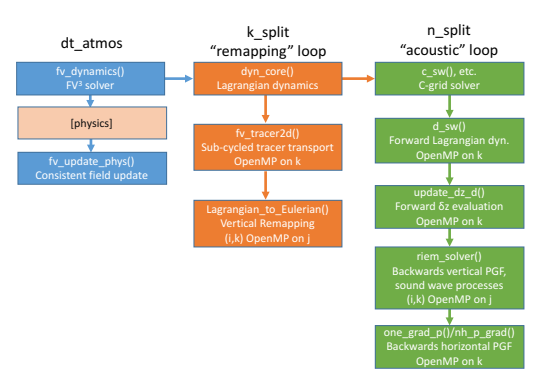
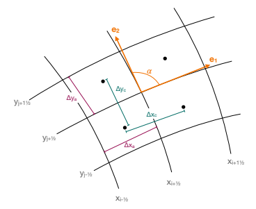
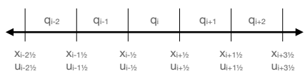
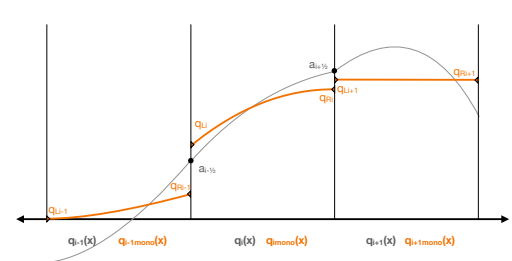
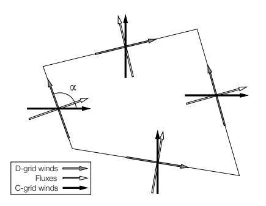
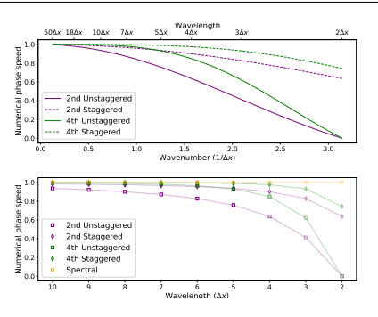
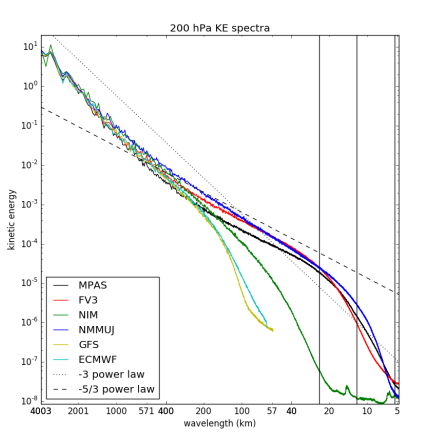
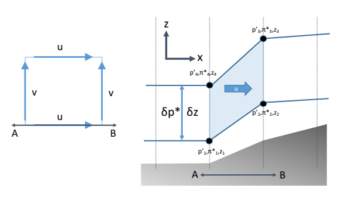
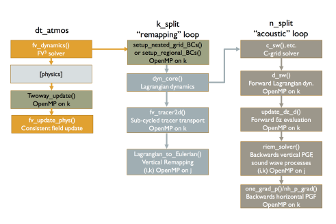
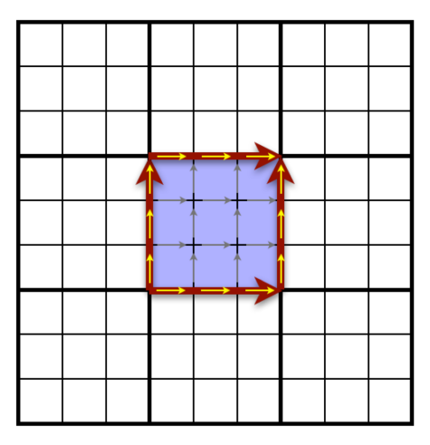

A Scientific Description of the GFDL
Finite-Volume Cubed-Sphere Dynamical Core Lucas Harris Xi Chen William Putman Linjiong Zhou Jan-Huey Chen 14 June 2021 Revision v1.0a 16 June 2021 GFDL Weather and Climate Dynamics Division

Technical Memorandum GFDL2021001

## Contents

Contents 2 Dedication and Acknowledgements 7

| 1   | FV3 introduction              | 9   |    |
|-----|-------------------------------|-----|----|
| 1.1 | A brief history of FV3        | 9   |    |
| 1.2 | The FV3 Way—Advantages of FV3 | 11  |    |
| 1.3 | Future FV3 Development        |     | 13 |
| 1.4 | About this document           | 17  |    |

2 Outline of the FV3 solver 19

| 5.1   | Lagrangian vertical coordinates                             | 40   |    |
|-------|-------------------------------------------------------------|------|----|
| 5.2   | Prognostic variables and governing equations                |      | 42 |
| 5.3   | Vertical Remapping                                          | 44   |    |
| 5.A   | Derivation of the vertically-Lagrangian equations of motion | . .  | 48 |
| 6     | Horizontal dynamics along Lagrangian surfaces               | 51   |    |
| 6.1   | Horizontal Discretization                                   |      | 51 |
| 6.2   | C-D grid discretization                                     | 53   |    |
| 6.3   | The importance of vorticity in fluid dynamics               | 55   |    |
| 6.4   | On Numerical Analysis and Numerological Analysis            |      | 56 |

2 Disclaimer 5

| 3   | Cubed-sphere grid                                       | 23   |    |
|-----|---------------------------------------------------------|------|----|
| 3.1 | Gnomonic coordinates and grid construction              |      | 24 |
| 3.2 | Vector geometry: covariant vs. contravariant components | 25   |    |
| 4   | Finite-volume formulation and flux evaluation           | 29   |    |
| 4.1 | One-dimensional advection operators                     |      | 30 |
| 4.2 | Two-dimensional advection                               |      | 36 |

6.5 Edge handling and component interpolation on a cubed-sphere

grid . . . . . . . . . . . . . . . . . . . . . . . . . . . . . . . . . . . 59

6.6 Backward-in-time horizontal pressure gradient force . . . . . . . 60

6.A Covariant and contravariant components on a staggered grid . 64

| 6.A                                        | Covariant and contravariant components on a staggered grid   | .   | 64   |
|--------------------------------------------|--------------------------------------------------------------|-----|------|
| 7                                          | Nonhydrostatic dynamics in FV3                               | 65  |      |
| 7.1                                        | The nonhydrostatic semi-implicit solver                      | 65  |      |
| 7.2                                        | Hydrostatic and nonhydrostatic dynamics                      | 68  |      |
| 8                                          | Artificial diffusion                                         | 71  |      |
| 8.1                                        | The necessity of numerical diffusion                         |     | 71   |
| 8.2                                        | Choosing the right (diffusion) tool for the job              | 72  |      |
| 8.3                                        | Divergence damping                                           |     | 74   |
| 8.4                                        | Vorticity damping                                            | 75  |      |
| 8.5                                        | Dissipative heating in FV3                                   | 76  |      |
| 8.6                                        | Model-top sponge layer and energy-conserving Rayleigh damping                                                              | 78  |      |
| 8.7                                        | Energy-, momentum-, and mass-conserving 2∆z filter           | 79  |      |
| 9                                          | Physics-dynamics and data assimilation coupling              | 83  |      |
| 9.1                                        | Condensate loading and mass conservation                     | 83  |      |
| 9.2                                        | Variable heat capacity                                       | 84  |      |
| 9.3                                        | Diabatic heating                                             | 85  |      |
| 9.4                                        | Staggered wind interpolation                                 |     | 86   |
| 10 Model initialization                    | 87                                                           |     |      |
| 10.1 Initialization from external analyses |                                                              | 87  |      |
| 10.2 Topography creation and filtering     | 89                                                           |     |      |
| 10.3 Forwards-backwards initialization     |                                                              | 91  |      |
| 11 Grid refinement techniques              | 93                                                           |     |      |
| 11.1 Grid stretching                       | 93                                                           |     |      |
| 11.2 Grid nesting                          |                                                              | 94  |      |
| Bibliography                               | 99                                                           |     |      |
| Revision History                           | 109                                                          |     |      |

## Disclaimer

We have made every effort to ensure that the information in this document

is as accurate, complete, and as up-to-date as possible. However, due to the rapid pace of FV3 development the document may not always reflect the current state of FV3 capabilities. Often, the code itself is the best description of the current capabilities and the available options, which due to limited space cannot all be described in full detail here. Contact GFDL FV3 support at oar.gfdl.fv3_dycore_support@noaa.gov for assistance and more information.

The most up-to-date documentation, articles, and tutorials can always be found at the GFDL Documentation and References site at www.gfdl.noaa.gov/fv3/fv3documentation-and-references/.

This document is licensed under the Creative Commons Attribution 4.0 International license, which allows reuse and distribution for any purpose but requires that the authors be credited.

# Dedication And Acknowledgements

Virtually all of the algorithms described in this document are the work of Shian-Jiann Lin, of late retired from NOAA. This document is the interpretation of the FV3 algorithms and design by the authors, although it is heavily influenced by S-J's thinking and he provided reviews of a very early draft. We could say of this document that it contains "not one word of Lin and not one thought of Harris et al.", channeling the aphorism applied to the textbooks written by the Soviet physicists Lev Landau and Evgeny Lifshitz. We strongly advise that, when citing this document, references to the documents describing specific algorithms also be cited. This is to ensure S-J receives the proper credit for his work.

Numerous scientists have lent their comments on this and earlier drafts.

We thank Henry Juang and Sajal Kar (EMC) for reviewing an early draft.

Stephen Griffies, Rusty Benson, Kai-Yuan Cheng, Joseph Mouallem, Mingjing Tong, Kun Gao, Baoqiang Xiang, and Kate Zhou have contributed reviews of the manuscript and made numerous and significant comments that have materially improved the draft. Alex Kaltenbaugh and Jake Huff helped compile the bibliography. We also thank several of our colleagues for their encouragement and support towards completing this large and complex manuscript, including Whit Anderson, Sarah Kapnick, Chris Bretherton, Oli Fuhrer, Jenn Mahoney, DaNa Carlis, Sundamaran "Gopal" Gopalakrishnan, and Curtis Alexander.

Many scientists and engineers have contributed to and supported FV3 and its predecessors over the years. S-J always appreciated the work of computational scientists who were able to lift some of the programming burden off of his hands so he could focus on the science of FV3, and Will Sawyer, Zhi Liang, Chris Kerr, and Rusty Benson were crucial in supporting implementations of FV and FV3.

An enlightened group of administrators at NASA and NOAA provided the continuing support to S-J and his teams over the decades, without which FV3 could never have become a success. Ricky Rood and Bob Atlas at NASA
Goddard, and Ants Leetma, Isaac Held, V. "Ram" Ramaswamy, and Whit Anderson at GFDL have been directly supportive of S-J and his team. More recently Tom Knutson, Frank Marks, and Craig McLean have been very strong 7 supporters of the FV3 Team. We also recognize the support from the National Weather Service for FV3-based model development: in particular Fred Toepfer, Dorothy Koch, Brian Gross, and the late Bill Lapenta all backed FV3's implementation and stuck to the science-based selection of FV3 when a politicallymotivated choice would have been expedient.

Finally, the FV3 Team gives our appreciation to S-J for his mentorship and support for the years we were fortunate enough to work for him.

8

# 1 Fv3 Introduction

## 1.1 A Brief History Of Fv3

FV3, the GFDL Finite-Volume Cubed-Sphere Dynamical Core, has its roots in the early '90s at NASA's Goddard Space Flight Center. FV3's origin is ShianJiann Lin's offline transport module for a chemistry transport model (CTM),
of which Goddard was a major center of development. Numerical noise, unphysical negative values, and non-conservation of mass had plagued atmospheric chemistry models for years (Rood, 1987) and new techniques were desperately needed to maintain monotonicity and positivity. Inspired by the finite-volume methods that had emerged in the '70s and '80s in computational fluid dynamics (Van Leer, 1977; Colella and Woodward, 1984), Lin developed a transport scheme which emphasized mass conservation, numerical accuracy, consistency, tracer-to-tracer correlations, and efficiency. This scheme (Lin and Rood, 1996) solved many of these problems and led to major advances in atmospheric chemistry modeling. Several CTMs and climate models adopted LR96, including the community NASA GMI model (Rotman et al., 2001), GOCART (Chin et al., 2000), the Harvard-led GEOS-Chem community model
(Bey et al., 2001), and the ECHAM5 climate model (Roeckner et al., 2003).

Motivated by the success of monotonicity-preserving finite-volume advection schemes, a fully finite-volume shallow-water solver was developed.

This solver was first presented at the 1994 PDEs on the Sphere Workshop and published in Lin and Rood (1997). The shallow-water solver was massconservative and had geophysically-correct vorticity dynamics, an important
"mimetic" property for geophysical flows. It was the first solver for geophysical fluid flows to use high-order monotonic advection *consistently* for momentum and all other prognostic variables—an achievement that even today few atmospheric dynamical cores reach. The FV core, a fully three-dimensional hydrostatic dynamical core discretized on the latitude-longitude grid, followed shortly thereafter. The FV core's foundation was the Lin and Rood (1996)
transport scheme and the Lin and Rood (1997) shallow-water algorithm. The pressure-gradient force in FV was the mimetic, fully-finite volume Lin (1997)
formulation, derived directly from Newton's second law and using Green's integral theorem, that had shown errors an order of magnitude smaller than did common finite-differencing pressure-gradient schemes of the time. The most powerful aspect of FV was the "vertically-Lagrangian" formulation for the vertical discretization, a revolutionary and as yet unmatched formulation permitting great computational efficiency and much improved numerical accuracy compared to traditional fixed-level coordinates. The FV core was running in Goddard's GEOS global weather and climate model by 1998 (Lin and Rood, 1998, 1999). FV was next implemented in NCAR's CCSM (now CESM)
in 2001 (Rasch et al., 2006), and as of 2021 remains its workhorse dynamical core (Danabasoglu et al., 2020). FV was later implemented within the GFDL
CM2 model in 2004 (Delworth et al., 2006), notably only taking a month for Lin and an engineer to accomplish. This transformed the very good CM2.0 model into CM2.1, by some measures the best in the world in the CMIP3 era
(Gleckler et al., 2008; Reichler and Kim, 2008).

Latitude-longitude grid cores like FV scale poorly in modern massivelyparallel environments and require filtering at the poles where the meridians converge. These needs led to the joint development of FV3 by Lin at GFDL
and Bill Putman at Goddard, in which an improved FV algorithm was instead discretized on the cubed-sphere grid (Putman and Lin, 2007). The cubedsphere geometry also could be easily re-purposed towards doubly-periodic domains (Held et al., 2007; Arnold and Putman, 2018), variable-resolution grids (Harris and Lin, 2013; Harris et al., 2016), and even very highly-regular regional domains (Purser and Tong, 2017).

The revised horizontal discretization in FV3 allowed it to run at much higher resolution and more efficiently than FV, making possible practical simulation at scales in which the hydrostatic approximation begins to break down. Two finite-volume nonhydrostatic solvers were created as a seamless, consistent extension to the successful hydrostatic solver. The first, introduced by Lin in 2006, used a highly-accurate Riemann solver to nearly exactly solve for vertical sound-wave propagation (Chen et al., 2013). This nonhydrostatic solver was used in NASA GEOS in 2008 to perform the first global cloudresolving model (GCRM) simulations in the United States. The second, developed by Lin in 2012, used a traditional semi-implicit approach for treating the vertically-propagating sound waves, and had no Courant number restriction (Harris et al., 2020a). The enhanced resolutions enabled by FV3 also spurred a re-consideration of how moist thermodynamics and latent heating is formulated in dynamical cores, especially in convective clouds. The moist energetics and microphysics in FV3 were thus carefully re-formulated to be thermodynamically-rigorous and consistent (Chen and Lin, 2013; Zhou et al.,
2019).

FV3 is a very widely used global dynamical core in the United States and is being adopted internationally. It is in use in all GFDL and Goddard global models and has been adopted into the GEOS-Chem High-Performance chemistry transport model, the F-GOALS climate model of the Chinese Academy of Sciences (Li et al., 2019), the Taiwan Central Weather Bureau Global Forecast System, and is under consideration in CESM. Most notably, FV3 was selected by the US National Weather Service for the Unified Forecast System (UFS), which has paved the way for unification of global and regional models, and for unification of GFDL's climate models with NOAA's weather models.

## 1.2 The Fv3 Way—Advantages Of Fv3

FV3 has been used for coarse-resolution paleoclimate Earth-system models
(∆x ≈ 500 km) to ∆x < 100-m radiative-convective equilibrium simulations.

The rare ability for FV3 to adapt to all of these use cases stems from some simple considerations that have guided FV3's development over three decades through many different applications.

## Physical Consistency

Many of FV3's algorithms are discrete representations of physical laws. The algorithms are designed not as isolated simple solvers but as parts of a consistent, integrated whole. Numerical consistency and "mimetic" discretizations obeying physical laws limit the generation of computational and unstable modes. As a result, FV3 is able to remain stable and noise-free with a minimum of artificial dissipation. FV3 most notably preserves vertical vorticity very well, much to its benefit in many geophysical systems (Sections 6.2 and 6.3). The discrete pressure-gradient force formulation (Section 6.6) recovers Newton's third law and thereby greatly reduces numerical noise. The powerful flow-following Lagrangian vertical coordinate (Chapter 5) bettermaintains vertical structures, even in the strongest updrafts. The forwardin-time, upwinding piecewise-parabolic method (Section 4.1) preserves the hyperbolicity and causality of the governing equations. Rigorous moist thermodynamics greatly improves simulation of cloud systems (Chapter 9).

## Fully Fv-Numerics

FV3 is *consistently finite volume*. All algorithms to the extent possible are formulated in a finite-volume manner: variables are cell- or face- means, and are advanced using explicit fluxes in the horizontal and implicitly in the vertical (Section 6.1). The pressure-gradient force (Section 6.6) and diabatic heating
(Section 9.3) are derived from finite control-volume analysis, a common technique in engineering fluid dynamics and in "box" methods used for biogeochemical cycles and atmospheric composition. Advective fluxes—the most mature and successful part of FV3—are calculated using the Lin and Rood
(1996) "reverse-engineered" method to maintain mass conservation, free-stream preservation, and consistency between dynamical variables and passive tracers (Section 4.2).

## Component Coupling

A dynamical core is only as valuable as the models it is implemented within.

FV3 was designed to easily adapt to different physics suites, which was a major reason for its being incorporated into many different models. FV3 is distributed with a set of sample drivers for interfacing with both climate and weather-model physics suites, and its moist thermodynamics (Chapter 9) and lack of a vertical Courant number restriction (Section 5.1) ensures that the suites are able to live up to their full potential. Often FV3 is so accurate and weakly-diffusive it can expose issues with physics schemes that are covered up in more-diffusive or less-accurate solvers. There is so little implicit vertical diffusion in FV3 that schemes that have had to artificially reduce their physical diffusion or vertical subgrid transport for other models wind up being under-mixing or under-active. FV- and FV3-based coupled atmosphere-ocean models are especially successful, and GFDL FV- and FV3-based models and FV-based CESM have been some of the best in the world in the last three CMIP iterations (Boucher et al., 2020; Bock et al., 2020; Brunner et al., 2020). FV and FV3 improve ocean coupling through its accurate representation of vorticity and thus the wind-stress curl (Delworth et al., 2006). Thereby it does an excellent job maintaining marine boundary-layer structures affecting air-sea interactions. FV3-based models are also notably strong at simulating tropical cyclones (Zhao et al., 2009; Chen and Lin, 2013; Gao et al., 2021; Chen et al.,
2019; Hazelton et al., 2018b) and rotating severe thunderstorms (Clark et al.,
2018; Harris et al., 2019).

## Computational Efficiency

FV3 is designed to be as computationally-efficient as possible without compromising the scientific integrity of the algorithm. The formulation of the advection scheme is notably designed to avoid unnecessary calculation and to allow a longer advective timestep, especially in regions of strong flow deformation (Section 4). The Lagrangian vertical coordinate eliminates the need to explicitly calculate vertical motion and possesses no Courant-number restriction (Section 5.1). Greater stability (Chapters 5 and 7; Sections 6.1 and 6.6) and tracer sub-cycling (Section 4.2) lengthens FV3's timestep. More mundanely, algorithms have been written and re-written again for optimum efficiency. Vectorization and OpenMP parallelism are employed as often as possible in a way that it does not compete for processor cycles with the MPI distributedmemory decomposition. Indeed it is probably this highly efficient implementation of an algorithm considerably more complex than most dynamical cores that is the greatest achievement of FV3. The design of FV3 makes it amenable to porting to modern multi-core architectures and scaling to the large processor counts needed for very high global resolutions. Evaluations of FV3's performance can be found at https://www.gfdl.noaa.gov/fv3/fv3-

## 1.3 Future Fv3 Development

FV3 has been amply demonstrated as a highly-effective solver for atmospheric problems at all scales of motion and has no obvious deficiencies that would forestall its application to any particular problem in the foreseeable future.

However as for any engineered system FV3 is not perfect and can be improved. As FV3's applications expand new capabilities will be necessary to get the best results possible at reasonable computational cost. Here we describe ongoing projects to improve and expand FV3.

## Duo-Grid

A major difficulty with gnomonic cubed-sphere grids (Section 3) is the "kink" in the gnomonic coordinates at the edges and corners. The solution of PL07
(Section 6.5) is adequate but some grid imprinting does occur at lower resolutions (cf. Zhou et al. (2019)). The current implementation of the entire cubedsphere grid is also very complex. The cubed-sphere implementation was completely re-thought by Chen (2021) to create the Duo-Grid, which simplifies the gnomonic cubed sphere implementation and introduces an "extended" grid structure at the edges. The extended grid remaps the opposing face's grid onto a local unkinked extension of the current face, virtually eliminating grid imprinting while retaining mass conservation.

## Low Mach Number Riemann Solver (Lmars)

The C-D grid discretization (LR97, Section 6.2) produces highly-accurate advective winds while retaining the advantages of the D-grid staggering. This method is a much-simplified version of the Riemann solver used in most finite-volume CFD solvers, which solves an approximation of the full governing equations to compute the advective winds. This gives very accurate solutions especially for transonic and supersonic flows but is generally too expensive for atmospheric applications. Riemann solvers specialized for atmospheric flows have emerged in the last decade and are becoming an attractive option for atmospheric dynamical cores. The Low-Mach Number Riemann Solver (LMARS; Chen et al., 2013) is being developed and is being evaluated as a replacement for the LR97 algorithm (Chen, 2021). LMARS improves the accuracy and numerical diffusivity and simplifies the dynamical core by removing the need for staggering. This is particularly important for physicsdynamics integration as virtually all physical parameterizations work with unstaggered grids, and the interpolation of tendencies to a staggered grid introduces some error that could be avoided in an unstaggered model. Energy conservation and non-traditional Coriolis terms also become much simpler on the unstaggered grid.

## Deep, Variable Composition, And Extraterrestrial Atmospheres

Most FV3-based models are principally used for the troposphere and lower stratosphere of the Earth. For these applications, the shallow-atmosphere approximation—that the depth of the atmosphere is much less than the radius of the Earth—is formally sufficient for a good simulation. However there are applications for atmosphere models, including in NOAA and NASA, for the study and prediction of the higher atmosphere, into the ionosphere and plasmasphere. The depths of these regions are a significant fraction of the Earth's radius. Whole-atmosphere models are emerging as useful scientific tools for exploring the upper atmosphere (Akmaev, 2011) and methods for implementation of deep atmosphere dynamics do exist (Wood and Staniforth, 2003).

There is also evidence that processes excluded by the shallow-atmosphere approximation (Ong and Roundy, 2020; Igel and Biello, 2020) may be important even for the troposphere: deep convection in the deep tropics is one relevant example.

Deep-atmosphere dynamics requires (a) the non-traditional Coriolis terms
(b) height-dependent gravity and (c) the widening of the atmospheric column with height. The three items must be implemented as a group: the governing equations are only consistent if they are all absent (shallow atmosphere)
or all present (deep atmosphere; White et al., 2005). GFDL is partnering with EMC to develop a form of the deep atmosphere dynamics which can be implemented within FV3.

The dynamics of other planets' atmospheres, specifically that of Mars, are similar enough to Earth's that FV3's approximations are still valid. Indeed FV3-based models of these atmospheres are well-established tools (Wilson, 2011; Greybush et al., 2012). However, the atmospheres of other planets, and the Earth's upper atmosphere, do not have uniform "dry" air composition. We are also working with EMC and the California Institute of Technology to implement variable-composition atmospheres within FV3 (Li and Chen, 2019)
for both space weather and planetary atmosphere modeling. The implementation of multiple gas constituents is an extension of the variable heat capacity in FV3 (Section 9.2), which currently is used to represent the heat capacities of different water phases. Multiple-constituent dynamics is also useful for emerging methods of representing convection and partially-resolved processes in the atmosphere (Weller et al., 2020; Thuburn and Vallis, 2018), one way of better-integrating physics and dynamics.

## Integrated Physics

Physical parameterizations have been increasingly built so as to be dynamicsagnostic and interchangable (Kalnay et al., 1989) much like puzzle pieces. The goal was to be able to better improve interoperability of models and to allow developers to more easily share innovations, and has become standard with the emergence of community modeling frameworks in the 21st century. Our belief is that this "strict separation" between physics and dynamics is now hindering model development, and the way forward is improved integration between physics and dynamics. The differences in definitions of winds, energy, heat capacity, and even the definition of tracer masses leads to errors between the physics and dynamics in many models.

Physics-dynamics coupling is now a major concern for model development (Gross et al., 2018) and new techniques are necessary. A tighter integration between physics and dynamics would improve conservation of momentum and energy, permit more accurate implementation of physical processes, allow physical processes to run at appropriate timescales (as opposed to the one-timescale-fits-all approach in most current models), and improve efficiency as the overhead of data copies and transformations can be avoided.

This will be important as physical parameterizations are developed which break out of the mold of purely one-dimensional column methods and expand into three-dimensional processes traditionally covered by the dynamics (Grandpeix and Lafore, 2010; Lee et al., 2011), or in the "gray-zone" of partially-resolved processes (Malardel and Bechtold, 2019).

We have embarked on a program to integrate physical processes directly within the dynamics. The most notable success has been the GFDL microphysics (Chen and Lin, 2013; Zhou et al., 2019) which is now inlined directly within the dynamical core (Harris et al., 2020b). This allows the microphysical latent heating and sedimentation processes to iterate with the dynamics much more frequently, achieving a very tight integration between gravity-wave processes, condensate loading, and latent heating. It also ensures precise energy conservation by the microphysical processes. The inline GFDL microphysics has spurred the development of the moist thermodynamics within FV3 (Section 9.2), which will be of importance for other moist processes integrated within the dynamics. Work has also been done on sub-grid orographic effects, shallow convection, and dust emission.

## Expanded Variable-Resolution Techniques

FV3 supports variable-resolution global modeling allowing very high resolutions to be efficiently reached in a global model. This is done through both two-way nesting (Harris and Lin, 2013) and grid stretching (Harris et al.,
2016). These techniques has been effectively applied to a number of problems (Hazelton et al., 2018b,a; Gao et al., 2019; Zhou et al., 2019; Zhang et al.,
2019; Gallo et al., 2019; Harris et al., 2020b) and are described in Chapter 11.

FV3 and the underlying Flexible Modeling System (FMS) supports multiple and telescoping (multi-level) nests. In collaboration with AOML and EMC
we are developing moving nested grid capability that can follow a significant feature, such as a tropical cyclone or tornadic thunderstorm. This is similar to the moving nest technology pioneered by the legendary GFDL Hurricane Model (Kurihara et al., 1979) and in the current Hurricane Weather Research and Forecasting model (HWRF; Gopalakrishnan et al., 2006). Techniques for
"free-floating" nests and nests that can span multiple faces of the cubed sphere and also under development.

## Emerging Computing Architectures

High-performance computing has standardized in the last few decades around the paradigm of massively-parallel systems of many general-purpose CPUs, connected by distributed memory through message passing and by multithreaded access to shared memory. FV3 became extremely efficient through strategic use of both the MPI libraries and the OpenMP API. However even as CPUs continue to get faster and more efficient many new computing architectures are emerging that use specialized processors like GPUs and ARMs. It is these specialized processors around which new exascale computing systems are being developed. This shift in part represents the increasing importance of machine learning, big data, and graphics applications to large-scale computing, compared to the good ol' days when the market was driven by scientific and engineering applications.

Previous efforts at Goddard and the Chinese Academy of Sciences to port FV3 to GPU-accelerated systems have found speedups of several times compared to similar systems without GPUs1. This has required re-factoring or even re-writing FV3 in a language specifically designed for a particular GPU
system, or to use a new API specifically for GPUs. The potential speedups are large, but porting is labor-intensive and requires both strong engineering skill and strong knowledge of the solver. The resulting codes may not be useful on a CPU, which are still used by the majority of people running FV3-based models. With each new GPU manufacturer creating a different programming "standard", maintaining a single codebase is difficult. We are precariously close to returning to the old era, where each new supercomputer required a complete re-write of model codes. Since weather and climate codes are far more sophisticated now than in that era this is an unpleasant thought.

GFDL and Goddard are collaborating with the Allen Institute for Artificial Intelligence (AI2), who with their own partners at the Swiss National Supercomputing Center and ETH Zurich are working to port FV3 into a domainspecific language (DSL) called GT4py. This is a new way of writing scientific codes in which the a domain scientist (like the authors or the reader) specifies in Python the basic "stencils" for the algorithm and how they connect. Then, backend customized for a specific computer architecture then compiles the Python into an executable with a memory layout and threading best adapted to the computing system and the specific domain. The hope is that this will create performance-portability across architectures using a single codebase, freeing the domain scientist to focus on the scientific design and implications of their algorithms rather than on vectorization and cache hits. FV3 and a selection of UFS physics packages are currently being ported into GT4py, and a prototype performance-portable model is expected by the end of 2021.

## 1.4 About This Document

The purpose of this document is principally not to say how FV3 is implementedwhich can best be understood by reading the code—but instead why it works and was designed the way it is. We have written a document that describes the theory and motivation behind FV3 and the algorithms thereof. The description in this document is intended to give sufficient detail that a reader can understand the workings of FV3 and its implementation. We assume the reader has a working knowledge of fluid dynamics on the level of Holton and Hakim (2013) or Kundu et al. (2015) and has some familiarity with numerical techniques for solving partial differential equations. A good reference for numerical methods in geoscience is Durran (2010). A quality text for atmospheric thermodynamics will also be helpful: Emanuel et al. (1994) and Bohren and Albrecht (2000) are both highly recommended but regrettably have become extremely expensive.

This document describes the version of FV3 in the January 2021 GFDL
public release2 and its implementation within the GFDL atmosphere models AM4 (Zhao et al., 2018) and SHiELD (Harris et al., 2020b). A separate "technical guide" is being prepared that includes runtime and compile-time options, and Jupyter notebooks demonstrating features of FV3 are also under development. Readers interested in the implementation within other FV3-based models should consult the creators of those models for specifics. We have also not integrated extensions developed by our community partners into this document, especially those which await formal description such as the stochastic physics (Bengtsson et al., 2019), limited-area model (LAM; Purser and Tong, 2017; Dong et al., 2020; Black et al., 2021), and FV3 adjoint (Holdaway and Trémolet, 2020). We recommend that users of these innovative features reference the literature by their creators to ensure that they receive credit for their important contributions.

This document does not explicitly include physical parameterizations, since FV3 is a dynamical core and not a model. However discussion of physicsdynamics coupling and moist thermodynamics, which are an integral part of a dynamical core, will be discussed.

The FV3 code itself is a great resource for understanding the precise implementation of this dynamical core, the details of which are too numerous to be included in any document. We encourage the reader to consult the codebase in addition to reading this document to get a true understanding3 of FV3.

Careful study of the layout and algorithms can yield great rewards in terms of understanding how CFD solvers are implemented, how the different parts work together, native finite-volume calculations of different quantities, optimization of fluid solvers for modern microprocessor architectures, and how to squeeze the most out of every last clock cycle.

## 2 Outline Of The Fv3 Solver

FV3's solver integrates the compressible, adiabatic Euler equations on a shallow atmosphere in a weather or climate model. The solver is modular and designed to be called as a largely independent component of a numerical model, consistent with modern standards for model design. For best results it is recommended that a model using FV3 as its dynamical core should use the provided application programming interface (API) to invoke the solver, and to use the provided utility routines consistent with the dynamics. This is especially important for the initialization, updating the model state by time tendencies from the physics, and for incorporating increments from the data assimilation system.

The leftmost column of Figure 2.1 shows the external API calls used during a typical process-split model integration procedure. First, the solver is called, which advances the solver a full "physics" time step (dt_atmos1).

The advanced solution from the solver is passed to the physical parameterization package, which then computes the physics tendencies over the same time interval. Finally, the tendencies are used to update the model state using a forward-in-time evaluation consistent with the dynamics, as described in Chapter 9.

There are two levels of time-stepping inside FV3. The first is the "remapping" loop, the orange column in Figure 2.1. This loop has three steps:
1. Perform the Lagrangian dynamics, the loop shown in the green column of Figure 2.1, as described in Chapters 6 and 7 2. Perform the subcycled tracer advection (Section 4.2) along Lagrangian surfaces, using accumulated mass fluxes from the Lagrangian dynamics.

Subcycling is done independently within each layer to maintain local
(within each layer) stability.

Figure 2.1: FV3 solver structure, including subroutines and time-stepping.

Blue represents external API routines, called once per physics time step; orange routines are called once per remapping time step; green routines once per acoustic time step.

This remapping is typically performed once per call to the solver, although it is possible to improve the model's stability by executing the loop (and thereby the vertical remapping) multiple times per solver call, controlled by k_split.

This is most useful at high resolutions in which the physical parameterizations may need to be called as infrequently as 20 or even 40 acoustic timesteps.

The Lagrangian dynamics is the second level of time-stepping in FV3. This is the integration of the dynamics along the Lagrangian surfaces, across which there is no mass transport. Since the time step of the Lagrangian dynamics is limited by horizontal sound-wave processes, this is called the "acoustic" time step loop and is called n_split times per remapping timestep. The Lagrangian dynamics first advances the C-grid winds by a half-time step, using simplified (but similarly constructed) core routines. This process produces a good approximation to timestep-mean advective winds, which are then used to compute the advective fluxes and advance the D-grid prognostic fields a full time step. The along-surface flux terms (mass, heat, vertical momentum, 20 and vorticity, and the kinetic energy gradient terms) are evaluated forwardin-time, and the pressure-gradient force and elastic terms are then evaluated backwards-in-time, to achieve enhanced stability.

## 3 Cubed-Sphere Grid

Previous versions of the FV core were discretized on a regular latitude-longitude grid, which could cover the entire Earth with a singular logically-rectangular grid. The lat-lon grid greatly simplifies much of the algorithm: metric terms are simple, the local coordinate vectors are orthogonal, and input and output is easy to analyze, with little to no interpolation needed. For many years, latlon grids were the standard for global atmospheric modeling, and a number of grid-point and finite-volume global modeling systems still use lat-lon grids.

However, a latitude-longitude grid suffers from the convergence of the meridians near the poles, which causes the grid cells to become very narrow.

Small-scale high-frequency modes near the poles must be removed with a polar filter to stabilize the model, diffusing the solution at high latitudes. Polar filtering also restricts the ability to parallelize across longitudes, limiting the ability to scale to large processor counts. This also limits the practicability of the lat-lon grid at high resolutions, which require a lot of computing power to achieve useful throughput rates. A lat-lon grid also has lower resolution in the tropics, where smaller-scale convective motions dominate, than in the midlatitudes, which is dominated by mid-latitude cyclones and planetary waves of much larger spatial extent.

A number of alternatives which are much more uniform than the lat-lon grid have been proposed. There is no ideal grid, and the choice of grid on the sphere must be considered as an "optimization", matching the best highorder FV-type numerics with a "perfectly scalable grid"1. For instance, the icosahedral grid is slightly (within 10%) more uniform than the cubed-sphere grid. However, high-order numerics are much more difficult to construct on the unstructured icosahedral grid. Hence, the cubed-sphere grid was selected, and the implementation of the finite-volume algorithms within it called FV32.

Putman and Lin (2007) considered several different variations of the cubedsphere, and found that the gnomonic (non-orthogonal) cubed-sphere was the best choice, for a number of reasons:

- The cubed-sphere is decomposed into quadrilaterals, allowing the advection scheme of Lin and Rood (1996) to be used with only minor modification.

- The regular quadrilateral structure of the cubed-sphere grid allows referencing of adjacent cells through direct indexing, avoiding the overhead of indirection.

- The cubed-sphere is the only quadrilateral global grid able to cover the Earth without overlapping patches (e.g., Yin-Yang grid).

- The gnomonic cubed-sphere was found to be much more uniform, with smaller variation in grid sizes, than other possible cubed-sphere grids such as the conformal cubed-sphere. For the same number of grid cells, the gnomonic grid can use a longer time step.

- The gnomonic cubed-sphere grid is generated analytically and almost instantly, without the need of special iterative solvers for the grid structure, and therefore grid generation is fast and easy. Further, grid refinement is straightforward on this grid.
However, there are tradeoffs to using the gnomonic cubed-sphere:
- The coordinate is non-orthogonal (particularly near the eight corners),
so the decomposition of vector quantities becomes more difficult.

- The coordinates have 'kinks' at the edges of the cube, so special edge handling (see section 6.5) is required to alleviate grid imprinting.

- The output needs additional post-processing to be usable by standard analysis software.

## 3.1 Gnomonic Coordinates And Grid Construction

A gnomonic coordinate system is one in which the coordinate lines are great circles, formed by the intersection of a sphere and a plane through the center of the sphere. If defined globally these have the same pole problem as does the latitude-longitude grid, except with eight poles instead of two. This problem is avoided by defining local coordinate patches throughout the sphere in which there are no singularities within the patches. The cubed-sphere 24 In this chapter, we discuss the construction of the cubed-sphere grid, and the necessary geometry needed for formulating the solver on this grid. Specific modifications to the solver algorithm needed for discretization on the cubed sphere are discussed in later chapters.

achieves this by projecting onto the surface of the sphere an inscribed cube, which allows six nonoverlapping, identical "faces" to cover the sphere, each with its own local coordinate system. This coordinate system is defined using an "equi-edge" projection (Chen, 2021), in which the local coordinate system is defined as3

x =a tan θx

y =a tan θy(3.1)
where a =
√
6 3 Re, Re is the radius of the sphere, θx, θy ∈ [−αref, αref], and αref = arcsin √3. The discrete grid is defined by dividing the range of θx, θy into N equal intervals, so ∆θ =
2αref N ; the cubed sphere grid so defined is called cN, and has an average grid-cell width of approximately Reπ 2N . The quantity N is one less than npx and npy, which represent the number of grid corners in each direction; on a cubed-sphere domain these must be identical, but on a nested, limited-area, or doubly-periodic domain this is not necessary.

A schematic of the resulting grid and its coordinates is shown in Figure 3.1.

## 3.2 Vector Geometry: Covariant Vs. Contravariant Components

The gnomonic coordinate system is non-orthogonal, so a vector decomposed into its components will have a projection into both coordinate directions.

This violates one of the assumptions made when the traditional decomposition of the momentum equation into its components is done, and typically extra metric terms appear when attempting to do the decomposition correctly. (Recall that the vector form of the momentum equation applies regardless of horizontal coordinate system.) Furthermore, it turns out that different quantities transform between coordinate systems differently if the coordinates are non-orthogonal. Most notably, the gradient of a scalar field does not transform the same way as a vector.

These issues can be avoided by introducing the ideas of *covariant* and *contravariant* components of a vector4. For example, a wind vector V in a coordinate system defined by local unit vectors e1, e2 can be written in two ways: as

a linear combination of the coordinate vectors:
V = uee1 + eve2, (3.2)
or as the projection of the vector into each coordinate direction:

u = V · e1 = ue + ev cos α v = V · e2 = ue cos α + ev.
(3.3)
ue = ev =
1 sin2 α [u − v cos α] 1 sin2 α [v − u cos α] . (3.4)
We call ue, ev the *contravariant* components, and u, v the *covariant* components.

The angle between the unit vectors is given as α, and the scalar (dot) product of the two coordinate vectors is e1 · e2 = cos α; in an orthogonal coordinate system, cos α = 0 and the covariant components equal their respective contravariant components. It is easy to invert (3.3) to attain an expression for the contravariant components in terms of the covariant components:

26
The vector decomposition given by (3.2), (3.3) is simple but very powerful, and remembering this form will greatly ease the correct derivation of the governing equations and of the formulation of the solver algorithm. For example, the kinetic energy can be expressed as

K = 1 2 V · V = 1 2 (uee1 + eve2) · (uee1 + eve2) = 1 2 [ue (ue + ev cos α) + ev (ue cos α + ev)] = 1 2 (uue + vev) (3.5a) = 1 2 1 sin2 α -u 2 + v 2 − 2uv cos α. (3.5b)

The bracketed term in (3.5b) is recognizable as the law of cosines.

Since the advection operator U · ∇ reduces to ue
∂
∂x + ev
∂
∂y , we can express the components of the momentum equation as:

∂U ∂t + (U · ∇) U · e1 = ∂u ∂t + ue ∂ ∂x + ev ∂ ∂yu. (3.6)
This result indicates that we can formulate the momentum equation so that the prognostic variables are the covariant components, and the contravariant components are the input for the transport operator. This result holds regardless of whether advective-form or flux-form is used.

If we want to compute the flux into a grid cell, we need to compute the component of the velocity normal to the grid cell, which in a nonorthogonal coordinate system is not in the same direction as the wind component in the direction into the cell. As grid cell boundaries are formed by coordinate lines, we can compute the perpendicular unit vector from the along-cell coordinate vector by n1 = e2 × kˆ, so the magnitude of the normal velocity can be written:

Un = U · n1 = ue sin α. (3.7)
Note that (n1, e2) form a locally-orthogonal coordinate system, simplifying this calculation.

Finally, we can express the same velocity vector in terms of the latitudelongitude components, so that we can interpolate the gnomonic-coordinate winds into coordinates more useful for physical parameterizations or for postprocessing:
uλ = U · eλ = uee1 · eλ + eve2 · eλ (3.8)
where uλ and eλ is the wind and the unit vector, respectively, in the longitudinal direction. A similar expression can be derived for vθ and eθ.

Much more thorough discussion of the geometry of non-orthogonal coordinate systems can be found in standard textbooks on applied differential geometry. We recommend Aris (2012) and Landau (1975) for classical expositions of relevance to physical applications, and Frankel (2011), Burke (1985),
and Schutz (1980) for modern "coordinate-free" formulations. There are also many good mathematical physics and pure mathematics texts for deeper understanding of this field, although many presume proficiency with linear algebra, real analysis, and basic topology.

28

# 4 Finite-Volume Formulation And Flux Evaluation

While there are many many advection schemes out there, few balance the high accuracy and computational efficiency of that in FV3 and its predecessors. The foundation of FV3 is the famed Lin and Rood (1996) advection scheme, later extended to the cubed-sphere and upgraded in Putman and Lin (2007). This scheme is "reverse-engineered" to produce a fully two-dimensional, massconserving scheme from a pair of one-dimensional advection operators, with these desirable properties: Fully second-order The leading order splitting error is eliminated.

Free-stream preserving A conserved tracer with a spatially-uniform specific ratio remains uniform in nondivergent flows Independent Courant numbers1 The Courant number restriction is max (cx, cy) 6 1, for local Courant numbers cx, cy defined below.

Efficient limiting Monotonicity and positivity constraints can be enforced in a simple one-dimensional reconstruction rather than the complex limiters necessary for two-dimensional reconstructions.

No dimensional splitting Simple one-dimensional operators can be combined to create a fully two-dimensional scheme, and so the scheme is not dimensionallysplit.

Highly flexible FV3 implements a wide array of piecewise-parabolic 1D operators, balancing efficiency, diffusivity, and shape-preservation. Other reconstruction methods may be adopted if desired.

Lin and Rood (1996) achieves these properties from the averaging of two
"asymmetric" methods of evaluating the two-dimensional flux using sequential splitting, one in which a 1D operator is applied first in the x-direction and then in the y-direction, and a second in the opposite order. Further, to ensure that free-stream preservation—an important "mimetic" property—is satisfied, the first, "inner" operator is an advective-form (as opposed to fluxform) operator, while the "outer" operators remain flux-form to retain mass conservation.

An accurate, efficient advection scheme not only improves the simulation of passive tracers—and often the overall simulation given that many tracers are thermally- and chemically-active—but also improves the dynamics as well. All of the prognostic variables have advective terms (6.1), which for consistency with the passive tracers are advected with the same advection scheme and reconstruction method.

Although the Lin and Rood (1996) and Putman and Lin (2007) advection schemes can use any 1D advective operator, we use the Piecewise-Parabolic Method (PPM) of Colella and Woodward (1984), which is formally fourthorder accurate assuming a uniform grid spacing. This method is highly accurate and is efficient enough to be useful. PPM also provides enough freedom in its construction to be customized (eg. low-diffusivity vs. shape preservation), more so than the lower-order piecewise-constant Godunov (1959) and piecewise-linear Van Leer (1977) methods. A good review of the motivation and history of PPM is given in Woodward (2007). It is possible to implement higher-order (piecewise-quartic, etc.) or more exotic (piecewise-rational, piecewise-hyperbolic) operators. It remains to be seen whether the greater formal accuracy of these more complex schemes will result in a sufficiently improved solution to justify the added computational expense. A similar point may be made about alternative advection schemes to Lin and Rood (1996).

## 4.1 One-Dimensional Advection Operators

We describe the basics of one-dimensional finite-volume advection. We define grid cell i as lying between interfaces xi− 12 and xi+ 12 and a cell-mean prognostic variable qi as in Figure 4.1. We also define the interface flow velocity ue
∗
i+ 12
,
which for now we assume is prescribed. The goal of a finite-volume scheme is to compute the fluxes of q, Fi+ 12
(q), between each grid cell and use their divergence δxF to compute the rate of change of qi over the next time step.

Since the mass that moves out of one grid cell moves into its neighbor the method is mass conserving.

The fluxes can be computed in many different ways. In PPM and similar cell-reconstruction methods they are computed by integrating an analytic subgrid reconstruction over the volume passing through the cell interface over one timestep. The basic method has four steps, two implementations of which are described in more detail in the following sections:
1. Interpolate from the *cell-mean* (not gridpoint) values to point values at the edges of the grid cells, which we write qb
− i for the "left-hand edge" at x
− = xi− 12 and qb
+ i for the "right-hand edge" at x
+ = xi+ 12
. Note that it

is not necessary for qb
+
i = qb
−
i+1
. For convenience and efficiency, we often write the pertubation edge values:

ai+½
bLi = qb − i − qi bRi = qb + i − qi. qLi+1
(4.1)

qRi
2. Use the edge values to form an analytic sub-grid reconstruction, qi(x),
within the grid cell. The form of this reconstruction is arbitrary, except that the integral of the reconstruction must equal the cell-mean value:
qLi
qi =1 ∆x Zx+ x− qi(x)dx. (4.2)
ai-½
The integral condition plus the two edge values in the cell are sufficient to completely determine the parabolic reconstruction used by PPM. (Other methods may require additional constraints, such as continuity of the reconstructions and their derivatives.)
qRi-1

3. Optionally, constrain (or *limit*) the reconstruction, so that when the flux integrals in the next step are evaluated and the cell-mean values are updated, the solution preserves a desired condition. This can be that no new extrema are created by the advection alone, a shape-preserving (or monotonicity-preserving, or somewhat inaccurately, "monotone") constraint; that the solution is strictly non-negative ("positive-definite");
that no 2∆x noise is created; or anything else.

qi-1(x) qi-1mono(x) qi+1(x) **qi+1mono(x)**
qi(x) **qimono(x)**
4. Finally, the flux is calculated *upwind* from the cell interface by integrating the reconstruction over the segment that will flow through the interface during one timestep. For the Courant number Ci+ 12
= ue
∗
i+ 12
∆t/∆x defined on interface x
+ the integral is
Fi+ 12 (q) = Rx+ Rx+
x+−ue ∗∆t qi(x)dx for ci+ 12
x++ue ∗∆t qi+1(x)dx for ci+ 12
> 0 < 0 (4.3) 31
is evaluated from this subgrid reconstruction.

In FV3 these fluxes are then applied to the two-dimensional Putman and Lin
(2007) scheme described in the next section.

Here, we explain the two main classes of advection operators in FV3.

## Linear And Positive-Definite Ppm Operators

The original Colella and Woodward (1984) PPM algorithm used a fourth-order
accurate interpolation from cell-mean values qi to cell interface values abi− 12
of reconstructions continuous across the interface. On a uniform grid this can be written:
abi− 12 = 7 12 (qi−1 + qi) − 1
12 (qi−2 + qi+1), (4.4)
On the cubed-sphere, cell-widths vary slowly except near the cube edges. For
efficiency we then neglect the variation of the cell width except near the edges.
A linear2, or "unlimited" scheme, would then use qb
+
i = qb
−
i+1 = abi+ 12
, so
the resulting reconstructions are continuous across the cell interfaces. The
resulting sub-grid reconstruction can be written in several equivalent ways:
qi(x) =   qi + bRi + (4bRi + 2bLi) (x − x +) + 3b0i (x − x +) 2 Right-based qi + bLi − (4bLi + 2bRi) (x − x −) + 3b0i (x − x −) 2Left-based qi − 1 4 b0i + ∆a (x − xi) + 3b0i (x − xi) 2Symmetric form (4.5)

where x ∈ [x
−, x
+], b0i = bLi +bRi = abi+ 12
+abi− 12
−2qi, and ∆a = bRi −bLi =
abi+ 12
− abi− 12
. Here, xi =
1 2
(x
− + x
+) is the cell centroid. It is easily checked that qi (x
+) = abi+ 12
, qi (x
−) = abi− 12
, and satisfies (4.2). An example of PPM
reconstructions are given in Figure 4.2.

The reconstruction can then be directly evaluated through (4.3) to yield:

Fi+ 12 (q) = qi + 1 − Ci+ 12  bRi − Ci+ 12 (bLi + bRi) for ci+ 12 > 0 = qi+1 + 1 + Ci+ 12  bL(i+1) + Ci+ 12 bR(i+1) + bL(i+1) for ci+ 12 < 0. (4.6)
Without modification this would create the "linear" PPM flux, but this easily creates noise especially in regions of steep gradients or discontinuities. However a simple modification would be to replace the fluxes in such regions with the upwind cell-mean value qi or qi+1, depending on the sign of Ci+ 12
. This reverts to a piecewise-constant scheme that would reduce the accuracy to only

Figure 4.2: A fanciful depiction of unlimited (gray) and monotonic (orange)
PPM reconstructions. Values of ai+ 12
, etc. (black circles) are identical for both sides of the interface; the limited values qLi and qRi (orange triangles) are not.

first-order, making the solution much more diffusive, but is strictly monotone and prevents the occurrence of numerical noise.

The difference between the different "linear" schemes is the decision criteria for reverting to first-order upwind flux. Two main methods are used in FV3:

- The "virtually-inviscid" scheme is the least diffusive (called hord = 5 in the namelist) and acts only when a 2∆x signal is detected. If in two adjacent cells bLi and bRi have the same sign—indicating the reconstructions of both cells have internal extrema—the flux at their common interface is set to be first-order. This is a weak constraint that will not be triggered at extrema that are any-better resolved, so it maintains the amplitudes of peaks very well.

- The "minimally-diffusive" scheme (hord = 6) sets the flux to first order upwind if both adjacent cells satisfy the condition:
A |bLi + bRi| > |bLi − bRi| , (4.7)
where A is an arbitrary parameter, set to 3 in hord = 6. The scheme can be generalized to use different values of A: larger values imply a more diffusive scheme. While any A > 1 filters 2∆x signals (choosing A = 1 would recover hord = 5) they also limit the steepness of the reconstruction when the signs do differ (ie. represents a increasing or decreasing value of q). Thus, if the greater of |bLi| and |bRi| is larger than the other by a factor of A+1 A−1 in both cells, the first-order flux is used.

For hord = 6 this value is 2; larger values of A would give a stronger constraint on the steepness, while A = 0 would recover the unlimited scheme.

Neither linear scheme strictly prevents negative values from occurring.

While negative values make sense for some advected quantities (especially vorticity) negative tracer values are a major problem especially in chemistry schemes which are absolutely unstable with negative inputs. The monotonic schemes described in the next section always prevent negatives from appearing but are more diffusive than the unlimited schemes described here, and may not be the best choice for some applications. We can instead apply a positive-definite filter to the linear schemes (in addition to the filters described earlier), which acts by ensuring that the reconstruction is nowhere-negative.

First, negative cell interface values abi+ 12 are set to 0. Next, two additional checks are made to determine if the minimum value of the reconstruction is negative3. For ∆ai = bRi − bLi and a4i = −3b0i where b0i = bRi + bLi, they are:

|∆ai| < −a4i qi + 1 4 (∆ai) 2 a4i + 1 12a4i < 0 (4.8)
Only if both conditions are satisfied within a grid cell is its reconstruction altered to enforce positivity. The first condition is a combination of the requirement that an extremum exists ( dq dx (xmin) = 0) within the grid cell, and that it is a minimum (3b0i = −a4i > 0); the second is that the extreme value is negative (qi (xmin) < 0). If both conditions are met, then the reconstruction coefficients can be modified to ensure that the resulting fluxes from that cell cannot create negatives. If bLi and bRi have the same sign, then the reconstruction in the grid cell is flattened by setting bLi = bRi = 0, ensuring a first-order upwind flux. If not, then the larger of the two values bLi and bRi (one of which is negative and the other positive) is set to no more than twice the magnitude of the lesser, with b0i appropriately re-computed, limiting gradients in reconstructions approaching negative values.

## Monotonic Methods

Several monotonic operators exist in FV3, which act by modifying the interface values so that mid-cell extrema are either modified or moved to a cell interface. A sample monotonic reconstruction is given in Figure 4.2. The condition (4.4) can be re-written as:

abi− 12 = 1 2 (qi−1 + qi) + 1 3 (∆qi−1 − ∆qi), (4.9)
which is a linear combination of piecewise-linear van Leer operators that yields PPM. (This is akin to how PPM was originally derived by Colella and Woodward (1984)). The value of the "mismatch" ∆qi =
1 4
(qi+1 − qi−1) (cf. Lin et al. (1994)) can be limited so that the reconstruction does not create a new extremum. This means limiting the magnitude of ∆qi so it is no larger than the magnitude of the difference between qi and its neighboring grid cells; thus, if qi is a local extremum ∆qi = 0:

∆qmono i = sign (∆qi) min |∆qi| , qi − min i−1,i,i+1 q, max i−1,i,i+1 q − qi . (4.10)
A monotone scheme then substitutes ∆qmono ifor ∆qi in (4.9), and then uses one of several monotonicity or positivity constraints, which are described in full in Lin et al. (1994), Lin and Rood (1996), Lin (2004), and Putman and Lin
(2007). The "fast monotonicity constraint" of Lin (2004), hord = 8, replaces bLi, bRi in (4.5) by

 (1). 
b mono Li = −sign (∆qi) min |2∆qi|, |qbi− 12 − qi|  b mono Ri = sign (∆qi) min |2∆qi|, |qbi+ 12 − qi| .
(4.11)
This is a very fast method—there are no selection criteria and only three direct calculations—but is more diffusive than the unlimited methods described above. A less-diffusive scheme can be constructed by increasing the number of selection criteria to be more discerning of when to modify the interface coefficients. The scheme hord = 10 does just this, using the constraint of Huynh
(1997) as described in Lin (2004) to more carefully decide when monotonicity is being violated. The scheme is significantly more complicated than hord =
8 and thereby more computationally expensive but is also significantly less diffusive4.

The reconstruction constraints are powerful controls on the flow evolution beyond maintaining positivity or monotonicity. Since the constraints locally smooth the flow by removing grid-scale extrema, they are the main source of implicit numerical diffusion. Indeed, in FV3 if a monotonicity constraint is applied to an advected variable there is no need for explicit damping or filtering. Since the implicit diffusion is a nonlinear function of the advected field, it can also be much more effective in controlling the flow compared to linear damping or filtering. However, implicit diffusion is often quite strong and is more difficult to "tune" for particular applications. Monotonicity constraints can have non-trivial impacts—good and bad—on numerical simulations: see Lin (2004), Gao et al. (2021), and Pressel et al. (2017), the latter in reference to the common "Implicit LES" sometimes used in CFD turbulence modeling.

Numerical diffusion is discussed in more detail in Chapter 8.

## 4.2 Two-Dimensional Advection

We now describe the method of Lin and Rood (1996) combining one-dimensional fluxes (4.6) into a fully two-dimensional advection scheme. The full development of the scheme is given in Putman and Lin (2007) and Lin and Rood
(1996). In this section we assume the winds are given, and that the flow is
(quasi-)horizontal along two-dimensional Lagrangian surfaces.

The continuous mass continuity equation for a conserved scalar mass density (per unit volume), Q, is

∂Q ∂t + ∇ · (QV) = 0 (4.12)
where V is the continuous horizontal vector velocity. We can then use the Divergence theorem to integrate about a quadrilateral grid cell of area ∆A,
while simultaneously integrating in time from t n to t n+1 = t n +∆t, to express the governing equation in finite (control)-volume form:

Qn+1 = Qn −1 ∆A Z t+∆t t IQV · n~ dldt = Qn + F [Q, ue ∗] + G [Q,ev ∗] , (4.13)

where we have defined the time-integrated flux divergences ("outer operators") along a grid-cell face in the x- and y-directions:

F [Q, ue ∗] = − 1 ∆Aδx Z t+∆t t UQ sin αdτ = − 1 ∆Aδx (X (Q, ue ∗) ηx) t VQ sin αdτ = − 1 ∆Aδy (Y (Q,ev ∗) ηy). (4.14) G [Q,ev ∗] = − 1 ∆Aδy Z t+∆t
also replaced the vector winds with the *timestep-mean, contravariant* components ue
∗, ev
∗in each flux direction, which are the advective winds in each direction as in (3.6). We further define the metric terms ηx = ∆t∆yd sin α and ηy = ∆t∆xd sin α on cell interfaces, where ∆xd and ∆yd are the lengths of the interfaces. Henceforth all variables will be expressed as volume-mean instantaneous values, and fluxes will be expressed as time-mean, face-integrated quantities, and we will no longer consider continuous variables like Q or V
unless noted as such.

We now compute the time-integrated fluxes (4.14) from the cell-mean values Qn, given the prescribed winds. In FV3, we begin by expressing separate equations for Q and for δp∗:

δp∗(n+1) = δp∗n + F[δp∗n, ue ∗] + G[δp∗n,ev ∗] (4.15) q n+1 =1 δp∗(n+1) {q nδp∗n + F[q n, X(δp, ue ∗)] + G[q n, Y(δp,ev ∗)]} (4.16)
Note that in (4.16) the mass flux is used in place of the advective winds, and the advection is then applied to the specific ratio q. This form allows (4.16) to degenerate consistently to (4.15) if q is a uniform value, a necessary condition for preserving a constant field and avoiding spurious gradients.

The Lin and Rood (1996) and Putman and Lin (2007) advection schemes achieve their desirable properties (maintenance of a constant field, cancellation of leading-order splitting error) from 1D operators through a symmetric combination of the flux operator (4.6) evaluated in opposite directions:

X(δp∗, ue ∗) = 12 (F (g(δp∗), cx) + F (δp∗, cx)) ue ∗ Y(δp∗,ev ∗) = 12 (F (f(δp∗), cy) + F (δp∗, cy))ev ∗, (4.17)
where we define cx = ∆tue
∗/∆xa,up, cy = ∆tye
∗/∆ya,up the Courant numbers at the interface, with ∆xaup, ∆yaup being the widths across the upwind grid cells (see Figure 3.1). Note that ˜u
∗ηx and ˜v
∗ηy are the total flow normal to the cell interfaces during a time step as per (3.7), called xfx_adv and yfx_adv. Similarly, the Courant numbers are called crx and cry in the code.

We call particular attention to the "inner operators" applied to the advected variable, f and g. These are the cross-directional advective-form operators, which allows for the cancellation of flow deformation and thereby the splitting error, but since they are internal to the scheme they do not affect mass conservation since the "outer operators" (4.14) are still flux-form. As per Putman and Lin (2007) the inner operators are evaluated implicitly-in-time::

f(q) = (q∆A − δxF(q, cx)) ∆A − δx(ηxue∗) g(q) = (q∆A − δyF(q, cy)) ∆A − δy(ηyev ∗). (4.18) 37
In the code the denominators of both expressions are written ra_x and ra_y, respectively. The formulation is identical for both δp∗ as for q.

Once the mass fluxes are computed, they can be applied to those of the tracers:

X(q, f(δp, ue ∗)) = 12 (F (g(q), cx) + F (q, cx)) X(δp∗, ue ∗) Y(q, f(δp,ev ∗)) = 12 (F (f(q), cy) + F (q, cy)) Y(δp∗,ev ∗). (4.19)
In FV3 dynamically-active scalars (total mass, virtual potential temperature, total condensate) are advected on the acoustic (shortest) timestep to maintain tightest consistency with the velocity fields. However, since the advective velocity is usually significantly smaller than the acoustic wave speed, passive tracers are subcycled by advecting them with a longer timestep. We consistently achieve this by summing the mass fluxes fx, fy and Courant numbers cx, cy over acoustic timesteps, as in Lin (2004), and then using the accumulated fluxes to compute gx and gy. The subcycling itself can divide the mass fluxes and Courant numbers into sub-steps again to maintain stability if the domain-maximum courant number (in either direction) is greater than 1. This maximum and the number of sub-steps can be computed over the entire three-dimensional domain or on each layer individually (z_tracer).

FV3 does not use the flux-form semi-Lagrangian extension described in Lin and Rood (1996). This extension was extremely valuable on the lat-lon grid used in FV, in which the convergence of the meridians at the poles would require either very small time steps or a costly time-implicit scheme with no Courant-number restriction. Implementation of the semi-Lagrangian advection was made significantly easier by the domain decomposition in FV, in which each processor received a full longitudinal band of grid cells encircling the domain. The algorithm could then look as far upstream in the zonal direction as was necessary to evaluate the semi-Lagrangian flux. However in FV3, domain decompositions do not span a full latitude circle due to different topology of the cubed-sphere grid and the ability to scale to larger processor counts. A semi-Lagrangian method in FV3 would require a large halo that would significantly degrade the scalability of the dynamical core. Since one of the main features of a cubed-sphere is its superior scaling compared to a latitude-longitude grid, the semi-Lagrangian advantage of longer timesteps is no longer as desirable in FV3, and has thereby been discarded.

# 5 The Vertically-Lagrangian Solver: Governing Equations And Vertical Discretization

Geophysical fluids, including atmospheres, are distinct from other fluid systems in part from the strong anisotropy imposed by the planet's gravitational field and also often by stratification (Tritton, 1977, , Chapters 15 and 16). This creates a distinction between the vertical and other directions on meteorologicallyrelevant spatial scales, a distinction further strengthened by the Earth's rotation. Virtually all atmospheric solvers are customized to take advantage of this anisotropy and FV3 is no exception.

Since scales of vertical motion are smaller than those in the horizontal, even on large-eddy resolving sub-kilometer scales, our grid cells are much wider in the horizontal than in the vertical. However there are exceptions to the reduced scale in the vertical. The speed of sound is the same in all directions, and updrafts in severe convective storms can easily reach 30 m s−1, all of which readily leads to processes crossing multiple vertical layers in a single timestep. Even in 13-km simulations, too coarse to resolve convective updrafts, the vertical advective Courant number w ∆t δz can regularly exceed 10, especially over steep orography. Fully-explicit methods, for either vertical advection or sound-wave propagation, would require a prohibitively small timestep for stability. Thus vertical motions must be computed *implicitly* for a practicable weather or climate model.

On the other hand, horizontal wind speeds of a significant fraction of the speed of sound are not uncommon. The southern polar night jet in the Antarctic stratosphere1can reach 200 m s−1. The stable timestep in the horizontal is then already limited by the advective and gravity wave speeds, and the presence of horizontally-propagating sound waves poses little additional constraint compared to the motions already resolved by the hydrostatic primitive 5. THE VERTICALLY-LAGRANGIAN SOLVER: GOVERNING EQUATIONS AND
VERTICAL DISCRETIZATION
equations. Explicit methods in the horizontal are thereby sufficient for stability, and avoid the need for expensive global implicit solvers that often scale poorly. This horizontally explicit and vertically implicit methodology (sometimes called "HEVI") guides the development of FV3 for efficient massivelyparallel simulation.

The solver of FV3 has three main components: an explicit forward horizontal advective solver, described in Chapter 6; the backwards-in-time processes, including the horizontal explicit pressure-gradient force (Section 6.6) and the semi-implicit solver for the vertical pressure-gradient force and sound-wave modes (Section 7); and the Lagrangian vertical discretization, which we describe here.

## 5.1 Lagrangian Vertical Coordinates

Flows which cross vertical coordinate surfaces is a major source of error for many atmospheric models, especially in nonhydrostatic solvers that split the vertical motion from the horizontal. If explicit vertical advection is used, the Courant-number restriction will often be much more severe than in the horizontal. Hybrid terrain-following coordinates reduce some issues since boundary-layer flow closely follows the terrain, but in steep slopes they still struggle to represent flows transverse to the surfaces. Non-hybrid coordinates do not have this problem but need to use cut cells or a step coordinate to represent topography, requiring a more complex algorithm.

FV3 uses a *Lagrangian* vertical coordinate. This coordinate uses the depth of each layer (in terms of mass or as geometric height) as a prognostic variable, allowing the layer interfaces to deform freely as the flow evolves. All flow is constrained within Lagrangian layers, with no flow across the layer interfaces even for non-adiabatic flows. Instead, the flow deforms the layers themselves by advecting the layer thickness and by straining the layers by the vertical gradient of explicit vertical motion.

One of the great benefits of the vertically-Lagrangian discretization is that, since there is no flow across the layers, all vertical advection is implicit, without needing to be computed. There are numerous advantages to this aspect:
- Explicit computation of the vertical advection is unnecessary, saving computations. Costly vertical advection occurs "for free".

- No dimensional splitting is needed to perform the vertical advection, and therefore there is no splitting error.

- The implied vertical advection is automatically consistent with the scheme in Chapter 4; with an explicitly computed vertical advection, a consistent, symmetric three-dimensional scheme would require nine onedimensional operator evaluations instead of four.
- Implicit vertical diffusion is greatly reduced. (Some diffusion arises from the vertical remapping process, described below.)

- There is no Courant number restriction for vertical advection. Instead, the stability constraint is the Lifschitz stability criterion: that Lagrangian trajectories should not cross, or equivalently that layers do not become infinitesimally thin.
Most notably the vertically-Lagrangian method, being a "Lagrangian-remap scheme", is a superior to most "Arbitrary Lagrangian-Eulerian" (ALE) methods requiring explicit calculation of the vertical advection. Griffies et al. (2020)
describes at length the difference between these methods.

In principle, the Lagrangian dynamics can be advanced indefinitely. However, the layers may become so distorted that the accuracy of the horizontal pressure gradient force calculation is lost; or so thin the stability condition is violated. Most physics packages also require that the model fields be provided on a set of reference "Eulerian" coordinates. For these reasons, FV3 periodically remaps the deformed Lagrangian layers onto the "Eulerian" reference vertical coordinates by a conservative re-gridding (or remapping). For this reason vertically-Lagrangian methods are sometimes called "Lagrangianremap" methods. The Lagrangian vertical coordinate can use any vertically-monotonic function for its Eulerian coordinate: FV3 and its predecessors have successfully used mass, geometric height, and potential temperature. In the current implementation FV3 uses a hybrid-pressure coordinate based on the hydrostatic surface pressure p
∗
s:
p
∗
k = ak + bkp
∗
s, (5.1)
where k is the vertical index of the layer interface, counting from the top down, and ak, bk are pre-defined coefficients. The top interface is at a constant pressure pT , so a0 = pT and b0 = 0. It is strongly recommended that the levels be chosen for the application in mind, including the choice of level spacings (especially in the boundary layer and near the tropical tropopause)
and model top pT .

The primary difficulty in using a Lagrangian vertical coordinate is transforming governing equations into this coordinate system. This is done in section 5.A for FV3's governing Euler equations (5.3), in which the vertical derivatives vanish and fluxes are all within layers. The FV3 pressure gradient force (Section 6.6) is ideally suited for the time-dependent Lagrangian vertical coordinate, since the algorithm re-computes the complete force on each evaluation instead of using static metric terms, and computes the purely horizontal component of the force.

5. THE VERTICALLY-LAGRANGIAN SOLVER: GOVERNING EQUATIONS AND
VERTICAL DISCRETIZATION

| Variable   | Description                                                       |
|------------|-------------------------------------------------------------------|
| δp∗        | Vertical difference in hydrostatic pressure, proportional to mass |
| u          | D-grid face-mean horizontal x-direction wind                      |
| v          | D-grid face-mean horizontal y-direction wind                      |
| Θv         | Cell-mean virtual potential temperature                           |
| w          | Cell-mean vertical velocity                                       |
| δz         | Geometric layer height                                            |

## 5.2 Prognostic Variables And Governing Equations

The mass of a grid cell per unit area δm is proportional to the difference in hydrostatic pressure δp∗ between the top and bottom of the layer. It can also be written in terms of the layer depth2 δz using the hydrostatic equation:

δm = δp∗

g= ρδz. (5.2)
The continuous Lagrangian equations of motion, in a layer of finite depth δz and mass δp∗, each bounded by isosurfaces of an imaginary tracer ζ are then given by as derived in Section 5.A. These are the fully-compressible inviscid Euler equations in an adiabatic, rotating shallow atmosphere. Prognostic variables are given in Table 5.2.

The flow is entirely along the Lagrangian surfaces, including the vertical motion which deforms the surfaces appropriately. The divergence is also taken entirely along the surfaces. In (5.3d) and (5.3e), Ω is the vertical com-
Table 5.1: Prognostic variables in FV3

∂δp∗ ∂t + ∇ · (Vδp∗) = 0 (5.3a) ∂Θvδp∗ ∂t + ∇ · (Vδp∗Θv) = 0 (5.3b) ∂wδp∗ ∂t + ∇ · (Vδp∗w) = −δp0(5.3c) ∂u ∂t = Ωv − ∂ ∂xK − 1 ρ ∂p ∂x z(5.3d) ∂v ∂t = −Ωu − ∂ ∂yK − 1 ρ ∂p ∂y z(5.3e)

ponent of absolute vorticity, K =
1 2
(uue + evv) is the kinetic energy3, and p is the full nonhydrostatic pressure. The vertical, nonhydrostatic pressure gradient term in the w equation is computed by the semi-implicit solver described in Section 7.1, which also calculates the elastic strains (sound-wave) terms needed to update δz. There is no projection of the vertical pressure gradient force into the horizontal and no projection of the horizontal winds u, v into the vertical, despite the slopes of the Lagrangian surfaces.

There is no evolution equation for the density ρ =
δp∗
gδz . We could directly solve an equation for the volume or specific density of a grid cell; however this created excessive noise near steep topography, and incorporating the kinematic surface condition of no flow perpendicular to the surface was more difficult. We instead derive an equation for z from the definition of w:

Dz Dt = w = ∂z ∂t + V · ∇z, (5.4)

which can be rearranged to give an expression for ∂z
∂t in terms of w and the advected z. Since at the surface zs is constant this gives a very simple expression for ws the lower-boundary condition for vertical velocity:

ws = dzs dt = Vs · ∇zs. (5.5)

If the solver is re-formulated to use a different vertical coordinate, such as z or Θ a different expression for the remaining prognostic variable would be necessary.

We close the system of equations with the ideal gas law:

p = p ∗ + p 0 = ρRdTv = δp∗ gδzRdTv (5.6a) = δm δz RdΘv γ(5.6b)

where Tv = T (1 + qv) (1 − qcond) is the "condensate modified" virtual temperature, or density temperature. Similarly, the virtual potential temperature is Θv = Tv p0 p κ, where in FV3 p0 =1 Pa and κ =
1 +cvm Rd(1+qv)
−1as derived in Section 9.2. Here, qcond is the specific ratio of the sum of all liquid and solid-phase microphysical species, if present. When the gas law is used, the mass δp∗in this computation must be the mass of gas only—dry air and water vapor—and cannot include the mass of the non-gas condensates species.

This capability is enabled by setting the USE_COND option at compile time; if it is not present then (5.6a) is computed as if the entire mass of the cell were gas. A rigorous derivation of the virtual and density temperatures is given in 3The kinetic energy K in (5.3d) and (5.3e) only uses the horizontal wind components, as explained in Section 5.A
5. THE VERTICALLY-LAGRANGIAN SOLVER: GOVERNING EQUATIONS AND
VERTICAL DISCRETIZATION
Emanuel et al. (1994), Sec. 4.3. For consistency, qcond is advected in-line with the other dynamical variables when the density temperature formulation is used. We also define  = Rv/Rd − 1. The second form of the ideal gas law in
(5.6b), akin to the "pi-theta" form in other solvers, uses the virtual (density)
potential temperature, and the parameter γ = (1 − κ)
−1. FV3 can use either the constant heat capacity of dry air (cpm = cp, cvm = cv, κ = Rd/cpd) or the variable heat capacity of moist air and its condensates (Section 9.2).

The vector-invariant velocity equations are used (5.3d) and (5.3e), in which the forcing terms are all expressed as fluxes of or derivatives of scalar quantities. This is very useful in spherical domains in which the local coordinate vectors are not constant; otherwise, evaluating derivatives would involve also taking differences of the coordinate vectors, adding many more cumbersome metric terms to the equations. The vector-invariant equations can also be rewritten so that several of the terms are fluxes as in (6.1d) and (6.1e). The momentum equations can then be updated by computing fluxes as in the previous chapter, and thereby the advection of the dynamical scalars (especially vorticity) are consistent with the transport of scalar quantities, particularly of heat and mass.

These equations are also applicable to (quasi-)hydrostatic flow, in which w is not prognosed and p = p
∗is entirely hydrostatic, and further to the hydrostatic shallow-water equations, in which Θv = 1. The dynamical effects of the hydrostatic assumption is discussed in Section 7.2.

The equations of motion (5.3) are *exact* and the only change from the original differential form of Euler's equations is to consider flow between impermeable Lagrangian surfaces of variable separation δp∗. Chapter 6 discusses the discretization of these equations.

## 5.3 Vertical Remapping

The Lagrangian surfaces are allowed to deform freely during a succession of acoustic (small) timesteps. After a number of these, the distorted surfaces are then remapped back to the Eulerian reference coordinate. In keeping with the finite-volume discretization of the Lagrangian layers, the re-gridding is performed by analytically integrating sub-grid cubic-spline reconstructions for each variable to be remapped, ensuring conservation of the variable being remapped. This re-gridding introduces some implicit vertical diffusion; there are no other sources of cross-layer diffusion in FV3, explicit or implicit4.

The process is as follows, assuming a hybrid-pressure coordinate (a hybrid-z coordinate would require a reversal of the roles of δp and δz):
1. From the surface pressure, compute the Eulerian reference coordinates p
∗ on the layer interfaces. From this δp∗can be determined.

2. Remap Tv (or optionally Θv). If remapping Tv remap from logp∗.

3. Remap tracers, using a positive-definite (or optionally monotonic) reconstruction method.

4. Remap w.

5. Remap the specific volume −δz/δp; since this is a conserved quantity it is easier to remap than δz.

6. Interpolate the layer-interface pressures to the horizontal grid interfaces, and then remap the staggered u, v.
The default choice of remapping algorithm, which remaps Tv from the logpressure coordinate, does not conserve total energy, but does conserve geopotential. Alternately, Θv can be remapped, thereby conserving potential energy; however, since typically the top layers are very deep, there is an exponential increase in Θ near the top of the domain, which is difficult to accurately interpolate using parabolic or cubic reconstructions. By contrast, Tv is relatively constant in the upper atmosphere, especially if the remapping is done in log p
∗
space, and can be more accurately remapped using our reconstructions. If potential temperature is indeed used as the remap variable, the remapping is performed in p κspace to help reduce the error. It is also possible to remap total energy as in Lin (2004) or Li and Chen (2019), although again this is subject to errors near the top of the domain as the potential energy gz increases very rapidly with thicker layers.

## Vertical Remapping Operators And Boundary Conditions

The vertical remapping is an extension of the one-dimensional advection operators described in Section 4.1. The main changes are that it supports arbitrary deformations instead of being limited to one upstream grid cell, takes into account the variation in δp∗ between layers, and uses a higher-order cubic spline interpolation to layer interfaces as opposed to (4.4). The cubic spline interpolation from layer-mean values to interface values is continuous and has a continuous derivative, but requires an implicit solution for the layer-interface values. The derivation of the cubic spline is standard and can be found in texts on numerical analysis.

The remapping uses a double loop over the target Eulerian grid and the deformed source Lagrangian grid. The reconstructions are integrated analytically in the overlaps between the two grids to compute the remapped values on the Eulerian levels. The reconstruction has a similar form to the symmetric 5. THE VERTICALLY-LAGRANGIAN SOLVER: GOVERNING EQUATIONS AND
VERTICAL DISCRETIZATION
form of the PPM reconstructions (4.5):
qk (s) = aT + s [aT − aB + a6 (1 − s)] s ∈ [0, 1]. (5.7)
Here, aT and aB are the top and bottom interface values in layer k, initially set to abk− 12 and abk+ 12 computed by the cubic-spline interpolation, and a6 is the curvature of the reconstruction. Several methods exist within FV3 to compute the interface values. The simplest is a "perfectly linear" scheme (called kord
= 17), in which the continuous cubic-spline interface values are used for aT
and aB, and a6 = 6qk − 3 (aT + aB). This recovers the unlimited parabolic reconstruction used for PPM (4.6). This unlimited scheme is very fast and formally the most accurate, but can create significant numerical noise at temperature inversions, elevated tracer plumes, or other long-lived discontinuities.

It also applies no positivity constraint, making it inappropriate for positivedefinite tracers. Since these are critical for maintaining good boundary-layer structures, clouds, or long-range transported constituents, all major focuses of FV3-based models, it is important that the vertical remapping be both shapepreserving and as weakly-diffusive as possible. Hence, it makes most sense to apply a selective monotonic constraint, such as Huynh (1997). The additional cost of more the complex constraints is mitigated by the relatively infrequent application of vertical remapping (k_split) compared to the horizontal advection operators (n_split).

For the monotone remapping schemes, the edge values are first modified in a fashion similar to that for the monotonic horizontal advection schemes.

The slope between adjacent values ∆qk− 12
= qk − qk−1 can be used to determine the application of different adjustments:

1. If ∆qk−3/2 and ∆qk+ 12 have the same sign, indicating that layer k does not have a local extremum, adjust abk− 12 to lie within qk−1 and qk.

2. If layer k is a local maximum (that it is a local extremum and ∆qk−3/2 >
0), adjust abk− 12 so that it is at least equal to the lesser of qk−1 and qk.

(Do nothing if abk− 12 is already greater than either of these, because in this case the reconstruction has a local maximum near this interface.)
3. Otherwise, layer k is a local minimum. Adjust abk− 12 so that it equals no more than the largest value of qk−1 and qk. Further, if this is a positivedefinite tracer and abk− 12
< 0, set it to 0.
Once the edge values are adjusted, a variety of other constraints can be applied. The options kord = 8, 9, and 10 use the Huynh (1997) constraint on the edge values aT and aB, with different modifications:
kord = 8 applies the Huynh (1997) constraint in all layers. kord = 9 only applies the Huynh (1997) constraint in layers where 46 which is where we may expect a local extremum. In addition, the 2∆x filter of the horizontal hord = 5 is applied: if ∆qk− 12 and either ∆qk+ 12 or ∆qk−3/2 have opposing signs, then revert the reconstruction in layer k to first-order piecewise-constant.

kord = 10 deciding what to do based on (5.8) and a new, stronger condition:

a6 3
 > |aB − aT | . (5.9)
If (5.9) is satisfied in layer k and one of the adjacent layers, then the reconstruction is set to piecewise constant. If (5.9) is not satisfied in either adjacent layer but (5.8) is, then apply the Huynh (1997) constraint; additionally, apply the Huynh (1997) constraint if (5.9) is not satisfied in layer k but the weaker (5.8) is and if (5.9) is satisfied in either adjacent layer.

kord = 11 does not use the Huynh (1997) constraint at all. Instead, if (5.9)
is satisfied in layer k and in an adjacent layer, then set the reconstruction to piecewise-constant.

Other constraints exist in the FV3 codebase, showing the variety of constraints that can be applied, but those not explicitly discussed here should be considered experimental.

## Boundary Conditions For Vertical Remapping

Unlike horizontal advection, vertical remapping has upper and lower boundary conditions, and these should depend on the particular variable and may differ at the upper and lower boundaries. The boundary conditions are applied to both the cubic-spline interpolation and the monotonicity constraints.

The cubic spline sets the second derivatives of the reconstructions to 0 at both top and bottom ("natural" boundary conditions). The constraints on the reconstructions are then applied as follows:
- For tracers (iv = 0), a positive-definite constraint is applied in every layer, adjusting the top-most and bottom-most interface values to enforce positivity.

- For winds (iv = -1), if qU1 has a different sign than q1, set qU1 = 0.

Similarly, if qB(Km+1) has a different sign than qKm, set qB(Km+1) = 0.

This is to prevent "overshooting" the zero value, especially where there is significant wind shear near the upper or lower boundaries.

- For temperature and specific volume (iv = 1) set the reconstruction to piecewise-constant when qi − aT and qi − aB have the same sign.
5. THE VERTICALLY-LAGRANGIAN SOLVER: GOVERNING EQUATIONS AND
VERTICAL DISCRETIZATION
- For vertical velocity (iv = -2), enforce the lower boundary condition through (7.7).

Then, in the top two and bottom two layers, for all variables except tracers, set the reconstruction to piecewise-constant if (5.9) is satisfied, and apply the standard PPM constraint (4.11). Here, Km is the number of vertical layers, called km or npz in the code.

FV3's vertical remapping routines are designed for the forward integration of the model, but they are also more broadly useful as a tool for very accurate and conservative remapping between vertical grids. They are used in model initialization to remap from ICs or restarts with a different grid setup. Remapping is also a powerful diagnostic tool for accurately interpolating fields onto pressure, height, or isentropic levels. For IC, restart, or diagnostic remapping, the target grid may have layers below the bottom or above the top of the input data: in these cases, the input dataset then is extended with constant values of the remapped variable. This is useful for many variables (especially temperature and tracers) but may not be acceptable for others. Modeler discretion is advised.

## 5.A Derivation Of The Vertically-Lagrangian Equations Of Motion

Here we follow Lin (2004)'s derivation, for the nonhydrostatic Euler equations
in a rotating shallow atmosphere. Consider an imaginary tracer ζ monotonicallyincreasing with height which is uniform on Lagrangian interfaces and is conserved following the flow. A conservation law for the pseudodensity π =
∂p∗/∂ζ can be written:
∂π ∂t + ∇ · Vπ~= 0, (5.10)
where V~ =u, v,
dζ
dt
. We see immediately in the coordinates (x, y, ζ) that the
vertical velocity dζ
dt = 0; it is this that allows us to remove explicit calculation
of vertical advection in the Lagrangian vertical coordinate. Note that neither u
nor v need follow the Lagrangian surface, and they can be strictly horizontal.
We now can write, in a layer bounded by two Lagrangian surfaces (within
which δζ is constant), that the layer-mean π = δp∗/δζ, and so (5.10) becomes:
∂ ∂t δp∗ δζ + ∂ ∂x u δp∗ δζ + ∂ ∂y v δp∗ δζ = 0. (5.11)
Since δζ is constant in the layer it can be factored out, yielding (5.3a). A similar derivation yields flux-form equations for other conserved quantities (δp∗θv, δp∗q). Similarly the vertical momentum equation:

dw dt = − 1 ρ ∂p0 ∂z , (5.12)

 (1). 
can be re-written, using ρ = δp∗ gδz = δm δz , as (5.3c).
The reader may ask why the kinetic energy K in (5.3) only includes the horizontal wind components and not the vertical wind. We will show that the w2 term drops out. The vector-invariant equations arise from a re-writing of the advective derivative term, usually written (U · ∇) U. Using tensor notation in cartesian coordinates and summing over repeated indices:

uj ∂ui ∂xj =∂ ∂xi (ujuj) + εijkωjuk, (5.13)

 (1). 
where εijk is the alternating tensor and ωj are components of the absolute vorticity vector. Indeed if we sum j over 1–3, we get that the second term on the right-hand side of (5.13) is the gradient of the three-dimensional kinetic energy. This also creates additional vorticity terms in the horizontal velocity equations replacing the full advective derivative. However we did not do this in (5.3): we re-write the horizontal advection terms, so that j sums over 1 and 2, but not the vertical term, which is 0 in the Lagrangian vertical coordinate.

By doing this we instead get the terms:

U · ∇u =dζ dt ∂u ∂ζ + ∂K ∂x − Ωv (5.14) U · ∇v =dζ dt ∂v ∂ζ + ∂K ∂y + Ωu, (5.15)

which match (5.3d) and (5.3e) after noting again that dζ dt = 0.

## 6 Horizontal Dynamics Along Lagrangian Surfaces

The most complex component of FV3 is the along-Lagrangian surface integration (sometimes incorrectly called the "horizontal" discretization). The layer-integrated equations (5.3) are discretized along the Lagrangian surfaces and integrated on the "acoustic" or "dynamical" time step δt using forwardbackward time-stepping. The discretization consists of three parts: The C-grid solver, which diagnoses the time step-mean, cell-face normal winds needed for computing the fluxes; the forward D-grid solver, which evaluates the fluxes and their divergences; and the backward pressure-gradient force, which completes the time step.

Here we follow the discussion of Lin and Rood (1997), extended to a nonhydrostatic solver on a non-orthogonal local coordinate. The horizontal discretization follows the same discretization used to derive the advection scheme in Chapter 4; indeed, along a Lagrangian surface, the mass δp∗, virtual potential temperature Θv 1, and the vertical velocity w are all described by (4.12),
and thus can be discretized as (three-dimensional) cell-mean values and advanced using the advection scheme. The geometric layer depth δz is simply the difference of the heights of the successive layer interfaces, which with δp∗ defines the layer-mean density and the location of the Lagrangian surfaces. The air mass is the total air mass, including water vapor and condensate species; this will be discussed in more detail in Chapter 9.

## 6.1 Horizontal Discretization

FV3 places the wind components using the Arakawa D-grid, which defines the winds as face-tangential quantities. The D-grid permits us to compute the cell-mean absolute vorticity Ω *exactly* using Stokes' theorem and a cell-mean value of the local Coriolis parameter, without averaging or interpolation. This is particularly useful in the vector-invariant equations, so that the vorticity flux term in the momentum equation can be computed using the same discretization and—once again—the same advection scheme as the other scalars.

The wind components themselves are face-mean values along the cell edges (not cell-mean values) arranged as in Figure 6.1.

Following the notation from Chapter 4, we can write the discretized forms of (5.3) and (5.4), excluding the vertical components of w and z, as:

δp∗(n+1) = δp∗n + F[δp∗, ue ∗] + G[δp∗,ev ∗] (6.1a) Θ n+1 =1 δp∗(n+1) {Θ nδp∗n + F [Θ, Xm] + G [Θ, Ym]} (6.1b) w ∗ =1 δp∗(n+1) {w nδp∗n + F [w, Xm] + G [w, Ym]} (6.1c) u n+1 = u n + ∆τ [Y(Ω,ev ∗) − δx (K ∗ − Dx) + Px] (6.1d) v n+1 = v n + ∆τ [−X(Ω, ue ∗) − δy (K ∗ − Dy) + Py] (6.1e) z ∗ = z n + F [z, ue ∗] + G [z,ev ∗] . (6.1f)

Equation (6.1a) is the same as (4.15). The mass fluxes Xm = X(δp∗, ˜u
∗) and Ym = Y(δp∗, ˜v
∗) from (4.17) can be computed during the evaluation of (6.1a),
and then re-used in place of the winds ue
∗, ev
∗ during the evaluation of (6.1b),
since the actual advected quantities in the latter two equations are Θvδp∗
and wδp∗; this formulation also avoids re-computing of some flux and metric terms. Here, τ is the acoustic timestep, dt_atmos/(k_split×n_split).

The quantities Px, Py are the horizontal pressure-gradient force terms described in Section 6.6. The vertical nonhydrostatic pressure-gradient force and elastic terms are evaluated by the semi-implicit solver described in Section 7.1; only the forward advection of w and z are performed during the Lagrangian dynamics, producing a partially-updated w∗ and z
∗. Since z is evaluated on layer interfaces (instead of as layer-mean values) the winds are interpolated onto the interfaces using the high-order cubic spline (Section 5.3), including a consistent extrapolation to the surface to get ws.

The evaluation of the kinetic energy gradient requires special attention.

Hollingsworth et al. (1983) found that the vector-invariant equations were prone to an instability in upwind-biased methods if the kinetic energy was evaluated using a cell-mean (or gridpoint) value, analogous to the nonlinear instability in centered-difference method which was traditionally eliminated through the use of the Arakawa Jacobian. This instability was eliminated if the kinetic energy were also evaluated in an upstream-biased manner, consistent with the means for computing the vorticity flux term2. In FV3 this is done by first recognizing that the (continuous) kinetic energy can be interpreted as the 2Many "next-generation" dynamical cores, especially those originally developed for regional modeling, have been caught by the Hollingsworth-Kallberg instability. No standard dynamical core cases test for this issue, and so cores that appear to be wildly successful in idealized tests have run into serious problems in more realistic simulations. Whether this is because the hardwon lessons of older model developers have been forgotten or is due to blind spots in idealized test protocols is an open question.

advection of the prognostic covariant wind by the contravariant component:

K = 1
2
(uue + evv), (6.2)
so then the discrete form can be computed, once again, by using the advection scheme on each component of the winds separately:

K ∗ = 1 2 (X(u, ue ∗ b) + Y(v,ev ∗
b)), (6.3)
where ue
∗
band ev
∗
bare the advective winds ue
∗, ev
∗ averaged to grid corners, so they can then advect the D-grid winds u and v. This kinetic energy is defined on cell corners, so that a direct point-wise difference is needed to evaluate the kinetic energy term in (6.1d) and (6.1e). Further, since the divergence D of the D-grid winds and its higher-order derivatives (8.3) are defined on grid corners, the divergence damping Dx, Dy can be simply added to K∗ and then proceeding as usual. More information about the divergence damping is given in Section 8.3.

## 6.2 C-D Grid Discretization

In Chapter 4 we left unresolved the matter of how to compute the time-centered advecting (contravariant) winds ue
∗, ev
∗. These are naturally defined as facenormal quantities: the first thought might be to interpolate directly from the D-grid winds, but this introduces substantial diffusion to marginally-resolved wave modes. In many CFD applications, which typically use un-staggered grids, the advective winds are computed by a Riemann solver. These work by solving a simplified form of the governing equations at the grid interfaces to arrive at an expression for the time-averaged fluxes computed from the unstaggered variables. Most CFD Riemann solvers are designed for transonic and supersonic flow and are too expensive for atmospheric applications, although emerging methods like that of Chen (2021) make this a possibility for future development.

Instead, FV3 applies a simplified form of the Riemann solver concept. We begin by interpolating the D-grid winds to the C-grid, but to mitigate the error introduced by the interpolation, the C-grid winds are advanced a half time step, to t n+ 12 , using a similarly-constructed solver as for the D-grid winds albeit with the advection using first-order upwind fluxes. We can then use the t n+ 12 winds, after converting them to contravariant components as in Section 6.A, to approximate the timestep-mean winds needed for the advection operator. The C-grid t n+ 12 variables are discarded thereafter and are not kept in memory; they are only relevant to the solution as the computed advective winds. The use of time-centered fluxes from the C-grid allows the solver to

use a D-grid discretization without creating grid-scale computational modes, a major problem for B-grid solvers on quadrilateral grids and C-grid solvers on hexagonal grids.

Evaluating the circulation around a grid cell and using Stokes' theorem yields the absolute vorticity equation:

Ωn+1 = Ωn + F(ue ∗, Ω) + G(ev ∗, Ω) + ∆t ∆A [δx (Px∆x) + δy (Py∆y)] , (6.4)
which is not solved for explicitly, but does show the advantage of the FV3 solver algorithm: in the absence of the baroclinic source term (which arises through gradients of the pressure gradient force), the vertical vorticity is advected as a passive scalar. Stretching Ω∇ · V3 arises through the mass advection terms while the vertical distortion of Lagrangian surfaces performs vortex tilting.

The scalar behavior of the vorticity gives rise to a very powerful aspect of the solver: if the same advection scheme is used to advect another scalar, any algebraic combination thereof is also advected as a scalar. Since δp∗ and w are 45 also advected as scalars, their products with vertical vorticity, the shallowwater potential vorticity Ω
δp and the (absolute) helicity wΩ, are also advected as scalars. In particular, in a shallow-water flow in which the baroclinic and tilting terms are zero, the shallow-water potential vorticity conservation law is exactly recovered, an important mimetic property.

That vorticity is effectively advected like a scalar also means that the implicit diffusion from the advection scheme is also applied to the vorticity. This means that a monotonic advection scheme can be sufficient to suppress gridscale vortical motions without explicit diffusion. The same is however not true of divergence, for which the time evolution cannot be expressed as an advected quantity, and therefore has no direct implicit diffusion. As a result, divergent modes cascade to grid-scale undiffused, and divergence damping is necessary in FV3 to remove grid-scale divergent oscillations. This is discussed at length in Chapter 8.

## 6.3 The Importance Of Vorticity In Fluid Dynamics

The role of vorticity in any fluid is evident to all students of fluid dynamics and especially geophysical fluid dynamics. It is also in evidence when mixing cream into coffee, or to any kid watching a turbulent pool of water. Vortical motion is not only pleasant to look at but one of the most important aspects of fluid dynamics. Turbulent flows are notably characterized by their strong vorticity, and a big part of the Kolmogorov turbulent cascade is the stretching of vortex tubes. Two-dimensional macroturbulence in the atmosphere and ocean is very strongly vortical and it is these eddies that are crucial to the general circulation of the atmosphere. The observed structures of both the Hadley Cell and the "eddy-driven" subpolar jet (Vallis, 2017, cf.) are due to baroclinic eddies. It was the significantly improved placement of the barotropic jet in CM2.1, which differed only from CM2.0 by its FV dynamical core, was cited as the reason for its improved sea-surface temperature climatology and greatly improved ocean heat uptake characteristics (Delworth et al., 2006). This is believed to be connected to the better vorticity dynamics in FV improving the simulation of the driving baroclinic eddies and the better wind-stress curl, through which the atmosphere forces ocean currents.

All weather enthusiasts are well aware of the high impact of intense atmospheric vortices. FV3-based models are noted for their groundbreaking tropical cyclone simulations, whether in climate simulations that marginallyresolve TCs (Zhao et al., 2009; Chen and Lin, 2013; Shaevitz et al., 2014; Murakami et al., 2015) or at convective-scales able to simulate the structures governing impacts and intensification (Gao et al., 2019, 2021; Chen et al., 2019; Hazelton et al., 2018b,a, 2020; Judt et al., 2021). The rotating updrafts of supercell thunderstorms have a very clear structure in updraft helicity UH= wζ, a quantity advected as a scalar by FV3's discretization and computed without averaging. The result is that FV3-based convective-scale models produce very well-defined grid-scale tracks, while its lack of a vertical Courant number and minimal vertical diffusion lead to very large UH values (Clark et al., 2018; Harris et al., 2019).

## 6.4 On Numerical Analysis And Numerological Analysis

This emphasis on vorticity dynamics is a great strength of FV3, setting it apart from virtually all present gridpoint and finite-volume atmospheric solvers.

Many developers instead place a strong emphasis on irrotational divergent modes, in part for their perceived importance for convective processes. The Arakawa C-grid is thus very widely used, most notably for storm-scale models. The C-grid is appealing since it is relatively easy to develop C-grid staggered horizontal dynamics, especially if the Coriolis force is considered unimportant. However, grid staggering is one decision amongst many when developing a model, and like any other decision there are many reasons for making a particular choice. In any case, no matter what decisions are made, the goal of model development is the same as for any other engineering effort: design to *emphasize* the advantages and *mitigate* the weaknesses.

Unfortunately a strain of argument has emerged from a subset of the atmospheric modeling community, to the effect that a model with C-grid staggered dynamics is indisputably superior to any model using any other staggering.

The scientific basis of this claim, to the extent that it exists, relies upon a trivial analysis of a toy numerical system having little in common with modern operational and research models. This analysis does *look* very precise and rigorous, an convenience that C-grid grid staggering has compared to design choices like vertical coordinates, reconstruction constraints, timestepping techniques, and so on that are more subtle and less-easily comprehended. These analyses make a whole host of questionable assumptions: they are applied to a system which is a (1) second-order (2) centered-difference (3) inviscid (4) linear (5) modal-wave solution of (6) shallow-water flow with (7) no mean flow, from which invariably C-grid staggering has better phase-propagation properties.

When any of these assumptions are relaxed, the conclusion is falsified. For example, Xu et al. (2021) show that the apparent significant difference in phase propagation of shallow-water waves between the staggered and unstaggered grids is greatly reduced or eliminated for higher-order numerics. Few models in use today still use second-order numerics (Ullrich et al., 2017). The more expansive study of Chen et al. (2018) additionally found that for non-modal discontinuous solutions the C-grid staggering produced far more numerical noise at a discontinuity than did an unstaggered grid. Chen et al. (2018) also found that since C-grid staggering propagates grid-scale (2∆x) modes4 away from their source more quickly than do unstaggered methods, numerical noise is continuously generated and quickly fills the domain.

Since discontinuities are common in the atmosphere (fronts, clouds, density currents, etc.) these errors must be somehow controlled, whether by implicit diffusion (upwinding, monotonicity) or by explicit diffusion—but this will also remove physical modes, rendering the advantages of C-grid staggering moot. Virtually all atmospheric solvers remove wavelengths shorter than 4∆x (Jablonowski and Williamson, 2011). These removed wavelengths, often emphasized in theoretical plots of numerical phase speeds (Figure 6.2), are effectively irrelevant for numerical simulation. When using fourth-order numerics the phase speed differences are minimal at the 4∆x cutoff wavelength and non-existent at 6∆x. There are far larger sources of error in weather and climate models, especially in the sub-grid scale parameterizations that often create the marginally-resolved modes in the first place. As an aside, if the goal were the best possible linear modal wave simulation, the spectral method would give the perfect solution up to time-truncation error. But the problems with discontinuities and aliasing errors with spectral method are already widely appreciated.

What isn't well-appreciated is the fact that the benefits of C-grid staggering are mostly *lost* when a mean flow exists and the (linearized) inertial terms are included in the analysis; see, for example, the analysis on pg. 156 of Durran (2010). A striking example, beyond the usual shallow-water tests, was given by Reinecke and Durran (2009) in which a stationary mountain wave in a stratified (x-z) flow, for which the phase speed is equal and opposite to the mean wind speed, was analyzed. They found that the solution is significantly degraded with a second-order C-grid solver compared to a second-order Agrid solver, in which the C-grid solver created an artificial horizontal phase velocity. This difference is again greatly decreased at higher order. It is notable that these mountain-wave results are far more significant for modern weather and climate models, with ∆x ∼1–100 km, than is the shallow-water model which is only a useful approximation on very large (∆x > 1000 km) scales of motion.

Do more comprehensive models show any of the results suggested by the linear analysis? Figure 6.3 shows plots of 200 hPa kinetic energy spectra from three global cloud-resolving models of ∆x ≈ 3 km. These are used to evaluate the "effective resolution" (Skamarock, 2004) of the models by finding where the modeled spectra drops off from the observed Nastrom and Gage
(1985) -5/3 turbulent spectrum due to the use of numerical dissipation. The use of full-physics models developed for many different applications (which may have goals not involving resolving the smallest wavelengths possible)
already convolves many factors beyond grid staggering. But despite the different staggerings—B-, C-, and D-grid—all three show very similar viscous cutoffs of 4–5∆x. Most notably, NMMUJ is a *second-order* B-grid solver and yet

 

has the shortest wavelength cutoff. That the results of the low-order shallowwater analysis are not reflected in the kinetic-energy evaluation of effective resolution is not surprising: the -5/3 spectrum arises from a nonlinear turbulent cascade dominated by inertial effects which are invisible to the linear analysis.

None of this argument is intended to denigrate models and dynamical cores with C-grid staggering. Indeed, ICON, UKMO, and GEM are excellent operational models that have C-grid dynamics, and SAM and CM15 are fantastic models for process studies. However, we have shown that the oversimplified analyses typically presented demonstrating the superiority of Cgrid dynamics are scientifically quite questionable and may have little application to real modeling problems in which horizontal grid staggering is merely one design choice amongst many. The real work of model develop-

ment is, again, to emphasize strengths and mitigate weaknesses, and no solver can assume to simply be superior on the grace of their choice of grid staggering.

## 6.5 Edge Handling And Component Interpolation On A Cubed-Sphere Grid

The cubed-sphere grid has a lot of advantages (Chapter 3 ) but one issue is the discontinuity in the grid at the cube edges.  This "kink", which is especially noticeable for the gnomonic cubed-sphere grid, can create grid imprinting due to the spurious flow convergence and inaccurate computation of the fluxes near the edges. A partial solution of this problem is presented in Putman and Lin (2007): a simple two-sided extrapolation to compute the interface values on the edges, abE = ab
−
1 2
= ab
+
N+ 12
, replacing the values computed by (4.4) or
(4.9). This procedure significantly reduces spurious grid imprinting.

The two-sided extrapolation to determine the PPM interface value on the cubed-sphere edge is:

abE = (6.5a) 1 2 (2∆x0 + ∆x−1) q−1 − ∆x0q0 ∆x−1 + ∆x0 + (2∆x1 + ∆x2) q2 − ∆x1q1 ∆x2 + ∆x1
 (6.5b)
Here, we have explicitly included the variation in grid-cell widths, which have the greatest variance at the edges of the cubed-sphere. We are also using the convention that the indices 6 0 lie on the opposing face of the cubed-sphere.

We can then apply the usual constraints or filters as in the interior. For the monotonic schemes (hord = 8 or 10) an additional constraint is applied to the extrapolated edge value:

abE ← max (abE, min (q−1, q0, q1, q2)) abE ← min (abE, max (q−1, q0, q1, q2)). (6.6)

Unlike the other constraints discussed in Chapter 4, this constraint strictly constrains the edge value to be within the range of cell-mean values being extrapolated from; in this sense it is more like a flux-corrected transport scheme rather than the polynomial reconstruction limiters described above.

For consistency with the edge extrapolation, the first cell-edge value in from the cube edges need to be modified from their PPM values:

ab3/2 = 1 14 (3q1 + 11q2 − 2∆q2) (6.7)
and similarly for ab− 12
.

A more rigorous solution to edge handling is presented through the "Duogrid" of Chen (2021), which does a linear remapping parallel to the boundary onto an extended version of the face in question, while still maintaining mass conservation. This is planned to be integrated within a later release of FV3.

## 6.6 Backward-In-Time Horizontal Pressure Gradient Force

The pressure-gradient force is the small difference ∆p of two large pressures, and thereby the most obvious discretization of this force is unexpectedly difficult and error-prone. The finite-volume integration method of Lin (1997)
avoids this problem, yielding vastly less noise and much lower error while also being more consistent with the finite-volume discretization of the other terms. We describe the Lin (1997) method in this section, modified for nonhydrostatic dynamics.

In a two-dimensional x-z cross-section the exact vector pressure gradient force, using Newton's second law, is

(Fx, Fz) = Z C pnˆ ds = δMdu dt , dw dt (6.8)
where C is the boundary of a lateral face of the grid cell, ˆn is the outwardnormal unit vector, and δM is the mass of the "cell" (here assumed to be some infinitesimal width dy transverse to the integration region). This form satisfies Newton's third law as pnˆ is equal and opposite on grid cells sharing an interface. Equation (6.8) can be decomposed into line integrals that are evaluated numerically. The force in the vertical is easily decomposed, since the lateral boundaries of grid cells are aligned along the vertical axis:

δMdw dt = Z 2 1 pdx + Z 3 4 pdx (6.9)

where the numbers correspond to quantities interpolated to the respective corners of the grid cell, as in Figure 6.4. The horizontal force balance can be written similarly:

δMdu dt= − Z 2 1 pdz − Z 3 4 + Z 3 2 pdz + Z 4 1

pdz (6.10)
pdz. (6.11)
We have taken advantage of the fact that on the sloped upper and lower boundaries, ˆx · nˆ = zˆ · sˆ = dz, and similarly ˆz · nˆ = xˆ · sˆ = dx, where ˆx, ˆz, and ˆs are appropriate unit vectors.

By Green's integral theorem (6.10) can be shown to equal the area integral of ∂p
∂x along the entire cell face. Stokes' theorem can then be used to compute the "circulation" of the pressure-gradient force over each lateral face of the cell, which is the horizontal area integral of ∇×∇p = 0. Thus this form is also curl-free, another critical mimetic property. Note that the δM term gives rise to the baroclinic vorticity generation term in the vorticity equation.

We now describe how (6.10) is evaluated. We will only describe the xcomponent here; the evaluation of the y-component is identical. In FV3 the integrals are evaluated in pressure coordinates and the hydrostatic component is computed using the Exner function π
∗ = (p
∗)
κ, further reducing the error in the calculation. The nonhydrostatic component, computed separately to ensure exact balance of the hydrostatic component, is computed using the nonhydrostatic pressure perturbation p 0, which is much smaller than the hydrostatic pressure p
∗. Hydrostatic π
∗ and p
∗ are related by:

δπ∗ π∗= κ δp∗ p∗
. (6.12)

61

In a hydrostatic simulation Φ is computed from gz diagnosed through the hypsometric equation:

gz hyd k+ 12 = gzs −X Km `=k+1 δ log p ∗RdTv = gzs +X Km `=k+1 cpΘvδpκ `. (6.13)
The line integrals are evaluated in geopotential (Φ = gz) space, where the layer interface heights are zk+ 12
= zs +PKm
`=k+1 δz`. We then approximate the integral using an estimate of the mean value along the contour, transforming into π
∗ using (6.12)

Z b a p ∗dz = 1 g δp∗ δπ∗ π∗ Z b a dΦ ≈ 1 g δp∗ δπ∗ 1 2 (π ∗ a + π ∗ b ) (Φb − Φa) a dΦ ≈ 1 g 1 2 (p 0 a + p 0 b ) (Φb − Φa). (6.14) Z b a p 0dz = 1 g p0 Z b
The vertical expression (6.9) is not directly evaluated since w is a cell-mean quantity instead of being defined on the interfaces, and is appropriately calculated implicitly by the semi-implicit solver discussed in Section 7.1. However since in hydrostatic balance gδM = F
∗
zthis gives us an expression for δM.

62 Using the same approximation as in the horizontal gives:

δM = ∆x 2g (δp∗ 14 + δp∗ 23) = ∆x 2g δp∗ δπ∗ (δπ∗ 14 + δπ∗ 23). (6.15)
Here, the subscript 14 represents an average of points 1 and 4 in Figure 6.4, and similarly for the subscript 23. The 2g in the denominator conveniently cancels that in 6.14, and in the hydrostatic formulation the δp∗ and δπ∗ are also cancelled.

Finally, we can evaluate the values of the pressure gradient force, after adding together all four integrals and dividing by δM. After a substantial amount of cancellation, we find the surprisingly compact forms:

P hyd x = − (Φ1 − Φ3) (π ∗ 2 − π ∗ 4 ) + (Φ4 − Φ2) (π ∗ 1 − π ∗ 3 ) δπ∗ 14 + δπ∗ 23 P NH x = − (Φ1 − Φ3) (p 0 2 − p 0 4 ) + (Φ4 − Φ2) (p 0 1 − p 0 3 ) δp14 + δp23.
(6.16)

These can finally be added together to get the full pressure-gradient force:

Px = ∆t ∆x P hyd x + P NH x. (6.17)
In a hydrostatic simulation P
NH
x = 0 of course.

Evaluating the pressure gradient forces requires interpolating the layerinterface quantities p
∗, π
∗, and Φ to the cell corners. To do this, two fourthorder interpolations are done. To interpolate from the cell-mean values Φij to cell-interface values Φb , a fourth-order PPM interpolation is in each direction, followed by a four-point Lagrange interpolation in the transverse directions, yielding two estimates of the corner values. For symmetry, the two estimates are then averaged, giving the interpolated corner values; this averaging is similar to what was done with the two one-dimensional flux operators to yield a symmetric scheme in Chapter 4.

Φbx(i− 12 )j = 1 12 [7 (Φij + Φi−1j) − (Φi+1j + Φi−2j)] Φbyi(j− 12 ) = 1 12 [7 (Φij + Φij−1) − (Φij+1 + Φij−2)] , (6.18)
For stability, the pressure gradient force is evaluated backwards-in-time:
the advective terms for all of the prognostic variables are evaluated forward by the advection scheme, and the resulting updated fields are used to compute the pressure gradient force. This forward-backward time-stepping is stable without needing to use predictor-corrector or Runge-Kutta methods.

Unlike the vertical pressure-gradient force, the horizontal force is explicitly calculated.

FV3 supports off-centering in time of the pressure-gradient force calculation, so that the force is partially computed using the time t n pressure.

This may improve the simulation of some wave motions (particularly tropical waves) in lower-resolution simulations. The off-centering parameter β
(beta in the namelist) controls what proportion of the full pressure-gradient force is computed forward:

Px = βPx n + (1 − β) Px

 (1). 
n+1. (6.19)
If β = 0 the computation is fully backward. Formally, the method is stable if β < 0.5, but in practice values larger than 0.45 will not be stable. Setting β = 0.4 has been useful in many hydrostatic models run at GFDL for longterm climate simulations.

In nonhydrostatic simulations it is recommended that the time off-centering for the horizontal pressure-gradient force described here be consistent with that used in the semi-implicit solver, which includes the vertical nonhydrostatic pressure-gradient force computation, to ensure consistency between the two. If the semi-implicit solver is run fully-implicit (αI = 1, controlled by am_imp in the namelist) then the pressure-gradient force should be evaluated fully backward (βI = 0); otherwise use βI = 1 − αI.

## 6.A Covariant And Contravariant Components On A Staggered Grid

Recall from (3.3) that the covariant components of the vector winds depend on both contravariant wind components, and vice-versa. For advective c-grid winds u
∗
c, v
∗
c advanced to the t n+ 12 timestep:

ue ∗ =u ∗ c − v ∗c  1 sin2 α ev ∗ =v ∗ c − u∗c  1 sin2 α , (6.20)
in which the overbar indicates a four-point average of the cross-direction winds to the face at which ue
∗ and ev
∗ are being evaluated.

## 7 Nonhydrostatic Dynamics In Fv3

FV3 is designed so that the hydrostatic and nonhydrostatic solvers are consistent with one another, share much of the same code, and are "switchable" at runtime through the namelist option hydrostatic. The nonhydrostatic solver augments the hydrostatic solver by introducing the prognostic variables w and δz, and computes the nonhydrostatic pressure gradient forces in all three directions consistently with the hydrostatic dynamics. The forwardin-time evaluation of w and δz was described in Section 6.1 and the horizontal nonhydrostatic pressure gradient force was described in Section 6.6. We now describe how the vertical nonhydrostatic terms are evaluated in the Lagrangian vertical coordinate: these are the vertical pressure-gradient force and the vertical straining term in the δz equation. These two terms are computed backwards-in-time for consistency with the horizontal pressure-gradient force, and implicitly for stability.

FV3 has two methods for computing these nonhydrostatic terms: a standard semi-implicit solver, described in Section 7.1, and a vertical Riemann solver described in (Chen et al., 2013). This vertical Riemann solver is as an option in FV3 but is still considered developmental1.

The implementation of nonhydrostatic dynamics in the Lagrangian vertical coordinate is very subtle, and its successful deployment is one of S-J Lin's great accomplishments. The below discussion touches upon some of the trickier bits in the nonhydrostatic algorithm. We also discuss the representation of vertical motion between the hydrostatic and nonhydrostatic dynamics in Section 7.2. Although there is no explicit vertical acceleration in the hydrostatic system, vertical motion still exists through mass flux convergence and thermal expansion of grid cells *below* the level of interest.

## 7.1 The Nonhydrostatic Semi-Implicit Solver

The forward-in-time advective processes produced the partially-updated w∗
and z
∗from (6.1c) and (6.1f), respectively. The continuous-in-time equations for the vertical processes can be written:

∂ ∂t z ∗ = w ∗(7.1a) ∂ ∂t (w ∗δm) = δp0, (7.1b)
where again δ is understood to be a vertical difference between the values at the top and bottom of a layer. We can take a vertical difference of (7.1a) to get:

∂ ∂tδz∗ = δw∗. (7.2)

This form shows how δz—the cell volume—is altered by strain due to the vertical gradient in w, and is another expression of how vertical motion deforms Lagrangian interfaces *along the flow*: the vertical motion deforms but does not cross the layers.

We can derive an equation for the non-hydrostatic pressure increment p 0 by taking the time-derivative of the logarithm of (5.6b). Using (7.2) and that p
∗
is not altered by the vertical processes in the vertically-Lagrangian equations gives:

∂p0 ∂t = γp δw∗ δz∗ . (7.3)
The equations (7.1b) and (7.3), along with the ideal gas law (5.6b) and the boundary conditions p 0 T = 0 and (5.5) determine w, δz, and p 0.

We use a vertically-implicit method for the time-discretization since solutions of these equations are vertically-propagating sound waves, which would have a very large Courant number if computed explicitly. The implicit solution has the additional benefit of consistency with the Lagrangian vertical coordinate. To be consistent with the backwards-in-time horizontal pressuregradient force we discretize the two evolution equations backwards-in-time over an acoustic timestep ∆t:

w n+1 k = w ∗ k + ∆t δmk p 0n+1 k+ 12 − p 0n+1 k− 12 (7.4a) p 0n+1 k+ 12= p 0∗ k+ 12 + ak+ 12 w n+1 k+1 − w n+1 k/∆t (7.4b) where ak+ 12 = 2 (∆t) γpk+ 12 /δz∗k+1 + δz∗k . (7.4c)

Here, integer indices represent layer-mean values, consistent with the finitevolume discretization. Interface values are given half-integer indices: k =
1 2 and k = Km +
1 2 are the upper and lower boundaries, respectively. In the expression for ak+ 12 p is full pressure, re-computed from θ n+1 V, δp∗(N+1), and δz∗.

66 We can eliminate p 0n+1from (7.4a) using (7.4b) and rearrange terms to get a tridiagonal system:

ak− 12 w n+1 k−1+ δmk − ak+ 12 + ak− 12  w n+1 k + ak+ 12 w n+1 k+1 =δmkw ∗ k + ∆t p 0 k+ 12 − p 0 k− 12 .
(7.5)
We can incorporate the upper boundary condition p 0 1/2 = 0 by setting a1/2 = 0 to get

δm1 − a3/2 w n+1 1 + a3/2w n+1 2 = δm1w ∗ 1 + p 0
3/2∆t. (7.6)
We can also incorporate the lower-boundary condition for w (5.5) by using an extrapolated p 0 Km+ 12
:

aKm− 12 w n+1 Km−1 + δmKm − aK+ 12 + aKm− 12  w n+1 Km = δmKmw ∗ Km + ∆t p 0 Km+ 12 − p 0 Km− 12 − aKm+ 12 ws (7.7) where aKm+ 12 = 2∆t2γpKm+ 12 /δz∗Km .

Equations (7.5), (7.6), and (7.7) form a complete tridiagonal system for wk whose coefficients and weights use only values (p 0, p n, δz∗) computed from the forward step of FV3. These can be solved by any standard tridiagonal solver. This system does require p 0to be defined on layer interfaces, which is again done through interpolating p 0 using the cubic-spline algorithm from the vertical remapping (Section 5.3). For consistency2 with the interior algorithm and with the method used to compute ws we use a higher-order extrapolation to compute the surface p 0.

With solutions for wn+1 we can compute the other quantities. We compute p 0n+1 k+ 12 on interfaces using (7.4b), and then invert the cubic-spline interpolation to re-compute cell-mean p 0n+1. This is then used to compute the full cell-mean pressure p n+1 = p
∗ + p 0n+1. We can then simply invert (5.6b) to diagnose δzn+1, finishing the update.

There is an option to off-center the semi-implicit solver to reduce implicit diffusion. The parameter αI (a_imp) can be varied between 0.5 and 1 to control the amount of off-centering, with αI = 1 being fully-implicit. As discussed in Section 6.6 this off-centering parameter should be set to αI = βI −1, consistent with that used for the horizontal pressure-gradient force. For most applications αI = 1 is recommended.

## 7.2 Hydrostatic And Nonhydrostatic Dynamics3

In a hydrostatic solver there is no explicit time-derivative for w, but vertical motion is still present. This is represented through mass convergence and diabatic heating in a grid cell, which instantaneously "lift" the entire atmospheric column (in geometric height z) above the cell. This is because height in a hydrostatic model is diagnosed through the hypsometric equation (6.13):
gδz is computed in each layer and then summed from the surface geopotential gzs upward. This form of the hypsometric equation makes it clear how mass convergence and diabatic heating expand a cell and thus raising the column above; and how mass divergence and diabatic cooling cause a cell to contract, lowering the column above. This non-local, upward effect is a consequence
(or artifact) of the hydrostatic assumption. Note that mass convergence into a grid cell affects z above the cell, but only increases the hydrostatic pressure p
∗
below it; and further that while diabatic heating again increases z above it has no direct impact on the column below the cell.

In a nonhydrostatic atmosphere, mass convergence into a grid cell does locally increase the cell's hydrostatic pressure p
∗, which is proportional to the mass of the cell; but this does not directly affect the cells above it, nor does it change the volume (ie. δz) of the cell. We can re-write the ideal gas law for layer k:

p 0 k = δp∗k RdTvk gδzk− 1 δ log p ∗ k +X Km `=k+1 δp∗ ` + pT , (7.8)
Consider a localized change in mass in layer k. Since all terms are constant except δp∗(and much more weakly δ log p
∗), an increase in mass in the grid cell will also increase the nonhydrostatic increment in that grid cell, resulting in an "overpressure". In all cells below the total pressure remains constant but the hydrostatic pressure is increased, by virtue of being below a cell in which the mass is increased. This would reduce p 0, an apparently non-local effect in nonhydrostatic dynamics. However, as seen from (7.1b) the only direct effect of the nonhydrostatic increment arises from the *vertical difference* in p 0, which is only altered in the cells adjacent to that with the added mass. (The change in the partitioning between p
∗ and p 0 would also change the evaluation of the pressure-gradient force of Section 6.6, since the hydrostatic and nonhydrostatic components are evaluated separately. However the partitioning does not change the result up to truncation error.) So mass convergence has a local, indirect effect on w through (7.1b), and then on height through (7.1a) and volume (7.2) in the nonhydrostatic system. In coordination with the horizontal pressure-gradient force, the new "overpressure" due to mass convergence is communicated in three dimensions through the radiation of sound waves with a finite propagation speed.

3This section benefited greatly from discussions with Noah Brenowitz of Vulcan Climate Modeling.

A similar but subtly different effect is seen from diabatic heating. An increase in Tv while keeping δp∗ and δz constant results in a purely local increase in the nonhydrostatic pressure increment p 0, which again leads to sound wave radiation. In the absence of further mass convergence or diabatic heating this radiation of sound waves continues until the nonhydrostatic overpressure relaxes. This adjustment process is performed instantaneously and implicitly in the hydrostatic system but has a finite timescale in the nonhydrostatic system.

How are w =
dz dt and ω =
dp dt related? Often a relationship ω = gρw is postulated, which neglects the non-local mass-convergence vertical motion effect; although the nonhydrostatic w is still correct since this effect is not present in a nonhydrostatic simulation, this "local" definition of ω does not include the mass convergence which leads to a local vertical *mass flux* at a fixed level, which is frequently how ω is considered. A correct definition of omega is given in Lin (2004):

ωk = (p ∗ k ) n+1 − (p ∗ k ) n
 (1). 
∆t , (7.9)
in which p
∗is the cell-mean pressure dependent on δp∗kand the sum of δp∗ of all cells above cell k. An equivalent definition, used more recently in hydrostatic FV3, explicitly includes the divergence of mass fluxes X and Y defined in (4.17):

ωk =1 ∆t X k `=1 δp` δxX` + δyY` δA . (7.10)

The reader will immediately notice that the entire contribution to ω on level k is from layers *above* it, or conversely that mass convergence only creates ω below it. While in the hydrostatic system mass flux will raise the layers above it, it does so *isobarically*, as it lifts up the (hydrostatic) pressure surfaces also.

The result is that while this creates vertical velocity *in height space* z it does not create ω above the level of convergence. Meanwhile, adding mass does increase p
∗in the layers below it, and thus creates ω > 0. Further since this is an adiabatic change δz must shrink to compensate, and by (5.6b) we see that δz must decrease to compensate the pressure increase; and this then leads to an increase in Tv, the adiabatic warming we expect from ω > 0.

# 8 Artificial Diffusion

## 8.1 The Necessity Of Numerical Diffusion

In any real turbulent fluid the interactions between nonlinear wave modes and turbulent eddies creates a "cascade" of increasingly shorter-length scale eddies containing energy1. This cascade continues until the eddies reach small, millimeter-scale lengths for which molecular diffusion of the fluid becomes important, and the kinetic energy is diffused to heat. This process is represented explicitly in Direct Numerical Simulation (DNS) which solves the full Navier-Stokes equations including the viscous terms.

However resolutions needed to explicitly represent the molecular diffusion of air are virtually never used in atmospheric models. It certainly will not be in weather or climate models in the foreseeable future barring a revolution in either computing capacity or in funding for atmospheric modeling. Even the vast majority of CFD codes—usually run at much finer scales than atmospheric models—parameterize turbulent stresses and dissipation (Pope, 2000)
while resolving the largest turbulent eddies, an approach called Large-Eddy Simulation (LES). Even LES is well beyond the capability of current weather and climate models as they are still unable to resolve eddies in the horizontal or vertical.

Thus atmosphere models *must* apply some form of numerical dissipation to represent the unresolved physical dissipation processes, lest kinetic energy build up at grid scale and dominate the solution with poorly-simulated noise. Grid-scale noise has many other causes, including initialization shocks, boundary conditions, internal discontinuities, and so on; and the simple fact that it is virtually impossible to eliminate computational noise and grid-scale forcing from any dynamical core or suite of physical parameterizations. All of this will require some form of artificial diffusion—artificial in the sense that neither molecular nor eddy diffusion is actually resolved at these scales—to be removed, lest the noise contaminate the solution to the point of uselessness2.

Indeed, "artificial" diffusion is our way of representing the very physical process of kinetic energy cascading to scales at which it can be dissipated.

## 8.2 Choosing The Right (Diffusion) Tool For The Job

The inescapable conclusion is that *diffusion is an essential part of any fluid solver*.

Furthermore, a judicious choice of diffusion (whether physical or numerical)
can *improve* the simulation, by controlling which features of the marginallyresolved flows are most important. For example, in decadal-to-centennial climate simulations, which are principally concerned with the quality of their global circulations and large-scale modes of variability, near-grid scale variability may adversely affect planetary circulations and artificially inflate smallscale variability. If the emphasis is on extreme events, especially tropical cyclones, then added damping (especially in divergent modes) can remove the small-scale convective cells that compete with the more desirable strong cyclones for moisture and instability (Zhao et al., 2012). There are also many applications for which the most important phenomena are marginally-resolved:
for ∆x ≈ 3-km severe storm prediction, even the strongest convective updrafts are resolved by only a few grid cells, and artificial dissipation should be the least necessary to maintain stability and possibly also to prevent convective storms from developing too quickly. We have also observed the trade-offs between more accurate representation of marginally-resolved circulations and better-resolved synoptic-scale features. Indeed there are documented cases of higher-resolution models with better representation of small-scale convective events but degraded skill in synoptic-scale circulations compared to more traditional coarse-resolution models (Schwartz, 2019; Dueben et al., 2020). We have noticed similar behavior when comparing synoptic circulations in 3-km C-SHiELD or T-SHiELD compared to 13-km SHiELD3 or the GFS. The question of how explicitly-resolved convection interacts with the larger-scale circulations is an open question and is among the goals of the DYAMOND project
(Stevens et al., 2019).

Several methods for horizontal numerical diffusion exist4in FV3 to complement the implicit diffusion from the advection schemes (Section 4.1). In FV and earlier versions of FV3, energy cascading to grid scale were dissipated through the monotonicity constraint in the advection scheme, which is nonlinear and thereby flow-dependent. This is a very common means to controlling noise in CFD simulations. The only explicit diffusion was a fourth-order scaleselective divergence damping. Explicit divergence damping is necessary because the divergence is effectively "invisible" to the horizontal discretization
(Section 6.2). The LR97 algorithm applies no direct implicit diffusion to these modes! So the divergent modes cascade to grid scale unimpeded and very accurately5. The grid-scale divergent modes are then removed through divergence damping. In FV3 the divergence damping is highly scale-selective to avoid diffusing longer-wavelength modes (Section 8.3).

This combination of implicit vorticity damping and explicit divergence damping was a powerful and very effective control of grid-scale modes (both physical and erroneous), and could also be used to create a sponge layer at the top of the domain (Section 8.6). However the implicit diffusion from the monotonicity constraint is nonlinear and difficult to understand and control. For many applications the monotonicity constraint is too diffusive to marginally-resolved modes, especially for storm-scale simulation. Further, implicitly-diffused kinetic energy cannot be restored as heat, unless total energy is a prognostic variable. Thus an explicit diffusion for the vortical modes has been implemented (Section 8.4), which is more configurable but also allows for dissipative heating (Section 8.5).

We have established a set of baseline settings, balancing implicit and explicit diffusion, for different applications. The options are given in Table 8.2.

Good choices for lower-resolution hydrostatic simulation are the "monotonic" or the "traditional climate" settings, the former being best if emphasizing tropical cyclones and mesoscale variability, although "traditional weather" is also a good choice for these purposes. In nonhydrostatic simulations, for which we recommend using non-monotonic advection schemes, there are two choices. The "effectively-inviscid" setting uses the minimal amount of numerical diffusion necessary to maintain stability and remove energy cascading to grid scale; modes of wavelength 4∆x or longer and 2∆x updrafts are unaffected. The "minimally-diffusive" setting adds some additional diffusion to marginally-resolved modes, which can help control the intensity and the influence of these features upon larger-scale circulations. This is most apparent in simulations of tropical cyclones, in which the "minimally-diffusive" settings tend to have better track skill (and often also have better large-scale circulations) but weaker intensity as a result compared to those in the "effectivelyinviscid" simulations. The "traditional weather" settings are useful for global medium-range and subseasonal prediction, as they are safer options that are more tolerant of quirks in the physics or initialization.

What we have implemented in FV3 is only a small selection from a very large set of possible fluid dissipation schemes. Most notably ocean models have a highly-sophisticated body of theory and implementation developed for physical and numerical diffusion in their models (Griffies, 2003), which are very tightly integrated with their numerics. We have also discussed re-5The fact that FV3 has no implicit diffusion of divergent modes is sometimes touted as a disadvantage. The mind boggles.

| Effectively-   | Minimally-   | Traditional   | Traditional   |         |         |
|----------------|--------------|---------------|---------------|---------|---------|
| Parameters     | Inviscid     | diffusive     | Monotonic     | Weather | Climate |
| hord_xx        | 5            | 6             | 8 or 10       | 5       | 10      |
| hord_tr        | -5           | -5            | 8             | 8 or -5 | 8       |
| nord           | 3            | 3             | 2             | 2       | 2       |
| d4_bg          | 0.15         | 0.15          | 0.12          | 0.12    | 0.12    |
| do_vort_damp   | .T.          | .T.           | .F.           | .T.     | .F.     |
| vtdm4          | 0.03         | 0.06          | n/a           | 0.06    | n/a     |

peatedly the role of both forms of diffusion in engineering CFD applications.

In recent years numerical diffusion and anti-diffusive noise generation has played an important role in the development of "stochastic models", which is a fancy name for a model in which random perturbations are injected into some fields (Franzke et al., 2015).

## 8.3 Divergence Damping

Horizontal divergence (along a Lagrangian surface) is computed as a cellintegrated quantity on the dual grid:

D =1 ∆Ac [δx (uc∆yc sin α) + δy (vc∆xc sin α)] (8.1)

The Laplacian of D can also be computed as a cell-integrated quantity on the dual grid, or the grid constructed by connecting the cell centroids of the standard model grid:

∇2D =1 ∆Ac δx δxD ∆x ∆yc sin α + δy δyD ∆y ∆xc sin α
 (8.2)
This operator can be applied on ∇2D instead of D to yield ∇4D, and then repeatedly to eventually yield ∇2(N+1)D. The damping is then applied when the forward time step is taken for the horizontal dynamics along verticallyLagrangian surfaces. Since D and its higher-order derivatives are co-located with the kinetic energy we can add all but the last difference to K∗in equations
(6.1d) and (6.1e):
Table 8.1: Standard sets of diffusion settings for full-physics simulations in FV3. These settings are only provided as broad guidelines: precise configurations may depend on the application and how the dynamics interacts with the physics.

Dx = νD ∆x ∇2ND + ν2D ∆x D Dy = νD ∆y ∇2ND + ν2D ∆y D, (8.3)
74
where N (equal to the namelist parameter nord) is 1 for fourth-order and 2 for sixth-order damping. The nondimensional damping coefficient is given as

νD = (d2N∆Amin)
N+1(8.4)
in which d2N is the parameter d4_bg in the namelist, and ∆Amin is the *global* minimum grid-cell area for a particular grid. It is recommended that this parameter be set to a value between 0.1 and 0.16, with instability likely for higher or lower values. An optional second-order ∇2 damping, in addition the higher-order divergence damping, can be applied as well; in this case the added damping is of the form ν2D
δxD
∆x , where ν2D = d2∆Amin. Typically, the coefficient for d2 (d2_bg) should be much smaller—by at least an order of magnitude—than the higher-order coefficient, if it is used at all, since the second-order damping is only weakly scale-selective and will significantly diffuse even resolved-scale features. For most purposes it should only be used in the sponge layer (Section 8.6).

The divergence damping can also be modified to add an approximate Smagorinskytype damping. This is implemented as second-order divergence damping with a coefficient that depends on the amount of stretching and dilation in the flow. In this case, the d2 in the expression for ν2D is replaced by dS∆t√D2 + ζ 2, where dS is the Smagorinsky coefficient (dddmp, typically set to 0.2 or 0.5 if used) and ζ is the relative vorticity interpolated to cell corners so as to be colocated with the divergence. This is closer to a physical damping than the other artificial dissipation methods, and will typically be very weak except in regions of strong flow deformation.

## 8.4 Vorticity Damping

As for the divergence damping, the vorticity damping is applied consistent with the discretization of vorticity in FV3. Since the vorticity flux is explicitly calculated the diffusion can be added to the flux, ensuring that the diffusion does not "leak" into the divergent flow and that conservation is maintained.

To maintain consistent advection of the other prognostic variables—w, θv, δp∗, and z—the same diffusion is also added to these fluxes. The diffusion is not added to tracer mass fluxes since higher-order diffusion cannot ensure monotonicity or positivity without an additional flux limiter.

The vorticity damping is of the same order (2 × (*nord*+1)) as the divergence damping, unless eighth-order divergence damping is used, for which the hyperdiffusion remains sixth-order.

Using scalar fluxes X(Q, ue
∗) and Y(Q,ev
∗) we can compute the diffusive fluxes consistently with those of Section 4.2:

XD2 = − sin α∆yd ∆xcδxq YD2 = − sin α∆xd ∆ycδyq.
$$(8.6).6).$$
(8.5)
For higher-order damping, we would complete the differences to compute the
diffused field:
qD2(n+1) =1 ∆A [δxXDn + δyYDn] (8.6)
from which we can iteratively compute the higher order fluxes:
X(Q) 7→ X(Q) + νvXD2(n+1)(Q)X(δp∗, ue ∗) Y(Q) 7→ Y(Q) + νvYD2(n+1)(Q)Y(δp∗,ev ∗)(8.8)
with w updated similarly. The higher-order diffusion is then automatically applied when the outer operators (4.14) are evaluated. The same procedure is used for the fluxes δp∗, Ω, and z except the mass fluxes X(δp∗, ue
∗) and Y(δp∗,ev
∗) are not used.

Divergence and vorticity damping are both applied entirely within Lagrangian surfaces; there is no explicit diffusion applied across the surfaces.

However, in regions of vertical motion the Lagrangian surfaces are distorted in the vertical as they follow the flow upward or downward. The amount of the distortion depends on the along-surface gradient of the vertical velocity; so where the distortion is largest is where there is the strongest horizontal shearing of the vertical velocity, which is also where ∇2n of the scalar fields is the largest.

## 8.5 Dissipative Heating In Fv3

So far we have added the divergence damping (8.3) and the diffusive fluxes
(8.8) to the velocity equations, and also added diffusive fluxes to the w equation. This loses kinetic energy which should properly be converted to heat.

We can compute the lost kinetic energy and restore it as heat, after applying a horizontal smoother to the energy density field so as not to restore the grid-scale noise which the damping was intended to remove. This can greatly improve the dynamical activity on marginally-resolved scales and better improve energy conservation.

XD2(n+1)(Q) = −sin α∆yd ∆xcδxqD2(n+1) YD2(n+1)(Q) = −sin α∆xd ∆ycδyqD2(n+1)
$$(8.8))$$
(8.7)
Finally, we can then add the diffusive fluxes to the total fluxes. For θv:

$$(8.9)$$

The lost kinetic energy is computed separately in the vertical and horizontal. In the nonhydrostatic solver the change in w is simply:

∆w = − 1 ∆A -δxXD2(n+1)(w) + δyYD2(n+1)(w), (8.9)
∆Kw = 1 2 h(w n + ∆w) 2 − w 2iδp∗ = w n∆w + 1 2 ∆w2 δp∗. (8.10)
In a hydrostatic simulation there is no explicit damping of vertical motions as ω is not a prognostic variable.

The computation of the change in horizontal KE, ∆K, is straightforward if slightly more involved. Using the formulation (3.5b) we can compute the diffusive loss of kinetic energy after u and v have been updated with the forward vorticity flux and kinetic energy gradient terms. All of these terms are defined at the staggered grid points, and so computing cell-mean KE loss requires a two-point linear average. However this is a blessing in disguise: this permits us to add the diffused kinetic energy back as heat at a coarser grid scale than at which it was removed, so that we are not simply restoring the grid-scale noise we wanted to remove in the first place. If we define from (8.3) and (8.8):

∆K = K(u y + Du y, v x + Dv x) − K(u y, v x) = 1 2 δp∗ sin2 α (u y + Du y) 2 − u2 y+ (v x + Dv x) 2 − v 2 − 2 cos α h(u y + Du y)(v x + Dv x) − u yv xi = 1 2 δp∗ sin2 α 2u yDu y+ 2v xDv x+ (Du y) 2 + (Dv x) 2 − 2 cos α hu yDv x+ v xDu y+ Du yDv xi.
x(8.12)
the resulting formula is then:

Du = Dx + νvXD2(n+1) Dv = Dy + νvYD2(n+1)
 (1). 

(8.11)
θ n+17→ θ n+1 + L {(d_con) ∆K + ∆Kw} δp∗cvpκ. (8.14)
The dissipative heating can then be applied:

ui,j y = 1 2 hui,j+ 12 + ui,j− 12 iand vi,j x = 1 2 hvi+ 12 ,j + vi− 12 ,j
i. (8.13)
and the lost kinetic energy of vertical motions is:

$$(8.13)$$

77
Here, we have defined the averaging operators:
Here, L is a second-order Laplacian smoother applied to the diffused KE, and d_con is a namelist option controlling the fraction of lost *horizontal* kinetic energy which is restored as heat. An additional limiter, delt_max, controls the maximum heating rate (in K s−1) from this process, which is useful for maintaining stability.

The dissipative heating can be applied to all of the explicit dissipative mechanisms listed in this chapter. However if do_vort_damp = .false.

and only divergence damping is applied, then dissipative heating is only applied in the sponge layer (Section 8.6) unless convert_ke = .true..

Note that we do not have a way to estimate kinetic energy lost through implicit diffusion. In most engineering CFD solvers the total energy is a prognostic variable, and so in flux-form schemes is advected as a conserved scalar.

As a result, all kinetic energy lost through dissipation, *whether explicit or implicit*, is automatically restored as heat. Total energy is also much easier to compute in unstaggered solvers, which is true for most CFD solvers. Currently no major atmospheric dynamical cores use total energy as a prognostic variable, although some experimental codes (such as the SNAP solver of Li and Chen, 2019) have been able to do so. This is a topic for future research.

## 8.6 Model-Top Sponge Layer And Energy-Conserving Rayleigh Damping

Two forms of damping are applied at the top of the domain to absorb verticallypropagating waves nearing the upper boundary. The first is a diffusive sponge layer, which applies second-order damping to the divergence and to the the vorticity, mass, and w-flux6. The damping is computed as in (8.3), although typically a very strong value of d2D (parameters d2_bg_k1 and d2_bg_k2; the latter should be the smaller but neither should be larger than 0.2) is used to ensure the vertically-propagating waves are sufficiently damped. This ∇2 sponge-layer damping is applied to the top two layers of the model, with a weaker damping also applied in the third layer if d2_bg_k2> 0.05. Since the model top is at a constant pressure, not constant height, it acts as a flexible lid, and therefore does not reflect gravity waves as strongly as a rigid lid would. Diffused kinetic energy in the sponge layer can again be restored as heat as in Section 8.5.

The second form of damping is a Rayleigh damping, which damps all three components of the winds to zero with a timescale which is shortest at the top of the domain and longer (weaker) lower down, until a cutoff pressure is reached. Given a minimum timescale τ0 (tau, days) and a cutoff pressure pc (rf_cutoff, Pa) the damping timescale is:

τ (p ∗) = ∆t τ0 sin π 2 log(pc/p∗) log(pc/pT ) 2. (8.15)

The Rayleigh damping is applied one per large (physics) timestep before the
Lagrangian dynamics is first called, to each local component of the winds in
turn:
u 7→ u (1 + τ (p
∗))−1, (8.16)
and similarly for v and w (in a nonhydrostatic simulation). The dissipated kinetic energy can then be restored as heat:

 (1). 
T 7→ T + K3D ∗ 1 − (1 + τ (p ∗))−2/Cv, (8.17)

in which K3D is the three-dimensional kinetic energy in a nonhydrostatic simulation, and the horizontal kinetic energy in a hydrostatic simulation.

Optionally, there is a "fast Rayleigh friction" which can be applied on each acoustic timestep, after the winds are updated with the pressure-gradient force. This is more rapidly applied (although on the same damping timescale)
and thus can be more stable, although it does not yet support energy conservation. This can be enabled with the rf_fast namelist option.

## 8.7 Energy-, Momentum-, And Mass-Conserving 2∆Z **Filter**

Shear instabilities are common in the atmosphere but poorly-resolved by models, and if not properly handled can grow and become numerically unstable. These are very common at cooling cloud tops, creating the cloud-top cooling instability (Lilly, 1968). They are also common in the stratosphere where other mechanisms to relieve shear layers are absent and gravity-wave fluxes can converge. Shearing instabilities are often handled in the vertical turbulence scheme of the planetary boundary-layer parameterization, but these do not always remove shear layers quickly enough to circumvent the growth of the instability. This is compounded by the absence of vertical diffusion within FV3, which does an excellent job maintaining these layers.

FV3 has the option to use the local (2∆z) vertical mixing to filter out unstable shear layers. This uses the Richardson-number based subgrid-scale diffusion formulation of Lilly (1962) and of Smagorinsky (1963), simplified to act only in the vertical. This filter is applied to the model state before the physical parameterizations are called, and so more can be considered an adjunct to the column physics suite; note that explicit cross-layer diffusion exists nowhere else in FV3.

The mixing is applied to all scalar variables and the A-grid (orthogonal)
latitude-longitude winds, consistent with the finite-volume discretization and the rigorous moist thermodynamics elsewhere in the solver. We compute the local Richardson number on layer interfaces:

Rik− 12 =gδzzδzθv θv z((δzu) 2 + (δzv) 2) , (8.18)

where the overbar represents an average over adjacent vertical layers. If Ri <
Ric, then mixing M is performed, scaled by Ri so that complete mixing occurs if Ri 6 0 :
The critical Richardson number Ric is pressure-dependent: above a certain critical pressure (currently set to 400 hPa) it is the classical linear limit of 0.25, linearly ramping up to 1.0 below 600 hPa7.

Mixing is applied with a timescale τ (namelist parameter fv_sg_adj, given in seconds) which should be larger than the physics timestep ∆t to avoid suppressing resolved convective motions. The mixing is applied to the momentum (δp∗ua, δp∗va), total energy, air mass, and all tracer masses, so that all of these quantities are conserved:

q n+1 k = q n k − ∆t M δp∗k q k − q k−1 1τ q n+1 k−1 = q n k−1 + ∆t M δp∗k q k − q k−1 1τ , (8.20)
where q is any scalar.

Since total energy and momentum are both conserved, lost kinetic energy automatically becomes heat (as is true in real fluids). Mixing in the nonhydrostatic system is tricky, because the heating is constant-volume whereas the mixing is constant-pressure. One can imagine mixing as the process in which each layer expands into the other. The mixing is applied to total enthalpy plus kinetic energy cpmTv+gz z+
1 2 u 2a + v 2a + w2, whereas the conversion back to temperature uses the total energy, which differs from the enthalpy by replacing the internal energy term with cvmTv. In the hydrostatic solver all processes are constant-pressure and the correct total energy uses cp and w = 0.

This mixing is most useful for removing instabilities caused by verticallypropagating waves in the stratosphere and above. In the troposphere this filter may interfere with physical shearing instabilities better-simulated by the planetary boundary-layer scheme. The vertical grid spacing ∆z is also much smaller in the troposphere and can often resolve many shearing layers and associated instabilities. For these reasons we recommend only applying the

M = max 1,(Ric − Ri) 2 δp∗kδp∗(k−1) δp∗k + δp∗(k−1) . (8.19)
2∆z filter in the middle-atmosphere unless using a much longer and weaker timescale. The (somewhat misnamed) namelist variable n_sponge controls the number of levels at the top of the domain to which the filter is applied; alternately, sg_cutoff controls the pressure level (in Pa) above which the filter is applied and overrides the setting in n_sponge.

81

## 9 Physics-Dynamics And Data Assimilation Coupling 9.1 Condensate Loading And Mass Conservation

In FV3 the mass per unit area δm = δp∗/g is the total mass of both the dry air and of the water categories, both vapor and condensate phases. The moist airmass effect and condensate loading are thereby incorporated into the solver without parameterization. The dry weight (per unit area) can be given as:

gδmd = δp∗   1 − X N m=1 qm ! =   δp∗ − X N m=1 Qm ! . (9.1)
where Qm = δp∗qm is the tracer mass. The precise number N of water species is dependent upon the microphysics scheme used, or may be zero.

Most physical parameterization suites return the rate of change in tracer mass dQm/dt, or can have their output tendencies converted into the change in total mass. The dry mass in each grid cell should be unchanged by the physical parameterizations:

δp∗(n+1) = δp∗n + δτ X N m=1 dQm dt= δp∗n∆M. (9.2)

where ∆M = 1 + δτPNm=1 dqi dt and δτ is the physics timestep. The tracer update is then done by:

Qn+1 m = Qnm + δτdQm dt(9.3)
or, using (9.2):

q n+1 m = Qnm + δτdqm dt δp∗n / δp∗(n+1) = Qnm + δτdqm dt δp∗n / (δp∗n∆M). (9.4)

83
The full mass-conserving update algorithm is then:

q ∗ m = q n m + δτdqm dt(9.5a) ∆M = 1 + δτ X N m=1 dqm dt(9.5b) δp∗(n+1) = δp∗n∆M (9.5c) q n+1 m = q ∗ m/∆M (9.5d)

Typically the mass of non-water species, such as aerosols, ozone or other chemical constituents, are considered so small that they are not included in δM. However, their specific ratios must still be adjusted by (9.5d) since their specific ratio is still with respect to the total air mass.

## 9.2 Variable Heat Capacity1

Most models assume the heat capacity (or more properly, specific enthalpy) of air is a uniform constant. While the composition of Earth's lower atmosphere is much more homogeneous than that of other planets, it is the variable concentration of water vapor and its condensates that drives much of the weather and climate. The concentrations of the various water species are greatest in unstable environments and convective conditions, which is precisely where the greatest diabatic heating occurs, and so the effect of a variable heat capacity is most apparent in these critical regions in our models. We thereby feel this justifies a variable heat capacity. This also is useful for integrating the microphysics within the dynamics, a major source of diabatic heating especially at convective-scale resolutions. This is done with the GFDL microphysics (Chen and Lin, 2013; Zhou et al., 2019; Harris et al., 2020b) and is a major reason for its success. Earlier work on variable heat capacities has been done by Ooyama
(1990) and Satoh et al. (2008) Even beyond the diabatic heating the heat capacity emerges in a number of places in FV3 (equations (5.6b), (6.12), (6.13), (8.14))
and so this effect has direct dynamical significance too.

The heat capacity of a mixture is equal to the sum of the separate heat capacities. The "moist" specific heat capacities cpm, cvm can be easily defined.

Using qi = Qi/δp∗:

cpm = cpdqd + cpvqv + cl X liquid qi + ci X solid qi liquid qi + ci X solid qi, (9.6) cvm = cvdqd + cvvqv + cl X
in which the specific heat capacities for dry air and the phases of water are defined below. (The total heat capacity for the entire mixture, per unit area, 1This section relies heavily upon the work of Linjiong Zhou.

would then be cpmδp∗.) When computing cpm and cvm the heat capacities for condensates are the same since their thermal expansion is insignificant.

Constants used for the heat capacities are given in Table 9.1.

Traditionally κd = Rd/cpd = Rd/ (cvd + Rd) is used in the definition of potential temperature. This can be easily adapted for a moist atmosphere, including condensates. If we start from the first law of thermodynamics in an adiabatic flow and divide through by the temperature, we have:

0 = cpmd ln T −1 ρT dp = (cvm + Rd(1 + qv)) d ln T − Rd (1 + qv) d ln p, (9.7)
where  = Rv/Rd − 1.

Equation (9.7) demonstrates an interesting link between adiabatic heating of a gas and the resulting heating of the condensates. In the right-hand term, you see a statement that uses the ideal gas law and thereby only applies to gases. Liquids and solids do have equations of state, but they tend to be complicated and nonlinear2, and their volume changes are neglected in this analysis. All phases are included in the temperature term on the left, to which heating is applied. This equation thereby takes an adiabatic transformation, which changes the volume of gases under constant pressure, and then heats the whole volume, including condensates not compressed.

Equation (9.7) can be further manipulated:

d ln T − Rd Rd + cvm/(1 + qv)  ln p = d [ln T − ln p κ] = 0. (9.8)
 (1). 
This can be integrated from a reference pressure (1 Pa in FV3) to p to get the usual definition of potential temperature.

## 9.3 Diabatic Heating

As discussed in Section 8.7 the hydrostatic and nonhydrostatic systems apply diabatic heating differently, and this difference is significant when applying heating from physical parameterizations which virtually always assume a hydrostatic atmosphere. Since in nonhydrostatic FV3 changes in temperature do not change δz but do change the pressure, as computed from (5.6a), heating is done under constant volume. In the hydrostatic system and in most physics suites, heating is done under constant pressure as δp and thereby the pressure does not change but δz computed from (6.13) does. To rectify this difference, in the nonhydrostatic system the temperature increment dT/dtphysics from the physics is transformed to dT/dtFV3 =
cpm cvm dT/dtphysics. No such transformation is necessary in the hydrostatic system.

2The ideal gas law only *looks* nonlinear. Take the logarithm if you don't believe us.

Table 9.1: Specific heat capacities (J kg−1 K
−1) for dry air and different water

species at 0◦C, and gas constants for dry air and water vapor. Values for dry

air and water vapor are those used in the GFS physics; condensates are taken

from the definitions used in ECMWF IFS.

Dry air (Earth) cpd = 1004.6 cvd = 717.55 Rd = 287.05

Water vapor cpv = 1846.0 cvv = 1384.5 Rv = 461.50

Liquid water cl = 4218. ——

Ice ci = 2106. ——

## 9.4 Staggered Wind Interpolation

Coupling FV3 to physical parameterizations is straightforward; the primary complication is interpolating between cell-centered, orthogonal winds used by most physics packages and the FV3 staggered non-orthogonal D-grid. A
two-stage horizontal re-mapping of the wind is used when coupling the physics packages to the dynamics. The D-grid winds are first transformed to locally orthogonal and unstaggered wind components at cell centers, as input to the physics. After the physics returns its tendencies, the wind tendencies (du/dt, dv/dt) are then remapped (using high-order algorithm) back to the native grid for updating the prognostic winds. This procedure satisfies the "no data no harm" principle - that the interpolation/remapping procedure creates no tendency on its own if there are no external sources from physics or data assimilation. This would not be the case if the tendencies were applied to the A-grid winds and then re-interpolated back to the D-grid.

Most data assimilation (DA) systems similarly use A-grid winds as analysis variables. The output of A-grid winds for data assimilation is enabled by the agrid_vel_rst namelist option, which can the be used as the "first guess" (typically a short-range forecast) for the DA cycling. FV3 also provides routines to read in analysis increments on latitude-longitude grid and remap the increments to the native grid, including remapping the A-grid wind increments to D-grid. The "warm-start" initial condition, or analysis, is created by adding the native grid increments to the first guess read from the forecast restart files. Alternately, the Incremental Analysis Update (IAU; Bloom et al., 1996) method can be used in which the A-grid wind analysis increments are transformed into tendencies, which are added by the model as additional forcing to the physics tendencies.

# 10 Model Initialization

## 10.1 Initialization From External Analyses Regridded Ncep Analyses

The option nggps_ic enables reading NCEP analyses which have already been bilinearly-regridded to the native cubed-sphere grid by the chgres_-
cube or chgres_global tools from the UFS_UTILS suite. These are analyses provided on native model levels, for both the legacy GFSv14 and earlier which used the GFS spectral dynamical core, and for FV3-based GFSv15 and later. The regridded analyses are read in, along with the filtered surface topography, and remap the input levels onto the choice of modeled levels using the cubicspline conservative remapping algorithm of Section 5.3.

To ensure the most accurate preservation of the initial conditions while maintaining consistency with the FV3 dynamics, there are a few special considerations made in the computation of the initial state from the NCEP analyses.

- The NCEP analyses contain heights and (hydrostatic) pressures on the layer interfaces, from which δz and δp∗can be easily computed.

- The model topography may be lower than that of the analysis. To compute surface pressure, the mirror image of interface heights and (log)
pressures are used below the analysis topography. The model surface pressure can then be linearly interpolated between the two layer interface values. (This is akin to the "method of images" frequently used in physics.)
- Negative tracer values are filled by "borrowing" tracer mass from other cells in the same column, so that the column-total tracer mass is unchanged. This is done in two passes: the first pass borrows from below, and if that is unable to fill all of the cells, then a borrowing from above is done.
- The chgres utility conveniently regrids both zonal and meridional winds onto cell interfaces. The correct native-grid staggered winds can be computed by simply rotating the two components into the appropriate local coordinates.

If using a hydrostatic NCEP analysis ("legacy" GFSv14 and earlier), perform the following additional steps:

- Compute temperature from the hypsometric equation (6.13), to ensure consistency between the initial δz and T fields.

- Partition the single condensate species to initialize the microphysical fields.

- Convert ω into w using the local conversion w = ω/(δp∗δz). (As discussed in Section 7.2 this is not strictly correct, but since ω is non-local it is difficult if not impossible to compute this exactly.)
- The legacy GFS defined pressure and tracers with respect to moist mass
(δm = δmd+δmv), and need to be converted to total mass for use in FV3.

The conversion is not difficult and follows the definitions in Section 9.1:
δp∗ = δp∗NCEP 1 + X cond qi = qiNCEP δp∗NCEP δp∗. (10.2)
qiNCEP!(10.1)

Note that the GFSv15 and later analyses still use moist mass for pressure but not for tracers, which remain total-mass, the tracers do not need adjusting.

Equation (10.1) can then be replaced by

δp∗ = δp∗NCEP 1 − X cond qiNCEP!. (10.3)
FV3 can identify the source of input files through the use of NetCDF file attributes added by chgres. This capability is planned for expansion in the future as the regridding abilities of chgres expand to cover other input datasets.

The regridded input files from chgres and related pre-processing tools should be placed in the INPUT/ subdirectory of the run directory, with the filenames gfs_ctrl.nc, gfs_data.tileN.nc, oro_data.tileN.nc, and sfc_data.tileN.nc, where N ranges from 1 to the number of tiles (6 for the cubed-sphere grid, more for nests, less for limited-area domains).

## Gaussian-Grid (Latitude-Longitude) Analysis

FV3 can read from a variety of real-time analyses (NCEP, ECWMF) or reanalyses (NCEP, MERRA, ERA, etc.) provided they are all provided on a regular latitude-longitude grid, in NetCDF format with input variables formatted to match what the code expects. (A very powerful libFMS facility, data_-
override, seamlessly handles interpolation from an input dataset onto the model grid, and is planned to replace much of the hard-coded data handling within FV3.) Input datasets are bilinearly interpolated onto the cubed-sphere grid: cell centroids for cell-mean values, and face centroids for both wind components. The initialization then follows that of Subsection 10.1, except the ability to re-compute temperature from the hypsometric equation has only been implemented for ECMWF analyses.

The use of analyses is enabled by enabling use_ncep_ic at runtime, except for ECMWF analyses which are enabled with the option use_ecmwf_-
ic. The filename is specified through the namelist variable res_latlon_-
dynamics. A somewhat out-of-date facility, enabled through use_fv_ic, also exists to initialize from lat-lon regridded FV or FV3 history files, although this only works for the hydrostatic solver.

## 10.2 Topography Creation And Filtering

Proper filtering of topography to remove unresolvable grid-scale slopes is a necessary step for getting a practicable model (Lindberg and Broccoli, 1996).

Improper filtering will cause noise or numerical instability if insufficient (Park et al., 2016), and remove important terrain features if it is too strong. FV3 has a powerful facility for creating and filtering topography, either on-line (initialization through the mountain option or re-filtering using the full_zs_-
filter and n_zs_filter options) or through the make_topo and filter_-
topo pre-processing utilities. The chgres utility then uses the filtered topography to create the initial conditions for a particular forecast.

The creation of topography simply reads in a high-resolution global terrain file, preferably of higher resolution than the target grid, and bins input topography into the model grid cells, the average of which is the resulting topography height; the variance of topography height within the cell, which is useful for sub-grid orographic drag schemes, is also created. Using the same method, a model-grid land fraction will also be computed from information in the terrain map file.

The topography filtering is highly configurable, and expresses both secondand fourth-order Laplacian diffusion of the terrain height by fluxes. Expressing the diffusion as fluxes makes FV3's filter very flexible as any standard reconstruction or flux limiting methods can now be provided in creative ways.

Flux limiting can be performed to avoid creating new extrema with fourthorder filtering, and to ensure no orography flux goes through coastlines ("island preservation"). The conditions of Section 4.1 can also be applied to limit the slope of the filtered topography in the second-order filtering. The fluxform method also ensures the total volume of topography is preserved by the limiting.

## Second-Order Laplacian Filter

The second-order filter comes in two varieties, a "strong" and a "weak" filter that use two different 2∆x filtering methods. This filter begins by computing PPM interface values zbs by (4.4) for both directions. It then uses the interface values to determine whether to use the full centered flux δxzs
∆xc sin α∆yd (modified appropriately in the y-direction). The full flux, which yields the greatest smoothing, is used when the cells on both sides of the interface satisfy one of the 2∆x filtering conditions discussed in Section 4.1 the condition for hord = 5 is satisfied in the "weak" filter, or when the condition for hord = 6 is satisfied in the "strong" filter. If these conditions are not met, then alternately a fraction of the total diffusive flux is used sufficient to create a slope between adjacent grid cells no greater than the parameter m_slope. If neither the filtering nor slope criteria are met, set the slope to 0, so there is no diffusive flux through that interface.

The number of passes of each kind of second-order filter is controlled through the options n_del2_weak and n_del2_strong, with a diffusion coefficient set by cd2. Higher resolutions should use more passes of a weaker filter; the driver script for filter_topo shows recommended default options. At global ∆x = 3-km resolution we have found that using a smaller 0.12 value of m_slope preserves all but the very steepest topography (Andes, Denali, Himalayas) while greatly improving numerical stability.

## Fourth-Order Laplacian Filter

The iterative method used in Chapter 8 for producing higher-order diffusive fluxes is used here to create the fourth-order flux. Further, the behavior of this diffusive filter is more complicated so the simple filtering and slope-limiting of the second-order filter is impractical and would not be sufficient to prevent new mountains or valleys (ie extrema) from being created. Instead, a fluxlimiting approach is used to control the strength of the filtering, by first computing the low-order monotonically-diffused fluxes f2, g2 and solution qlow
(without limiting except for the island-preserving limiter described in the next section). Then fourth-order fluxes f4, g4 are computed as the second-order fluxes of qlow. From these the summed ingoing fluxes fin and the summed outgoing fluxes fout from each cell are computed, and then used to compute the limiting coefficients in the cell:

win = ∆Amax (0, qmax − qlow) /fin (10.4) wout = ∆Amax (0, qlow − qmin) /fin, (10.5)
where qmax and qmin are the maximum and minimum values, respectively, of the unfiltered value of the cell and the filtered value of itself and its neighbors. The unfiltered cell value used in computing qmax can be scaled by an optional multiplicative factor, peak_fac, to limit the heights of peaks. The limiting coefficients can then be used to limit the fourth-order fluxes to ensure monotonicity:

fL = min win,down, wout,upf4 (10.6) gL = min win,down, wout,upg4, (10.7)
where up and down represent the upstream and downstream cells from the cell interface.

## Island-Preserving Limiting

The fact that both the fourth-order and second-order smoothers are formulated as fluxes makes it easy to prevent the filtered topography from bleeding into ocean areas. When the option zero_ocean is set, if the land fraction is zero on either side of a flux interface set the flux to 0. This very simple method is extremely effective at eliminating bleed into the ocean, a common problem for many other models. This does potentially lead to very steep fluxes along small islands, peninsulas, and along fjords.

In the second-order filter the island-preserving limiting is applied to the fluxes prior to taking the flux divergence to create the filtered topography. In the fourth-order fluxes it is applied separately to the second-order fluxes f2, g2 and again to the fully-limited fluxes fL, gL.

## 10.3 Forwards-Backwards Initialization

Currently all initial conditions supported by FV3 do not initialize the nonhydrostatic fields. The vertical velocity defaults to 0. and δz uses its hydrostatic value from the hypsometric equation (6.13), unless the analysis (as in GFSv15 and later) has nonhydrostatic heights. An immediate startup shock will occur when nonhydrostatic processes begin to act on this hydrostatic state. This is solved in FV3 through the use of a forward-backwards initialization technique, in which the dynamics is advanced adiabatically forward one *dt_atmos* timestep, back two, and then forward one more step to return to the initialization time. The back-and-forth is done na_init times (usually 1 cycle is sufficient) to spin up the vertical velocity and nonhydrostatic pressure perturbations. This is somewhat similar to the digital filter initialization (Huang and Yang, 2002) used in many mesoscale models, but is done over a much shorter time interval—only a single timestep rather than an hour or longer. The ability to take a "backwards" timestep like this is built into FV3, which does not act differently if given a negative timestep. This capability is important for data assimilation capabilities, especially in the construction of an FV3 adjoint.

The goal of the fowards-backwards initialization is to quickly "spin-up" the vertical velocity fields. The process does disturb the other prognostic fields, though. To prevent them from drifting too far from the initial conditions, a nudging back to the initial values is applied after the first backwards step and the second forward step. The nudging takes a weighted average of 2/3 the initial condition and 1/3 of the forward-and-back (or back-andforward, as appropriate) solution to u, v, T, and δp. Additionally, the same nudging can be applied to nudge the stratospheric water vapor field to an analytic vertical profile approximating the HALOE satellite climatology. This option, enabled by the nudge_qv option, is useful to create a standard profile of water vapor important for some longer-range or climate simulations.

## 11 Grid Refinement Techniques

There is an ever-increasing need for higher-resolution weather and climate model output. There is also an ever-increasing need to couple the newlyresolved scales to the large- and global-scale circulations, for which limitedarea models are only of limited use. However, uniformly-high resolution global models are not always practical on present-day computers. The solution to this problem is to locally refine a global grid, allowing for enhanced resolution over the area of interest while also representing the global grid.

FV3 has two variable-resolution methods: a simple Schmidt transformation for grid stretching, and two-way regional-to-global nesting. These methods can be combined for maximum flexibility.

FV3 can also be configured as a doubly-periodic solver, in which the cubedsphere is replaced by a Cartesian-coordinate doubly-periodic horizontal grid; otherwise the solver is unchanged. This can be useful for idealized simulations at a variety of resolutions, including very high horizontal resolutions useful for studying explicit convection.

## 11.1 Grid Stretching

Here we follow the development of Harris et al. (2016). A relatively simple variable-resolution grid can be created by taking the original cubed-sphere grid and applying the transformation of Schmidt (1977) to "pull" grid intersections towards a "target" point, corresponding to the center point of the high-resolution region. This is done in two steps: the grid is distorted towards the south pole to get the desired degree of refinement, and then the south pole is rotated to the target point using a solid-body rotation. Distorting to the south pole means that the longitudes of the points are not changed, only the latitudes, greatly simplifying the transformation.

The transformation of the latitude θ to ϑ is given by:

sin ϑ =D + sin θ
1 + D sin θ(11.1)
where the distortion is a function of the stretching factor c, which can be any

Figure 11.1: Alternate flowchart (Figure 2.1 ) including grid-nesting processes (ark green). positive number:

1 − c 2 D = (11.2) 1 + c 2
Using c = 1 causes no stretching. Note that other forms for the transformation could also be used without making any other changes to the solver.

Although the grid has been deformed, the solver still uses the assumption that the grid cells are bounded by great-circle arcs, which are not strictly identical to a Schmidt transformation of the cubed-sphere arcs of the unstretched grid.

## 1.2 Grid Nesting

Using grid nesting can greatly increase the flexibility of grid refinement in the model, at the cost of greater complexity in the solver.  The major strength of grid nesting is its ability to use independent configurations on each grid, including different time steps and physical parameterizations, most appropriate for that particular grid. The ability to use a longer time step on the coarse grid than on the nested grid can greatly improve the efficiency of a nested-grid model; and choosing parameterizations independently allows values appropriate for each resolution without needing compromise or "scale-aware" parameterizations.

Here we follow the development of Harris and Lin (2013), with additional updates necessary for the nonhydrostatic solver. Implementing two-way grid nesting involves two processes: spatially interpolating the global grid variables to create boundary conditions for the nested-grid, and then updating the coarse-grid solution with nested-grid data in the region they overlap. Both the boundary conditions and two-way updating are designed to be consistent with the finite-volume discretization of the solver, reducing noise and errors.

A major feature of FV3's nesting is to use *concurrent* nesting, in which the nested and coarse grids run simultaneously, akin to how coupled models run their atmosphere and ocean components at the same time on different sets of processors. This can greatly reduce the amount of load imbalance between the different processors.

The entire nesting cycle is as follows, starting at the beginning of call to the solver:
- For each p_split step:
- Call solver - Retrieve boundary condition data from coarse grid

- In Lagrangian dynamics, update boundary conditions at each ∆t by extrapolating from two earlier coarse-grid states.

- Perform tracer transport and vertical remapping
- Perform two-way update, by replacing the coarse-grid data in the region they overlap (either in full or as a blending)

## - Call Physics

The process is illustrated in Figure 11.1. Note that we do not do a complete cycle of the nesting communication every dynamical time step on the coarse grid, unlike many regional nested-grid models, but only on each physics timestep or some specified fraction thereof if more frequent updates of the boundary conditions and of the two-way communication are wanted.

Currently, nested grids in FV3 are constrained to be a proper refinement of a subset of coarse-grid cells; that is, each coarse-grid cell in the nestedgrid region is subdivided into N × N nested-grid cells. This greatly simplifies the nested-grid boundary condition interpolation and the two-way updating.

Nested grids are also static and constrained to lie within one coarse-grid face.

However, the algorithm does not require an aligned, static grid in one cube face, and any of these conditions may be relaxed in the future. Also the two grids do not need to have the same sets or even numbers of vertical levels: the only requirement is that the constant-pressure top of the child grid lies at or below that of the parent. This sole requirement to avoid extrapolating above the top of the parent domain, which is prone to numerical instability.

The nested-grid boundary conditions are implemented in a simple way.

Coarse-grid data is interpolated from the coarse grid into the halo of the nested grid, thereby providing the nested-grid boundary conditions. Linear interpolation, although it is simple and is not conserving, does have the advantage of not introducing new extrema in the interpolated field. The boundary conditions for staggered variables are interpolated directly from the staggered coarse grids. Boundary conditions are needed for each prognostic variable, including the tracers; also, boundary conditions are needed for the C-grid winds, available at each half-time step, and for the divergence when using fourth- or higher-order divergence damping. There is no distinction made between upstream and downstream boundaries, since we can take advantage of the upwinding nature of the FV3 algorithm. Thereby the physically-correct upstream boundary conditions are "baked in" to FV3 without needing special treatment. There is no special treatment to attempt to conserve mass or energy at the boundaries; this is left to future research.

Finally, boundary conditions for the layer-interface nonhydrostatic pressure anomalies are also needed to evaluate the pressure-gradient force. Instead of interpolating these interface values from the coarse grid, they are diagnosed and interpolated from the other boundary condition variables using the same methods as the semi-implicit solver.

Most nested-grid models perform time-interpolation between two coarsegrid states to compute the boundary conditions on each time step, but since the grids are integrated concurrently in FV3, interpolation is not possible. Instead, FV3 extrapolates between two earlier coarse-grid states. If interpolated coarse-grid boundary conditions are available at times t and t − ∆τ, where
∆τ = N∆t, then the extrapolation for a given variable q at time t + nδt
(n = 1, . . . , N) is given by:

q t+nδt = 1 + n N q t − n N q

t−∆τ. (11.3)
The boundary condition extrapolation is constrained for positive-definite scalars so that the value of the boundary condition at t + ∆τ is non-negative, which is done by the substitution q t−∆τ → min q t−∆τ, 2q t.

Two-way updates from the nested to the coarse grid are performed consistent with the finite-volume numerics. Scalars are updated to the coarse grid by performing an average of nested-grid cells, since the solution values are cell averages. The staggered horizontal winds are updated by averaging the winds on the faces of nested-grid cells abutting the coarse-grid cell being updated, so that the update preserves the average of the vorticity on the nested-grid cells (Figure 11.2). In FV3 only the three wind components and the temperature is updated to the coarse grid; the air and tracer masses are not updated, trivially conserving their masses on the nested grid, and reducing the amount of noise created through overspecification of the solution on

the coarse grid. Since the air mass determines the vertical coordinate, which will differ between the two grids, the averaged nested-grid data is remapped onto the coarse-grid's vertical coordinate.

## Multiple Same Level And Telescoping Nested Grids

Starting from the public release1 of January 2021, FV3 supports multiple same level and telescoping nested grids. These capabilities work within the FMS
framework. A telescoping nest is defined as a nest within a nest. A global or regional grid is considered to be at level zero and is called a top grid. A nest in one of the tiles (or tile) of the top grid (the grid at level zero) is considered to be a level one nest. A nest within the level one nest is considered as a level two nest (Telescoping nest). There is no limit on the number of nests at a particular level (for instance, we can have multiple nests at level one) and no limit on the number of levels as well. The nested grids are independent at the moment, meaning that there is no communication between the nests. The communication occurs only between a child grid (nested grid) and its parent.

A grid is considered as a parent grid if it holds a nest which is considered as a child grid. For a telescoping case, in the example mentioned above, the nest at level one is a parent grid relative to the nest at level two, but a child grid relative to the grid at level zero. So, a nest could be both a parent and a child grid at the same time. The nests at the same level can overlap (with no direct communication whatsoever) but should stay within their parent tile.

Nests spanning multiple cubed-sphere tiles are not supported in FV3 at the moment.

The communication between the nests and their parents is done per level.

For instance, all nests present at a certain level (ex: level one) get their BC
data collectively from their parent level (level zero). For one-way updates, the updates occur sequentially by the level number, from top to bottom (level 0 to level 1, then level 1 to level 2, etc.) For two-way coupling, the updates occur in the opposite direction. All nested grids run concurrently on different sets of processors and the numerical parameters on each grid could be set independently.

## Bibliography

Akmaev, R., 2011: Whole atmosphere modeling: Connecting terrestrial and space weather. *Reviews of Geophysics*, **49 (4)**.

Aris, R., 2012: *Vectors, tensors and the basic equations of fluid mechanics*. Dover Publications.

Arnold, N. P., and W. M. Putman, 2018: Nonrotating Convective SelfAggregation in a Limited Area AGCM. Journal of Advances in Modeling Earth Systems, **10 (4)**, 1029–1046.

Bengtsson, L., J.-W. Bao, P. Pegion, C. Penland, S. Michelson, and J. Whitaker, 2019: A model framework for stochastic representation of uncertainties associated with physical processes in NOAA's next generation global prediction system (NGGPS). *Monthly Weather Review*, **147 (3)**, 893–911.

Bey, I., and Coauthors, 2001: Global modeling of tropospheric chemistry with assimilated meteorology: Model description and evaluation. *Journal of Geophysical Research: Atmospheres*, **106 (D19)**, 23 073–23 095.

Black, T. L., and Coauthors, 2021: A Limited Area Modeling Capability for the Finite-Volume Cubed-Sphere (FV3) Dynamical Core and Comparison with a Global Two-Way Nest. *Journal of Advances in Modeling Earth Systems*,
e2021MS002483.

Bloom, S. C., L. L. Takacs, A. M. da Silva, and D. Ledvina, 1996: Data Assimilation Using Incremental Analysis Updates. *Monthly Weather Review*, **124 (6)**,
1256–1271.

Bock, L., and Coauthors, 2020: Quantifying Progress Across Different CMIP
Phases With the ESMValTool. *Journal of Geophysical Research: Atmospheres*,
125 (21), e2019JD032 321.

Bohren, C. F., and B. A. Albrecht, 2000: *Atmospheric Thermodynamics*. American Association of Physics Teachers.

Boucher, O., and Coauthors, 2020: Presentation and Evaluation of the IPSLCM6A-LR Climate Model. *Journal of Advances in Modeling Earth Systems*,
12 (7), e2019MS002 010.

Brunner, L., A. G. Pendergrass, F. Lehner, A. L. Merrifield, R. Lorenz, and R. Knutti, 2020: Reduced global warming from CMIP6 projections when weighting models by performance and independence. *Earth System Dynamics*, **11 (4)**, 995–1012.

Burke, W. L., 1985: *Applied differential geometry*. Cambridge University Press.

Chen, J.-H., and S.-J. Lin, 2013: Seasonal predictions of tropical cyclones using a 25-km-resolution general circulation model. *Journal of Climate*, **26 (2)**, 380–
398.

Chen, J.-H., and Coauthors, 2019: Advancements in Hurricane Prediction With NOAA's Next-Generation Forecast System. *Geophysical Research Letters*, **46 (8)**, 4495–4501.

Chen, X., 2021: The LMARS based shallow-water dynamical core on generic gnomonic cubed-sphere geometry. *Journal of Advances in Modeling Earth Systems*, **13 (1)**, e2020MS002 280.

Chen, X., N. Andronova, B. Van Leer, J. E. Penner, J. P. Boyd, C. Jablonowski, and S.-J. Lin, 2013: A control-volume model of the compressible Euler equations with a vertical Lagrangian coordinate. *Monthly weather review*, **141 (7)**,
2526–2544.

Chen, X., S.-J. Lin, and L. M. Harris, 2018: Towards an Unstaggered FiniteVolume Dynamical Core With a Fast Riemann Solver: 1-D Linearized Analysis of Dissipation, Dispersion, and Noise Control. Journal of Advances in Modeling Earth Systems, **10 (9)**, 2333–2356.

Chin, M., R. B. Rood, S.-J. Lin, J.-F. Müller, and A. M. Thompson, 2000: Atmospheric sulfur cycle simulated in the global model GOCART: Model description and global properties. *Journal of Geophysical Research: Atmospheres*,
105 (D20), 24 671–24 687.

Clark, A. J., and Coauthors, 2018: The Community Leveraged Unified Ensemble (CLUE) in the 2016 NOAA/Hazardous Weather Testbed Spring Forecasting Experiment. *Bulletin of the American Meteorological Society*, **99 (7)**,
1433 - 1448.

Colella, P., and P. R. Woodward, 1984: The piecewise parabolic method (PPM)
for gas-dynamical simulations. *Journal of computational physics*, **54 (1)**, 174–
201.

Danabasoglu, G., and Coauthors, 2020: The community earth system model version 2 (CESM2). *Journal of Advances in Modeling Earth Systems*, **12 (2)**.

Delworth, T. L., and Coauthors, 2006: GFDL's CM2 global coupled climate models. Part I: Formulation and simulation characteristics. *Journal of Climate*, **19 (5)**, 643–674.

Dong, J., and Coauthors, 2020: The Evaluation of Real-Time Hurricane Analysis and Forecast System (HAFS) Stand-Alone Regional (SAR) Model Performance for the 2019 Atlantic Hurricane Season. *Atmosphere*, **11 (6)**, 617.

Dueben, P. D., N. Wedi, S. Saarinen, and C. Zeman, 2020: Global simulations of the atmosphere at 1.45 km grid-spacing with the Integrated Forecasting System. *Journal of the Meteorological Society of Japan. Ser. II*.

Durran, D. R., 2010: Numerical methods for fluid dynamics: With applications to geophysics, Vol. 32. Springer Science & Business Media.

Emanuel, K. A., and Coauthors, 1994: *Atmospheric Convection*. Oxford University Press on Demand. Frankel, T., 2011: *The geometry of physics: an introduction*. Cambridge University Press.

Franzke, C. L., T. J. O'Kane, J. Berner, P. D. Williams, and V. Lucarini, 2015:
Stochastic climate theory and modeling. *Wiley Interdisciplinary Reviews: Climate Change*, **6 (1)**, 63–78.

Gallo, B. T., and Coauthors, 2019: Initial development and testing of a convection-allowing model scorecard. *Bulletin of the American Meteorological Society*, **100 (12)**, ES367–ES384.

Gao, K., L. Harris, J.-H. Chen, S.-J. Lin, and A. Hazelton, 2019: Improving AGCM hurricane structure with two-way nesting. Journal of Advances in Modeling Earth Systems, **11 (1)**, 278–292.

Gao, K., L. Harris, L. Zhou, M. Bender, and M. Morin, 2021: On the sensitivity of hurricane intensity and structure to horizontal tracer advection schemes in FV3. *Journal of the Atmospheric Sciences (in revision)*.

Gleckler, P. J., K. E. Taylor, and C. Doutriaux, 2008: Performance metrics for climate models. *Journal of Geophysical Research: Atmospheres*, **113 (D6)**.

Godunov, S. K., 1959: A difference scheme for numerical solution of discontinuous solution of hydrodynamic equations. *Math. Sbornik*, 47, 271–306.

Gopalakrishnan, S., N. Surgi, R. Tuleya, and Z. Janjic, 2006: NCEP's two-wayinteractive-moving-nest NMMWRF modeling system for hurricane forecasting. preprints. 27th Conference on Hurricanes and Tropical Meteorology, Monterey, CA, American Meteorological Society, Ar. A, Vol. 7.

Grandpeix, J.-Y., and J.-P. Lafore, 2010: A density current parameterization coupled with Emanuel's convection scheme. Part I: The models. *Journal of* Atmospheric Sciences, **67 (4)**, 881–897.

Greybush, S. J., R. J. Wilson, R. N. Hoffman, M. J. Hoffman, T. Miyoshi, K. Ide, T. McConnochie, and E. Kalnay, 2012: Ensemble Kalman filter data assimilation of Thermal Emission Spectrometer temperature retrievals into a Mars GCM. *Journal of Geophysical Research: Planets*, **117 (E11)**.

Griffies, S. M., 2003: *Fundamentals of Ocean Climate Models*. Princeton University Press.

Griffies, S. M., A. Adcroft, and R. W. Hallberg, 2020: A Primer on the Vertical Lagrangian-Remap Method in Ocean Models Based on Finite Volume Generalized Vertical Coordinates. *Journal of Advances in Modeling Earth Systems*,
12 (10), e2019MS001 954.

Gross, M., and Coauthors, 2018: Physics–dynamics coupling in weather, climate, and earth system models: Challenges and recent progress. *Monthly* Weather Review, **146 (11)**, 3505–3544.

Harris, L., X. Chen, L. Zhou, and J.-H. Chen, 2020a: The Nonhydrostatic Solver of the GFDL Finite-Volume Cubed-Sphere Dynamical Core. Tech.

Rep. 2020-003, Geophysical Fluid Dynamics Laboratory. URL https://
repository.library.noaa.gov/view/noaa/27489.

Harris, L., and Coauthors, 2020b: GFDL SHiELD: A Unified System for Weather-to-Seasonal Prediction. *Journal of Advances in Modeling Earth Systems*, **12 (10)**.

Harris, L. M., and S.-J. Lin, 2013: A two-way nested global-regional dynamical core on the cubed-sphere grid. *Monthly Weather Review*, **141 (1)**, 283–306.

Harris, L. M., S.-J. Lin, and C. Tu, 2016: High-resolution climate simulations using GFDL HiRAM with a stretched global grid. *Journal of Climate*, **29 (11)**,
4293–4314.

Harris, L. M., S. L. Rees, M. Morin, L. Zhou, and W. F. Stern, 2019: Explicit prediction of continental convection in a skillful variable-resolution global model. *Journal of Advances in Modeling Earth Systems*, **11 (6)**, 1847–1869.

Hazelton, A. T., M. Bender, M. Morin, L. Harris, and S.-J. Lin, 2018a: 2017 Atlantic Hurricane Forecasts from a High-Resolution Version of the GFDL
fvGFS Model: Evaluation of Track, Intensity, and Structure. Weather and Forecasting, **33 (5)**, 1317–1337.

Hazelton, A. T., L. Harris, and S.-J. Lin, 2018b: Evaluation of tropical cyclone structure forecasts in a high-resolution version of the multiscale GFDL
fvGFS model. *Weather and Forecasting*, **33 (2)**, 419–442.

Hazelton, A. T., X. Zhang, S. Gopalakrishnan, W. Ramstrom, F. Marks, and J. A. Zhang, 2020: High-Resolution Ensemble HFV3 Forecasts of Hurricane Michael (2018): Rapid Intensification in Shear. *Monthly Weather Review*,
148 (5), 2009–2032.

Held, I. M., M. Zhao, and B. Wyman, 2007: Dynamic radiative–convective equilibria using GCM column physics. *Journal of the Atmospheric Sciences*,
64 (1), 228–238.

Holdaway, D., and Y. Trémolet, 2020: Full-Resolution Cycled Data Assimilation with FV3-JEDI. *100th American Meteorological Society Annual Meeting*,
AMS.

Hollingsworth, A., P. Kallberg, V. Renner, and D. M. Burridge, 1983: An internal symmetric computational instability. *Quarterly Journal of the Royal Meteorological Society*, 109, 417–428.
Holton, J., and G. Hakim, 2013: An Introduction to Dynamic Meteorology.

Academic Press.

Huang, X.-Y., and X. Yang, 2002: A new implementation of digital filtering initialization schemes for HIRLAM. Tech. Rep. 52, HIRLAM Consortium. URL http://hirlam.org/index.php/hirlam-documentation/doc_
download/254-hirlam-technical-report-no-52.
Huynh, H., 1997: Schemes and constraints for advection. *Fifteenth International* Conference on Numerical Methods in Fluid Dynamics, Springer, 498–503.

Igel, M. R., and J. A. Biello, 2020: The nontraditional coriolis terms and tropical convective clouds. *Journal of Atmospheric Sciences*, **77 (12)**, 3985–3998.

Jablonowski, C., and D. L. Williamson, 2011: The pros and cons of diffusion, filters and fixers in atmospheric general circulation models. *Numerical techniques for global atmospheric models*, 381–493.
Judt, F., D. Klocke, R. Rios-Berrios, B. Vanniere, F. Ziemen, L. Auger, and coauthors, 2021: Tropical Cyclones in Global Storm-Resolving Models. Journal of the Meteorological Soceity of Japan.

Kalnay, E., and Coauthors, 1989: Rules for interchange of physical parameterizations. *Bulletin of the American Meteorological Society*, **70 (6)**, 620–622.

Kundu, P., I. Cohen, and D. Dowling, 2015: *Fluid Mechanics*. 6th ed., Academic Press.

Kurihara, Y., G. J. Tripoli, and M. A. Bender, 1979: Design of a movable nestedmesh primitive equation model. *Monthly Weather Review*, **107 (3)**, 239–249.

Landau, L. D., 1975: *The Classical Theory of Fields*. United Kingdom: Elsevier Science.

Lee, W.-L., K. Liou, and A. Hall, 2011: Parameterization of solar fluxes over mountain surfaces for application to climate models. Journal of Geophysical Research: Atmospheres, **116 (D1)**.

Li, C., and X. Chen, 2019: Simulating Nonhydrostatic Atmospheres on Planets
(SNAP): formulation, validation, and application to the Jovian atmosphere.

The Astrophysical Journal Supplement Series, **240 (2)**, 37.

Li, J., Q. Bao, Y. Liu, G. Wu, L. Wang, B. He, X. Wang, and J. Li, 2019: Evaluation of FAMIL2 in simulating the climatology and seasonal-to-interannual variability of tropical cyclone characteristics. *Journal of Advances in Modeling* Earth Systems, **11 (4)**, 1117–1136.
Lilly, D. K., 1962: On the numerical simulation of buoyant convection. *Tellus*,
14, 148–172.

Lilly, D. K., 1968: Models of cloud-topped mixed layers under a strong inversion. *Qarterly Journal of the Roayl Meteorological Society*, 94, 292–309. Lin, S., and R. Rood, 1998: A flux-form semi-Lagrangian general circulation model with a Lagrangian control-volume vertical coordinate. *Proc. the* Rossby-100 Symp, 220–222.

Lin, S.-J., 1997: A finite-volume integration method for computing pressure gradient force in general vertical coordinates. *Quarterly Journal of the Royal* Meteorological Society, **123 (542)**, 1749–1762.
Lin, S.-J., 2004: A "vertically Lagrangian" finite-volume dynamical core for global models. *Monthly Weather Review*, **132 (10)**, 2293–2307.

Lin, S.-J., W. C. Chao, Y. Sud, and G. Walker, 1994: A class of the van Leer-type transport schemes and its application to the moisture transport in a general circulation model. *Monthly Weather Review*, **122 (7)**, 1575–1593.
Lin, S.-J., and R. B. Rood, 1996: Multidimensional flux-form semi-Lagrangian transport schemes. *Monthly Weather Review*, **124 (9)**, 2046–2070.

Lin, S.-J., and R. B. Rood, 1997: An explicit flux-form semi-Lagrangian shallow-water model on the sphere. *Quarterly Journal of the Royal Meteorological Society*, **123 (544)**, 2477–2498.

Lin, S.-J., and R. B. Rood, 1999: Development of the Joint NASA/NCAR General Circulation Model. *13th Conf. on Numerical Weather Prediction*, Denver, CO, American Meteorological Society, 115–119.

Lindberg, C., and A. J. Broccoli, 1996: Representation of Topography in Spectral Climate Models and Its Effect on Simulated Precipitation. *Journal of Climate*, **9 (11)**, 2641–2659.

Malardel, S., and P. Bechtold, 2019: The coupling of deep convection with the resolved flow via the divergence of mass flux in the IFS. *Quarterly Journal of* the Royal Meteorological Society, **145 (722)**, 1832–1845.

Murakami, H., and Coauthors, 2015: Simulation and Prediction of Category 4 and 5 Hurricanes in the High-Resolution GFDL HiFLOR Coupled Climate Model. *Journal of Climate*, **28 (23)**, 9058 - 9079.

Nastrom, G. D., and K. S. Gage, 1985: A Climatology of Atmospheric Wavenumber Spectra of Wind and Temperature Observed by Commercial Aircraft. *Journal of Atmospheric Sciences*, **42 (9)**, 950 - 960.

Ong, H., and P. E. Roundy, 2020: Nontraditional hypsometric equation. *Quarterly Journal of the Royal Meteorological Society*, **146 (727)**, 700–706.

Ooyama, K. V., 1990: A thermodynamic foundation for modeling the moist atmosphere. *Journal of Atmospheric Sciences*, **47 (21)**, 2580–2593.

Park, S.-H., J.-H. Kim, R. D. Sharman, and J. B. Klemp, 2016: Update of upper level turbulence forecast by reducing unphysical components of topography in the numerical weather prediction model. *Geophysical Research Letters*,
43 (14), 7718–7724.

Pope, S. B., 2000: Turbulent Flows. *Melbourne, Australia, cambridge university* press édition, 21, 22.

Pressel, K. G., S. Mishra, T. Schneider, C. M. Kaul, and Z. Tan, 2017: Numerics and subgrid-scale modeling in large eddy simulations of stratocumulus clouds. *Journal of advances in modeling earth systems*, **9 (2)**, 1342–1365.

Purser, R., and M. Tong, 2017: A minor modification of the gnomonic cubedsphere grid that offers advantages in the context of implementing moving hurricane nests. Tech. Rep. 486, National Centers for Environmental Prediction. URL https://repository.library.noaa.gov/view/noaa/14767.
Putman, W. M., and S.-J. Lin, 2007: Finite-volume transport on various cubedsphere grids. *Journal of Computational Physics*, **227 (1)**, 55–78.

Rasch, P. J., D. B. Coleman, N. Mahowald, D. L. Williamson, S.-J. Lin, B. A.

Boville, and P. Hess, 2006: Characteristics of atmospheric transport using three numerical formulations for atmospheric dynamics in a single GCM
framework. *Journal of Climate*, **19 (11)**, 2243–2266.
Reichler, T., and J. Kim, 2008: How Well Do Coupled Models Simulate Today's Climate? *Bulletin of the American Meteorological Society*, **89 (3)**, 303 - 312.

Reinecke, P. A., and D. Durran, 2009: The overamplification of gravity waves in numerical solutions to flow over topography. *Monthly weather review*,
137 (5), 1533–1549.

Roeckner, E., and Coauthors, 2003: The atmospheric general circulation model ECHAM 5. Part I: Model description. Tech. Rep. 349, Max-Planck-Institut für Meteorologie. URL http://hdl.handle.net/11858/
00-001M-0000-0012-0144-5.

Rood, R. B., 1987: Numerical advection algorithms and their role in atmospheric transport and chemistry models. *Reviews of geophysics*, **25 (1)**, 71–
100.

Rotman, D., and Coauthors, 2001: Global modeling initiative assessment model: Model description, integration, and testing of the transport shell.

Journal of Geophysical Research: Atmospheres, **106 (D2)**, 1669–1691.

Satoh, M., T. Matsuno, H. Tomita, H. Miura, T. Nasuno, and S. Iga, 2008:
Nonhydrostatic icosahedral atmospheric model (NICAM) for global cloud resolving simulations. *Journal of Computational Physics*, **227 (7)**, 3486–3514, predicting weather, climate and extreme events.
Schmidt, F., 1977: Variable fine mesh in spectral global models. *Beitr. Phys.*
Atmos., 50, 211–217.

Schutz, B. F., 1980: *Geometrical methods of mathematical physics*. United Kingdom: Cambridge University Press.

Schwartz, C. S., 2019: Medium-range convection-allowing ensemble forecasts with a variable-resolution global model. *Monthly Weather Review*, **147 (8)**,
2997 - 3023.

Shaevitz, D. A., and Coauthors, 2014: Characteristics of tropical cyclones in high-resolution models in the present climate. *Journal of Advances in Modeling Earth Systems*, **6 (4)**, 1154–1172.

Skamarock, W. C., 2004: Evaluating Mesoscale NWP Models Using Kinetic Energy Spectra. *Monthly Weather Review*, **132 (12)**, 3019 - 3032, doi:10.1175/
MWR2830.1.

Smagorinsky, J., 1963: General circulation experiments with the primitive equations: I. The basic experiment. *Monthly weather review*, **91 (3)**, 99–164.

Stevens, B., and Coauthors, 2019: DYAMOND: the DYnamics of the Atmospheric general circulation Modeled On Non-hydrostatic Domains. Progress in Earth and Planetary Science, **6 (1)**, 1–17.

Thuburn, J., and G. K. Vallis, 2018: Properties of conditionally filtered equations: Conservation, normal modes, and variational formulation. Quarterly Journal of the Royal Meteorological Society, **144 (714)**, 1555–1571.

Tritton, D., 1977: *Physical Fluid Dynamics*. Van Nostrand Reinhold.

Ullrich, P. A., and Coauthors, 2017: DCMIP2016: a review of non-hydrostatic dynamical core design and intercomparison of participating models. *Geoscientific Model Development*, **10 (12)**, 4477–4509.

Vallis, G. K., 2017: *Atmospheric and Oceanic Fluid Dynamics*. Cambridge University Press.

Van Leer, B., 1977: Towards the ultimate conservative difference scheme. IV.

A new approach to numerical convection. *Journal of computational physics*,
23 (3), 276–299.

Weinreich, G., 1998: *Geometrical Vectors*. University of Chicago Press.

Weller, H., W. McIntyre, and D. Shipley, 2020: Multifluids for Representing Subgrid-Scale Convection. *Journal of Advances in Modeling Earth Systems*, 12 (8), e2019MS001 966.

White, A. A., B. J. Hoskins, I. Roulstone, and A. Staniforth, 2005: Consistent approximate models of the global atmosphere: shallow, deep, hydrostatic, quasi-hydrostatic and non-hydrostatic. *Quarterly Journal of the Royal Meteorological Society: A journal of the atmospheric sciences, applied meteorology and* physical oceanography, **131 (609)**, 2081–2107.

Wilson, R., 2011: Dust cycle modeling with the GFDL Mars general circulation model. *Fourth International Workshop on the Mars Atmosphere: Modelling and* Observation, CNES, 8–11.

Wood, N., and A. Staniforth, 2003: The deep-atmosphere Euler equations with a mass-based vertical coordinate. *Quarterly Journal of the Royal Meteorological* Society: A journal of the atmospheric sciences, applied meteorology and physical oceanography, **129 (589)**, 1289–1300.

Woodward, P., 2007: Numerics for ILES: The PPM compressible gas dynamics scheme. *Implicit Large Eddy Simulation*, Cambridge University Press, 131–146, URL https://experts.umn.edu/en/publications/
numerics-for-iles-the-ppm-compressible-gas-dynamics-scheme.

Xu, D., D. Chen, and K. Wu, 2021: Properties of High-Order Finite Difference Schemes and Idealized Numerical Testing. *Advances in Atmospheric Sciences*,
1–12.

Zhang, C., and Coauthors, 2019: How well does an FV3-based model predict precipitation at a convection-allowing resolution? Results from CAPS forecasts for the 2018 NOAA hazardous weather test bed with different physics combinations. *Geophysical Research Letters*, **46 (6)**, 3523–3531.

Zhao, M., I. M. Held, and S.-J. Lin, 2012: Some counterintuitive dependencies of tropical cyclone frequency on parameters in a GCM. *Journal of the* Atmospheric Sciences, **69 (7)**, 2272–2283.

Zhao, M., I. M. Held, S.-J. Lin, and G. A. Vecchi, 2009: Simulations of Global Hurricane Climatology, Interannual Variability, and Response to Global Warming Using a 50-km Resolution GCM. *Journal of Climate*, **22 (24)**, 6653 –
6678.

Zhao, M., and Coauthors, 2018: The GFDL global atmosphere and land model AM4. 0/LM4. 0: 1. Simulation characteristics with prescribed SSTs. Journal of Advances in Modeling Earth Systems, **10 (3)**, 691–734.

Zhou, L., S.-J. Lin, J.-H. Chen, L. M. Harris, X. Chen, and S. L. Rees, 2019: Toward convective-scale prediction within the next generation global prediction system. *Bulletin of the American Meteorological Society*, **100 (7)**, 1225–1243.

## Revision History

Initial release 14 June 2021 v1.0a 16 June 2021 Updates to Table 8.2 and corrections in Section 8.6 .