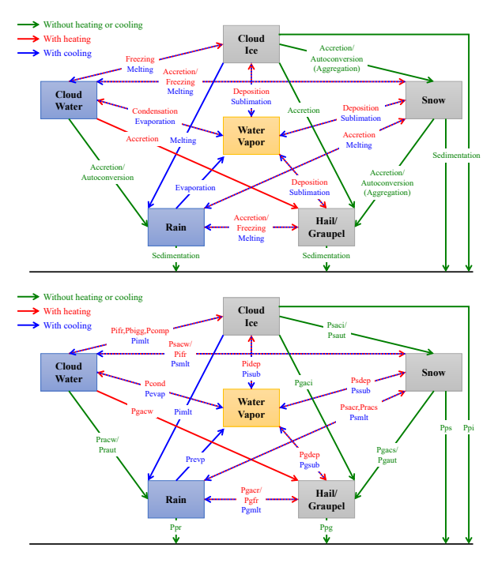
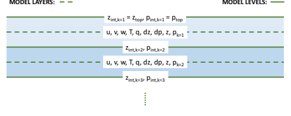
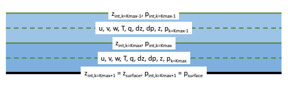
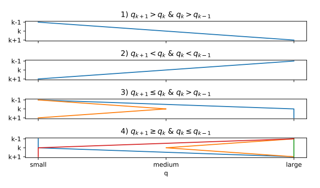
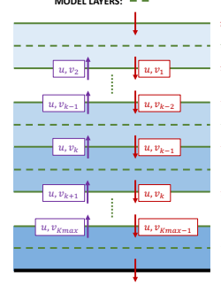

# The Gfdl Cloud Microphysics Parameterization

Linjiong Zhou Princeton University Lucas Harris NOAA/Geophysical Fluid Dynamics Laboratory Jan-Huey Chen University Corporation for Atmospheric Research, NOAA/Geophysical Fluid Dynamics Laboratory 1 July 2022 Document Version 4.0 GFDL Weather and Climate Dynamics Division 

Technical Memorandum GFDL202202 

## Contents

| 1                                                                     | Introduction                                                       | 1   |    |
|-----------------------------------------------------------------------|--------------------------------------------------------------------|-----|----|
| 1.1                                                                   | History                                                            |     | 1  |
| 1.2                                                                   | Features                                                           | 2   |    |
| 1.3                                                                   | Application                                                        |     | 2  |
| 1.4                                                                   | Structure                                                          |     | 3  |
| 2                                                                     | Theory                                                             | 4   |    |
| 2.1                                                                   | Basic Equations                                                    | 4   |    |
| 2.2                                                                   | Vertical Placement of the Meteorological Fields                    | 7   |    |
| 2.3                                                                   | Size Distribution of Hydrometeors                                  |     | 8  |
| 2.4                                                                   | Air Mass and Mass Mixing Ratio of Hydrometeors                     |     | 8  |
| 2.5                                                                   | Number Concentration of Hydrometeors                               | 9   |    |
| 2.6                                                                   | Air Density                                                        |     | 10 |
| 2.7                                                                   | Virtual Temperature                                                | 11  |    |
| 2.8                                                                   | Specific Heat Capacity                                             | 11  |    |
| 2.9                                                                   | Latent Heat Coefficient                                            |     | 12 |
| 2.10 Cloud Condensation Nuclei and Cloud Droplet Number Concentration | 12                                                                 |     |    |
| 2.11 Subgrid Variability                                              | 13                                                                 |     |    |
| 2.12 Rate of Conversion                                               | 14                                                                 |     |    |
| 2.13 Fix Negative Hydrometeors                                        |                                                                    | 15  |    |
| 2.14 Saturation Water Vapor Pressure                                  | 16                                                                 |     |    |
| 2.15 Energy Conservation                                              | 20                                                                 |     |    |
| 3                                                                     | Cloud Microphysical Processes                                      | 22  |    |
| 3.1                                                                   | Cloud Water Condensation and Evaporation                           | 22  |    |
| 3.2                                                                   | Evaporation of Rain to Water Vapor                                 | 23  |    |
| 3.3                                                                   | Minimum Evaporation of Rain to Water Vapor                         |     | 24 |
| 3.4                                                                   | Cloud Ice Sublimation and Deposition                               |     | 24 |
| 3.5                                                                   | Snow Sublimation and Deposition                                    |     | 25 |
| 3.6                                                                   | Graupel Sublimation and Deposition                                 | 26  |    |
| 3.7                                                                   | Instantaneous Deposition of Water Vapor                            |     | 27 |
| 3.8                                                                   | Instantaneous Evaporation / Sublimation of Cloud Water / Cloud Ice |     | 27 |
| 3.9                                                                   | Melting of Cloud Ice to Cloud Water and Rain                       |     | 27 |
| 3.10 Complete Freezing of Cloud Water to Cloud Ice                    | 28                                                                 |     |    |
| 3.11 Homogeneous Freezing of Cloud Water to Cloud Ice and Snow        |                                                                    | 28  |    |
| 3.12 Bigg Freezing of Cloud Water to Cloud Ice                        |                                                                    | 29  |    |
| 3.13 Melting of Snow to Cloud Water and Rain, Simple Version          |                                                                    | 29  |    |
| 3.14 Melting of Snow to Cloud Water and Rain                          | 29                                                                 |     |    |
| 3.15 Melting of Graupel to Rain                                       |                                                                    | 30  |    |
| 3.16 Freezing of Rain to Graupel, Simple Version                      | 30                                                                 |     |    |
| 3.17 Freezing of Rain to Graupel                                      | 31                                                                 |     |    |
| 3.18 Autoconversion from Cloud Water to Rain, Simple Version          |                                                                    | 31  |    |
| 3.19 Autoconversion from Cloud Water to Rain                          | 31                                                                 |     |    |
| 3.20 Autoconversion from Cloud Ice to Snow, Simple Version            |                                                                    | 32  |    |

| 3.21 Autoconversion from Cloud Ice to Snow                                |                                                     | 32   |    |
|---------------------------------------------------------------------------|-----------------------------------------------------|------|----|
| 3.22 Autoconversion from Snow to Graupel                                  | 33                                                  |      |    |
| 3.23 Accretion of Cloud Water by Rain                                     |                                                     | 33   |    |
| 3.24 Accretion of Cloud Water by Snow                                     | 34                                                  |      |    |
| 3.25 Accretion of Rain by Snow                                            |                                                     | 34   |    |
| 3.26 Accretion of Snow by Rain                                            |                                                     | 34   |    |
| 3.27 Accretion of Cloud Water by Graupel                                  |                                                     | 34   |    |
| 3.28 Accretion of Rain by Graupel                                         | 35                                                  |      |    |
| 3.29 Accretion of Cloud Ice by Snow                                       | 35                                                  |      |    |
| 3.30 Accretion of Cloud Ice by Graupel                                    |                                                     | 35   |    |
| 3.31 Scaler for Accretion of Rain by Snow and Freezing of Rain to Graupel |                                                     | 36   |    |
| 3.32 Accretion of Snow by Graupel                                         | 36                                                  |      |    |
| 4                                                                         | Sedimentation and Precipitation                     | 37   |    |
| 4.1                                                                       | Terminal Fall Velocity                              |      | 37 |
| 4.2                                                                       | Implicit Falls of Hydrometeors                      |      | 38 |
| 4.3                                                                       | Lagrangian Falls of hydrometeors                    | 39   |    |
| 4.4                                                                       | Impact of Sedimentation on Momentum and Temperature | 39   |    |
| 5                                                                         | Diagnostic Output                                   | 41   |    |
| 5.1                                                                       | Cloud Fraction                                      |      | 41 |
| 5.2                                                                       | Radar Reflectivity                                  |      | 43 |
| 5.3                                                                       | Cloud Effective Radius                              | 45   |    |
| Appendix A                                                                | List of Symbols                                     | 48   |    |
| Appendix B                                                                | List of Constants in IFS                            | 54   |    |
| Appendix C                                                                | Namelist Guide                                      | 55   |    |
| C.1                                                                       | General                                             |      | 55 |
| C.2                                                                       | Conversion Time Scale                               | 55   |    |
| C.3                                                                       | Subgrid Variability                                 | 56   |    |
| C.4                                                                       | Fall Speed                                          | 56   |    |
| C.5                                                                       | Conversion Threshold                                |      | 57 |
| C.6                                                                       | Conversion Efficiency                               | 57   |    |
| C.7                                                                       | Options                                             |      | 58 |
| C.8                                                                       | Cloud Fraction                                      |      | 60 |
| C.9                                                                       | Sedimentation                                       | 60   |    |
| C.10 CCN                                                                  | 61                                                  |      |    |
| C.11 Others                                                               | 61                                                  |      |    |
| Appendix D Document Update Record                                         | 62                                                  |      |    |
| Acknowledgement                                                           | 63                                                  |      |    |
| Code, Copyright, and Citation                                             | 63                                                  |      |    |
| References                                                                | 63                                                  |      |    |

## 1 Introduction

Clouds play critical roles in our daily weather and in the global energy and water budgets that regulate the climate of the Earth (Lamb and Verlinde, 2011; Houze, 2014). The formation and evolution of clouds significantly impact precipitation forecasts in numerical weather prediction (Seifert and Beheng, 2005; Morrison and Grabowski, 2008; Baldauf et al., 2011; Bauer et al., 2015). Clouds and their impacts on solar and thermal radiation are among the most challenging aspects of climate prediction (Trenberth et al., 2009; Stephens et al., 2012; Wild et al., 2019). Therefore, the representation of clouds in atmospheric models has to be paid particular attention to. Among all physical processes in a model, cloud microphysics is less well represented but is of critical importance. Because the processes are not readily resolved in time and space, cloud microphysics parameterization is essential from large-eddy to global simulations (Morrison and Grabowski, 2008; Kogan, 2013; Nogherotto et al., 2016).

## 1.1 History

Two cloud microphysics schemes have been developed at the Geophysical Fluid Dynamics Laboratory
(GFDL) for use in global climate and weather models. One is the Rotstayn-Klein cloud microphysics scheme
(Rotstayn, 1997; Klein and Jakob, 1999; Rotstayn et al., 2000; Jakob and Klein, 2000); the other one is a single-moment five-category cloud microphysics scheme (Chen and Lin, 2011, 2013; Zhou et al., 2019; Harris et al., 2020; Zhou et al., 2022). This document focuses on the latter one. The single-moment five-category cloud microphysics scheme (GFDL MP for short hereafter) was developed based on the Lin-Lord-Krueger cloud microphysics scheme (Lin et al., 1983; Lord et al., 1984; Krueger et al., 1995) formerly used in the GFDL ZETAC regional model (Pauluis and Garner, 2006; Knutson et al., 2007, 2008). It was substantially revised and redesigned by Dr. Shian-Jiann Lin for the GFDL global high-resolution model HiRAM (HighResolution Atmospheric Model) in the early 2000s (Zhao et al., 2009; Chen and Lin, 2011, 2013; Harris et al., 2016; Gao et al., 2017, 2019). This version can be called as GFDL MP version 0 (GFDL MP v0). It is being continually developed and maintained by the FV3 team for various applications ranging from convective-scale to seasonal-scale prediction, from regional to global domains. We released GFDL MP v1 as in (Zhou et al., 2019), and GFDL MP v2 as in Harris et al. (2020). In addition, for climate and very-longtime simulation, it is widely recognized that a double-moment scheme (or other added complexity schemes such as triple-moment or spectral bin schemes) can improve the representation of clouds and cloud feedbacks
(Reisner et al., 1998; Swann, 1998; Luo et al., 2008; Morrison et al., 2009; Dawson et al., 2010; Milbrandt and McTaggart-Cowan, 2010; Jung et al., 2012; Molthan and Colle, 2012; Van Weverberg et al., 2012; Baba and Takahashi, 2014; Jin et al., 2014; Igel et al., 2015). Therefore, the GFDL MP was rewritten entirely in early 2021 to allow the future development of the double-moment capability for climate simulation and the weather to seasonal prediction (Zhou et al., 2022). This version can be called as GFDL MP v3. This document has been updated to represent the GFDL MP v2 that was briefly described in Harris et al. (2020). The latest development in GFDL MP v3 described in Zhou et al. (2022) will be included in the next release of this document.

1

## 1.2 Features

The GFDL MP was designed to be integrated within the Finite-Volume Cubed-Sphere Dynamical Core
(FV3), thus it has the following featured attributes that are more or less originated from the FV3 (Zhou et al., 2019; Harris et al., 2020). The first feature is inline cloud microphysics. All cloud processes are embedded within the Lagrangian-to-Eulerian remapping in the FV3 dynamical core and can be updated more frequently than the rest of the physics. The second feature is fast and stable sedimentation. Timeimplicit monotonic scheme and piecewise parabolic method are applied to falling condensates, ensuring shape preservation and stability without subcycling (see section 4). The third feature is consistent thermodynamics. Thermodynamic consistency is maintained between the dynamics and the physics by considering the heat content of the condensates. As a result, the total moist energy is precisely conserved within the cloud microphysics scheme (see section 2). The fourth feature is sedimentation effect. Condensates carry heat and momentum during the sedimentation processes (see section 4). The fifth feature is scale awareness. Scale awareness is achieved by an assumed horizontal subgrid variability and a second-order finite-volume-type vertical reconstruction for autoconversion processes (see section 2).

## 1.3 Application

The GFDL MP was originally developed within HiRAM as one of its essential components. HiRAM showed excellent performance in the convective-scale forecast, sub-seasonal to seasonal prediction, and climate simulation (Chen and Lin, 2011, 2013; Harris et al., 2016; Gao et al., 2017, 2019). This cloud microphysics scheme has also been an option of the GFDL modeling system suites for most 25-km resolution configurations and radiative-convective equilibrium (RCE) simulations (Jeevanjee, 2017; Jeevanjee and Zhou, 2022). In 2011, this cloud microphysics scheme has been adopted by the climate modeling system of the Institute of Atmospheric Physics (IAP) at the Chinese Academy of Sciences (CAS). The IAP / CAS model with this cloud microphysics scheme achieves excellent global energy and water balance, improved MaddenJulian Oscillation (MJO), and hurricane predictions (Zhou et al., 2015; Li et al., 2019; He et al., 2019).

In 2016, the GFDL MP was implemented into the Next Generation Global Prediction System (NGGPS) to replace the current Zhao-Carr cloud microphysics scheme (Zhao and Carr, 1997). With this upgrade, the NGGPS significantly outperforms the "Legacy" Spectral Global Forecast System (GFS) in the global forecast skill (Zhou et al., 2019; Harris et al., 2020; Zhou et al., 2022) and hurricane prediction (Chen et al., 2019b,a). This model also shows skillful predictions of convective storms over the contiguous United States (Zhou et al., 2019; Harris et al., 2019). On June 12, 2019, the National Weather Service (NWS) upgraded its operational GFS to version 15 which included the FV3 dynamical core as well as the GFDL MP
(https://www.emc.ncep.noaa.gov/gmb/STATS/html/model changes.html). The most up-to-date GFS version 16 still adopts the GFDL MP since it helps to produce excellent forecasts. The NWS's Hurricane Analysis and Forecast System (HAFS) is also using this cloud microphysics scheme for hurricane predictions(Dong et al., 2020; Hazelton et al., 2021). More recently, the National Aeronautics and Space Administration
(NASA) Goddard Earth Observing System Model, Version 5 (GEOS-5) adopted this cloud microphysics scheme in their cloud-resolving simulations (Arnold et al., 2020).

## 1.4 Structure

This document is organized as follows: Section 2 describes the basic theory of the cloud microphysics scheme, which includes basic equations, definition of meteorological fields, size distribution, subgrid variability, conversion rate, saturation water vapor pressure, and energy conservation. Section 3 describes all cloud microphysical processes, which includes saturation adjustment, accretion, autoconversion, freezing /
melting, and others. Section 4 describes the equations to calculate sedimentation and precipitation. Section 5 describes some diagnosis outputs, which are cloud fraction, radar reflectivity, cloud effective radius. The appendices provide further information on symbols, constants used in this document, namelist of parameters, and update records.

## 2 Theory 2.1 Basic Equations

Like many other single-moment bulk cloud microphysics schemes (Rutledge and Hobbs, 1983, 1984; Cotton et al., 1986; Dudhia, 1989; Tao and Simpson, 1993; Walko et al., 1995; Thompson et al., 2004; Hong and Lim, 2006; Nogherotto et al., 2016), the GFDL MP consists of water vapor (q*vapor*) and five categories of hydrometeors defined as the mass mixing ratio of cloud water (q*water*), cloud ice (qice), rain (q*rain*),
snow (q*snow*), and graupel or hail (qgraupel or q*hail*) and contains various processes to parameterize the conversions between them (Figure 1). As a single-moment cloud microphysics scheme, all other moments of the hydrometeor size distribution are prescribed or diagnosed. For example, the number concentration (zeroth moment) is prescribed as a constant for all categories of hydrometeors. The effective radius (third moment divided by second moment) and radar reflectivity (sixth moment) are diagnosed at the end of the cloud microphysics scheme.

The prognostic equations governing the mass mixing ratio conversion between hydrometeors shown in Figure
1 are written as:
 =$Pgdep+Pgacw+Pgaci+Pgacr+Pgfr+Pgacs+Pgaut\nonumber$  $\begin{array}{r}-Pgsub-Pgmlt-Pgacw-Pgacr,\nonumber\end{array}$
$$\frac{\partial q_{g r a u p e l}}{\partial t}=$$
$$\frac{\partial q_{s n o w}}{\partial t}\ +$$
 $\begin{array}{l}+\left(1-\epsilon\right)P r a c s+\left(1-\epsilon\right)P r s a c w+P g a c w+P g a c r\\ \\ -P r e v p-P s a c r-P g a c r-P g f r\\ \\ =P s a c p+\left(1-\beta\right)P i f r+P s a c i+P s a u t+P s a c r\\ \\ -P s s u b-P s m l t-P r a c s-P g a c s-P g a u t-P s a c w-P s a c r\\ \\ =P g a c p+P g a c w+P g a c i+P g a c r+P g f r+P g a c s+P g a u t\end{array}$
$$\begin{array}{l}{{+(1-\epsilon)P r a c s+(1-\epsilon)P s a c w+P g a c w+P g a c r}}\\ {{-\,P r e v p-P s a c r-P g a c r-P g f r}}\end{array}$$
$$\frac{\partial q_{r a i n}}{\partial t}\ =$$
 =$P i d e p+\beta P i f r+P o m p+P b i g g$  $\begin{array}{l}-P i s u b-P i m l t-P s a c i-P s a u t-P g a c i\end{array}$  =$P a c w+P r a u t+\left(1-\alpha\right)P i m l t+\left(1-\epsilon\right)P s m l t+P g m l t+\left(1-\epsilon\right)P a s c r$  $\begin{array}{l}+\left(1-\epsilon\right)P r a c s+\left(1-\epsilon\right)P s a c w+P g a c w+P g a c r\end{array}$
$$P i d e p+\beta P i f r+P c o m p+P b i g g$$
$$\frac{\partial q_{i c e}}{\partial t}\,=$$
$$\frac{\partial q_{w a t e r}}{\partial t}\ ;$$
$$\frac{\partial q_{v a p o r}}{\partial t}\ =$$
 =$Pevap+Pisub+Prevp+Psub+Pgsub\newline\newline-Pcond-Pidep-Psdep-Pgdep\newline\newline=Pcond+\alpha Pimtl+\epsilon Psmtl+\epsilon Psaw+\epsilon Pscar+\epsilon Pracs\newline\newline-Pevap-Pifr-Pracw-Praut-Pgacw-Pcomp-Pbigg\newline\newline=Pidep+\beta Pifr+Pcomp+Pbigg$
where α, β, and ϵ represent the partitioning of P imlt, P ifr, P smlt, P sacw, *P sacr*, and *P racs* in separated microphysical processes. Note that all relevant hydrometeors and temperature are updated immediately after each cloud microphysical process based on exact mass conservation and moist total energy conservation.

The meaning and source of each item on the right-hand side of Equations (2.1) to (2.6) and in Figure 1 are demonstrated in Table 1. Conversion between hydrometeors in different phases involves heating and cooling of the air, while that between hydrometeors in the same phases does not. Most of the microphysical processes, as well as the parameters, are revised from Lin et al. (1983); Hong et al. (2004); Hong and Lim
(2006).

$$(2.1)$$
$$(2.2)$$
$$(2.3)$$
$$(2.4)$$
$$(2.5)$$

$$(2.6)$$

| Table 1: The symbols used in the prognostic mass mixing ratio equations and Figure 1.   |                                                                                                                     |                                                             |
|-----------------------------------------------------------------------------------------|---------------------------------------------------------------------------------------------------------------------|-------------------------------------------------------------|
| Symbol                                                                                  | Meaning and Source                                                                                                  |                                                             |
| Pcond                                                                                   | Condensational growth of cloud water (Hong and Lim, 2006).                                                          |                                                             |
| Pevep                                                                                   | Evaporation of cloud water (Hong and Lim, 2006).                                                                    |                                                             |
| Pifr                                                                                    | Freezing of cloud water to form cloud ice (Lin et al., 1983; Hong and Lim, 2006).                                   | Auto                                                             |
| convert to snow if cloud ice exceeds a threshold.                                       |                                                                                                                     |                                                             |
| Pbigg                                                                                   | Bigg freezing of cloud water to form cloud ice (Bigg, 1953).                                                        |                                                             |
| Pcomp                                                                                   | Complete freezing of cloud water to form cloud ice (Lin et al., 1983; Hong and Lim, 2006)                           |                                                             |
| Pidep                                                                                   | Depositional growth of cloud ice (Hong et al., 2004).                                                               |                                                             |
| Pisub                                                                                   | Sublimation of cloud ice (Hong et al., 2004).                                                                       |                                                             |
| Pimlt                                                                                   | Melting of cloud ice to form cloud water (Lin et al., 1983).                                                        | Auto-convert to rain if cloud                               |
| water exceeds a threshold.                                                              |                                                                                                                     |                                                             |
| Prevp                                                                                   | Evaporation of rain (Lin et al., 1983).                                                                             |                                                             |
| Praut                                                                                   | Auto-conversion of cloud water to form rain (Hong et al., 2004).                                                    |                                                             |
| Pracw                                                                                   | Accretion of cloud water by rain (Lin et al., 1983).                                                                |                                                             |
| Pracs                                                                                   | Accretion of snow by rain; produces graupel if rain or snow exceeds a threshold and T < Tf reez (Lin et al., 1983). |                                                             |
| Psacw                                                                                   | Accretion of cloud water by snow; produces snow if T < Tf reez or rain if T ≥ Tf reez (Lin et al., 1983).           |                                                             |
| Psacr                                                                                   | Accretion of rain by snow.                                                                                          | For T < Tf reez, produces graupel if rain or snow exceeds a |
| threshold; if not, produces snow (Lin et al., 1983).                                    |                                                                                                                     |                                                             |
| Psaci                                                                                   | Accretion of cloud ice by snow (Lin et al., 1983).                                                                  |                                                             |
| Psaut                                                                                   | Auto-conversion (aggregation) of cloud ice to form snow (Lin et al., 1983).                                         |                                                             |
| Psdep                                                                                   | Depositional growth of snow (Lin et al., 1983).                                                                     |                                                             |
| Pssub                                                                                   | Sublimation of snow (Lin et al., 1983).                                                                             |                                                             |
| Psmlt                                                                                   | Melting of snow to form cloud water (Lin et al., 1983). Auto-convert to rain if cloud water exceeds a threshold.    |                                                             |
| Pgaut                                                                                   | Auto-conversion (aggregation) of snow to form graupel (Lin et al., 1983).                                           |                                                             |
| Pgfr                                                                                    | Freezing of rain to form graupel (Lin et al., 1983).                                                                |                                                             |
| Pgacw                                                                                   | Accretion of cloud water by graupel (Lin et al., 1983).                                                             |                                                             |
| Pgaci                                                                                   | Accretion of cloud ice by graupel (Lin et al., 1983).                                                               |                                                             |
| Pgacr                                                                                   | Accretion of rain by graupel (Lin et al., 1983).                                                                    |                                                             |
| Pgacs                                                                                   | Accretion of snow by graupel (Lin et al., 1983).                                                                    |                                                             |
| Pgdep                                                                                   | Depositional growth of graupel (Lin et al., 1983).                                                                  |                                                             |
| Pgsub                                                                                   | Sublimation of graupel (Lin et al., 1983).                                                                          |                                                             |
| Pgmlt                                                                                   | Melting of graupel to form rain, T ≥ Tf reez (Lin et al., 1983).                                                    |                                                             |
| Ppi                                                                                     | Sedimentation of cloud ice (Deng and Mace, 2008; Heymsfield and Donner, 1990).                                      |                                                             |
| Ppr                                                                                     | Sedimentation of rain (Lin et al., 1983).                                                                           |                                                             |
| Pps                                                                                     | Sedimentation of snow (Lin et al., 1983).                                                                           |                                                             |
| Ppg                                                                                     | Sedimentation of graupel (Lin et al., 1983).                                                                        |                                                             |

There are several definitions, assumptions, and conservations that are different from other cloud microphysics schemes. The mass of a grid cell includes that of water vapor and of all hydrometeors; that latent heat coefficients are functions of air temperature; dry air, water vapor, liquid water, and solid water have their own heat capacities; cloud droplet number concentrations are prescribed; subgrid variability is piecewiselinear and scale-aware; saturation water vapor pressure is derived explicitly; latent heating and cooling follow the exact moist total energy conservation. More details will be depicted in this section.

## 2.2 Vertical Placement Of The Meteorological Fields

It is important to clarify in advance where the meteorological fields are located in the model vertical levels
/ layers. Model levels are defined as the boundaries of the model layers. Thus the number of model levels is equal to one more than the number of model layers. Sometimes, model levels are called as interfaces or layer edges. Meteorological fields at model layers in FV3 are always defined as layer-mean values. However, those at model levels are defined as interface (cell face-mean) values.

As it is shown in Figure 2, interface height (zint) and interface air pressure (pint) are defined at model levels.

Zonal wind (u), meridional wind (v), vertical velocity (w), air temperature (T), the mass mixing ratio of hydrometeors (q), height thickness (negative) (dz), pressure thickness or air mass (positive) (dp) are defined at model layers. Those are layer-mean variables. We can also get the middle layer height (z) and layer-mean air pressure (p) using gas law and hydrostatic equilibrium:

$$p=-\frac{d p}{g d z}R_{d r y}T_{v}$$
$$\begin{array}{r}{(2.7)}\end{array}$$
gdz RdryTv (2.7)
where Tv is virtual temperature, and Rdry is dry air constant.

## 2.3 Size Distribution Of Hydrometeors

The size distribution of hydrometeors is central to a cloud microphysics scheme (Khain and Pinsky, 2018).

Many microphysical variables and processes are directly derived from the integration over the size distribution. For example, the mass mixing ratio of hydrometeors is the third moment. The number concentration of hydrometeor is the zeroth moment, the effective radius is the ratio of the third moment and the second moment, and the radar reflectivity is the sixth moment. The terminal velocity and collision are mostly determined by the higher moments of the size distribution. According to observations, the size distribution of non-precipitable hydrometeors (e.g. cloud water and cloud ice) is represented as a gamma distribution, while precipitable hydrometeors (e.g. rain, snow, and graupel) is represented as a exponential distribution (Pruppacher and Klett, 2010). The exponential distribution can be treated as a simplified gamma distribution. However, the size distribution of cloud water and cloud ice in the GFDL MP is assumed to be uniform so far, which is simple but unrealistic. Therefore, the number concentration, effective radius, radar reflectivity, and terminal velocity of cloud water and cloud ice are either prescribed as constant or empirically diagnosed from other variables. The size distribution of rain (n*rain*), snow (n*snow*), and graupel (n*graupel*) is assumed as an exponential distribution and follows Lin et al. (1983):

$$n_{rain}(D)=n_{rain,0}\exp\left(-\lambda_{rain}D\right)\tag{2.8}$$ $$n_{snow}(D)=n_{snow,0}\exp\left(-\lambda_{snow}D\right)$$ (2.9) $$n_{gravuel}(D)=n_{gravuel,0}\exp\left(-\lambda_{gravuel}D\right)\tag{2.10}$$
$$(2.14)$$
$$(2.15)$$
8
where D is the diameter of hydrometeor. nrain,0, n*snow,*0, and n*graupel,*0 are the intercept parameters of the rain, snow, and graupel size distributions prescribed as constants. The slope parameters of the rain
(λ*rain*), snow (λ*snow*), and graupel (λ*graupel*) size distributions can be derived from the integration of size distribution for all sizes and the mass mixing ratio of hydrometeor:

$$\lambda_{rain}=\left(\frac{\pi\rho_{rain}n_{rain,0}}{\rho q_{rain}}\right)^{0.25}$$ $$\lambda_{snow}=\left(\frac{\pi\rho_{snow}n_{snow,0}}{\rho q_{snow}}\right)^{0.25}$$ $$\lambda_{graupl}=\left(\frac{\pi\rho_{graupl}n_{graupl,0}}{\rho q_{graupl}}\right)^{0.25}$$

where ρrain, ρ*snow*, and ρ*graupel* are the density of rain, snow, and graupel. ρ is air density.

## 2.4 Air Mass And Mass Mixing Ratio Of Hydrometeors

Air mass per unit area (Mdry) and the mass mixing ratio of hydrometeors (q∗) in the GFDL MP are defined for dry air at the model layers:

$$M_{dry}=\frac{dp}{g}$$ $$q_{*}=\frac{M_{*}}{M_{dry}}$$

where dp is dry air thickness, q∗ can be qvapor, qwater, qice, qrain, q*snow*, or q*graupel*, M∗ can be M*vapor*, Mwater, Mice, Mrain, M*snow*, or M*graupel*. That is different from those in the FV3 dynamical core, which are defined for moist air (dry air + all hydrometeors) thickness (dp′) and the specific ratio of hydrometeors
(q
′
∗
):

$$dp^{\prime}=\left(M_{dry}+M_{vapor}+M_{water}+M_{ice}+M_{rain}+M_{swow}+M_{graupel}\right)g\tag{2.16}$$ $$q^{\prime}_{s}=\frac{M_{s}}{M_{dry}+M_{vapor}+M_{water}+M_{ice}+M_{rain}+M_{swow}+M_{graupel}}\tag{2.17}$$

At the beginning of the cloud microphysics scheme, moist air thickness (dp′) is converted to dry air thickness
(dp), specific ratio of hydrometeors (q
′
∗
) is converted to mass mixing ratio of hydrometeors (q∗):

$$dp=dp^{\prime}\left[1-\left(q^{\prime}_{vapor}+q^{\prime}_{water}+q^{\prime}_{ice}+q^{\prime}_{rain}+q^{\prime}_{snow}+q^{\prime}_{gravel}\right)\right]\tag{2.18}$$ $$q_{*}=\frac{q^{\prime}_{*}}{1-\left(q^{\prime}_{vapor}+q^{\prime}_{water}+q^{\prime}_{ice}+q^{\prime}_{rain}+q^{\prime}_{snow}+q^{\prime}_{gravel}\right)}\tag{2.19}$$

At the end of the cloud microphysics scheme, dry air thickness (dp) converts back to moist air thickness
(dp′), mass mixing ratio of hydrometeors (q∗) converts back to specific ratio of hydrometeors (q
′
∗
):

$$dp^{\prime}=dp\left[1+(q_{vapor}+q_{water}+q_{ice}+q_{rain}+q_{now}+q_{grapuel})\right]\tag{2.20}$$ $$q^{\prime}_{*}=\frac{q_{*}}{1+(q_{vapor}+q_{water}+q_{ice}+q_{rain}+q_{now}+q_{grapuel})}\tag{2.21}$$

It is important to note that air mass is exactly conserved in the GFDL MP.

## 2.5 Number Concentration Of Hydrometeors

In the GFDL MP, the number concentration of hydrometeors are not prognostic variables. For cloud water, the number concentration is only used for cloud water to rain autoconversion and cloud water freezing to form cloud ice. It will be described later that the cloud water number concentration is from the prescribed cloud droplet number concentration, which has constant values over land and over ocean. For cloud ice, the number concentration should be from ice nucleation or cloud ice deposition. For now, it follows the calculation in Hong et al. (2004):

$$N_{i c e}=5.38\times10^{7}\left(\rho q_{i c e}\right)^{0.75}$$
0.75 (2.22)
Optionally, Nice can also be calculated from Meyers et al. (1992):
Nice = exp [−2.80 + 0.262 × (T*f reez* − T)] × 1000.0 (2.23)
or

$$N_{i c e}=\exp\left[-0.639+12.96\times\left(\frac{q_{v a o r}}{q_{s2}}-1\right)\right]\times1000.0$$

Nice can also calculated from Cooper (1986):
Nice = 5 × 10−3 × exp [0.304 × (T*f reez* − T)] × 1000.0 (2.25)

$$(2.24)$$

One more option is from Fletcher et al. (1962):

$$N_{i c e}=1\times10^{-5}\times\exp\left[0.5\times(T_{f r e e z}-T)\right]\times1000.0$$
Nice = 1 × 10−5 × exp [0.5 × (T*f reez* − T)] × 1000.0 (2.26)
Since rain, snow, and graupel follow the exponential size distribution, Their number concentrations (N*rain*,
N*snow*, and N*graupel*) are the integration of size distributions:

$$N_{rain}=\int_{0}^{\infty}n_{rain}(D)dD=\frac{n_{rain,0}}{\lambda_{rain}}$$ $$N_{snow}=\int_{0}^{\infty}n_{snow}(D)dD=\frac{n_{snow,0}}{\lambda_{snow}}$$ $$N_{graubel}=\int_{0}^{\infty}n_{graubel}(D)dD=\frac{n_{graubel,0}}{\lambda_{graubel}}$$
$$(2.26)$$
$$\begin{array}{l}{(2.27)}\\ {}\\ {(2.28)}\\ {}\\ {(2.29)}\end{array}$$

If, in the future, number concentration is a prognostic variable in this cloud microphysics scheme, n*rain,*0, n*snow,*0, and n*graupel,*0 will no longer be constants. Instead, they are updated upon the change of mass mixing ratio and number concentration written as:

$$n_{rain,0}=\left(\frac{\pi\rho_{rain}}{\rho q_{rain}}\right)^{1/3}N_{rain}^{4/3}$$ $$n_{snow,0}=\left(\frac{\pi\rho_{snow}}{\rho q_{snow}}\right)^{1/3}N_{snow}^{4/3}$$ $$n_{grauvel,0}=\left(\frac{\pi\rho_{grauvel}}{\rho q_{grauvel}}\right)^{1/3}N_{grauvel}^{4/3}$$
 $$\begin{array}{l}\left(2.30\right)\end{array}$$ = $$\begin{array}{l}\left(2.31\right)\end{array}$$ = $$\begin{array}{l}\left(2.32\right)\end{array}$$ = $$\begin{array}{l}\left(2.32\right)\end{array}$$ . 

## 2.6 Air Density

Many assumptions in the GFDL MP depend on whether the model, particularly the FV3 dynamical core, is designed to be hydrostatic or non-hydrostatic. For climate modeling, the hydrostatic assumption is appropriate. In this case, the GFDL MP uses the consistent definition of constants and parameters as other physical parameterizations. As the resolutions approach the grey zone, the hydrostatic assumption is no longer as accurate and it is more appropriate to use non-hydrostatic dynamics. In either case, energy conservation and the consistency of constants and parameterizations are critical.

In hydrostatic case, moist air thickness (dp′) and air temperature (T) are both prognostic variables in the dynamical core. So air density (ρ) is calculated using the ideal gas law and the hypsometric equation:

$$\rho={\frac{p}{R_{d r y}T_{v}}}={\frac{d p^{\prime}}{d\ln p^{\prime}R_{d r y}T_{v}}}$$
′RdryTv(2.33)
where Tv is virtual temperature, Rdry is dry air gas constant.

In non-hydrostatic case, the height thickness (negative) (dz) is also a prognostic variable. So air density (ρ) is calculated from its definition:

$$(2.33)$$
$$\rho=-{\frac{d p^{\prime}}{g d z}}$$
gdz (2.34)
where g is gravitational acceleration.

## 2.7 Virtual Temperature

The virtual temperature (Tv) of a moist air parcel is the temperature at which a theoretical dry air parcel would have a total pressure and density equal to the moist parcel of air. Thus all hydrometeors are considered to calculate virtual temperature:

$$T_{v}=T\left(1+z_{v i r}q_{v a p o r}\right)\left[1-\left(q_{v a p o r}+q_{v a t e r}+q_{i c e}+q_{r a i n}+q_{s n o w}+q_{g r a u p e t}\right)\right]^{1}$$

where zvir is the ratio of the gas constants of water vapor (R*vapor*) and dry air (Rdry):

$$(2.35)$$
$$z_{v i r}={\frac{R_{v a p o r}}{R_{d r y}}}-1$$
$$(2.36)$$

$$(2.37)$$ $$(2.38)$$
Rdry− 1 (2.36)

## 2.8 Specific Heat Capacity

In the real atmosphere, the air contains water vapor and hydrometeors. Thus, the specific heat capacity consists of contributions from both dry air, water vapor, and each hydrometeor. In the GFDL MP, the constant-volume or constant-pressure specific heat capacity for moist air (cv,moist or c*p,moist*) is defined as:

 $ c_{v,moist}=c_{v,dry}+q_{vapor}c_{v,vapor}+q_{liquid}c_{v,liquid}+q_{solid}c_{v,solid}$  $ c_{p,moist}=c_{p,dry}+q_{vapor}c_{p,vapor}+q_{liquid}c_{p,liquid}+q_{solid}c_{p,solid}$  ... 
where cv,dry, cv,vapor, c*v,liquid*, and c*v,solid* are the constant-volume specific heat capacities of dry air, water vapor, liquid water (at the triple point of water T*f reez*), and solid water (at the triple point of water T*f reez*). Similarly, cp,dry, cp,vapor, c*p,liquid*, and c*p,solid* are the corresponding specific heat capacities at constant pressure. Liquid water and solid water barely change in volume and pressure during heating or cooling that their constant-volume and constant-pressure specific heat capacities are the same and defined as:

 $c_{liquid}=c_{v,liquid}=c_{p,liquid}\nonumber$  $c_{solid}=c_{v,solid}=c_{p,solid}\nonumber$  (1)
$$(2.39)$$ $$(2.40)$$
q*liquid* is the mass mixing ratio of liquid water defined as the sum of the mass mixing ratio of cloud water and rain:

$$(2.41)$$
$$q_{l i q u i d}=q_{w a t e r}+q_{r a i n}$$
qliquid = qwater + q*rain* (2.41)
and q*solid* is the mass mixing ratio of solid water defined as the sum of mass mixing ratio of cloud ice, snow, and graupel:

$$q_{s o l i d}=q_{i c e}+q_{s n o w}+q_{g r a u p e l}$$
qsolid = qice + qsnow + q*graupel* (2.42)
The sum of the mass mixing ratio of liquid and solid water (q*cond*) is written as:
qcond = qliquid + q*solid* (2.43)

$$(2.42)$$
$\left(2.43\right)$ . 
Different from most existing cloud microphysics schemes, the GFDL MP was built at the height coordinate.

That means heating or cooling in this cloud microphysics scheme uses the constant-volume specific heat capacity. Pressure thickness is later adjusted according to the change of hydrometeors content in the grid box. This treatment is consistent with what is being used in FV3's nonhydrostatic solver (Lin, 2004), and the Nonhydrostatic ICosahedral Atmospheric Model (NICAM) (Satoh et al., 2008). Theoretically and actually, the constant-pressure specific heat capacity is about 40% larger than the constant-volume specific heat capacity. It indicates the heating or cooling by using constant-pressure specific heat capacity is 40% smaller than that using constant-volume specific heat capacity. Since the height thickness will be later adjusted according to temperature change, the eventual impact of the microphysics processes on the atmosphere is similar in these two different approaches. In the following sections, we use c*moist* instead of c*v,moist* as default.

## 2.9 Latent Heat Coefficient

According to the Kirchhoff's equation under constant volume (Emanuel, 1994), the latent heat coefficient of condensation / evaporation (Lv2l), melting / freezing (Ll2s), and deposition / sublimation (Lv2s) are a function of temperature (T):

$$L_{v2l}=L_{vap}+\left(c_{vapor}-c_{liquid}\right)\left(T-T_{frees}\right)$$ $$L_{l2s}=L_{fus}+\left(c_{liquid}-c_{solid}\right)\left(T-T_{frees}\right)$$ $$L_{v2s}=L_{vap}+L_{fus}+\left(c_{vapor}-c_{solid}\right)\left(T-T_{frees}\right)$$
$$\begin{array}{l}{(2.44)}\\ {(2.45)}\\ {(2.46)}\end{array}$$

where Lvap and Lfus are the latent heat coefficient of condensation / evaporation and melting / freezing at the triple point temperature of water (Tf reez). cvapor = c*p,vapor* in hydrostatic case. cvapor = c*v,vapor* in non-hydrostatic case.

A special latent heat coefficient of condensation / evaporation (L
′ v2l
) for saturated water vapor is defined as:

$$L_{v2l}^{\prime}=L_{v2l}+L_{l2s}\operatorname*{max}\left[0,\operatorname*{min}\left(1,{\frac{T_{f r e e z}-T}{T_{f r e e z}-T_{w f r}}}\right)\right]$$
$$(2.47)$$

If temperature is higher than freezing temperature (T > T*f reez*), L
′
v2l = Lv2l; If temperature is lower than critical freezing temperature (*T < T*w ), ′
f r Lv2l = Lv2s; otherwise (Twf r < T < Tf reez), Lv2l < L′v2l < Lv2s.

## 2.10 Cloud Condensation Nuclei And Cloud Droplet Number Concentration

Cloud condensation nuclei (CCN) is used in cloud seeding, that tries to promote condensation into cloud water by seeding the air with condensation nuclei. It is a major source of cloud water formation. The cloud droplet number concentration (CDNC) activated from CCN determines how much cloud water can be auto-converted to rain. However, since there is no cloud water activation built in this cloud microphysics scheme, the cloud droplet number concentration (CDNC, Nc) is either prescribed over land (N*c,land*) and ocean (N*c,ocean*) respectively:

$$N_{c}=[N_{c,l a n d}\cdot L S M+N_{c,o c e a n}\cdot(1-L S M)]\times10^{6}$$
Nc = [Nc,land · LSM + Nc,ocean · (1 − LSM)] × 106(2.48)
or calculated from aerosol mass mixing ratio (q*aerosol*) following Boucher and Lohmann (1995):

$$N_{c}=\left[10^{2.24}\times\left(10^{9}\rho\rho_{a e r o s o l}\right)^{0.257}\cdot L S M+10^{2.06}\times\left(10^{9}\rho\rho_{a e r o s o l}\right)^{0.48}\cdot(1-L S M)\right]\times10^{6}\rho_{a e r o s o l}\cdot\left(10^{9}\rho\rho_{a e r o s o l}\right)^{0.48}\cdot(1-L S M)\right]$$

where LSM is the land-sea mask, with value 1 over land and value 0 over ocean. ρbot is the bottom layer air density. The former method is used in the current operational GFS, NASA GEOS-5, HiRAM, IAP climate model. The latter method is an option in the GFDL modeling system suites. The number concentration of cloud then from the cloud droplet number concentration (CDNC):

$$(2.49)$$
$$(2.50)$$
$$N_{w a t e r}=N_{c}$$
N*water* = Nc (2.50)

## 2.11 Subgrid Variability

In a model that is unable to resolve cloud microphysical processes explicitly, it is useful to prescribe the subgrid distribution of quantities (e.g., hydrometeors) in the grid box. Regardless of which algorithm is used, it is some kind of empirical assumption. The simplest one is a linear assumption. In the GFDL MP, it presumed a linear background horizontal variability (hvar) and vertical variability (zvar) for hydrometeors following Lin et al. (1994). The horizontal subgrid variability is a function of cell area:

$$h_{v a r}=\operatorname*{min}\left(0.2,\operatorname*{max}\left\{0.01,[D_{l a n d}\cdot L S M+D_{o e c a n}\cdot(1-L S M)]\,\sqrt{\frac{x}{10^{5}}}\right\}\right)$$

where x is grid size. D*land* and D*ocean* are basic value for subgrid variability over land and ocean. These are tunable parameters. This formula indicates larger subgrid variability appears in the larger cell area. D*land* and D*ocean* can adjust the strength of the subgrid variability. The subgrid variability function enables the GFDL MP to be flexibly adapted to simulations in different resolutions and variable resolution. Theoretically, this assumption can be applied to all condensation / evaporation, freezing / melting, and deposition / sublimation processes. In the current version of GFDL MP, horizontal subgrid variability is mainly used in the calculation of cloud water to rain autoconversion and cloud fraction diagnostic. The vertical subgrid variability depends on the distribution of the three adjacent mass mixing ratio of hydrometeors: for model top (k = 1) and bottom layer (k = *kbot*):

$$(2.51)$$
$$(2.52)$$ $$(2.53)$$
 $\begin{array}{l}z_{var,1}=0\\ \\ z_{var,kbot}=0\end{array}$
for all other model layers (k = 2*, kbot* − 1), use twice the strength of the positive definiteness limiter (Lin et al., 1994). Four conditions are considered shown in Figure 3:
1) When qk+1 > qk, and qk > qk−1, monotonically increasing from up to down:

$$z_{v a r,k}={\frac{1}{2}}\operatorname*{min}\left(\left|{\frac{q_{k+1}-q_{k-1}}{2}}\right|,{\frac{q_{k}}{2}}\right)$$
2(2.54) 
2) When qk+1 < qk, and qk < qk−1, monotonically decreasing from up to down:

$$z_{v a r,k}={\frac{1}{2}}\operatorname*{min}\left(\left|{\frac{q_{k+1}-q_{k-1}}{2}}\right|,{\frac{q_{k}}{2}}\right)$$
2(2.55) 
$$(2.54)$$

$$(2.55)$$
$13\phantom{\rule{0ex}{0ex}}$. 

3) When qk+1 ≤ qk, and qk > qk−1, maximum value at the center:

$$z_{v a r,k}=\operatorname*{min}\left[{\frac{1}{2}}\operatorname*{min}\left(\left|{\frac{q_{k+1}-q_{k-1}}{2}}\right|,{\frac{q_{k}}{2}}\right),{\frac{q_{k}-q_{k-1}}{2}},-{\frac{q_{k+1}-q_{k}}{2}}\right]$$
(2.56)
 4) When $q_{k+1}\geq q_k$, and $q_k\leq q_{k-1}$, minimum value at the center: . 
$$(2.56)$$
$$(2.57)$$

$$z_{v a r,k}=0.0$$
$$(2.58)$$
z*var,k* = 0.0 (2.57)
Impose a presumed background horizontal variability that is proportional to the value itself:

$$z_{v a r,k}=\operatorname*{max}\left(z_{v a r,k},q_{m i n v a p r},h_{v a r}q_{k}\right),\quad k=1,...,k b o t$$

Note that zvar is a function of q, so zvar is different in each hydrometeor. q*minvapor* is minimum value for water vapor. Vertical subgrid variability is mainly used in the calculation of cloud water to rain autoconversion.

## 2.12 Rate Of Conversion

In general, conversion between two hydrometeors is not done instantaneously except for some extreme conditions. In most cases, it is a function of time. If the cloud microphysics scheme is embedded in the FV3 dynamical core, it will use the vertical remapping time step (dtm), which is a sub-cycle of physics time step
(dtp) controlled by k *split* in the namelists. If the cloud microphysics scheme is inside the normal physics package, it uses a relative smaller cloud microphysics time step (dtc), which is also a sub-cycle of physics time step (dtp). dtp, dtm, dtc at this stage are the same. However, dtp, dtm and dtc have much freedom to control separately, especially for higher resolution.

In many microphysical processes of this cloud microphysics scheme, the effective conversion rate from x to y over a time step dt, assuming an exponential decrease of x, is calculated as:

$$f_{x2y}=1-\exp\left(-\frac{dt}{\tau_{x2y}}\right)\tag{2.59}$$

where x and y can be v (water vapor), w (cloud water), i (cloud ice), r (rain), s (snow), or g (graupel). dt can be dtm or dtc. Note that τx2y and α are both tunable parameters controlling the conversion rate. The larger of τx2y, the slower the conversion.

## 2.13 Fix Negative Hydrometeors

Unphysical negative hydrometeor concentrations are difficult to completely avoid in finite-precision arithmetic. Fixing negative hydrometeors in the GFDL MP is straightforward and mass conserved. The easiest way to fix negative hydrometeor is to borrow mass from other hydrometeors. Negative hydrometeor then is fixed to zero. Assume hydrometeor x is negative, and borrow mass from hydrometeor y:

$q_{y}=q_{y}+q_{x}$  $q_{x}=0.0$
$$(2.60)$$ $$(2.61)$$
$$(2.62)$$

In some certain conditions, qy could become negative after this process. Then qy need to be fixed from other hydrometeors except for qx. In general, the direction of negative fixing follows:

$$q_{i c e}\gets q_{s n o w}\gets q_{g r a u p e l}\gets q_{r a i n}\gets q_{w a t e r}\gets q_{v a p o r}$$
qice ← qsnow ← qgraupel ← qrain ← qwater ← q*vapor* (2.62)
That is to say, if qice is negative, borrow mass from q*snow*; if q*snow* is negative, borrow mass from q*graupel*;
etc. However, to prevent overdoing, Equation (2.60) can be revised as:

$q_{tmp}=\min\left[-q_{x},\max\left(0,q_{y}\right)\right]$  $q_{x}=q_{x}+q_{tmp}$  $q_{y}=q_{y}-q_{tmp}$
$$(2.63)$$ $$(2.64)$$

If this is a phase change, latent heating and cooling should also be applied. In the GFDL MP, water vapor can be used to fix all other negative hydrometeors. However, when water vapor is negative, it can borrow from above and below layers. From k = 1 to *kbot* − 1, when water vapor at k layer is negative, borrow it from below:

$$q_{v a p o r,k+1}=q_{v a p o r,k+1}+{\frac{q_{v a p o r,k}d p_{k}}{d p_{k+1}}}$$ $$q_{v a p o r,k}=0$$

when water vapor at the bottom layer is negative, borrow it from above if the water vapor in *kbot* − 1 is

$$(2.66)$$  $$(2.67)$$

positive:

$$dq=\min\left[-q_{vapor,kbot}dp_{kbot},q_{vapor,kbot-1}dp_{kbot-1}\right]$$ $$q_{vapor,kbot-1}=q_{vapor,kbot-1}-\frac{dq}{dp_{kbot-1}}$$ $$q_{vapor,kbot}=q_{vapor,kbot}+\frac{dq}{dp_{kbot}}$$
$$\begin{array}{l}{(2.68)}\\ {\qquad(2.69)}\end{array}$$  $$\begin{array}{l}{(2.70)}\end{array}$$ . 

## 2.14 Saturation Water Vapor Pressure

Saturation water vapor pressure is calculated using lookup tables. Five lookup tables are designed for different purposes for the GFDL MP. First of all, define a scaled temperature

$$T^{\prime*}=\min\left\{2621,10\left[T-\left(T_{f r e e z}-160\right)\right]+1\right\}$$ $$T^{*}=\mbox{INT}\left(T^{\prime*}\right)$$

INT here means forcing a variable to be an integer. Different from most existing tables of saturation water vapor pressure, which are basically written as empirical formula, the ones in the GFDL MP are directly derived by integrating of the Clausius-Claperyron equation (Wallace and Hobbs, 1977):

$$(2.71)$$ $$(2.72)$$
$${\frac{d\ln e_{s s}}{d T}}={\frac{L_{*}}{R_{v a p o r}T^{2}}}$$
$$(2.73)$$

R*vapor*T2(2.73)
where es∗ can be es0, es1, or es2 detailedly described in the following sub-sections. L∗ can be Lv2l, Ll2s, or Lv2s.

## Table N

The table N of saturation water vapor pressure (es0) was built only over water with temperature ranged from −160◦C to 102◦C defined as:

Ttmp = Tf reez − 160 + 0.1 (T ∗ − 1) (2.74) α = (cp,vapor − cliquid) ln Ttmp Tf reez + [Lvap − Tf reez (cp,vapor − cliquid)] Ttmp − Tf reez TtmpTf reez Rvapor(2.75) es0(T ∗) = e0e α(2.76)
$$\left({2.74}\right)$$  $$\left({2.75}\right)$$ $$\left({2.76}\right)$$
Table I
The table I of saturation water vapor pressure (es1) was built based on three temperature categories:
1) When T
∗ranges from 1 to 1600 (T ranges from −160◦C to 0
◦C), compute saturation water vapor pressure
(es1) over ice:

$$T_{t m p}=T_{f r e e z}-160+0.1\left(T^{*}-1\right)$$ $$\alpha=\frac{\left(c_{p,v a o r}-c_{s o i d}\right)\ln\frac{T_{t m p}}{T_{f r e e z}}+\left[L_{v o p}+L_{f u s}-T_{f r e e z}\left(c_{p,v a o r}-c_{s o i d}\right)\right]\frac{T_{t m p}-T_{f r e e z}}{T_{t m p}T_{f r e e z}}}{R_{v o p r}}$$ $$e_{s1}(T^{*})=e_{0}e^{\alpha}$$
$$\left({2.77}\right)$$  $$\left({2.78}\right)$$  $$\left({2.79}\right)$$

where e0 is saturation vapor pressure at T*f reez*.

2) When T
∗ranges from 1401 to 2621 (T ranges from −20◦C to 102◦C), compute saturation water vapor pressure (es1) over water:

$$\begin{array}{c}{{T_{t m p}=T_{f r e e z}-20+0.1\left(T^{*}-1400-1\right)}}\\ {{\alpha=\frac{\left(c_{p,v a o r}-c_{l i q u i d}\right)\ln\frac{T_{t m p}}{T_{f r e e z}}+\left[L_{v a p}-T_{f r e e z}\left(c_{p,v a o r}-c_{l i q u i d}\right)\right]\frac{T_{t m p}-T_{f r e e z}}{T_{t m p}T_{f r e e z}}}}\\ {{R_{v a o r}}}\\ {{e_{z1}(T^{*})=e_{0}e^{a}}}\end{array}$$
$$\left({2.80}\right)$$  $$\left({2.81}\right)$$  $$\left({2.82}\right)$$  $$\left({2.82}\right)$$

3) When T
∗ranges from 1401 to 1600 (T ranges from −20◦C to 0◦C), compute saturation water vapor pressure (es1) over ice and supercooled water:

$$\begin{array}{c}{{T_{t m p}=T_{f r e e z}-20+0.1\left(T^{*}-1400-1\right)}}\\ {{e_{s1}(T^{*})=\frac{\left(T_{f r e e z}-T_{t m p}\right)}{20}e_{s1}(T^{*})+\frac{\left[T_{t m p}-\left(T_{f r e e z}-20\right)\right]}{20}e_{s1}(T^{*})}}\end{array}$$
∗) (2.84)
$$(2.83)$$  $$(2.84)$$

Note that the first es1(T
∗) on the right hand side comes from saturation water vapor pressure over ice between −160◦C and 0◦C, and the second es1(T
∗) on the right hand side comes from saturation water vapor pressure over water between −20◦C and 102◦C.

## Table Ii

The table II of saturation water vapor pressure (es2) was built based on two categories:
1) When T
∗ranges from 1 to 1600 (T ranges from −160◦C to 0◦C), compute saturation water vapor pressure
(es2) over ice:

$$T_{t m p}=T_{f r e e z}-160+0.1\left(T^{*}-1\right)$$ $$\alpha=\frac{\left(c_{p,v a p o r}-c_{v o l d i d}\right)\ln\frac{T_{t m p}}{T_{f r e e z}}+\left[L_{v a p}+L_{f a u}-T_{f r e e z}\left(c_{p,v a p o r}-c_{v o l d i d}\right)\right]\frac{T_{t m p}-T_{f r e e z}}{T_{t m p}T_{f r e e z}}}{R_{v o p o r}}$$ $$e_{\alpha2}(T^{*})=e_{0}e^{\alpha}$$

2) When T
∗ranges from 1601 to 2621 (T ranges from 0◦C to 102◦C), compute saturation water vapor

pressure (es2) over water:

$$T_{t m p}=T_{f r e e z}-160+0.1\left(T^{*}-1\right)$$ $$\alpha=\frac{\left(c_{p,v a o r}-c_{l i q u i d}\right)\ln\frac{T_{t m p}}{T_{f r e e z}}+\left[L_{v o p}-T_{f r e e z}\left(c_{p,v a o r}-c_{l i q u i d}\right)\right]\frac{T_{t m p}-T_{f r e e z}}{T_{t m p}T_{f r e e z}}}{R_{v a o r}}$$ $$e_{z2}(T^{*})=e_{0}e^{a}$$
(2.88)  $\begin{array}{l}\text{(2.89)}\\ \\ \text{(2.90)}\end{array}$  . 
$$(2.91)$$

A smoother was added to es2 where temperature is around 0◦C (T
∗ = 1600 and T
∗ = 1601):

$$e_{s2}(T^{*})=0.25e_{s2}(T^{*}-1)+2e_{s}(T^{*})+e_{s2}(T^{*}+1)$$
∗ + 1) (2.91)

## Table Iii

The table III of saturation water vapor pressure (es3) is the same as Table I except using the Smithsonian formula Smithsonian and List (1951): 1) When T
∗ranges from 1 to 1600 (T ranges from −160◦C to 0◦C), compute saturation water vapor pressure
(es3) over ice:
2) When T
∗ranges from 1401 to 2621 (T ranges from −20◦C to 102◦C), compute saturation water vapor

$$T_{tmp}=T_{freez}-160+0.1\left(T^{*}-1\right)\tag{2}$$ $$a=-9.09718\times\left(\frac{T_{freez}}{T_{tmp}}-1\right)$$ (3) $$b=-3.56654\times\log_{10}\left(\frac{T_{freez}}{T_{tmp}}\right)$$ (4) $$c=-0.876793\times\left(\frac{T_{tmp}}{T_{freez}}-1\right)$$ (5) $$e=\log_{10}\left(6107.1\right)$$ (6) $$e_{s3}(T^{*})=0.1\times10^{a+b+c+d}\tag{6}$$
$$(2.93)$$  $$(2.94)$$
$$(2.95)$$

pressure (es3) over water:

 Let: $$T_{tmp}=T_{freez}-20+0.1\left(T^*-1400-1\right)$$ $$a=-7.90298\times\left(\frac{T_{freez}+100}{T_{tmp}}-1.\right)$$ $$b=5.02808\times\log_{10}\left(\frac{T_{freez}+100}{T_{tmp}}\right)$$ $$c=-1.3816\times10^{-7}\times\begin{bmatrix}1^{11.344\times}\left(1–\frac{T_{tmp}}{T_{freez}+100}\right)\\ \\ 10^{-7}\end{bmatrix}-1\right]$$ $$d=8.1328\times10^{-3}\times\begin{bmatrix}3.49149\times\left(1–\frac{T_{freez}+100}{T_{tmp}}\right)\\ \\ 10\end{bmatrix}-1.\right]$$ $$e=\log_{10}\left(1013246.0\right)$$ $$e_{s3}(T^*)=0.1\times10^{a+b+c+d}$$
$$\begin{array}{l}{(2.98)}\\ {}\\ {(2.99)}\end{array}$$  $$\begin{array}{l}{(2.100)}\\ {}\end{array}$$ . 
$$(2.101)$$
 $$\begin{split}(2.102)\end{split}$$  $$\begin{split}(2.103)\end{split}$$ $$\begin{split}(2.104)\end{split}$$
$$(2.105)$$  $$(2.106)$$
3) When T
∗ranges from 1401 to 1600 (T ranges from −20◦C to 0◦C), compute saturation water vapor pressure (es3) over ice and supercooled water:

$$\begin{array}{c}{{T_{t m p}=T_{f r e e z}-20+0.1\left(T^{*}-1400-1\right)}}\\ {{e_{s3}(T^{*})=\frac{\left(T_{f r e e z}-T_{t m p}\right)}{20}e_{s3}(T^{*})+\frac{\left[T_{t m p}-\left(T_{f r e e z}-20\right)\right]}{20}e_{s3}(T^{*})}}\end{array}$$
∗) (2.106)
Note that the first es3(T
∗) on the right hand side comes from saturation water vapor pressure over ice between −160◦C and 0◦C, and the second es3(T
∗) on the right hand side comes from saturation water vapor pressure over water between −20◦C and 102◦C.

## Table Iv

The table IV of saturation water vapor pressure (es4) is the same as Table II except using the Smithsonian formula Smithsonian and List (1951):
1) When T
∗ranges from 1 to 1600 (T ranges from −160◦C to 0◦C), compute saturation water vapor pressure
(es4) over ice:

 $\begin{array}{l}{T}_{t m p}={T}_{f r e e z}-160+0.1\left({T}^{*}-1\right)\\ \text{}\\ a=-9.09718\times\left(\dfrac{{T}_{f r e e z}}{{T}_{t m p}}-1\right)\\ \text{}\\ b=-3.56654\times{\log}_{10}\left(\dfrac{{T}_{f r e e z}}{{T}_{t m p}}\right)\\ \text{}\\ c=-0.876793\times\left(\dfrac{{T}_{t m p}}{{T}_{f r e e z}}-1\right)\\ \text{}\\ e={\log}_{10}\left(6107.1\right)\\ \text{}\\ {e}_{s3}({T}^{*})=0.1\times{10}^{a+b+c+d}\end{array}$
 $$\left({2.107}\right)$$  $$\left({2.108}\right)$$  $$\left({2.109}\right)$$  $$\left({2.110}\right)$$  $$\left({2.111}\right)$$  $$\left({2.112}\right)$$
2) When T
∗ranges from 1601 to 2621 (T ranges from 0◦C to 102◦C), compute saturation water vapor pressure (es4) over water:

.$$ T_{tmp}=T_{freez}-20+0.1\left(T^*-1400-1\right)$$ $$ a=-7.90298\times\left(\frac{T_{freez}+100}{T_{tmp}}-1.\right)$$ $$ b=5.02808\times\log_{10}\left(\frac{T_{freez}+100}{T_{tmp}}\right)$$ $$ c=-1.3816\times10^{-7}\times\begin{bmatrix}11.344\times\left(1-\frac{T_{tmp}}{T_{freez}+100}\right)\\ \\ 10\end{bmatrix}-1\right]$$ $$ d=8.1328\times10^{-3}\times\begin{bmatrix}3.49149\times\left(1-\frac{T_{freez}+100}{T_{tmp}}\right)\\ \\ 10\end{bmatrix}-1.\right]$$ $$ e=\log_{10}\left(1013246.0\right)$$ $$ e_{s3}(T^*)=0.1\times10^{a+b+c+d}$$
 $$\left(2.113\right)$$         $$\left(2.114\right)$$  $$\left(2.115\right)$$         $$\left(2.116\right)$$         $$\left(2.116\right)$$         ... 
(2.117)
 $$\begin{split}(2.117)\end{split}$$  $$\begin{split}(2.118)\end{split}$$ $$\begin{split}(2.119)\end{split}$$
$$(2.120)$$
A smoother was added to es4 where temperature is around 0◦C (T
∗ = 1600 and T
∗ = 1601):

$$e_{s4}(T^{*})=0.25e_{s4}(T^{*}-1)+2e_{s}(T^{*})+e_{s4}(T^{*}+1)$$
∗ + 1) (2.120)
Finally The increment of saturation water vapor pressure is defined as:
des(T
∗) = max [0, es(T
∗ + 1) − es(T
∗)] (2.121)
Then the saturated specific humidity is calculated as:

$$q_s(T)=\frac{\rho_s}{\rho}=\frac{\frac{e_s}{R_{vapor}T}}{\rho}=\frac{e_s(T^*)+[T^{\prime*}-T^*]\,de_s(T^*)}{\rho R_{vapor}T}$$  Note that we follow a slightly less hard state. 
Then the gradient of saturated specific humidity is calculated as:  $$T_{temp}=\text{INT}\left(T^{\prime\prime}-0.5\right)\tag{2.1}$$ $$\frac{1}{\rho R_{\text{reapor}}T}\frac{d e_{\text{s}}(T)}{d T}=\frac{e_{\text{s}}(T+0.1)-e_{\text{s}}(T)}{0.1\rho R_{\text{reapor}}T}=10\frac{d e_{\text{s}}(T_{\text{temp}}^{\prime})+\left(T^{\prime\prime}-T_{\text{temp}}^{\prime}\right)\left[d e_{\text{s}}(T_{\text{temp}}^{\prime}+1)-d e_{\text{s}}(T_{\text{temp}}^{\prime})\right]}{\rho R_{\text{reapor}}T}\tag{2.2}$$
(2.124)
$$\begin{array}{l}{\quad(2.123)}\\ {\quad\stackrel{\star}{\underline{{m p}}})\quad}\end{array}$$

$$(2.121)$$
$$(2.122)$$

Here we use finite temperature difference: dT = 0.1.

## 2.15 Energy Conservation

The total energy is precisely conserved all the time in the GFDL MP. Total energy consists of internal energy, potential energy, and kinetic energy. For cloud microphysics processes except for sedimentation, the internal energy is the only one need to be conserved during phase change. Internal energy (IE) is defined following Emanuel (1994) using the moist specific heat capacity:

$$I E=c_{m o i s t}T+L_{v}q_{v a p o r}-L_{f}\left(q_{i c e}+q_{s n o w}+q_{g r a u p e l}\right)$$

where Lv = Lvap − (cv,vapor − cv,liquid) T*f reez* is a constant latent heat coefficient for condensation / evaporation at 0 K, Lf = Lfus − (cv,liquid − cv,solid) T*f reez* is a constant latent heat coefficient for freezing /
melting at 0 K. We can derive the temperature change (∆T ) for condensation / evaporation, freezing /
melting, and deposition / sublimation with ∆q as

$$\Delta T=\begin{cases}\dfrac{L_{\text{m}o1}^{n}}{c_{\text{m}o1}^{n+1}}\cdot\Delta q,&\text{condensation/evaporation}\\ \dfrac{L_{\text{m}o2}^{n}}{c_{\text{m}o1}^{n+1}}\cdot\Delta q,&\text{freezing/melting}\\ \dfrac{L_{\text{m}o2}^{n}}{c_{\text{m}o1}^{n+1}}\cdot\Delta q,&\text{deposition/sublimation}\\ c_{\text{m}o1st}^{n+1}&\end{cases}\tag{2.126}$$
$$(2.125)$$

where ∆T = T
n+1 − T
n, and ∆q = q n+1 − q n. n and n + 1 denote the states before and after the microphysical process. The traditional method to calculate heating in most cloud microphysics schemes is using the constant-pressure specific heat for dry air and latent heat coefficient at T*f reez*.

## 3 Cloud Microphysical Processes

Many cloud microphysical processes parameterized in this scheme as shown in Figure 1. They can be categorized as the following groups:
- Phase change involved water vapor, e.g., condensation and evaporation, deposition and sublimation;

- Phase change between liquid water and solid water, e.g., freezing and melting;
- Phase change within the same water phase, e.g., autoconversion or aggregation;
- Accretion or collision between two different categories.

## 3.1 Cloud Water Condensation And Evaporation

When water vapor is saturated, water vapor condenses to cloud water. When water vapor is undersaturated,
cloud water evaporates to water vapor. The algorithms of these conversions follow Equation (A46) in Hong
and Lim (2006), which followed Yau and Austin (1979), but revised using temperature gradient of saturated
specific humidity followed Clausius-Clapeyron equation:
$$\frac{d\ln e_{ss}}{dT}=\frac{L_{*}}{R_{vapor}T^{2}}\tag{1}$$
or
$${\frac{1}{e_{s*}}}\,{\frac{d e_{s*}}{d T}}={\frac{1}{q_{s*}\rho R_{v}T}}\,{\frac{d e_{s*}}{d T}}={\frac{L_{*}}{R_{v a p o r}T^{2}}}\to{\frac{1}{\rho R_{v}T}}\,{\frac{d e_{s*}}{d T}}={\frac{L_{*}q_{s*}}{R_{v a p o r}T^{2}}}$$
where qs∗ can be qs0, qs1, or qs2. L∗ can be L′
v2l or Lv2l
, So the amount of condensation / evaporation per time step can be written as:

$$(3.1)$$
$$(3.2)$$
$$\begin{array}{l l}{{P c o n d^{\prime}=\frac{q_{v a p o r}-q_{s0}}{\left(1+\frac{L_{v2l}}{c_{m o i s t}}\frac{1}{\rho R_{v}T}\frac{d e_{s0}}{d T}\right)d t},}}&{{q_{v a p o r}>q_{s0}}}\\ {{P e v a p^{\prime}=-\frac{q_{v a p o r}-q_{s0}}{\left(1+\frac{L_{v2l}}{c_{m o i s t}}\frac{1}{\rho R_{v}T}\frac{d e_{s0}}{d T}\right)d t},}}&{{q_{v a p o r}\leq q_{s0}}}\end{array}$$
(3.3)  $\begin{array}{l}\text{(3.4)}\end{array}$  . 
1) If water vapor is under-saturated (q*vapor* ≤ qs0), cloud water will evaporate to water vapor using fw2v and relative humidity (RH = q*vapor*/qs0) as scaling factors. So the amount of cloud water evaporated to water vapor per time step can be written as:

$$P e v a p=\operatorname*{min}\left[{\frac{q_{w a t e r}}{d t}},\operatorname*{min}\left(1,f_{w2v}{\frac{1-R H}{1.0-0.9}}\right)P e v a p^{\prime}\right]$$

It is designed for that when relative humidity is low, it would be easier to evaporate, while relative humidity is high, it would be harder to evaporate.

2) If water vapor is saturated (qvapor > qs0), use fv2w and relative humidity (RH = q*vapor*/qs0) to prevent over-condensation. So the amount of water vapor condensed to cloud water per time step can be written as:

$$P c o n d=\operatorname*{min}\left[{\frac{q_{v a p o r}}{d t}},\operatorname*{min}\left(1,f_{v2w}{\frac{R H-1}{1.0-0.9}}\right)P c o n d^{\prime}\right]$$
$$(3.5)$$
$$(3.6)$$

3) If no condensation time scale is predefined, the amount of water vapor condensed to cloud water per time step can be simplified as:

$$P c o n d=\operatorname*{min}\left[{\frac{q_{v a p o r}}{d t}},P c o n d^{\prime}\right]$$
$$(3.7)$$
$$(3.8)$$
dt *, P cond*′(3.7) h i

## 3.2 Evaporation Of Rain To Water Vapor

When rain exists at where temperature (T ) is higher than T*wf r*. The evaporation of rain follows the Equation
(52) in Lin et al. (1983), but with substantial revision. Firstly, the presence of clouds suppresses the rain evaporation. So define a 'liquid-frozen water temperature' assuming all cloud water have been evaporated:

$$T_{i n}={\frac{c_{m o i s t}T-L_{v}q_{v o u e r}}{c_{v,d r y}+\left(q_{v o u p r}+q_{w u e r}\right)c_{v,v a p r}+q_{r a i n}c_{l i g u i d}+\left(q_{i c e}+q_{s m o u}+q_{g r a v p e l}\right)c_{s o i d e}}}$$

Hence the whole rain evaporation process is using Tin instead of T. Consistently, assume that all cloud water has been evaporated to water vapor. Secondly, subgrid variability is applied here. Subgrid variability defines an upper bound (q*plus*) and a lower bound (q*minus*). Calculation of upper bound and lower bound is based on the linear theory (Lin et al., 1994). The dispersion of qvapor + q*water* is controlled by the horizontal subgrid variability hvar and constrained by cloud water amount. Meanwhile, the dispersion should not exceed its 20%:
qh = min {max [qwater, hvar max (qvapor + qwater, q*mincond*)] , 0.2 (qvapor + q*water*)} (3.9)
where q*mincond* is the minimum value for cloud condensates. Therefore, the upper bound and lower bound are defined as:

$$_{ncond})]\,,0.2\,(q_{vapor}+q_{water})\}\tag{3.9}$$
$$(3.10)$$ $$(3.11)$$
 $\begin{array}{l}{q}_{plus}={q}_{vapor}+{q}_{water}+{q}_{h}\\ \\ {q}_{minus}={q}_{vapor}+{q}_{water}-{q}_{h}\end{array}$  (1)  $\begin{array}{l}{q}_{plus}={q}_{vapor}+{q}_{water}+{q}_{h}\\ \\ {q}_{minus}={q}_{vapor}+{q}_{water}-{q}_{h}\end{array}$  (2)
Rain evaporation starts when water vapor is undersaturated (qvapor + qminvapor < qs0) and q*minus* < qs0.

The supersaturation of qvapor + q*water* is defined as:

$$dq=\begin{cases}q_{s0}-\left(q_{vapor}+q_{water}\right),&\text{if}q_{plus}<q_{s0}\\ 0.25\frac{\left(q_{s0}-q_{minus}\right)^{2}}{q_{h}},&\text{if}q_{minus}<q_{s0}\leq q_{plus}\end{cases}$$
$$(3.12)$$

Here qs0 is calculated based on Tin. According to this formula, if qs0 = q*minus*, dq = 0; if qs0 = qvapor+q*water*,
dq = 0.25qh; if qs0 = q*plus*, dq = qh.

The amount of rain evaporated to water vapor per time step following Equation (52) in Lin et al. (1983):

$$C=\frac{\rho L_{v a p}^{2}}{K_{a}R_{v a p o r}T_{i m}^{2}}$$ $$D=\frac{1}{q_{v0}\chi}$$ $$P r e v p^{\prime}=\frac{2\pi d q}{q_{v0}\left(C+D\right)}n_{r e u n.0}\left[0.78\lambda_{r e i n}^{-2}+0.31S_{e}^{1/3}\mathrm{T}\left(\frac{b+5}{2}\right)a^{1/2}\left(\frac{\rho_{s f c}}{\rho}\right)^{1/4}\nu^{-1/2}\lambda_{r e i n}^{-(b+5)/2}\right]$$
 (3.13)  $\text{}$  (3.14)  $\text{}$  (3.15)  . 
where a and b are constant in empirical formula for UR defined in Lin et al. (1983).

Meanwhile, rain evaporation can be achieved through saturation adjustment. The amount of rain evaporated to water vapor per time step can be written as:

$$P r e v p^{\prime\prime}=-\frac{q_{v a p o r}-q_{s0}}{\left(1+\frac{L_{v2l}}{c_{m o i s t}}\frac{1}{\rho R_{v}T}\frac{d e_{s0}}{d T}\right)d t}$$
$$(3.17)$$
$$(3.16)$$

Evaporation will stop when all rain is evaporated, or the water vapor is saturated. So the amount of rain evaporated to water vapor per time step can be rewritten as

$$Prevp=\min\left[{\frac{{q_{rain}}}{{d t}}},{f_{r2v}Prevp',Prevp''}\right]\tag{1}$$

Note that rain evaporation is scaled by the relaxation time fr2v. There is an optional threshold (RH*revap*)
that above of which the rain evaporation is shut off.

## 3.3 Minimum Evaporation Of Rain To Water Vapor

In GFDL MP, there is an option to turn on alternative minimum evaporation in the dry environmental air. Define the relative humidity for rain

$$R H_{r a i n}=\operatorname*{max}\left(0.35,R H_{a d j}-R H_{i n r}\right)$$
$$(3.18)$$
RH*rain* = max (0.35, RHadj − RHinr) (3.18)
Here 0.35 is a lower bound of relative humidity for rain, smaller value makes the rain evaporation harder, vice verses. RHinr is relative humidity increment for minimum evaporation of rain. Evaporation will stop when all rain is evaporated, or the water vapor reaches the rain evaporation saturation. So the amount of rain evaporated to water vapor per time step can be written as:

$$Prevp=\min\left[\frac{q_{rain}}{dt},-\frac{\min\left(q_{vapor}-RH_{rain}q_{s0},0\right)}{\left(1+\frac{L_{v2l}}{c_{moist}}\frac{1}{\rho R_{v}T}\frac{d\epsilon_{s0}}{dT}\right)dt}\right]\tag{3.19}$$

## 3.4 Cloud Ice Sublimation And Deposition

Cloud ice sublimation or deposition starts only when air temperature (T) is lower than freezing temperature
(T*f reez*). To mimic cloud ice nucleation, cloud ice deposition (*P idep*′) starts when cloud ice exists. *P idep*′
is defined using Equation (9) in Hong et al. (2004), its A and B are defined in Equation (B8) in Dudhia
(1989), and Equation (A15) in Rutledge and Hobbs (1984). The amount of water vapor deposited to cloud ice per time step can be written as:

 Let us: $$A=\frac{\rho\left(L_{vap}+L_{fus}\right)^2}{K_a L_{vapor}T^2}$$ $$B=\frac{1}{q_{s2}\chi}$$ $$Pidep'=\frac{4\bar{D}_{conice}\left(q_{vapor}-q_{s2}\right)\left(\rho q_{ice}N_{ice}\right)^{0.5}}{q_{s2}\left(A+B\right)}$$. 

where D¯*conice* uses the same as Equation (5b) in Hong et al. (2004), Nice is the number concentration of cloud ice, Ka is thermal conductivity of air. χ is diffusivity of water vapor in the air. Nice has the option to get the value from Ni, which comes from cloud ice activation or nucleation.

Meanwhile, cloud ice sublimation or deposition can be achieved through saturation adjustment. The amount of water vapor deposited to cloud ice per time step can be written as:

$$P i d e p^{\prime\prime}={\frac{q_{v a p o r}-q_{s2}}{\left(1+{\frac{L_{v2s}}{c_{m o i s t}}}{\frac{1}{\rho R_{v}T}}{\frac{d e_{s2}}{d T}}\right)d t}}$$
$${\left({3.24}\right)}$$  $${\mathfrak{{M}}}{4}{)}{\vdots}$$ $${\left({3.25}\right)}$$
$$(3.23)$$

1) If water vapor is saturated (qvapor > qs2), water vapor deposits to cloud ice until temperature reaches freezing temperature T*f reez*. So the amount of water vapor deposited to cloud ice per time step can be written as:

$$Pidep=\min\left[Pidep^{n},\max\left(\frac{q_{write}-q_{ave}}{dt},Pidep^{n}\right),-\frac{c_{noind}}{L_{2a}}\frac{T-T_{free}}{dt}\right]\tag{3.2}$$  where $q_{write}$ is initial ice nuclei mass mixing ratio revised from $q_{10}$ in Equation (7) in **Hong et al. (2004)**:  $$q_{write}=\frac{q_{space}}{\rho}\min\left(q_{inites},-\frac{T-T_{free}}{10}\right)\tag{3.2}$$
where q*genice* is maximum cloud ice generated during remapping time step. q*limice* is a cloud ice limiter to
prevent large ice build-up.
2) If water vapor is under saturated (q*vapor* ≤ qs2), cloud ice sublimates to water vapor until temperature
(T) reaches the super low temperature (Tsub) or all cloud ice is sublimated. So the amount of cloud ice sublimated to water vapor per time step can be written as:

$$P i s u b=\operatorname*{min}\left\{{\frac{q_{i e e}}{d t}},-P i d e p^{\prime\prime},-\operatorname*{min}\left[1,{\frac{\operatorname*{max}\left(T-T_{s u b},0\right)}{5}}\right]P i d e p^{\prime}\right\}$$

## 3.5 Snow Sublimation And Deposition

Snow sublimation or deposition starts only when air temperature (T) is lower than freezing temperature
(T*freez*). To mimic cloud ice nucleation, snow deposition (*P sdep*′) starts when snow exists. *P sdep*′is defined using Equation (31) in Lin et al. (1983). The amount of water vapor deposited to snow per time step can be written as:

pp can be written as:  $$P s d e y^{\prime}=\frac{2\pi\left(q_{e o p e r}-q_{e2}\right)}{q_{e2}\left(A+B\right)}n_{n m o w,0}\left[0.78\lambda_{m o w e}^{-2}+0.31S_{e}^{1/3}\mathrm{T}\left(\frac{d+5}{2}\right)e^{1/2}\left(\frac{\rho_{e f e}}{\rho}\right)^{1/4}\nu^{-1/2}\lambda_{m o w}^{-(d+5)/2}\right]\tag{3.27}$$. 
$$(3.26)$$
where Sc is Schmidt number. c and d are constant in empirical formula for US defined in Lin et al. (1983).

ν is kinematic viscosity of air. Meanwhile, snow sublimation or deposition can be achieved through saturation adjustment. The amount of water vapor deposited to snow per time step can be written as:

$$P s d e p^{\prime\prime}={\frac{q_{v a p o r}-q_{s2}}{\left(1+{\frac{L_{v2s}}{c_{m o i s t}}}{\frac{1}{\rho R_{v}T}}{\frac{d e_{s2}}{d T}}\right)d t}}$$
$$\left({3.28}\right)$$. 
1) If water vapor is saturated (qvapor > qs2), water vapor deposits to snow until temperature freezing temperature T*f reez*. So the amount of water vapor deposited to snow per time step can be written as:

$$P s d e p=\operatorname*{min}\left[P s d e p^{\prime\prime},P s d e p^{\prime},-{\frac{c_{m o i s t}}{L_{v2s}}}{\frac{T-T_{f r e e z}}{d t}}\right]$$

2) If water vapor is under saturated (q*vapor* ≤ qs2), snow sublimates to water vapor until temperature (T )
reaches the super low temperature (Tsub) or all snow is sublimated. So the amount of snow sublimated to water vapor per time step can be written as:

$$P s s u b=\operatorname*{min}\left[{\frac{q_{s n o w}}{d t}},-\operatorname*{min}\left(1,{\frac{T-T_{s u b}}{5}}\right)P s d e p^{\prime}\right]$$

## 3.6 Graupel Sublimation And Deposition

Graupel sublimation or deposition starts only when air temperature (T) is lower than freezing temperature
(T*f reez*). To mimic cloud ice nucleation, graupel deposition (*P gdep*′) starts when graupel exists. *P gdep*′is defined using Equation (46) in Lin et al. (1983). The amount of water vapor deposited to graupel per time step can be written as:

$$Pgdp^{\prime}=\frac{2\pi\left(q_{upper}-q_{o2}\right)}{q_{o2}\left(A+B\right)}n_{upper,0}\left[0.78\lambda_{sp\text{-}upper4}^{-2}+0.31S_{c}^{1/3}\Gamma\left(\frac{f+5}{2}\right)e^{1/2}\left(\frac{4\theta\rho_{upper,0}}{3C_{D}\rho}\right)^{1/4}\nu^{-1/2}\lambda_{sp\text{-}upper4}^{-\left(f+5\right)/2}\right]\tag{3.31}$$
$$(3.29)$$

$$(3.30)$$

$$(3.32)$$
$$(3.34)$$

where CD follows Equation (46) in Lin et al. (1983) defined as:

$$C_{D}={\frac{4g\rho_{g r a u p e l}}{3\rho_{s f c}40.74^{2}}}$$
3ρ*sf c*40.742(3.32)
Meanwhile, graupel sublimation or deposition can be achieved through saturation adjustment. The amount of water vapor deposited to graupel per time step can be written as:

$$P g d e p^{\prime\prime}={\frac{q_{v a p o r}-q_{s2}}{\left(1+{\frac{L_{v2s}}{c_{m o i s t}}}{\frac{1}{\rho R_{v}T}}{\frac{d e_{s2}}{d T}}\right)d t}}$$
$$(3.33)$$

1) If water vapor is saturated (qvapor > qs2), water vapor deposits to graupel until temperature freezing temperature T*f reez*. So the amount of water vapor deposited to graupel per time step can be written as:

$$P g d e p=\operatorname*{min}\left[P g d e p^{\prime\prime},P g d e p^{\prime},-{\frac{c_{m o i s t}}{L_{v2s}}}{\frac{T-T_{f r e e z}}{d t}}\right]$$

2) If water vapor is under saturated (q*vapor* ≤ qs2), graupel sublimates to water vapor until temperature (T)
reaches the super low temperature (Tsub) or all graupel is sublimated. So the amount of snow sublimated to water vapor per time step can be written as:

$$P g s u b=\operatorname*{min}\left[{\frac{q g r a u e p l}{d t}},-\operatorname*{min}\left(1,{\frac{T-T_{s u b}}{5}}\right)P g d e p^{\prime}\right]$$
(3.35)
$$(3.35)$$

26

## 3.7 Instantaneous Deposition Of Water Vapor

If the air temperature (T) is super low (T < Tsub), where Tsub is the minimum temperature for the sublimation of cloud ice, freeze water vapor as a fix because it is too cold to be accurate. So the amount of water vapor deposited to cloud ice per time step can be written as:

$$P i d e p={\frac{q_{v a p o r}-q_{m i n c o n d}}{d t}}$$
$$(3.36)$$

## 3.8 Instantaneous Evaporation / Sublimation Of Cloud Water / Cloud Ice

If the relative humidity is lower than a certain threshold (RHadj ), all clouds should evaporate or sublimate to water vapor, results in cloud-free. Assume all cloud water is evaporated to water vapor, all cloud ice is sublimated to water vapor, a new air temperature named 'liquid-frozen water temperature' (Tin) is defined:

$$T_{i n}={\frac{c_{m o i s}T-L_{f}q_{i c e}-L_{v}\left(q_{w a t e r}+q_{i c e}\right)}{c_{v,d r y}+\left(q_{v a p o r}+q_{w a t e r}+q_{i c e}\right)c_{v,v a p o r}+q_{r a i n}c_{l u q u d}+\left(q_{s o n w}+q_{g r a u p e l}\right)c_{s o i d s}}}$$

Tin then is used to calculate saturated water vapor pressure qs2. Define relative humidity considering water vapor, cloud water, and cloud ice assumed all cloud water evaporates and all cloud ice sublimates:

$$(3.37)$$
$$RH=\frac{q_{vapor}+q_{water}+q_{ice}}{q_{s2}}\tag{1}$$
$$(3.38)$$

qs2(3.38)
Instant evaporation / sublimation happens when temperature Tin is higher than Tsub + 6, and relative humidity RH is lower than RHadj . So the amount of cloud water / cloud ice evaporated / sublimated to water vapor per time step can be written as:

 $\begin{array}{l}Pevap=\dfrac{{{q}_{water}}}{dt}\\ Pisub=\dfrac{{{q}_{ice}}}{dt}\end{array}$
Here the definition of RHadj using horizontal subgrid variability:
$$(3.39)$$  $$(3.40)$$
$$(3.41)$$
$$R H_{a d j}=1-h_{v a r}-R H_{i n c}$$
RHadj = 1 − hvar − RHinc (3.41)
where RHinc is relative humidity increment for complete evaporation / sublimation of cloud water / cloud ice.

## 3.9 Melting Of Cloud Ice To Cloud Water And Rain

When cloud ice exists at where temperature (T ) is higher than freezing temperature (T*f reez*), cloud ice melts to cloud water or rain. The amount of cloud ice melted per time step can be written as:

$$P i m l t^{\prime}=f_{i2w}{\frac{c_{m o i s t}}{L_{l2s}}}{\frac{T-T_{f r e e z}}{d t}}$$
dt (3.42)
Note that the melting process is scaled by a relaxation time fi2w. Melting stops when temperature reaches the freezing temperature or all cloud ice is melted:

$$P i m l t=\operatorname*{min}\left({\frac{q_{i e e}}{d t}},P i m l t^{\prime}\right)$$
dt *, P imlt*′(3.43)  
$$(3.42)$$

$$(3.43)$$

Define q*mltwater*, maximum value of cloud water allowed from melted cloud ice, exceed of which is converted to rain. It is used to prevent excessive cloud water. So the ratio of converted cloud water and total melted cloud ice (α) can be written as:

$$\alpha=\min\left[1,{\frac{\max\left(q_{m l t w a t e r}-q_{w a t e r},0\right)}{P i m l t\cdot d t}}\right]$$
$$(3.44)$$

Thus, the ratio of converted rain and total melted cloud ice is 1 − α.

## 3.10 Complete Freezing Of Cloud Water To Cloud Ice

When temperature (T ) is below a critical temperature (Twfr), all cloud water is enforced to freeze to cloud ice. The amount of cloud water frozen to cloud ice per time step can be written as:

$$Pcomp^{\prime}=-\frac{T-T_{wfr}}{dt_{fr}}\frac{q_{water}}{dt}\tag{3.45}$$

Freezing stops when temperature reaches the critical temperature or all cloud water is frozen:

$$Pcomp=\min\left(\frac{q_{water}}{dt},Pcomp^{\prime},-\frac{c_{moist}}{L_{12s}}\frac{T-T_{wfr}}{dt}\right)\tag{3.46}$$

## 3.11 Homogeneous Freezing Of Cloud Water To Cloud Ice And Snow

Homogeneous freezing is the process by which a supercooled liquid drop freezes without the assistance of ice nuclei. Homogeneous freezing starts when the temperature (T) is lower than T*wf r*. Cloud water below Twf r − dtf r would be enforced to convert to cloud ice completely. Between Twf r − dtf r and T*wf r*, the conversion rate is a linear function of temperature. The amount of frozen cloud water per time step can be written as:

$$P i f r^{\prime}=-{\frac{T-T_{w f r}}{d t_{f r}}}{\frac{q_{w a t e r}}{d t}}$$
dt (3.47)
The freezing process stops when the temperature reaches T*wf r* or all cloud water is frozen:

$$P i f r=\operatorname*{min}\left({\frac{q_{w a t e r}}{d t}},P i f r^{\prime},-{\frac{c_{m o i s t}}{L_{l2s}}}{\frac{T-T_{w f r}}{d t}}\right)$$

At this point, P if t = *P comp*. However, homogeneous freezing allows exceeded cloud ice to autoconvert to snow. The ratio of converted cloud ice to total frozen cloud water (β) can be written as:

$$\beta=\operatorname*{min}\left[1,{\frac{\operatorname*{max}\left({\frac{q_{a u t i c e}}{\rho}}-q_{i c e},0\right)}{P i f r\cdot d t}}\right]$$
$$(3.47)$$
$$(3.48)$$
$$(3.49)$$

Thus, the ratio of converted snow and total frozen cloud water is 1 − β.

## 3.12 Bigg Freezing Of Cloud Water To Cloud Ice

Different from complete or homogeneous freezing above, Bigg (1953) confirmed that there was a linear relationship between the logarithm of the cloud water diameter and the mean freezing temperature and interpreting his results in terms of simple probability theory. Bigg (1953) can be treated as heterogeneous freezing. Heterogeneous freezing is the process by which a supercooled liquid drop freezes with the assistance of a solid aerosol particle which can act as ice nuclei. The constants are similar to Equation (A.22) in Reisner et al. (1998) or Equation (A44) in Hong and Lim (2006). When cloud water exists at where temperature
(T) is lower than freezing temperature (T*f reez*). The amount of cloud water frozen to cloud ice per time step can be written as:

$$Pbigg^{\prime}=B^{\prime}\left\{\exp\left[-A^{\prime}\left(T-T_{free}\right)-1\right]\right\}\frac{\rho q_{water}^{2}}{\rho_{water}N_{water}}\tag{3.50}$$

where A′ and B′ are tunable parameters, ρ*water* is the density of cloud water, N*water* is the number concentration of cloud water. The number concentration of cloud water (N*water*) is from the cloud droplet number concentration (Nc). The freezing process stops when the temperature reaches freezing temperature, or all cloud water is frozen:

$$Pbigg=\min\left(\frac{q_{water}}{dt},Pbigg',-\frac{c_{moist}}{L_{l2i}}\frac{T-T_{free}}{dt}\right)\tag{3.51}$$

## 3.13 Melting Of Snow To Cloud Water And Rain, Simple Version

Snow can melt to cloud water and rain when snow exist at where temperature (T ) is higher than freezing temperature (T*f reez*). The amount of snow melted per time step can be written as:

$$P s m l t^{\prime}=\left({\frac{T-T_{f r e e z}}{10}}\right)^{2}{\frac{q s n o w}{d t}}$$
$$(3.52)$$
$$(3.53)$$

The melting process will stop when temperature reaches T*f reez* or all snow is melted:

$$P s m l t=\operatorname*{min}\left({\frac{q_{s n o w}}{d t}},P s m l t^{\prime},f_{s2r}{\frac{c_{m o i s t}}{L_{l2i}}}{\frac{T-T_{f r e e z}}{d t}}\right)$$

Note that the melting is scaled by a relaxation time fs2r. Define q*mltsnow*, maximum value of cloud water allowed from melted snow, exceed of which would be conversed to rain. It is used to prevent excessive cloud water. So the ratio of converted cloud water and total melted snow (ϵ) can be written as:

 $\epsilon=\min\left[1,\dfrac{\max\left(q_{mlstnow}-q_{water},0\right)}{Psmlt\cdot dt}\right]$  and total number k, can be shown. 
Thus, the ratio of converted rain and total melted snow is 1 − ϵ.

## 3.14 Melting Of Snow To Cloud Water And Rain

Unlike the previous melting of snow to cloud water and rain process, which simply considers the temperature difference, here the snow melting considers the accretion between cloud water and snow, rain and snow. Snow

$$(3.54)$$

starts to melt when the temperature (T ) is higher than the freezing temperature (T*f reez*). The calculation of melted snow follows Equation (32) in Lin et al. (1983):

$$Psmtl^{\prime}=-\frac{2\pi}{\rho L_{22}}\left[K_{a}\left(T-T_{free2}\right)-L_{w2}\psi\left(q_{a2}-q_{wamp}\right)\right]n_{\text{source},0}$$ $$\left[0.78\lambda_{\text{source}}^{2}+0.31S_{\text{c}}^{1/2}\Gamma\left(\frac{d+5}{2}\right)c^{1/2}\left(\frac{\rho_{sf}c}{\rho}\right)^{1/4}\nu^{-1/2}\lambda_{\text{source}}^{-(d+5)/2}\right]$$ $$-\frac{G_{\text{liquid}}\left(T-T_{free3}\right)}{L_{22}}\left(Psw+Psw\right)\tag{3.55}$$
$$(3.56)$$

Melting of snow will stop when all snow has been melted, temperature (T) reaches freezing temperature
(T*f reez*):

$$P s m l t=\operatorname*{min}\left[{\frac{q_{s n o w}}{d t}},\operatorname*{max}\left(0,P s m l t^{\prime}\right)+P r a c s,{\frac{c_{m o i s t}}{L_{l2s}}}{\frac{T-T_{f r e e z}}{d t}}\right]$$

Define q*mltsnow*, the maximum value of cloud water allowed from melted snow, exceed of which would be conversed to rain. It is used to prevent excessive cloud water. So the ratio of converted cloud water and total melted snow (ϵ) can be written as:

 $\epsilon=\min\left[1,\dfrac{\max\left(q_{mltsnow}-q_{water},0\right)}{Psmtl\cdot dt}\right]$                      (3.57)  and total melted snow is 1 = 6. 
Thus, the ratio of converted rain and total melted snow is 1 − ϵ.

## 3.15 Melting Of Graupel To Rain

Graupel melting considers the accretion between cloud water and graupel, rain and graupel. graupel starts to melt when the temperature (T ) is higher than the freezing temperature (T*f reez*). The calculation of melted graupel follows Equation (47) in Lin et al. (1983):

$$Pgmlt^{\prime}=-\frac{2\pi}{\rho L_{2n}}\left[K_{a}\left(T-T_{free1}\right)-L_{e2}\psi\left(q_{e2}-q_{wapost}\right)\right]n_{gyrapel,0}$$ $$\left[0.783\frac{2}{y^{wapagel}}+0.315^{1/2}_{e}\Gamma\left(\frac{f+5}{2}\right)e^{1/2}\left(\frac{4\rho gy_{yrapel}}{3C\rho\rho}\right)^{1/4}\nu^{-1/2}\chi^{(f+5)/2}_{gyrapel}\right]$$ $$-\frac{C_{\text{legacy}}\left(T-T_{free1}\right)}{L_{2n}}\left(Pgaev+Pgaev\right)\tag{3.58}$$
$$(3.59)$$

Melting of graupel will stop when all graupel has been melted, temperature (T) reaches freezing temperature
(T*f reez*):

$$P g m l t=\operatorname*{min}\left[{\frac{q_{g r a u p e l}}{d t}},\operatorname*{max}\left(0,P g m l t^{\prime}\right),{\frac{C_{m o i s t}}{L_{l2s}}}{\frac{T-T_{f r e e z}}{d t}}\right]$$

## 3.16 Freezing Of Rain To Graupel, Simple Version

Since rain is bigger than cloud water, freezing of rain will become graupel when rain exists at where temperature (T) is lower than freezing temperature (T*f reez*). The amount of rain frozen to graupel per time step can be written as:

$$P g f r^{\prime}=\left({\frac{T-T_{f r e e z}}{40}}\right)^{2}{\frac{q_{r a i n}}{d t}}$$
$$(3.60)$$
$$(3.61)$$
, time $\,f_{r2g}$. 
The freezing process stops when the temperature reaches T*f reez* or all rain is frozen:

$$P g f r=\operatorname*{min}\left({\frac{q_{r a i n}}{d t}},P g f r^{\prime},-f_{r2g}{\frac{c_{m o i s t}}{L_{l2i}}}{\frac{T-T_{f r e e z}}{d t}}\right)$$

Note that the freezing is scaled by a relaxation time fr2g.

## 3.17 Freezing Of Rain To Graupel

Unlike the previous freezing of rain to graupel process, which simply considers the temperature difference, freezing here is based on the work or Bigg (1953) and represents the formation of hail from raindrops due to immersion freezing. Freezing of rain to graupel starts when rain exists at where temperature (T ) is lower than freezing temperature (T*freez*). Calculation of freezing rain follows Equation (45) in Lin et al. (1983):

$$Pgfr=20\pi^{2}B^{\prime}n_{rain,0}\left(\frac{\rho_{water}}{\rho}\right)\left\{\exp\left[-A^{\prime}\left(T-T_{free}\right)\right]-1\right\}\lambda_{rain}^{-7}\tag{3.62}$$

## 3.18 Autoconversion From Cloud Water To Rain, Simple Version

Autoconversion is straightforward. Autoconversion of cloud water to rain is done when q*water* excceds q*maxwater*, maximum mass mixing ratio of cloud water for autoconversion of cloud water. So the amount of cloud water conversed to rain per time step can be written as:

 $\ Pratut=f_{w2r}\dfrac{q_{water}-q_{maxwater}}{dt}$                                (3.63)  v the relaxation time $f_{w2r}$. 
Note that autoconversion is scaled by the relaxation time fw2r.

## 3.19 Autoconversion From Cloud Water To Rain

Unlike the previous autoconversion process, which uses a fixed threshold to trigger the conversion, here the autoconversion is done completely, autoconversion scales the threshold with subgrid variability and considers the cloud droplet number concentration. Before the vertical subgrid variability (zvar) is used in autoconversion of cloud water to rain, it is constrained by cloud water and a basic value:

$$z_{v a r}=\operatorname*{min}\left[\operatorname*{max}\left(q_{m i n c o n d,\,z_{v a r}}\right),0.5q_{w a t e r}\right]$$
zvar = min [max (qmincond, zvar), 0.5q*water*] (3.64)
Autoconversion of cloud water to rain starts when the temperature (T) is higher than T*wf r* follows Equations
(16) and (17) in Hong et al. (2004), Equations (A38) and (A39) in Hong and Lim (2006), with subgrid

$\left(3.64\right)$ . 
variability:

$$q_{c r t w a t e r}=\frac{4}{3}\pi\rho_{r a i n}r_{t h e r s h}^{3}\frac{N_{c}}{\rho}$$ $$dq=\min\left[1,\frac{H\left(q_{w a t e r}+\frac{z_{w a r}-q_{c r t w a t e r}}{z_{w a r}}\right)}{2\rho_{r a t}}\right]$$ $$P r a u t=\frac{0.104q E_{r a u t e r}\rho^{4/3}}{\mu\left(N_{c}\rho_{w a t e r}\right)^{1/3}q_{w a t e r}}d q$$

where T*wf r* is the minimum temperature water can exist (Moore and Molinero, 2011). H is the Heaviside unit step function (here set to 0.5 because subgrid variability is considered), which suppresses the autoconversion processes until cloud water reaches the critical mixing ratio (qcrtwater). E*raut* is autoconversion efficiency from cloud water to rain. µ is the dynamic viscosity of air. r*thresh* is critical cloud drop radius. Note that dq is revised using subgrid variability. If qcrtwater = qwater + zvar, dq = 2H; If qcrtwater = q*water*, dq = H;
If qcrtwater = qwater − zvar, dq = 0.0. If q*crtwater* from qwater + zvar to qwater − zvar, it is linearly decaying from 2H to 0. There is an option not to use subgrid variability, dq is simplified to:

$$d q=q_{w a t e r}-q_{c r t w a t e r}$$
dq = qwater − q*crtwater* (3.68)

## 3.20 Autoconversion From Cloud Ice To Snow, Simple Version

Autoconversion of cloud ice to snow is done when qice exceeds q*maxice*, maximum mass mixing ratio cloud ice for autoconversion of cloud ice. This value follows Equation (15) in Hong et al. (2004). So the amount of cloud ice conversed to snow per time step can be written as

$$Psaut=f_{i2s}\frac{q_{ice}-q_{maxice}\frac{\rho_{0}}{\rho}}{dt}\tag{3.69}$$
Note that autoconversion is scaled by the relaxation time fi2s.

## 3.21 Autoconversion From Cloud Ice To Snow

Unlike the previous autoconversion process, which uses a fixed threshold to trigger the conversion, here the autoconversion is done completely, autoconversion scales the threshold with subgrid variability. In the future, autoconversion from cloud ice to snow needs to consider the number concentration of ice crystal (Nice or Ni). There are several cloud ice to snow autoconversion schemes described in Straka (2009) that include the cloud ice number concentration. Before the vertical subgrid variability (zvar) is used in autoconversion of cloud ice to snow, it is constrained by q*minrain*, the minimum value of rain:

$$z_{v a r}=\operatorname*{max}\left(z_{v a r},q_{m i n r a i n}\right)$$
zvar = max (zvar, q*minrain*) (3.70)
Autoconversion of cloud ice to snow is similar to Equation (21) in Lin et al. (1983), but with revision using subgrid variability. Define the upper bound (q*plus*) and lower bound (q*minus*) of subgrid variability of cloud ice:

$$q_{p l u s}=q_{i c e}+z_{v a r}$$ $$q_{m i n u s}=q_{i c e}-z_{v a r}$$
qplus = qice + zvar (3.71)
qminus = qice − zvar (3.72)
$$(3.70)$$
$$(3.71)$$

$$(3.72)$$

Autoconversion starts when the temperature (T ) is lower than freezing temperature (T*f reez*), and q*plus* −
q*minrain* exceeds autoconversion threshold (q*autice*/ρ). The amount of autoconversion from cloud ice to snow per time step is written as:

$$Psaut=f_{i2s}E_{saut}\frac{0.25\left(q_{plus}-q_{autice}\frac{\rho_0}{\rho}\right)^2}{z_{var}\cdot dt}$$ $$Psaut=f_{i2s}E_{saut}\frac{q_{ice}-q_{autice}\frac{\rho_0}{\rho}}{dt}$$
$$(3.73)$$  $$(3.74)$$  $$(3.74)$$

zvar · dt , if q*autice*
ρ0 ρ ρ0 ρ
> q*minus* (3.73)
dt , if q*autice*
≤ q*minus* (3.74)
where q*autice* is dependent on horizontal resolution. Note that if qautice/ρ = qplus, *P saut* = 0; If q*autice*/ρ =
qice, *P saut* = 0.25fi2sEsautzvar/dt; If qautice/ρ = qminus, P saut = fi2sEsautzvar/dt. If q*autice*/ρ from q*plus* to qminus, *P saut* cubicaly increases from 0 to fi2sEsautzvar/dt. E*saut* is autoconversion efficiency. In GFDL
MP, there are two types of terminal fall velocity: one is constant terminal fall velocity, the other is empirical terminal fall velocity. Terminal fall velocity can affect the autoconversion efficiency:

$$E_{s a u t}=\begin{cases}\exp\left[0.025\left(T-T_{f r e e z}\right)\right],\\ 1,\end{cases}$$
exp [0.025 (T − T*f reez*)] , if variable fall
1, if constant fall
if variable fall $$\left(3.75\right)$$ if constant fall
In the end, the sum of accretion of cloud ice by snow and autoconversion should be less than 75% of total cloud ice.

## 3.22 Autoconversion From Snow To Graupel

When the temperature (T ) is below the freezing temperature (T*f reez*), and snow exists, snow can autoconvert to graupel. Autoconversion of snow to graupel follows Equations (37) and (38) in Lin et al. (1983) when q*snow* exceeds the threshold q*autsnow*/ρ:

$$\alpha_{g a u t}=1\times10^{-3}\exp\left[0.09\left(T-T_{f r e e z}\right)\right]d t$$ $$P g a u t=\operatorname*{min}\left[\frac{q_{s n o w}}{d t},P g a c s+\frac{\alpha_{g a u t}}{1+\alpha_{g a u t}}\frac{q_{s n o w}-q_{a u t s n o w}}{d t}\frac{\rho_{0}}{\rho}\right]$$

Autoconversion will stop when all snow are converted or the mass mixing ratio of snow is less than the autoconversion threshold.

## 3.23 Accretion Of Cloud Water By Rain

After evaporation of rain, when cloud water and rain exists, and water vapor is saturated (qminus > qs0),
do accretion of cloud water by rain following Equation (51) in Lin et al. (1983). The amount of cloud water accreted to rain per time step can be written as:

$$(3.76)$$  $$(3.77)$$
accreted to train per time step can be written as:  $$\alpha_{recav}=\frac{\pi E_{recav}m_{min}\omega\Gamma\left(3+b\right)}{4\lambda_{max}^{3+1}}\left(\frac{\rho_{sf}}{\rho}\right)^{1/2}dt\tag{3.78}$$ $$Proav=\frac{\alpha_{recav}}{1+\alpha_{recav}}\frac{\alpha_{recav}}{dt}\tag{3.79}$$  where $E_{recav}$ is the collection efficiency. Here an implicit form $(q^{n+1}-q^{n}=-\alpha q^{n+1})$ is used.  

## 3.24 Accretion Of Cloud Water By Snow

Accretion of cloud water by snow starts when the temperature (T ) is above freezing temperature (T*f reez*),
and snow and cloud water exist. The calculation of accretion follows Equations (24) in Lin et al. (1983):

$$\alpha_{sacw}=\frac{\pi E_{sacw}n_{snow,0}c\Gamma\left(3+d\right)}{4\lambda_{sw}^{3+d}}\left(\frac{\rho_{sfc}}{\rho}\right)^{1/2}dt$$ $$Psacw=\frac{\alpha_{sacw}}{1+\alpha_{sacw}}\frac{q_{watter}}{dt}$$  efficiency. The amount of water accreted by snow is written in implicit i 
$$(3.80)$$  $$(3.81)$$
where E*sacw* is the collection efficiency. The amount of water accreted by snow is written in implicit form.

## 3.25 Accretion Of Rain By Snow

Accretion of rain by snow starts when the temperature (T) is above freezing temperature (T*f reez*), and snow
and rain exist. The calculation of accretion follows Equations (28) in **Lin et al.** (1983):  $$Pasar^{\prime}=\pi^{2}E_{near}n_{range,0}n_{rain,0}\left|v_{now}-v_{rain}\right|\left(\frac{\rho_{coin}}{\rho}\right)\tag{3.82}$$ $$\left(\frac{5}{\tilde{\lambda}_{coin}^{*}\lambda_{ncore}}+\frac{2}{\tilde{\lambda}_{coin}^{*}\lambda_{ncore}^{2}}+\frac{0.5}{\tilde{\lambda}_{ncore}^{*}\lambda_{ncore}^{3}}\right)$$  where $E_{near}$ is the collection efficiency. $v_{ncore}$ and $v_{rain}$ are the terminal fall velocity of snow and rain. The accretion will stop when all rain has been accreted:
 $\left(3.82\right)$  l. The. 
$$\left({3.83}\right)$$. 
$$P s a c r=\operatorname*{min}\left(P s a c r^{\prime},{\frac{q_{r a i n}}{d t}}\right)$$
dt (3.83)  

## 3.26 Accretion Of Snow By Rain

Accretion of snow by rain starts when the temperature (T) is above freezing temperature (T*f reez*), and snow and rain exist. The calculation of accretion follows Equations (27) in Lin et al. (1983):

$$Pracos=\pi^{2}E_{res}n_{win,0}n_{smeav,0}\left|v_{win}-v_{smeav}\right|\left(\frac{\rho_{smeav}}{\rho}\right)$$ $$\left(\frac{5}{\lambda_{smeav}^{2}\lambda_{win}}+\frac{2}{\lambda_{smeav}^{2}\lambda_{win}^{2}}+\frac{0.5}{\lambda_{smeav}^{4}\lambda_{win}^{3}}\right)\tag{3.84}$$  Where $E_{res}$ is the collection efficiency.  

## 3.27 Accretion Of Cloud Water By Graupel

Accretion of cloud water by graupel starts when the temperature (T ) is above freezing temperature (T*f reez*),
and graupel and cloud water exist. The calculation of accretion follows Equations (40) in Lin et al. (1983):

$$\begin{array}{c}{{\alpha_{g a c w}=\frac{\pi E_{g a c w}n_{g r a u p e l,0}e\Gamma\left(3+f\right)}{4\lambda_{g r a u p e l}^{3+f}}\left(\frac{4g\rho_{g r a u p e l}}{3C_{D}\rho}\right)^{1/2}d t}}\\ {{P g a c w=\frac{\alpha_{g a c w}}{1+\alpha_{g a c w}}\frac{q u a t e r}{d t}}}\end{array}$$
$$(3.85)$$  $$(3.86)$$

Where E*gacw* is the collection efficiency. The amount of cloud water accreted by graupel is written in implicit form.

## 3.28 Accretion Of Rain By Graupel

Accretion of rain by graupel starts when the temperature (T) is above freezing temperature (T*f reez*), and graupel and rain exist. The calculation of accretion follows Equations (42) in Lin et al. (1983):

$$P g a c{r^{\prime}}=\pi^{2}E_{p e a r}n_{p e a p e l,0}n_{r i a n,0}\left|v_{g r a u p e l}-v_{r i a n l}\right|\left({\frac{\rho_{r o n i}}{\rho}}\right)$$ $$\left({\frac{5}{\lambda_{r a n}^{6}\lambda_{g r a p e l}}}+{\frac{2}{\lambda_{r a n}^{5}\lambda_{g r a p e l}^{2}}}+{\frac{0.5}{\lambda_{r a n}^{4}\lambda_{g r a u p e l}^{3}}}\right)$$
graupel !(3.87)
$$(3.87)$$

Where E*gacr* is the collection efficiency. v*graupel* is the terminal velocity of graupel. The accretion will stop when all rain has been accreted

$$P g a c r d t=\operatorname*{min}\left(P g a c r^{\prime},{\frac{q_{r a i n}}{d t}}\right)$$

## 3.29 Accretion Of Cloud Ice By Snow

Accretion of cloud ice by snow starts when the temperature (T) is below freezing temperature (T*f reez*), and snow and cloud ice exist. The calculation of accretion follows Equations (22) in Lin et al. (1983):
where E*saci* is the collection efficiency.The amount of cloud ice accreted by snow is written in implicit form.

## 3.30 Accretion Of Cloud Ice By Graupel

Accretion of cloud ice by graupel starts when the temperature (T ) is below freezing temperature (T*f reez*),
and graupel and cloud ice exist. The calculation of accretion follows Equations (41) in Lin et al. (1983):

$$\alpha_{gaci}=\frac{\pi E_{gacn}\eta_{grapel,0}\mathrm{e}\Gamma\left(3+f\right)}{4\lambda_{grapel}^{3+f}}\left(\frac{4g\rho_{grapel}}{3C_{D}\rho}\right)^{1/2}\tag{3.92}$$ $$Pgaci=\frac{\alpha_{gaci}}{1+\alpha_{gaci}}\frac{q_{ice}}{dt}\tag{3.93}$$

where E*saci* is the collection efficiency.The amount of cloud ice accreted by graupel is written in implicit form.

$$E_{soci}=\exp\left[0.02\left(T-T_{free}\right)\right]$$ $$\alpha_{soci}=\frac{\pi E_{soci}n_{smow,0}c\Gamma\left(3+d\right)}{4\lambda_{smow}^{3+d}}\left(\frac{\rho_{sfc}}{\rho}\right)^{1/2}dt$$ $$Pscai=\frac{\alpha_{saci}}{1+\alpha_{saci}}\frac{q_{ice}}{dt}$$
$$(3.88)$$
$$(3.89)$$
$${\left({3.90}\right)}$$ $${\left({3.91}\right)}$$

## 3.31 Scaler For Accretion Of Rain By Snow And Freezing Of Rain To Graupel

In GFDL MP, there is a combined scaler for accretion of rain by snow and freezing of rain to graupel processes:

$$f_{r2s2g}=\frac{\min\left(Psacr+Pgfr,\frac{q_{min}}{dt},-\frac{c_{moist}}{L_{l2s}}\frac{T-T_{freez}}{dt}\right)}{\max\left(Psacr+Pgfr,\frac{q_{minmin}}{dt}\right)}\tag{3.94}$$

## 3.32 Accretion Of Snow By Graupel

Accretion of snow by graupel starts when the temperature (T) is below freezing temperature (T*f reez*), and graupel and snow exist. The calculation of accretion follows Equations (29) in Lin et al. (1983):

$$Pgas=\pi^{2}E_{pues}n_{range,0}n_{ground,0}\left|v_{ground}-v_{noun}\right|\left(\frac{\rho_{noun}}{\rho}\right)$$ $$\left(\frac{5}{\overline{\lambda_{noun}^{5}\lambda_{ground}}}+\frac{2}{\overline{\lambda_{noun}^{2}\lambda_{round}^{5}}}+\frac{0.5}{\overline{\lambda_{noun}^{2}\lambda_{round}^{5}}}\right)\tag{3.95}$$  where $E_{pues}$ is the collection of $\mathcal{H}$.  
where $E_{gacs}$ is the collection efficiency. 

## 4 Sedimentation And Precipitation 4.1 Terminal Fall Velocity

Terminal fall velocity is the fall speed of hydrometeor under the condition of balance between the buoyancycorrected gravitation force and the drag force (Pruppacher and Klett, 2010). There are two types of terminal fall velocity algorithms designed in the GFDL MP, one is constant terminal fall velocity, the other is a function of size distribution, mass mixing ratio, or temperature. In this cloud microphysics scheme, water vapor doesn't fall, and the falling speed of cloud water is too small to take into account.

## Constant Terminal Fall Velocity

The idea of constant fall speed comes from IFS's cloud microphysics scheme. In this IFS document (https://
www.ecmwf.int/sites/default/files/elibrary/2018/18714-part-iv-physical-processes.pdf), it is said that with the potential for hydrometeors to settle through many model layers in a single time step, using a mass related fall speed formulation can lead to numerical 'shocks' when long time steps are necessary if the numerics of the process are not carefully formulated. Thus the fall speeds are set to a constant to avoid this. In this case, the terminal fall velocity of cloud ice, rain, snow, and graupel is constant (vic, vrc, vsc, and vgc).

## Variational Terminal Fall Velocity

In general, terminal fall velocities of the hydrometeors follow the power law (Lin et al., 1983; Pruppacher and Klett, 2010). Therefore, the terminal velocity for rain, snow, and graupel of diameter D are:

$$v_{rain}=a D^{b}\left(\frac{\rho_{sfc}}{\rho}\right)^{0.5}$$ $$v_{snow}=c D^{d}\left(\frac{\rho_{sfc}}{\rho}\right)^{0.5}$$ $$v_{graupel}=e D^{f}\left(\frac{\rho_{sfc}}{\rho}\right)^{0.5}\left(\frac{4g\rho_{graupel}}{3C_{D}\rho_{sfc}}\right)^{0.5}$$
(4.1)  $\binom{4.2}{4.3}$  (4.3)  . 
Following Srivastava (1967), the mass-weighted mean terminal velocities can be derived as:

$$v_{rain}=f_{vr}\frac{a\Gamma\left(4+b\right)}{6\lambda_{rain}^{b}}\left[\min\left(10,\frac{\rho_{sfc}}{\rho}\right)\right]^{1/2}$$ $$v_{snow}=f_{vs}\frac{e\Gamma\left(4+d\right)}{6\lambda_{snow}^{d}}\left[\min\left(10,\frac{\rho_{sfc}}{\rho}\right)\right]^{1/2}$$ $$v_{gravbel}=f_{vy}\frac{e\Gamma\left(4+f\right)}{6\lambda_{gravbel}^{f}}\left[\min\left(10,\frac{\rho_{sfc}}{\rho}\right)\right]^{1/2}\left(\frac{49\rho_{gravbel}}{3C_{D}\rho_{sfc}}\right)^{1/2}$$
 $$\left(4.4\right)$$  $$\left(4.5\right)$$  $$\left(4.6\right)$$  . 
Since the size distribution of cloud ice is assumed to be uniform, the calculation of terminal fall velocity for cloud ice follows Deng and Mace (2008):
vice = fvi0.01 · 10[a
′(T −T*freez*)
2+b
′(T −T*freez*)+c
′] log10(103qiceρ)+d
′(T −T*freez*)+e
′(4.7)
or follows Heymsfield and Donner (1990):

$$v_{i c e}=f_{v i}3.29\left(\rho q_{i c e}\right)^{0.16}$$
$$(4.8)$$
0.16 (4.8)
Here scaling factors (fvi, fvr, fvs, and fvg) are used to adjust the terminal fall velocities of cloud ice, rain, snow, and graupel. The maximum and minimum values (v*maxvi* and vminvi, v*maxvr* and vminvr, v*maxvs* and vminvs, v*maxvg* and v*minvg*) are used to prevent extreme terminal fall velocities of cloud ice, rain, snow, and graupel.

## 4.2 Implicit Falls Of Hydrometeors

Terminal fall velocity determines how fast the hydrometeor falls. It is similar to the horizontal wind in
advection. An advection scheme is needed to vertically downward transport hydrometeor. In the GFDL
MP, a time-implicit monotonic scheme for sedimentation was developed by Shian-Jiann Lin in 2016. The
analytic equation for the 1D downward transport of the cloud 'condensates density' Q (Q can be qice, q*rain*,
q*snow*, or q*graupel*), given the downward terminal velocity V (V can be vice, vrain, v*snow*, or v*graupel*), can be
written as:
$${\frac{\partial}{\partial t}}Q+{\frac{\partial}{\partial z}}\left(V Q\right)=0$$
∂z (V Q) = 0 (4.9)
We seek to discretize the above without the usual CFL limitation. The simplest and yet effective method is a fully time implicit upwind wind discretization. The upwind discretization ensures the positivity of the mixing ratio q = Q/ρ:
$${\frac{Q_{k}^{n+1}-Q_{k}^{n}}{\Delta t}}={\frac{V_{k}Q_{k}^{n+1}}{\delta z_{k}}}-{\frac{V_{k-1}Q_{k-1}^{n+1}}{\delta z_{k-1}}}$$
where k is from model top to bottom. Note that the direction of V and z are different. δzk = zk+ 1 −zk− 1 < 0 2 2 From this equation, we can derive:

$$Q_{k}^{n+1}={\frac{Q_{k}^{n}-{\frac{\Delta t V_{k-1}}{\delta z_{k-1}}}Q_{k-1}^{n+1}}{1-{\frac{\Delta t V_{k}}{\delta z_{k}}}}}$$

$$(4.9)$$
$$(4.10)$$
$$(4.11)$$
$$(4.12)$$
$$(4.13)$$

The above equation can be converted to:

$$\frac{Q_{k}^{n+1}}{\delta z_{k}}=\frac{Q_{k}^{n}-\Delta t V_{k-1}\frac{Q_{k-1}^{n+1}}{\delta z_{k-1}}}{\delta z_{k}-\Delta t V_{k}}\tag{1}$$

Rewriting the above equation in term of mixing ratio, the integration starts from the top layer (k = 1) as follows. For k = 1:
δz1 − ∆tV1(4.13)
Note that typically the 'terminal fall velocity' at the top layer is zero, so the mixing ratio there stays the same. The mixing ratios in the interior (including the bottom layer, k = 2*, kbot*) is then updated sequentially from top to bottom as follows. Do k = 2, kbot

$$\frac{q_{1}^{n+1}\delta p_{1}}{\delta z_{1}}=\frac{q_{1}^{n}\delta p_{1}}{\delta z_{1}-\Delta t V_{1}}$$
$$\frac{q_{k}^{n+1}\delta p_{k}}{\delta z_{k}}=\frac{q_{k}^{n}\delta p_{k}-\Delta t V_{k-1}\frac{q_{k-1}^{n+1}\delta p_{k-1}}{\delta z_{k-1}}}{\delta z_{k}-\Delta t V_{k}}$$
$$(4.14)$$

End do where the mixing ratio q, air density ρ, and terminal (downward, positive) velocity V are defined at the layer center, and δzk is the layer thickness. ∆t is the time step size. This transport scheme is conservative, monotonic, and stable for big time step. Output mass fluxes at each layer bottom are the accumulated of species mass loss above.

$$m_{k}=\sum_{i=1}^{k}\delta p_{i}\left(q_{i}^{n}-q_{i}^{n+1}\right)\tag{4.15}$$

The bottom layer mass flux becomes precipitation (See Figure 4).

MODEL	LAYERS:	 **MODEL	LEVELS:**

/ = 0 $, $, $, $ + → $ +-$ "#& = "#. + "#& "#& + − "#& +-$ $ = $ $ + − $ +-$ "#$, "#$, "#$, "#$ + → "#$ +-$ "#$ = "#& + "#$ "#$ + − "#$ +-$ ", ", ", " + → " +-$ " = "#$ + " " + − " +-$ 1234#$ = 1234#& + 1234#$ 1234#$ + − 1234#$ +-$ 1234 , 1234, 1234, 1234 + → 1234 +-$ 1234 = 1234#$ + 1234 1234 + − 1234 +-$ = 
Figure 4: Schematic of implicit fall and momentum exchange between the neighbouring layers.

## 4.3 Lagrangian Falls Of Hydrometeors

The Lagrangian fall utilizes the same piecewise parabolic method that is used in the FV3 dynamical core's vertically-Lagrangian solver. Details of this method can be found in Chapter 5 of the public FV3 documentation (https://repository.library.noaa.gov/view/noaa/30725) (Harris et al., 2021)

## 4.4 Impact Of Sedimentation On Momentum And Temperature

Momentum is exchanged when hydrometeors fall. In this process, momentum is always conservative. Horizontal and vertical velocity, as well as associated temperature, are updated after cloud microphysics. Meanwhile, the falling hydrometeors bring down the air temperature from the above layer.

## Horizontal Velocity

As it is shown in Figure 4, falling of hydrometeors can bring down the wind speed above and bring up the wind speed below as a compensation. Take the zonal wind (u) as an example:

$$\mathbf{u}_{k}=\mathbf{v}_{P}$$
$=\;\omega_k\,\omega_B$
u n+1 kδpk = u n k δpk + α − β (4.16)
where the transport of upper-layer wind down (α) and transport of present-layer wind up (β) are written as:

$$+\,\alpha-\beta$$
$\left(4.16\right)^{2}$
 $\alpha=m_{k-1}u_{k-1}^{n+1}$  $\beta=m_{k-1}u_{k}^{n+1}$  ... 
$${\left({4.17}\right)}$$ $${\left({4.18}\right)}$$

mk is the combined falling flux of all hydrometeors. Here the time-implicit form is used. This formula also applies to the meridional wind (v).

## Vertical Velocity

The transportation of vertical wind is more complicated since it is mixed with the sedimentation of hydrometeor itself. Similar to the transport of zonal wind, falling of hydrometeors can bring down the wind speed above and bring up the wind speed below as a compensation:

$$w_{k}^{n+1}\delta p_{k}=w_{k}^{n}\delta p_{k}+\alpha-\beta$$
$$(4.19)$$
δpk + α − β (4.19)
where the transport of upper-layer wind down (α) and transport of present-layer wind up (β) are written as:

α = mk−1w n+1 β = mk−1w n+1
k−1 − mk−1Vk−1 (4.20)
$${\left({4.20}\right)}$$ $${\left({4.21}\right)}$$
k − mkVk (4.21)
mk is the falling flux of each hydrometeor. V is the terminal fall velocity of each hydrometeor.

## Temperature

Energy transport is used instead of directly temperature transport to ensure energy conservation. Assume the kinetic energy in the falling condensates is negligible compared to the potential energy. Local thermal equilibrium is assumed, and the loss in potential energy is transformed into internal energy (to heat the whole grid box). Backward time-implicit upwind transport scheme is used:

$$\delta p_{k}c_{m o i s t,k}T_{k}^{n+1}=\delta p_{k}c_{m o i s t,k}T_{k}^{n}+\alpha-\beta$$
k + α − β (4.22)
where the transport of upper-layer energy down (α) and transport of present-layer energy up (β) are written as:

$$(4.22)$$
$$\alpha=m_{k-1}c_{*}T_{k-1}^{n+1}$$ $$\beta=m_{k}c_{*}T_{k}^{n+1}-(m_{k}-m_{k-1})\,c_{*}T_{k}^{n}-m_{k-1}g z_{k}$$
$$\left(4.23\right)$$ $$\left(4.24\right)$$

## 5 Diagnostic Output 5.1 Cloud Fraction

Cloud fraction is diagnosed inside the GFDL MP. Four options are available. The first one is originally designed for this cloud microphysics scheme using the subgrid variability. The second one follows Xu and Randall (1996). The third one follows Park et al. (2016). The fourth one follows Gultepe and Isaac (2007).

The first one is the default option in the current cloud microphysics scheme.

## Option I (Gfdl Method)

This option uses subgrid variability theory and is similar to that in Le Trent and Li (1991). Cloud water, cloud ice, rain, snow, and graupel are considered for computing cloud fraction. Define a new air temperature, the liquid-frozen water temperature (Tin), by assuming all liquid-phase water is evaporated to water vapor and all solid-phase water is sublimated to water vapor:

$$T_{i n}={\frac{c_{m o i s t}T-L_{v}\left(q_{l i a u d}+q_{s o l i d}\right)-L_{f}\left(q_{l c e}+q_{s n o w}+q_{r g a u p e l}\right)}{c_{v,d r y}+\left(q_{v a p o r}+q_{c o n d}\right)c_{v,v a p o r}}}$$

Tin then is used to calculate the saturation mass mixing ratio (qsat):

$$q_{s a t}=\begin{cases}q_{s2}(T_{i n}),\\ q_{s w}(T_{i n}),\\ \alpha q_{s2}(T_{i n})+\beta q_{s w}(T_{i n}),\end{cases}$$
$$(5.2)$$
qs2(Tin), if Tin ≤ T*f reez* − 40
qsw(Tin), if Tin ≥ T*f reez*
αqs2(Tin) + βqsw(Tin), if Tf reez − 40 < Tin < T*f reez*
where α and β are the partitioning factors defined as:

if $ T_{in}\leq T_{freez}-40$  if $ T_{in}\geq T_{freez}$  if $ T_{freez}-40<T_{in}<T_{freez}$  ... 
$$\alpha=\begin{cases}\dfrac{q_{solid}}{q_{cond}},&\text{if}q_{cond}>3\times10^{-6}\\ \dfrac{T_{freez}-T_{in}}{40},&\text{if}q_{cond}\leq3\times10^{-6}\\ \beta=\begin{cases}\dfrac{q_{liquid}}{q_{cond}},&\text{if}q_{cond}>3\times10^{-6}\\ 1-\dfrac{T_{freez}-T_{in}}{40},&\text{if}q_{cond}\leq3\times10^{-6}\end{cases}\end{cases}$$
$$(5.1)$$
$$(5.3)$$
$$(5.4)$$
$$(5.5)$$
$${\left({5.6}\right)}$$ $${\left({5.7}\right)}$$

Relative humidity (RH) is calculated considering all hydrometeors as they are all assumed to convert to water vapor as:

$$RH=\frac{q_{vapor}+q_{cond}}{q_{sat}}\tag{1}$$

When calculating cloud fraction, the subgrid linear distribution in the horizontal (hvar) is assumed. This is effectively a smoother for the binary cloud scheme. Cloud fraction occurs only when *RH >* 0.75 and q + q > 1 × 10−6 cond vapor . The upper and lower bounds of total hydrometeors are written as:

$$\begin{array}{l}{{q_{p l u s}=\left(1+q_{h}\right)\left(q_{v a p o r}+q_{c o n d}\right)}}\\ {{q_{m i n u s}=\left(1-q_{h}\right)\left(q_{v a p o r}+q_{c o n d}\right),}}\end{array}$$

where qh is as defined in (3.9). Finally, the cloud fraction (CF ) is calculated as:

$$CF=\begin{cases}1.0,&\text{if}q_{sat}<q_{min}\\ \dfrac{q_{plus}-q_{sat}}{q_{plus}-q_{min}},&\text{if}q_{min}\leq q_{sat}\leq q_{plus}\\ 0.0,&\text{if}q_{sat}>q_{plus}\end{cases}\tag{5.8}$$

Finally, cloud fraction is constrained by a basic value (CFmin) and 1.0:

$$\begin{array}{r}{(5.9)}\end{array}$$

CF = min [1.0 max (CFmin*, CF*)] (5.9)

## Option Ii (Xu-Randall Method)

This option follows Xu and Randall (1996). It uses the same relative humidity (RH), thresholds, saturation mass mixing ratio (qsat), and all hydrometeors as option I. Cloud fraction is calculated as:

$$CF=\begin{cases}1.0,&\text{if}RH\geq1.0\\ RH^{0.25}\left\{1-\exp\left[-\frac{100q_{cond}}{\left(1-RH\right)^{0.49}\frac{q}{q_{out}^{0.49}}}\right]\right\},&\text{if}0.65<RH<1.0\\ 0.0,&\text{if}RH\leq0.65\end{cases}\tag{5.10}$$

## Option Iii (Park Method)

This option follows Park et al. (2016). It simply considers the mass mixing ratio of all hydrometeors:

CF′ =
$$={\frac{1}{50}}\times{\left[5.77\times{\left(100-{\frac{x}{1000}}\right)}\times{\left(1000q\right)}\right]}$$
0.94i(5.11)
$$\left(\frac{x}{1000q_{c o n d}}\right)\times\left(1000q_{c o n d}\right)^{1.07}+4.82\times\left(\frac{x}{1000}-50\right)\times\left(1000q_{c o n d}\right)^{0.94}\right]$$
Here CF′is the cloud fraction for mixed-phase cloud. It is then adjusted by the ratio of liquid-phase water and solid-phase water:

$$CF=CF^{\prime}\left(\frac{0.92}{0.96}\frac{q_{l i q u i d}}{q_{c o n d}}+\frac{1.0}{0.96}\frac{q_{s o l i d}}{q_{c o n d}}\right)\tag{1}$$
$$(5.12)$$

## Option Iv (Gultepe-Isaac Method)

This option follows Gultepe and Isaac (2007). It also simply considers the mass mixing ratio of all hydrometeors:

$$\gamma=\frac{1000q_{cond}}{0.28+\left(1000q_{cond}\right)^{0.49}}$$ $$CF_{10}=\begin{cases}0.0,&\text{if}\gamma<0.18\\ -0.1754+0.9811\gamma-0.2223\gamma^{2}+0.0104\gamma^{3},&\text{if}0.18<\gamma<2.0\\ 1.0,&\text{if}\gamma>2.0\end{cases}$$ $$CF_{100}=\begin{cases}0.0,&\text{if}\gamma<0.12\\ -0.0913+0.7213\gamma+0.1060\gamma^{2}-0.0946\gamma^{3},&\text{if}0.12<\gamma<1.85\\ 1.0,&\text{if}\gamma>1.85\end{cases}$$ $$CF=CF_{10}+\left(\log_{10}\frac{x}{1000}-1\right)\left(CF_{100}-CF_{10}\right)$$
0.49 (5.13)
 $$\text{(5.13)}$$  $$\text{(5.14)}$$  $$\text{(5.15)}$$  $$\text{(5.16)}$$  $$\text{(5.16)}$$  . 
where CF10 is the cloud fraction for 10-km resolution, and CF100 is the cloud fraction for 100-km resolution.

## 5.2 Radar Reflectivity

As it was mentioned in the previous sections, radar reflectivity is the six month of hydrometeor size distribution. Only rain, snow, and graupel, which follow exponential size distribution, are included for radar reflectivity diagnosed. Three radar reflectivity options were built in the GFDL MP. The first one follows Stoelinga (2005), the second one follows the revised Stoelinga (2005) scheme by Smith and Xue (Smith et al.,
1975; Tong and Xue, 2005). The third one follows Rogers and Yau (1989). The first one is the default option in the current cloud microphysics scheme.

## Option I (Stoelinga Method)

The code to calculate reflectivity was originally from Mark Stoelinga's dbzcalc.f (refer to https://ams.

confex.com/ams/32Rad11Meso/techprogram/paper 97032.htm) from the RIP package, modified for use in the GFDL MP. Rain, snow, and graupel are considered to calculate reflectivity. The reflectivity factor of rain (f*rain*), snow (f*snow*), and graupel (f*graupel*) is defined as

$$f_{rain}=\gamma\left(\frac{1}{\pi\rho_{rain}}\right)^{1.75}10^{18}\tag{5.17}$$ $$f_{now}=\alpha\gamma\left(\frac{1}{\pi\rho_{now}}\right)^{1.75}\left(\frac{\rho_{now}}{\rho_{rain}}\right)^{2}10^{18}$$ (5.18) $$f_{graupel}=\alpha\gamma\left(\frac{1}{\pi\rho_{graupel}}\right)^{1.75}\left(\frac{\rho_{graupel}}{\rho_{rain}}\right)^{2}10^{18}\tag{5.19}$$

where γ = 720, α = 0.224. If air temperature is higher than T*f reez*, compute factor for brightband, where snow or graupel particle scatters like liquid water (α = 0.224) because it is assumed to have a liquid skin:

 $\begin{array}{l}{f_{snow}=\dfrac{f_{snow}}{\alpha}}\\ {f_{gravel}=\dfrac{f_{gravel}}{\alpha}}\\ \\ dBZ)\text{is written as:}\\ \end{array}$
Therefore, the total equivalent reflectivity (dBZ) is written as:

$$d B Z=10\log\left\{\max\left[0.01,f_{r e i n t}\frac{\left(\rho q_{r e i n t}\right)^{1.75}}{n_{0r}^{0.75}}+f_{s n o w e}\frac{\left(\rho q_{r a n o w e}\right)^{1.75}}{n_{0s}^{0.75}}+f_{g r a u p e l}\frac{\left(\rho q_{r a u p e l}\right)^{1.75}}{n_{0s}^{0.75}}\right]\right\}$$

Vertically maximum equivalent reflectivity (dBZmax) is written as:

$$(5.20)$$  $$(5.21)$$
$$(5.22)$$
$$(5.23)$$

#) (5.22)
$$d B Z_{m a x}=\operatorname*{max}\left(-20,d B Z\right)$$
dBZmax = max (−20*, dBZ*) (5.23)

## Option Ii (Smith-Tong-Xue Method)

This is a modification of the Stoelinga scheme to use parameters from Smith et al. (1975) and modified by Tong and Xue (2005), albeit we do not use the modified parameters for the graupel reflectivity. This reflectivity also considers rain, snow and graupel, with snow divided into wet snow and dry snow. The reflectivity factor of rain (f*rain*), wet snow (f*snoww*), dry snow (f*snowd*), and graupel (f*graupel*) is defined as:

$$f_{rain}=\gamma\left(\frac{1}{\pi\rho_{rain}}\right)^{1.75}10^{18}$$ $$f_{snoww}=\gamma\left(\frac{1}{\pi\rho_{snow}}\right)^{1.75}10^{18}$$ $$f_{snowwd}=\alpha\gamma\left(\frac{1}{\pi\rho_{snow}}\right)^{1.75}\left(\frac{\rho_{snow}}{\rho_{ice}}\right)^{2}10^{18}$$ $$f_{graupel}=\gamma\left(\frac{1}{\pi\rho_{graupel}}\right)^{1.75}10^{18}$$

where γ = 720, α = 0.224. If air temperature is higher than T*f reez*, snow is treated as wet snow because it is assumed to have a liquid skin. If air temperature is lower than T*f reez*, snow is treated as dry snow.

Therefore, the total equivalent reflectivity (dBZ) is written as:

$$d B Z=10\log\left\{\max\left[0.01,f_{r e i n t}\frac{\left(\rho\rho_{r e i n t}\right)^{1.75}}{n_{0r}^{0.75}}+f_{s n o w e}\frac{\left(\rho\rho_{r e i n w e}\right)^{1.75}}{n_{0s}^{0.75}}+f_{g r a u p e l}\frac{\left(\rho\rho_{g r a u p e l}\right)^{1.75}}{n_{0g}^{0.75}}\right]\right\}$$
$$(5.28)$$
$$(5.29)$$

Vertically maximum equivalent reflectivity (dBZmax)
dBZmax = max (−20*, dBZ*) (5.29)

## Option Iii (Rogers-Yau Method)

This one is follow Rogers and Yau (1989). Precipitation rate of rain (P r*rain*), snow (P r*snow*) and graupel (P r*graupel*) can be defined as

 $\begin{array}{l}Pr_{rain}=\dfrac{\rho q}{\rho_{rain}}v_{rain}\\Pr_{swow}=\dfrac{\rho q}{\rho_{swow}}v_{swow}\\Pr_{grauvel}=\dfrac{\rho q}{\rho_{grauvel}}v_{grauvel}\end{array}$
 $$\begin{array}{l}\left(5.30\right)\end{array}$$ = $$\begin{array}{l}\left(5.31\right)\end{array}$$ = $$\begin{array}{l}\left(5.32\right)\end{array}$$ = $$\begin{array}{l}\left(5.32\right)\end{array}$$ . 
$$\left(5.33\right)$$  $$\left(5.34\right)$$
Therefore, the total equivalent reflectivity (dBZ) is written as:

$$Z_{e}=200\left[\left(3.6\times10^{6}P r_{r a n i}\right)^{1.6}+\left(3.6\times10^{6}P r_{s n o w}\right)^{1.6}+\left(3.6\times10^{6}P r_{g r a u p e l}\right)^{1.6}\right]$$ $$r_{s n o w}=101\quad\left[r_{s n o w}\left[0.21,Z_{e}\right]\right]$$
$$d b z=10\log_{10}\left\{\operatorname*{max}\left[0.01,Z_{e}\right]\right\}$$
dbz = 10 log10 {max [0.01, Ze]} (5.34)
Vertically maximum equivalent reflectivity (dBZmax)

$$(5.35)$$

dBZmax = max (−20*, dBZ*) (5.35)

## 5.3 Cloud Effective Radius

The cloud effective radius connects the cloud microphysics and radiation. The size and distribution of hydrometeors significantly impact the radiation and the global energy balance. There are several options in the GFDL MP for cloud effective radius calculation. There are also options to decide whether liquid-phase water or solid-phase water should be combined.

The calculation of effective radius of cloud water (R*water*) has two options. Option one assumes the cloud water is spherical following Martin et al. (1994):

$$R_{water}=\left(\frac{3\rho q_{water}}{4\pi\rho_{water}N_{water}}\right)^{1/3}10^{6}\tag{1}$$
$$(5.36)$$

N*water* is the empirical number concentration of cloud water following the definition in Martin et al. (1994).

By default, it uses the values of Nc from the GFDL MP. Option two considers the difference of land and ocean, and is simply a function of temperature following revised Kiehl (1994):

$$R^{\prime}_{water}=14(1-LSM)+\left\{8+6\min\left[1,\max\left(0,\frac{T_{trees}-T}{30}\right)\right]\right\}LSM\tag{5}$$  $$R_{water}=R^{\prime}_{water}+(14-R^{\prime}_{water})\min\left[1,\max\left(0,\frac{D_{now}}{1000}\right)\right]\tag{6}$$

where D*snow* is snow depth.

The calculation effective radius of cloud ice (Rice) has five options. Option one is a function of cloud ice

content and temperature following Heymsfield and McFarquhar (1996):

$$R_{ice}=\begin{cases}\dfrac{\beta}{9.917}\left(\rho q_{ice}10^{3}\right)^{0.109}10^{3},&\text{if}T<T_{0}-50\\ \\ \dfrac{\beta}{9.337}\left(\rho q_{ice}10^{3}\right)^{0.080}10^{3},&\text{if}T_{0}-50\leq T<T_{0}-40\\ \\ \dfrac{\beta}{9.208}\left(\rho q_{ice}10^{3}\right)^{0.055}10^{3},&\text{if}T_{0}-40\leq T<T_{0}-30\\ \\ \dfrac{\beta}{9.387}\left(\rho q_{ice}10^{3}\right)^{0.031}10^{3},&\text{if}T\geq T_{0}-30\end{cases},\tag{5.39}$$

where β = 1.22. Option two is simply a function of temperature following Donner et al. (1997):

$$R_{i c e}=$$

 If $T-T_{free}<-30\,$  if $\,-55\leq T-T_{free}<-50\,$  if $\,-50\leq T-T_{free}<-45\,$  if $\,-45\leq T-T_{free}<-40\,$  if $\,-40\leq T-T_{free}<-35\,$  if $\,-35\leq T-T_{free}<-30\,$  if $\,-30\leq T-T_{free}<-25\,$  if $\,T-T_{free}\geq-25\,$

15.41627, if T − T*f reez* < −55
16.60895, if − 55 ≤ T − T*f reez* < −50
32.89967, if − 50 ≤ T − T*f reez* < −45
35.29989, if − 45 ≤ T − T*f reez* < −40
55.65818, if − 40 ≤ T − T*f reez* < −35
85.19071, if − 35 ≤ T − T*f reez* < −30
72.35392, if − 30 ≤ T − T*f reez* < −25
92.46298, if T − Tf reez ≥ −25
$$(5.40)$$

Option three is also a function of temperature following Fu (2007):

Rice = 47.05 + 0.6624 (T − T*f reez*) + 0.001741 (T − T*f reez*)
2(5.41)
Option four is also a function of temperature following Kristjansson et al. (2000):

 $\begin{gathered}\min\left\{\max\left[\left(INT\left(T-136.0\right),44\right],138-1\right\}\right]\hfill\\ \beta=T-INT(T)\hfill\\ R_{ice}=\Lambda(\alpha)\left(1.-\beta\right)+\Lambda\left(\alpha+1\right)\beta\hfill\\ \end{gathered}$
$$,44]\,,138-1\}$$
$$\left({5.45}\right)$$  $$\left({5.46}\right)$$
where Λ is a prescribed discrete curve. Option five is a function of cloud ice content and temperature following Wyser (1998):

$$\begin{array}{c}{{\beta=-2+10^{-3}\times\log_{10}\left(\frac{\rho q_{i c e}}{\rho_{0}}\right)(T_{f r e e z}-T)^{1.5}}}\\ {{R_{i c e}=377.4+203.3\beta+37.91\beta^{2}+2.3696\beta^{3}}}\end{array}$$

Option six is a function of cloud ice content and temperature following Sun and Rikus (1999); Sun (2001):

$$R_{i e e}=45.8966\times\left(\rho q_{i e e}10^{3}\right)^{0.2214}+0.7957\times\left(\rho q_{i e c}10^{3}\right)^{0.2535}\left(T-T_{f r e e z}+190.0\right)$$ $$R_{i e e}=\left[1.2351+0.0105\times\left(T-T_{f r e e z}\right)\right]R_{i e e}$$

The effective radii of rain (R*rain*), snow (R*snow*), and graupel (R*graupel*) are derived from their size distri-

$$\begin{array}{l}{(5.47)}\\ {\quad}\end{array}$$ $$\begin{array}{l}{(5.48)}\\ {\quad}\end{array}$$

bution Lin et al. (1983):

$$R_{rain}=\frac{3}{2\lambda_{rain}}10^{6}$$ $$R_{snow}=\frac{3}{2\lambda_{snow}}10^{6}$$ $$R_{grauvel}=\frac{3}{2\lambda_{grauvel}}10^{6},$$

They can also be derived as the mass-weighted form from Lin et al. (1983):

$$R_{rain}=\frac{\left[\frac{\Gamma\left(4+b\right)}{6}\right]}{2\lambda_{rain}}10^{6}\tag{1}$$ $$R_{snow}=\frac{\left[\frac{\Gamma\left(4+d\right)}{6}\right]}{2\lambda_{snow}}10^{6}\tag{2}$$ $$R_{graupel}=\frac{\left[\frac{\Gamma\left(4+f\right)}{6}\right]}{2\lambda_{graupel}}10^{6},\tag{3}$$
 (5.49)  $\left(\text{5.50}\right)\\$  (5.51)  . 
$$(5.52)$$
$$(5.53)$$
$$(5.54)$$

The maximum and minimum values (R*maxrain* and Rminrain, R*maxsnow* and Rminsnow, R*maxgraupel* and R*mingraupel*) are used to cap the range of radii of rain, snow, and graupel.

## Appendix A List Of Symbols

| Notation               | Description                                                | Value         | Units      |      |    |          |          |      |          |
|------------------------|------------------------------------------------------------|---------------|------------|------|----|----------|----------|------|----------|
| a                      | constant in empirical formula                              | 842           | cm1−b s −1 |      |    |          |          |      |          |
| ′                      | constant in empirical formula vice                         | −4.14122×10−5 |            |      |    |          |          |      |          |
| a A                    | parameter in sublimation / deposition processes            | sm−2          |            |      |    |          |          |      |          |
| A′                     | parameter in Bigg mechanism                                | 0.66          | K−1        |      |    |          |          |      |          |
| b                      | constant in empirical formula                              | 0.8           |            |      |    |          |          |      |          |
| b ′                    | constant in empirical formula vice                         | −0.00538922   |            |      |    |          |          |      |          |
| B                      | parameter in sublimation / deposition processes            | sm−2          |            |      |    |          |          |      |          |
| B′                     | parameter in Bigg mechanism                                | 100           | m−3 s −1   |      |    |          |          |      |          |
| c                      | parameter to control snow to cloud water and snow to       | 4.8           | cm1−d s −1 |      |    |          |          |      |          |
| water vapor conversion |                                                            |               |            |      |    |          |          |      |          |
| c ′                    | constant in empirical formula vice                         | −0.0516344    |            |      |    |          |          |      |          |
| c                      | heat capacity                                              | Jkg−1         | −          |      |    |          |          |      |          |
| ∗                      | K                                                          | 1             |            |      |    |          |          |      |          |
| c                      | moist specific heat                                        | Jkg−1K−1      |            |      |    |          |          |      |          |
| moist cliquid          | liquid phase specific heat at Tf reez                      | 4218          | Jkg−1K−1   |      |    |          |          |      |          |
| cp,dry                 | dry air specific heat at constant pressure                 | 1004.6        | Jkg−1K−1   |      |    |          |          |      |          |
| c                      | −1                                                         | −1            |            |      |    |          |          |      |          |
| p,liquid               | liquid phase specific heat at constant pressure at Tf reez | 4218          | Jkg        | K    |    |          |          |      |          |
| cp,moist               | moist specific heat constant pressure                      | Jkg−1K−1      |            |      |    |          |          |      |          |
| cp,solid               | solid phase specific heat at constant pressure at Tf reez  | 2106          | Jkg−1K−1   |      |    |          |          |      |          |
| cp,vapor               | water                                                      | vapor         | specific   | heat | at | constant | pressure | 1846 | Jkg−1K−1 |
| (4Rvapor)              |                                                            |               |            |      |    |          |          |      |          |
| csolid                 | solid phase specific heat at T                             | −             |            |      |    |          |          |      |          |
| f reez                 | 2106                                                       | Jkg           | 1K−1       |      |    |          |          |      |          |
| cv,dry                 | dry air specific heat at constant volume (cp,dry −Rdry)    | 717.55        | Jkg−1K−1   |      |    |          |          |      |          |
| cv,liquid              | liquid phase specific heat at constant volume at Tf reez   | 4218          | Jkg−1K−1   |      |    |          |          |      |          |
| cv,moist               | moist specific heat constant volume                        | Jkg−1K−1      |            |      |    |          |          |      |          |
| cv,solid               | solid phase specific heat at constant volume at T          | −1            | −1         |      |    |          |          |      |          |
| f reez                 | 2106                                                       | Jkg           | K          |      |    |          |          |      |          |
| cv,vapor               | water vapor specific heat at constant volume (3Rvapor)     | 1384.5        | Jkg−1K−1   |      |    |          |          |      |          |
| cvapor                 | water vapor specific heat                                  | Jkg−1K−1      |            |      |    |          |          |      |          |
| C                      | parameter in evaporation / condensation processes          | sm−2          |            |      |    |          |          |      |          |
| CD                     | drag coefficients for hail / graupel                       |               |            |      |    |          |          |      |          |
| CF                     | cloud fraction                                             |               |            |      |    |          |          |      |          |
| CF′                    | cloud fraction for mixed-phase cloud                       |               |            |      |    |          |          |      |          |
| CF10                   | cloud fraction in 10-km resolution                         |               |            |      |    |          |          |      |          |
| CF100                  | cloud fraction in 100-km resolution                        |               |            |      |    |          |          |      |          |
| CFmin                  | minimum cloud fraction                                     | 0.05          |            |      |    |          |          |      |          |
| d                      | constant in empirical formula                              | 0.25          |            |      |    |          |          |      |          |
| dq                     | difference of hydrometeor mass mixing ratio                | kgkg−1        |            |      |    |          |          |      |          |
| dp                     | pressure thickness of dry air (positive)                   | P a           |            |      |    |          |          |      |          |
| dp′                    | pressure thickness of moist air (positive)                 | P a           |            |      |    |          |          |      |          |
| dt                     | time step                                                  | s             |            |      |    |          |          |      |          |
| dtc                    | cloud microphysics time step                               | s             |            |      |    |          |          |      |          |
| dtf r                  | Twf r - dtf r: minimum temperature water can exist         | 8             | K          |      |    |          |          |      |          |
| dtm                    | vertical remapping time step                               | s             |            |      |    |          |          |      |          |
| 48                     |                                                            |               |            |      |    |          |          |      |          |

| dtp      | physics time step                                         | s          |            |
|----------|-----------------------------------------------------------|------------|------------|
| dz       | height thickness (negative)                               | m          |            |
| dBZ      | radar reflectivity                                        | dBZ        |            |
| dBZmax   | maximum radar reflectivity                                | dBZ        |            |
| d ′      | constant in empirical formula vice                        | 0.00216078 |            |
| D        | parameter in evaporation / condensation processes         | sm−2       |            |
| Dland    | base value for subgrid deviation / variability over land  | 0.12       | km−1/2     |
| Docean   | base value for subgrid deviation / variability over       | 0.08       | km−1/2     |
| ocean    |                                                           |            |            |
| Dsnow    | snow depth                                                | m          |            |
| D¯       | parameter in ice deposition                               | 11.9       | mkg−0.5    |
| conice   |                                                           |            |            |
| e        | constant in empirical formula                             | 1          | cm1−b s −1 |
| e ′      | constant in empirical formula vice                        | 1.9714     |            |
| e0       | saturation water vapor pressure at Tf reez                | 611.21     | P a        |
| es0      | saturation water vapor pressure for the table N           | P a        |            |
| es1      | saturation water vapor pressure for the table I           | P a        |            |
| es2      | saturation water vapor pressure for the table II          | P a        |            |
| es3      | saturation water vapor pressure for the table III         | P a        |            |
| es4      | saturation water vapor pressure for the table IV          | P a        |            |
| Egaci    | collection efficiency of cloud ice by graupel             | 0.05       |            |
| Egacr    | collection efficiency of rain by graupel                  | 1          |            |
| Egacs    | collection efficiency of snow by graupel                  | 0.01       |            |
| Egacw    | collection efficiency of cloud water by graupel           | 1          |            |
| Eracs    | collection efficiency of snow by rain                     | 1          |            |
| Eracw    | collection efficiency of cloud water by rain              | 0.8        |            |
| Eraut    | collection efficiency of cloud water to rain autoconver-  | 0.8        |            |
| sion     |                                                           |            |            |
| Esaci    | collection efficiency of cloud ice by snow                |            |            |
| Esacr    | collection efficiency of rain by snow                     | 1          |            |
| Esacw    | collection efficiency of cloud water by snow              | 1          |            |
| Esaut    | collection efficiency of cloud ice to snow autoconversion |            |            |
| f        | constant in empirical formula                             | 0.5        |            |
| fgraupel | reflectivity factor of graupel                            |            |            |
| frain    | reflectivity factor of rain                               |            |            |
| fsnow    | reflectivity factor of snow                               |            |            |
| fvg      | tunable factor for graupel fall                           | 1          |            |
| fvi      | tunable factor for cloud ice fall                         | 1          |            |
| fvr      | tunable factor for rain fall                              | 1          |            |
| fvs      | tunable factor for snow fall                              | 1          |            |
| fx2y     | conversion rate from hydrometeor x to hydrometeor y       |            |            |
| g        | gravitational acceleration                                | 9.80665    | ms−2       |
| hvar     | subgrid variability in horizontal direction               |            |            |
| H        | Heaviside unit step function                              | 0.5        |            |
| IE       | internal energy                                           | Jkg−1      |            |
| k        | vertical index                                            |            |            |

| kbot                  | bottom layer index                                    |              |              |
|-----------------------|-------------------------------------------------------|--------------|--------------|
| Ka                    | thermal conductivity of air                           | 2.36 × 10−2  | Jm−1 s −1K−1 |
| L                     | latent heat                                           | Jkg−1        |              |
| Lf                    | latent heat of fusion at 0K                           | Jkg−1        |              |
| L                     | latent heat of fusion at T                            | 3.3358 × 105 | −            |
| fus                   | f reez                                                | Jkg          | 1            |
| Ll2s                  | true latent heat of melting / freezing                | Jkg−1        |              |
| Lv                    | atent heat of condensation / evaporation at 0K        | Jkg−1        |              |
| Lv2l                  | true latent heat of condensation / evaporation        | Jkg−1        |              |
| Lv2s                  | true latent heat of deposition / sublimation          | Jkg−1        |              |
| Lvap                  | latent heat of evaporation at T                       | 6            | −1           |
| f reez                | 2.5 × 10                                              | Jkg          |              |
| ′                     | −1                                                    |              |              |
| L v2l                 | special latent heat of condensation / evaporation for | Jkg          |              |
| saturated water vapor |                                                       |              |              |
| LSM                   | land sea mask, 1: land, 0: sea                        |              |              |
| m                     | sedimentation mass flux                               | P a          |              |
| M                     | mass                                                  | kg           |              |
| Mdry                  | dry air mass                                          | kg           |              |
| Mgraupel              | graupel mass                                          | kg           |              |
| Mice                  | cloud ice mass                                        | kg           |              |
| Mrain                 | rain mass                                             | kg           |              |
| Msnow                 | snow mass                                             | kg           |              |
| Mvapor                | water vapor mass                                      | kg           |              |
| Mwater                | cloud water mass                                      | kg           |              |
| n                     | size distribution                                     | m−4          |              |
| n0                    | intercept parameter                                   | m−4          |              |
| ngraupel              | size distribution of graupel                          | m−4          |              |
| ngraupel,0            | intercept parameter of graupel size distribution      | 4.0 × 106    | m−4          |
| nhail                 | size distribution of hail                             | m−4          |              |
| n                     | intercept parameter of hail size distribution         | 4.0 × 104    | m−4          |
| hail,0 nrain          | size distribution of rain                             | m−4          |              |
| nrain,0               | intercept parameter of rain size distribution         | 8.0 × 106    | m−4          |
| nsnow                 | size distribution of snow                             | m−4          |              |
| nsnow,0               | intercept parameter of snow size distribution         | 3.0 × 106    | m−4          |
| Nc                    | cloud droplet number concentration (CDNC)             | m−3          |              |
| Nc,land               | prescribed cloud droplet number concentration over    | 300          | cm−3         |
| land                  |                                                       |              |              |
| Nc,ocean              | prescribed cloud droplet number concentration over    | 200          | cm−3         |
| ocean                 |                                                       |              |              |
| Ngraupel              | number concentration of graupel                       | m−3          |              |
| Ni                    | activated cloud ice number concentration              | m−3          |              |
| Nice                  | number concentration of cloud ice                     | m−3          |              |
| N                     | −                                                     |              |              |
| rain                  | number concentration of rain                          | m            | 3            |
| Nsnow                 | number concentration of snow                          | m−3          |              |
| Nwater                | number concentration of cloud water                   | m−3          |              |
| p                     | air pressure                                          | P a          |              |
| pint                  | interface air pressure                                | P a          |              |

| P rgraupel             | graupel precipitation rate                             | ms−1        |        |
|------------------------|--------------------------------------------------------|-------------|--------|
| P rrain                | rain precipitation rate                                | ms−1        |        |
| q                      | hydrometeor mass mixing ratio                          | kgkg−1      |        |
| q ′                    | hydrometeor specific ratio                             | kgkg−1      |        |
| qaerosol               | aerosol mass mixing ratio                              | kgkg−1      |        |
| qautice                | ice to snow density autoconversion threshold           | 8 × 10−5    | kgkg−3 |
| qautsnow               | snow to graupel density autoconversion threshold       | 1 × 10−3    | kgkg−3 |
| qcond                  | total water condensate mass mixing ratio               | kgkg−1      |        |
| qcrtice                | initial ice nuclei mass mixing ratio                   | kgkg−1      |        |
| qcrtwater              | critical mass mixing ratio for cloud water in autocon- | kgkg−1      |        |
| version                |                                                        |             |        |
| qgenice                | maximum cloud ice generated during remapping step      | 1.82 × 10−6 | kgkg−1 |
| q                      | maximum cloud water generated during remapping         | 1 × 10−3    | kgkg−1 |
| genwater               | step                                                   |             |        |
| qgraupel               | graupel mixing ratio                                   | kgkg−1      |        |
| qh                     | dispersion of hydrometeors                             | kgkg−1      |        |
| q                      | hail mixing ratio                                      | kgkg−1      |        |
| hail qice              | cloud ice mixing ratio                                 | kgkg−1      |        |
| qlimice                | cloud ice limiter to prevent large ice build up        | 1           | kgkg−1 |
| qliquid                | liquid phase water species mass mixing ratio           | kgkg−1      |        |
| qmaxice                | maximum cloud ice mass mixing ratio for autoconver-    | 1.0 × 10−4  | kgkg−1 |
| sion of cloud ice      |                                                        |             |        |
| qmaxwater              | maximum cloud water mass mixing ratio for autocon-     | 2 × 10−3    | kgkg−1 |
| version of cloud water |                                                        |             |        |
| qmincond               | minimum value for cloud condensates                    | 1 × 10−12   | kgkg−1 |
| q                      | −8                                                     | −1          |        |
| minrain                | minimum value for rain                                 | 1 × 10      | kgkg   |
| qminus                 | lower bound of the hydrometeors                        | kgkg−1      |        |
| qminvapor              | minimum value for water vapor                          | 1 × 10−20   | kgkg−1 |
| qmltsnow               | maximum value of cloud water allowed from melted       | 1 × 10−6    | kgkg−1 |
| snow                   |                                                        |             |        |
| q                      | maximum value of cloud water allowed from melted       | 1 × 10−3    | kgkg−1 |
| mltwater               | cloud ice                                              |             |        |
| qplus                  | upper bound of the hydrometeors                        | kgkg−1      |        |
| qrain                  | rain mixing ratio                                      | kgkg−1      |        |
| q                      | −1                                                     |             |        |
| tmp                    | a temporal variable to store mass mixing ratio         | kgkg        |        |
| qs                     | saturation specific humidity for the table I           | kgkg−1      |        |
| qs2                    | saturation specific humidity for the table III         | kgkg−1      |        |
| qsnow                  | snow mixing ratio                                      | kgkg−1      |        |
| qsolid                 | solid phase water species mass mixing ratio            | kgkg−1      |        |
| q                      | saturation specific humidity for the table II          | kgkg−1      |        |
| sw qvapor              | water vapor mixing ratio                               | kgkg−1      |        |
| qwater                 | cloud water mixing ratio                               | kgkg−1      |        |
| Q                      | condensates density                                    | kgm−3       |        |
| r                      | radius of hydrometeor                                  | m           |        |
| rthresh                | critical cloud drop radius                             | 10 × 10−6   | micro  |

| Rdry                       | dry air gas constant                                               | 287.05   | Jkg−1K−1   |    |
|----------------------------|--------------------------------------------------------------------|----------|------------|----|
| Rgraupel                   | graupel radius                                                     | micron   |            |    |
| Rice                       | cloud ice radius                                                   | micron   |            |    |
| Rmaxgraupel                | maximum graupel radius                                             | micron   |            |    |
| Rmaxice                    | maximum cloud ice radius                                           | micron   |            |    |
| Rmaxrain                   | maximum rain radius                                                | micron   |            |    |
| Rmaxsnow                   | maximum snow radius                                                | micron   |            |    |
| Rmaxwater                  | maximum cloud water radius                                         | micron   |            |    |
| Rmingraupel                | minimum graupel radius                                             | micron   |            |    |
| Rminice                    | minimum cloud ice radius                                           | micron   |            |    |
| Rminrain                   | minimum rain radius                                                | micron   |            |    |
| Rminsnow                   | minimum snow radius                                                | micron   |            |    |
| Rminwater                  | minimum cloud water radius                                         | micron   |            |    |
| Rrain                      | rain radius                                                        | micron   |            |    |
| Rsnow                      | snow radius                                                        | micron   |            |    |
| R                          | −1                                                                 | −1       |            |    |
| vapor                      | water vapor gas constant                                           | 461.5    | Jkg        | K  |
| Rwater                     | cloud water radius                                                 | micron   |            |    |
| RH                         | relative humidity                                                  |          |            |    |
| RHadj                      | relative humidity threshold for complete evaporation / sublimation |          |            |    |
| RHinc                      | RH increment for complete evaporation / sublimation                | 0.3      |            |    |
| of cloud water / cloud ice |                                                                    |          |            |    |
| RHinr                      | RH increment for complete evaporation of rain                      | 0.3      |            |    |
| RHrain                     | relative humidity for rain                                         |          |            |    |
| RHrevap                    | relative humidity threshold for rain evaporation                   |          |            |    |
| Sc                         | Schmidt number = ν/ψ                                               |          |            |    |
| t                          | time                                                               | s        |            |    |
| T                          | air temperature                                                    | K        |            |    |
| T ′                        | scaled air temperature for saturation table                        | K        |            |    |
| Ttmp                       | temporal variable to store air temperature                         | K        |            |    |
| Tf reez                    | freezing temperature                                               | 273.16   | K          |    |
| Tin                        | liquid frozen temperature                                          | K        |            |    |
| Tmin                       | minimum temperature for sublimation of cloud ice                   | 178      | K          |    |
| Tsub                       | minimum temperature for sublimation of cloud ice                   | 184      | K          |    |
| Twf r                      | critical freezing temperature (Tf reez - 40)                       | 233.16   | K          |    |
| Tv                         | virtual temperature                                                | K        |            |    |
| u                          | zonal wind                                                         | ms−1     |            |    |
| v                          | meridional wind                                                    | ms−1     |            |    |
| vgc                        | constant graupel fall speed                                        | 2        | ms−1       |    |
| vgraupel                   | graupel fall speed                                                 | ms−1     |            |    |
| vic                        | constant cloud ice fall speed                                      | 1/3      | ms−1       |    |
| vice                       | cloud ice fall speed                                               | ms−1     |            |    |
| vrain                      | rain fall speed                                                    | ms−1     |            |    |
| vrc                        | constant rain fall speed                                           | 4        | ms−1       |    |
| vsc                        | constant snow fall speed                                           | 1        | ms−1       |    |

| vsnow             | snow fall speed                                       | ms−1               |            |
|-------------------|-------------------------------------------------------|--------------------|------------|
| vmaxvg            | maximum fall speed for graupel                        | 12.0               | ms−1       |
| vmaxvi            | maximum fall speed for cloud ice                      | 1.0                | ms−1       |
| vmaxvr            | maximum fall speed for rain                           | 12                 | ms−1       |
| vmaxvs            | maximum fall speed for snow                           | 6.0                | ms−1       |
| vminvg            | minimum fall speed for graupel                        | 1 × 10−5           | ms−1       |
| vminvi            | minimum fall speed for cloud ice                      | 1 × 10−5           | ms−1       |
| vminvr            | minimum fall speed for rain                           | 1 × 10−3           | ms−1       |
| vminvs            | minimum fall speed for snow                           | 1 × 10−5           | ms−1       |
| V                 | terminal velocity                                     | ms−1               |            |
| w                 | vertical velocity                                     | ms−1               |            |
| x                 | grid size                                             | m                  |            |
| z                 | height                                                | m                  |            |
| zint              | interface height                                      | m                  |            |
| zvar              | subgrid variability in vertical direction             |                    |            |
| zvir              | ratio of the gas constants of dry air and water vapor | 0.6077338443       |            |
| (Rvapor/Rdry − 1) |                                                       |                    |            |
| Z                 | radar reflectivity factor                             | mm6m−3             | 3          |
| e                 | µm                                                    |                    |            |
| χ                 | diffusivity of water vapor in air                     | 2.26 × 10−5        | m2 s −1    |
| ∆q                | mass mixing ratio increment                           | kgkg−1             |            |
| ∆T                | temperature increment                                 | K                  |            |
| Γ                 | gamma function                                        |                    |            |
| λ                 | slope parameter                                       | cm−1               |            |
| λ                 | −1                                                    |                    |            |
| graupel           | slope parameter in graupel size distribution          | cm                 |            |
| λ                 | slope parameter in rain size distribution             | cm−1               |            |
| rain λsnow        | slope parameter in snow size distribution             | cm−1               |            |
| µ                 | dynamic viscosity of air                              | 1.717 × 10−5       | kgm−1 s −1 |
| ν                 | kinematic viscosity of air                            | 1.259 × 10−5       | cm2 s −1   |
| π                 | ratio of a circle's circumference to its diameter     | 3.1415926535897931 |            |
| ψ                 | diffusivity of water vapor in air                     | 2.11 × 10−5        | cm2 s −1   |
| ρ                 | air density                                           | kgm−3              |            |
| ρ0                | reference air density                                 | 1.0                | kgm−3      |
| ρbot              | bottom layer air density                              | kgm−3              |            |
| ρgraupel          | density of graupel                                    | 4 × 102            | kgm−3      |
| ρ                 | density of hail                                       | 9.17 × 102         | −          |
| hail              | kgm                                                   | 3                  |            |
| ρrain             | density of rain                                       | 1 × 103            | kgm−3      |
| ρsf c             | surface air density                                   | 1.2                | kgm−3      |
| ρ                 | 2                                                     | −3                 |            |
| snow              | density of snow                                       | 1 × 10             | kgm        |
| ρ                 | 3                                                     | −3                 |            |
| water             | density of cloud water                                | 1 × 10             | kgm        |
| τx2y              | relaxation time scale from hydrometeor x to hydrom-   | s                  |            |
| eteor y           |                                                       |                    |            |

## Appendix B List Of Constants In Ifs

| Notation          | Description                                                | Value          | Units     |          |         |          |          |        |          |
|-------------------|------------------------------------------------------------|----------------|-----------|----------|---------|----------|----------|--------|----------|
| RE                | Earth radius                                               | 6371229        | m         |          |         |          |          |        |          |
| clight            | speed of light in vacuum                                   | 299792458      | ms−1      |          |         |          |          |        |          |
| cp,dry            | dry air specific heat at constant pressure (7/2Rdry)       | 1004.7090      | Jkg−1K−1  |          |         |          |          |        |          |
| cp,liquid         | liquid phase specific heat at constant pressure at Tf reez | 4218           | Jkg−1K−1  |          |         |          |          |        |          |
| cp,solid          | solid phase specific heat at constant pressure at Tf reez  | 2106           | Jkg−1K−1  |          |         |          |          |        |          |
| cp,vapor          | water                                                      | vapor          | specific  | heat     | at      | constant | pressure | 1846.1 | Jkg−1K−1 |
| (4Rvapor)         |                                                            |                |           |          |         |          |          |        |          |
| cv,dry            | dry air specific heat at constant volume (5/2R             | )              | 717.6493  | Jkg−1K−1 |         |          |          |        |          |
| dry               |                                                            |                |           |          |         |          |          |        |          |
| cv,liquid         | liquid phase specific heat at constant volume at Tf reez   | 4218           | Jkg−1K−1  |          |         |          |          |        |          |
| cv,solid          | solid phase specific heat at constant volume at T          | −1             | −1        |          |         |          |          |        |          |
| freez             | 2106                                                       | Jkg            | K         |          |         |          |          |        |          |
| cv,vapor          | water vapor specific heat at constant volume (3Rvapor)     | 1384.575       | Jkg−1K−1  |          |         |          |          |        |          |
| g                 | gravitational acceleration                                 | 9.80665        | ms−2      |          |         |          |          |        |          |
| h                 | Planck constant                                            | 6.6260755      | ×         | Js       |         |          |          |        |          |
| 10−34             |                                                            |                |           |          |         |          |          |        |          |
| K                 | Boltzmann constant                                         | 1.380658×10−23 | JK−1      |          |         |          |          |        |          |
| Lfus              | latent heat of fusion at Tf reez                           | 3.337 × 105    | Jkg−1     |          |         |          |          |        |          |
| L                 | 6                                                          | −1             |           |          |         |          |          |        |          |
| vap               | latent heat of evaporation at Tf reez                      | 2.5008 × 10    | Jkg       |          |         |          |          |        |          |
| mdry              | dry air molar mass                                         | 28.9644 × 10−3 | kgmol−1   |          |         |          |          |        |          |
| m                 | water vapor molar mass                                     | 18.0153 × 10−3 | −         |          |         |          |          |        |          |
| vapor             | kgmol                                                      | 1              |           |          |         |          |          |        |          |
| N                 | Avogadro number                                            | 6.0221367×1023 | mol−1     |          |         |          |          |        |          |
| R                 | universal gas constant (NK)                                | 8.31451        | JK−1mol−1 |          |         |          |          |        |          |
| Rdry              | dry air gas constant (R/m                                  | −1             | −1        |          |         |          |          |        |          |
| dry)              | 287.0597                                                   | Jkg            | K         |          |         |          |          |        |          |
| Rvapor            | water vapor gas constant (R/m                              | −1             | −1        |          |         |          |          |        |          |
| vapor)            | 461.5250                                                   | Jkg            | K         |          |         |          |          |        |          |
| S                 | total solar irradiance                                     | 1370           | Wm−2      |          |         |          |          |        |          |
| 0 Tfreez          | freezing temperature                                       | 273.16         | K         |          |         |          |          |        |          |
| zvir              | ratio of the gas constants of dry air and water vapor      | 0.6078         |           |          |         |          |          |        |          |
| (Rvapor/Rdry − 1) | 2π 5K4                                                     |                |           |          |         |          |          |        |          |
| σ                 | Stefan-Boltzmann constant (                                | )              | 5.6705085 | ×        | Wm−2K−4 |          |          |        |          |
| 15c 2 lighth 3    | 10−8                                                       |                |           |          |         |          |          |        |          |

Data in this table is obtained from the IFS documentation: https://www.ecmwf.int/en/elibrary/18714-ifsdocumentation-cy45r1-part-iv-physical-processes

## Appendix C Namelist Guide C.1 General Mp Time

Real: Sub time step of the GFDL MP. If mp time isn't divisible by physics time step or is larger than physics time step, the actual MP time step becomes dt/NINT[dt/MIN(*dt, mp time*)]. The unit is s. 150 by default.

ntimes Integer: Sub cycle times in the GFDL MP. It used to divide the remapping time step or physics time step. 1 by default.

fix negative Logical: Set *.true.* to fix negative hydrometeors using other hydrometeors or nearby points. *.true.* as default.

consv checker Logical: Set *.true.* to activate the total energy and total water checker. *.f alse.* by default.

## C.2 Conversion Time Scale Tau V2L

Real: Time scale for cloud water condensation. Increasing / decreasing tau v2l can slow down / speed up cloud water condensation (water vapor → cloud water). The unit is s. 150 by default.

tau l2v Real: Time scale for cloud water evaporation. Increasing / decreasing tau l2v can slow down / speed up cloud water evaporation (cloud water → water vapor). The unit is s. 300 by default.

tau l2r Real: Time scale for autoconversion of cloud water to rain. Increasing / decreasing tau l2r can slow down / speed up autoconversion of cloud water to rain (cloud water → rain). The unit is s. 900 by default.

tau r2g Real: Time scale for freezing of rain to graupel. Increasing / decreasing tau r2g can slow down / speed up freezing of rain to graupel (rain → graupel). The unit is s. 900 by default.

tau i2s Real: Time scale for autoconversion of cloud ice to snow. Increasing / decreasing tau i2s can slow down
/ speed up autoconversion of cloud ice to snow (cloud ice → snow). The unit is s. 1000 by default.

tau imlt Real: Time scale for cloud ice melting. Increasing / decreasing tau imlt can slow down / speed up melting of cloud ice to cloud water or rain (cloud ice → cloud water or rain). The unit is s. 1200 by default.

tau smlt Real: Time scale for snow melting. Increasing / decreasing tau smlt can slow down / speed up melting of snow to cloud water or rain (snow → cloud water or rain). The unit is s. 900 by default.

tau gmlt Real: Time scale for graupel melting. Increasing / decreasing tau g2r can slow down / speed up melting of graupel to rain (graupel → rain). The unit is s. 600 by default.

tau revp Real: Time scale for rain evaporation. Increasing / decreasing tau g2r can slow down / speed up rain evaporation (rain → water vapor). The unit is s. 0 by default.

## C.3 Subgrid Variability Dw Land

Real: Basic value for subgrid variability over land. 0.2 by default.

dw ocean Real: Basic value for subgrid variability over ocean. 0.1 by default.

z slope liq Logical: Set *.true.* to turn on vertically subgrid linear monotonic slope for autoconversion of cloud water to rain. *.true.* by default.

z slope ice Logical: Set *.true.* to turn on vertically subgrid linear monotonic slope for autoconversion of cloud ice to snow. *.true.* by default.

## C.4 Fall Speed Const Vi

Logical: Set *.true.* to use constant cloud ice terminal fall velocity. *.f alse.* by default.

const vs Logical: Set *.true.* to use constant snow terminal fall velocity. *.f alse.* by default.

const vg Logical: Set *.true.* to use constant graupel terminal fall velocity. *.f alse.* by default.

const vr Logical: Set *.true.* to use constant rain terminal fall velocity. *.f alse.* by default.

vi fac Real: Scale factor for cloud ice fall or the constant cloud ice terminal fall velocity when const vi is
.true.. The unit is 1. 1 by default.

vr fac Real: Scale factor for rain fall or the constant rain terminal fall velocity when const vr is *.true.*. The unit is 1. 1 by default.

vs fac Real: Scale factor for snow fall or the constant snow terminal fall velocity when const vs is *.true.*. The unit is 1. 1 by default.

vg fac Real: Scale factor for graupel fall or the constant graupel terminal fall velocity when const vg is *.true.*.

The unit is 1. 1 by default.

vi max Real: Maximum terminal fall velocity for cloud ice. The unit is ms−1. 1 as default.

vs max Real: Maximum terminal fall velocity for snow. The unit is ms−1. 2 as default.

vg max Real: Maximum terminal fall velocity for graupel. The unit is ms−1. 12 as default.

vr max Real: Maximum terminal fall velocity for rain. The unit is ms−1. 12 as default.

## C.5 Conversion Threshold Ql Mlt

Real: Maximum value of cloud water allowed from melted cloud ice (cloud ice → cloud water or rain).

Exceed of which will become rain. Increasing / decreasing ql mlt can increase / decrease cloud water and decrease / increase rain. The unit is *kgkg*−1. 1.0 × 10−3 by default.

qs mlt Real: Maximum value of cloud water allowed from melted snow (snow → cloud water or rain). Exceed of which will become rain. Increasing / decreasing qs mlt can increase / decrease cloud water and decrease / increase rain. The unit is *kgkg*−1. 1.0 × 10−6 by default.

ql gen Real: Maximum value for cloud water generated from condensation of water vapor (water vapor →
cloud water). Increasing / decreasing ql gen can increase / decrease cloud water. The unit is *kgkg*−1.

1.0 × 10−3 by default.

ql0 max Real: Threshold of cloud water to rain autoconversion (cloud water → rain). Increasing / decreasing ql0 max can increase / decrease cloud water and decrease / increase rain. The unit is *kgkg*−1. 2.0×10−3 by default.

qi0 max Real: Maximum value of cloud ice generated from other sources like convection. Exceed of which will become snow. Increasing / decreasing qi0 max can increase / decrease cloud ice and decrease / increase snow. The unit is *kgkg*−1. 1.0 × 10−4 by default.

qi0 crt Real: Threshold of cloud ice to snow autoconversion (cloud ice → snow). Increasing / decreasing qi0 crt can increase / decrease cloud ice and decrease / increase snow. The unit is kgm−3. 8×10−5 by default.

qs0 crt Real: Threshold of snow to graupel autoconversion (snow → graupel). Increasing / decreasing qs0 crt can increase / decrease snow and decrease / increase graupel. The unit is kgm−3. 1.0×10−3 by default.

qi lim Real: Cloud ice limiter to prevent ice built up in cloud ice freezing (cloud water → cloud ice) and deposition (water vapor → cloud ice). The unit is 1. 1 by default.

rh inc Real: Relative humidity increment for complete evaporation of cloud water and cloud ice. The unit is 1. 0.3 by default.

rh ins Real: Relative humidity increment for minimum evaporation of rain. The unit is 1. 0.3 by default.

rh inr Real: Relative humidity increment for rain evaporation. The unit is 1. 0.3 by default.

rthresh Real: Critical cloud water radius for autoconversion (cloud water → rain). Increasing / decreasing of rthresh can slow down / speed up the autoconversion. The unit is mm. 1.0 × 10−5 by default.

## C.6 Conversion Efficiency C Pracw

Real: Accretion efficiency of cloud water to rain (cloud water → rain). Increasing / decreasing of c pracw can speed up / slow down the accretion of cloud water by rain. The unit is 1. 0.9 by default.

c psacw Real: Accretion efficiency of cloud water to snow (cloud water → snow). Increasing / decreasing of c psacw can speed up / slow down the accretion of cloud water by snow. The unit is 1. 1 by default.

c pgacw Real: Accretion efficiency of cloud water to graupel (cloud water → graupel). Increasing / decreasing of c pgacw can speed up / slow down the accretion of cloud water by graupel. The unit is 1. 1 by default.

c psaci Real: Accretion efficiency of cloud ice to snow (cloud ice → snow). Increasing / decreasing of c psaci can speed up / slow down the accretion of cloud ice by snow. The unit is 1. 0.02 by default.

c pgaci Real: Accretion efficiency of cloud ice to graupel (cloud ice → graupel). Increasing / decreasing of c pgaci can speed up / slow down the accretion of cloud ice by graupel. The unit is 1. 0.05 by default.

c praci Real: Accretion efficiency of cloud ice to rain (cloud ice → rain). Increasing / decreasing of c praci can speed up / slow down the accretion of cloud ice by rain. The unit is 1. 1 by default.

c pgacs Real: Accretion efficiency of snow to graupel (snow → graupel). Increasing / decreasing of c pgacs can speed up / slow down the accretion of snow by graupel. The unit is 1. 0.01 by default.

c pracs Real: Accretion efficiency of snow to rain (snow → rain). Increasing / decreasing of c pracs can speed up / slow down the accretion of snow by rain. The unit is 1. 1 by default.

c psacr Real: Accretion efficiency of rain to snow (rain → snow). Increasing / decreasing of c psacr can speed up / slow down the accretion of rain by snow. The unit is 1. 1 by default.

c pgacr Real: Accretion efficiency of rain to graupel (rain → graupel). Increasing / decreasing of c pgacr can speed up / slow down the accretion of rain by graupel. The unit is 1. 1 by default.

c paut Real: Autoconversion efficiency of cloud water to rain (cloud water → rain). Increasing / decreasing of c paut can speed up / slow down the autoconversion of cloud water to rain. The unit is 1. 0.5 by default.

## C.7 Options Cfflag

Cloud fraction scheme. 1: GFDL cloud scheme; 2: Xu and Randall (1996); 3: Park et al. (2016); 4:
Gultepe and Isaac (2007). 1 by default.

icloud f GFDL cloud scheme. 0: subgrid variability based scheme; 1: same as 0, but for old fvgfs implementation; 2: binary cloud scheme; 3: extension of 0. 0 by default.

irain f Cloud water to rain auto conversion scheme. 0: subgrid variability based scheme; 1: no subgrid varaibility. 0 by default.

## Inflag

Ice nucleation scheme. 1: Hong et al. (2004); 2: Meyers et al. (1992); 3: Meyers et al. (1992); 4: Cooper
(1986); 5: Fletcher et al. (1962). 1 by default.

igflag Ice generation scheme. 1: WSM6; 2: WSM6 with 0 at 0 C; 3: WSM6 with 0 at 0 C and fixed value at
- 10 C; 4: combination of 1 and 3. 3 by default.

ifflag Ice fall scheme. 1: Deng and Mace (2008); 2: Heymsfield and Donner (1990). 1 by default.

rewflag Cloud water effective radius scheme. 1: Martin et al. (1994); 2: Martin et al. (1994), GFDL revision; 3: Kiehl (1994). 1 by default.

## Reiflag

Cloud water effective radius scheme. 1: Heymsfield and McFarquhar (1996); 2: Donner et al. (1997); 3:
Fu (2007); 4: Kristjansson et al. (2000); 5: Wyser (1998); 6: Sun and Rikus (1999); Sun (2001). 5 by default.

rerflag Rain effective radius scheme. 1: effective radius; 2: mass-weighted effective radius. 1 by default.

resflag Snow effective radius scheme. 1: effective radius; 2: mass-weighted effective radius. 1 by default.

regflag Graupel effective radius scheme. 1: effective radius; 2: mass-weighted effective radius. 1 by default.

radr flag Radar reflectivity for rain. 1: Stoelinga (2005); 2: Smith et al. (1975); Tong and Xue (2005); 3: Marshall-Palmer formula (https://en.wikipedia.org/wiki/DBZ (meteorology)). 1 by default.

rads flag Radar reflectivity for snow. 1: Stoelinga (2005); 2: Smith et al. (1975); Tong and Xue (2005); 3:
Marshall-Palmer formula (https://en.wikipedia.org/wiki/DBZ (meteorology)). 1 by default.

radg flag Radar reflectivity for graupel. 1: Stoelinga (2005); 2: Smith et al. (1975); Tong and Xue (2005); 3:
Marshall-Palmer formula (https://en.wikipedia.org/wiki/DBZ (meteorology)). 1 by default.

do hail Logical: Set *.true.* to change all graupel properties to hail properties so that graupel becomes hail.

.f alse. by default.

do cond timescale Logical: Set *.true.* to scale cloud water condensation to make it slower. *.f alse.* by default.

use rhc cevap Logical: Set *.true.* to reduce evaporation / condensation by adding a cap. *.f alse.* by default.

use rhc revap Logical: Set *.true.* to reduce evaporation / condensation by adding a relative humidity threshold. *.f alse.*
by default.

liq ice combine Logical: Set *.true.* to combine all liquid water, combine all solid water in cloud effective radius diagnostic.

.f alse. by default.

snow grauple combine Logical: Set *.true.* to combine snow and graupel in cloud effective radius diagnostic. *.true.* by default.

## Do Warm Rain Mp

Logical: Set *.true.* to do warm rain microphysics only. It removes all ice microphysics processes. *.f alse.*
by default.

## C.8 Cloud Fraction Do Qa

Logical: Set *.true.* to activate cloud fraction diagnosis. *.true.* as default.

rad rain Logical: Set *.true.* to consider rain in cloud fraction calculation. *.true.* by default.

rad snow Logical: Set *.true.* to consider snow in cloud fraction calculation. *.true.* by default.

rad graupel Logical: Set *.true.* to consider graupel in cloud fraction calculation. *.true.* by default.

do cld adj Logical: Set *.true.* to adjust cloud fraction based on the Xu and Randall (1996) scheme. *.f alse.* by default.

cld min Real: Minimum cloud fraction. If total cloud condensate exceeds 1×10−6*kgkg*−1, cloud fraction cannot be less than cld min. The unit is 1. 0.05 by default.

xr a Real: p value in Xu and Randall (1996). 0.25 by default.

xr b Real: alpha 0 value in Xu and Randall (1996). 100 by default.

xr c Real: gamma value in Xu and Randall (1996). 0.49 by default.

## C.9 Sedimentation Use Ppm

Logical: Set *.true.* to use PPM fall scheme. *.f alse.* to use time-implicit monotonic fall scheme. *.f alse.*
by default.

mono prof Logical: Set *.true.* to turn on terminal fall with monotonic PPM scheme. This is used together with use ppm = .true.. *.true.* by default.

do sedi uv Logical: Set *.true.* to turn on horizontal momentum transport during sedimentation. *.true.* by default.

do sedi w Logical: Set *.true.* to turn on vertical motion transport during sedimentation. *.true.* by default.

do sedi heat Logical: Set *.true.* to turn on heat transport during sedimentation. *.true.* by default.

do sedi melt Logical: Set *.true.* to turn on cloud ice, snow, and graupel melting during sedimentation. *.true.* by default.

## C.10 Ccn Prog Ccn

Logical: Set *.true.* to activate prognostic CCN. *.f alse.* by default.

ccn l Real: Base CCN over land. Increasing / decreasing ccn l can slow down / speed up the autoconversion of cloud water to rain (cloud water → rain). The unit is cm−3. 270 by default.

ccn o Real: Base CCN over ocean. Increasing / decreasing ccn o can slow down / speed up the autoconversion of cloud water to rain (cloud water → rain). The unit is cm−3. 90 by default.

## C.11 Others Tice Mlt

Real: Melting temperature. The unit is K. 273.16 by default.

alin Real: Parameter a in Lin et al. (1983). Constant in empirical formula for UR. Increasing / decreasing alin can boost / decrease accretion of cloud water by rain (cloud water → rain) and rain evaporation
(rain → water vapor). The unit is cm1−bs
−1. 842 by default. This value follows Hong and Lim (2006).

blin Real: Parameter b in Lin et al. (1983).The unit is 1. 0.8 by default.

clin Real: Parameter c in Lin et al. (1983). Constant in empirical formula for US. Increase / decreasing clin can boost / decrease accretion of cloud water by snow (cloud water → snow), accretion of cloud ice by snow (cloud ice → snow), snow sublimation and deposition (snow ↔ water vapor), and snow melting
(snow → cloud water or rain). The unit is cm1−ds
−1. 4.8 by default.

dlin Real: Parameter d in Lin et al. (1983).The unit is 1. 0.25 by default.

elin Real: Parameter e in Lin et al. (1983). Constant in empirical formula for UG. Increase / decreasing elin can boost / decrease accretion of cloud water by graupel (cloud water → graupel), accretion of cloud ice by graupel (cloud ice → graupel), graupel sublimation and deposition (graupel ↔ water vapor), and graupel melting (graupel → cloud water or rain). The unit is cm1−ds
−1. 1 by default.

## Flin

Real: Parameter f in Lin et al. (1983).The unit is 1. 0.5 by default.

t min Real: Temperature threshold for instant deposition. Deposit all water vapor to cloud ice (water vapor
→ cloud ice) when temperature is lower than t min. The unit is K. 178 by default.

t sub Real: Temperature threshold for sublimation. Cloud ice, snow or graupel stops / starts sublimation (cloud ice → water vapor, snow → water vapor, graupel → water vapor) when temperature is lower / higher than t sub. The unit is K. 184 by default.

te err Real: Use in total energy and total water checker. 64bit: 1 × 10−14, 32bit: 1 × 10−7; turn off to save computer time. 1 × 10−14 by default.

## Appendix D Document Update Record

- 2022.07.01 Document version 4.0: Used GFDL MP as a short name for "GFDL single-moment fivecategory cloud microphysics scheme". Clarify the 3rd latent heat coefficient, horizontal subgrid variability, particle size distribution, cloud fraction and radar reflectivity, and cloud drop number concentration. Made some corrections to the saturated specific humidity. Updated GitHub information.

Updated the features subsection. Cleaned up the microphysical processes section. Removed unused figures.

- 2021.10.09 Document version 3.1: some updates to the introduction section. - 2021.02.16 Document version 3.0: the whole document was overwritten because the whole code was overwritten.

- 2019.10.30 Document version 2.3: title changed, more references were included, revised many places to correctly represent the size distribution, and mentioned the plan to develop the double-moment scheme.

- 2019.10.14 Document version 2.2: minor update to the number concentration of cloud ice.

- 2019.09.06 Document version 2.1: added a reference to cloud fraction scheme I, updated basic equations, removed some red text that has been implemented into the code, updated some formulas, updated the List of Symbols.

- 2019.08.28 Document version 2.0: revised the whole document based on the latest version of the GFDL
MP.

- 2017.10.16 Document version 1.1: updated authors' affiliations, corrected snow melting equation in fast saturation adjustment, added namelist guide.

- 2017.07.25 Document version 1.0: adjusted the line spacing, updated author list. - 2017.07.22 Document version 0.7: updated figure 2, updated appendix A and B, revised the CNN
formula, added Figure 3,5,6. The whole document has been revised.

- 2017.06.02 Document version 0.6: added distribution declaration, cleaned up main text and formulas, enriched the description of the formulas and included their source and derivation method, fixed some errors, revised the appendix tables, updated the constants and tuning parameters, updated figure 1
- 2017.01.31 Document version 0.5: updated some parameters (according to gfdl mp dev branch), fixed some errors in the formulas and units, added the comparison to IFS constants.

- 2016.11.17 Document version 0.4: revised according to code change (according to gfdl mp branch),
completed radius diagnosis.

- 2016.11.04 Document version 0.3: revised the title page, added the references of formulas, corrected several errors, added a new section called reflectivity diagnosis, a new section called Lagrangian falls of hydrometeors.

- 2016.10.28 Document version 0.2: added contents, source / sink flow chart, references, basic equations, unified the name of source / sink terms, added a new section called interaction with convection and radiation, a new appendix section called some cloud microphysics parameters, acknowledgment, revised the whole document, corrected the errors, those are not consistent with the code are marked as red color.

- 2016.10.20 Document version 0.1: first draft, mainly listing all equations / processes in the GFDL
cloud microphysics scheme.
- 2016.10.14 Document version 0.0: initiated this document.

## Acknowledgement

This document cannot be finished without the huge support from the original developer of GFDL MP, ShianJiann Lin. Thank everyone in the FV3 team for using, improving, and criticizing the cloud microphysics scheme in his / her applications, especially Baoqiang Xiang, Xi Chen, Mingjing Tong, Kun Gao, and KaiYuan Cheng. We also thank Steve Garner for providing the original version of this cloud microphysics scheme in ZETAC. Special thanks also goes to Songmiao Fan and Huan Guo for reviewing this document and providing their insightful comments.

## Code, Copyright, And Citation

The source code of this document is available on GitHub (https://github.com/linjiongzhou/GFDL-MP). The source code of the GFDL MP is also available on GitHub in the FV3 repository (https://github.com/NOAAGFDL/GFDL atmos cubed sphere/).

## References

Arnold, N. P., W. M. Putman, and S. R. Freitas, 2020: Impact of resolution and parameterized convection on the diurnal cycle of precipitation in a global nonhydrostatic model. *Journal of the Meteorological Society* of Japan. Ser. II, 98 (6), 1279–1304, doi:https://doi.org/10.2151/jmsj.2020-066.

Baba, Y., and K. Takahashi, 2014: Dependency of stratiform precipitation on a two-moment cloud microphysical scheme in mid-latitude squall line. *Atmospheric Research*, 138, 394–413, doi:https://doi.org/10.

1016/j.atmosres.2013.12.009.

Baldauf, M., A. Seifert, J. Forstner, D. Majewski, M. Raschendorfer, and T. Reinhardt, 2011: Operational convective-scale numerical weather prediction with the cosmo model: Description and sensitivities. Monthly Weather Review, 139 (12), 3887–3905, doi:https://doi.org/10.1175/Mwr-D-10-05013.1.

Bauer, P., A. Thorpe, and G. Brunet, 2015: The quiet revolution of numerical weather prediction. *Nature*,
525 (7567), 47–55, doi:https://doi.org/10.1038/nature14956.

Bigg, E. K., 1953: The supercooling of water. *Proceedings of the Physical Society of London Section B*,
66 (404), 688–694, doi:https://doi.org/10.1088/0370-1301/66/8/309.

Boucher, O., and U. Lohmann, 1995: The sulfate-ccn-cloud albedo effect. *Tellus B*, 47 (3), 281–300, doi:
https://doi.org/10.1034/j.1600-0889.47.issue3.1.x.

Chen, J.-H., and S.-J. Lin, 2011: The remarkable predictability of inter-annual variability of atlantic hurricanes during the past decade. *Geophysical Research Letters*, 38 (11), L11 804, doi:https://doi.org/10.

1029/2011GL047629.

Chen, J. H., and S. J. Lin, 2013: Seasonal predictions of tropical cyclones using a 25-km-resolution general circulation model. *Journal of Climate*, 26 (2), 380–398, doi:https://doi.org/10.1175/Jcli-D-12-00061.1.

Chen, J.-H., S.-J. Lin, L. Zhou, X. Chen, S. Rees, M. Bender, and M. Morin, 2019a: Evaluation of tropical cyclone forecasts in the next generation global prediction system. *Monthly Weather Review*, 147 (9),
3409–3428, doi:https://doi.org/10.1175/MWR-D-18-0227.1.

Chen, J.-H., and Coauthors, 2019b: Advancements in hurricane prediction with noaa's next-generation forecast system. *Geophysical Research Letters*, 46 (8), 4495–4501, doi:https://doi.org/10.1029/2019GL082410.

Cooper, W. A., 1986: *Ice Initiation in Natural Clouds*, book section Chapter 4, 29–32. American Meteorological Society, Boston, MA, doi:https://doi.org/10.1007/978-1-935704-17-1 4.

Cotton, W. R., G. J. Tripoli, R. M. Rauber, and E. A. Mulvihill, 1986: Numerical-simulation of the effects of varying ice crystal nucleation rates and aggregation processes on orographic snowfall. Journal of Climate and Applied Meteorology, 25 (11), 1658–1680, doi:https://doi.org/10.1175/1520-0450(1986)025⟨1658:
Nsoteo⟩2.0.Co;2.

Dawson, D. T., M. Xue, J. A. Milbrandt, and M. K. Yau, 2010: Comparison of evaporation and cold pool development between single-moment and multimoment bulk microphysics schemes in idealized simulations of tornadic thunderstorms. *Monthly Weather Review*, 138 (4), 1152–1171, doi:https://doi.org/10.1175/
2009mwr2956.1.

Deng, M., and G. G. Mace, 2008: Cirrus cloud microphysical properties and air motion statistics using cloud radar doppler moments: Water content, particle size, and sedimentation relationships. *Geophysical* Research Letters, 35 (17), L17 808, doi:https://doi.org/10.1029/2008gl035054.

Dong, J., and Coauthors, 2020: The evaluation of real-time hurricane analysis and forecast system (hafs)
stand-alone regional (sar) model performance for the 2019 atlantic hurricane season. *Atmosphere*, 11 (617),
1–16, doi:https://doi.org/10.3390/atmos11060617.

Donner, L. J., C. J. Seman, B. J. Soden, R. S. Hemler, J. C. Warren, J. Strom, and K. N. Liou, 1997: Largescale ice clouds in the gfdl skyhi general circulation model. *Journal of Geophysical Research-Atmospheres*,
102 (D18), 21 745–21 768, doi:https://doi.org/10.1029/97jd01488.

Dudhia, J., 1989: Numerical study of convection observed during the winter monsoon experiment using a mesoscale two-dimensional model. *Journal of the Atmospheric Sciences*, 46 (20), 3077–3107, doi:https:
//doi.org/10.1175/1520-0469(1989)046⟨3077:Nsocod⟩2.0.Co;2.

Emanuel, K. A., 1994: *Atmospheric convection*. Oxford University Press, New York, x, 580 p. pp.

Fletcher, N. H., P. Squires, and E. G. Bowen, 1962: *The Physics of Rainclouds*. University Press, New York, 386 p. pp.

Fu, Q., 2007: A new parameterization of an asymmetry factor of cirrus clouds for climate models. Journal of the Atmospheric Sciences, 64 (11), 4140–4150, doi:https://doi.org/10.1175/2007jas2289.1.

Gao, K., J.-H. Chen, L. M. Harris, S.-J. Lin, B. Xiang, and M. Zhao, 2017: Impact of intraseasonal oscillations on the tropical cyclone activity over the gulf of mexico and western caribbean sea in gfdl hiram.

Journal of Geophysical Research: Atmospheres, 122 (24), 13,125–13,137, doi:https://doi.org/10.1002/ 2017JD027756.

Gao, K., L. Harris, J.-H. Chen, S.-J. Lin, and A. Hazelton, 2019: Improving agcm hurricane structure with two-way nesting. *Journal of Advances in Modeling Earth Systems*, 11 (1), 278–292, doi:https://doi.org/
10.1029/2018MS001359.

Gultepe, I., and G. A. Isaac, 2007: Cloud fraction parameterization as a function of mean cloud water content and its variance using in-situ observations. *Geophysical Research Letters*, 34 (7), L07 801, doi:
https://doi.org/10.1029/2006gl028223.

Harris, L., X. Chen, W. Putman, L. Zhou, and J. Chen, 2021: A scientifc description of the gfdl finite-volume cubed-sphere dynamical core. Tech. rep. doi:https://doi.org/10.25923/6nhs-5897, URL https://repository.

library.noaa.gov/view/noaa/30725.

Harris, L., and Coauthors, 2020: Gfdl shield: A unified system for weather-to-seasonal prediction. *Journal of Advances in Modeling Earth Systems*, 12 (10), e2020MS002 223, doi:https://doi.org/10.1029/
2020ms002223.

Harris, L. M., S. J. Lin, and C. Y. Tu, 2016: High-resolution climate simulations using gfdl hiram with a stretched global grid. *Journal of Climate*, 29 (11), 4293–4314, doi:https://doi.org/10.1175/Jcli-D-150389.1.

Harris, L. M., S. L. Rees, M. Morin, L. Zhou, and W. F. Stern, 2019: Explicit prediction of continental convection in a skillful variable-resolution global model. *Journal of Advances in Modeling Earth Systems*, 11 (6), 1847–1869, doi:https://doi.org/10.1029/2018MS001542.

Hazelton, A., G. J. Alaka, L. Cowan, M. Fischer, and S. Gopalakrishnan, 2021: Understanding the processes causing the early intensification of hurricane dorian through an ensemble of the hurricane analysis and forecast system (hafs). *Atmosphere*, 12 (93), 2–26, doi:https://doi.org/10.3390/atmos12010093.

He, B., and Coauthors, 2019: Cas fgoals-f3-l model datasets for cmip6 historical atmospheric model intercomparison project simulation. *Advances in Atmospheric Sciences*, 36 (8), 771–778, doi:https:
//doi.org/10.1007/s00376-019-9027-8.

Heymsfield, A. J., and L. J. Donner, 1990: A scheme for parameterizing ice-cloud water-content in generalcirculation models. *Journal of the Atmospheric Sciences*, 47 (15), 1865–1877, doi:https://doi.org/10.1175/
1520-0469(1990)047⟨1865:Asfpic⟩2.0.Co;2.

Heymsfield, A. J., and G. M. McFarquhar, 1996: High albedos of cirrus in the tropical pacific warm pool:
Microphysical interpretations from cepex and from kwajalein, marshall islands. *Journal of the Atmospheric* Sciences, 53 (17), 2424–2451, doi:https://doi.org/10.1175/1520-0469(1996)053⟨2424:Haocit⟩2.0.Co;2.

Hong, S. Y., J. Dudhia, and S. H. Chen, 2004: A revised approach to ice microphysical processes for the bulk parameterization of clouds and precipitation. *Monthly Weather Review*, 132 (1), 103–120, doi:
https://doi.org/10.1175/1520-0493(2004)132⟨0103:Aratim⟩2.0.Co;2.

Hong, S. Y., and J. O. J. Lim, 2006: The wrf single-moment 6-class microphysics scheme (wsm6). *Asia-Pacific* Journal of Atmospheric Sciences, 42 (2), 129–151, URL http://www.dbpia.co.kr/Article/NODE00937254.

Houze, R. A., 2014: *Cloud dynamics*. Second edition. ed., Academic Press is an imprint of Elsevier, Amsterdam ; New York, xxiii, 432 pages pp.

Igel, A. L., M. R. Igel, and S. C. van den Heever, 2015: Make it a double? sobering results from simulations using single-moment microphysics schemes. *Journal of the Atmospheric Sciences*, 72 (2), 910–925, doi:
https://doi.org/10.1175/jas-d-14-0107.1.

Jakob, C., and S. A. Klein, 2000: A parametrization of the effects of cloud and precipitation overlap for use in general-circulation models. *Quarterly Journal of the Royal Meteorological Society*, 126 (568), 2525–2544, doi:https://doi.org/10.1256/smsqj.56808.

Jeevanjee, N., 2017: Vertical velocity in the gray zone. *Journal of Advances in Modeling Earth Systems*,
9 (6), 2304–2316, doi:https://doi.org/10.1002/2017ms001059.

Jeevanjee, N., and L. Zhou, 2022: On the resolution-dependence of anvil cloud fraction and precipitation efficiency in radiative-convective equilibrium. *Journal of Advances in Modeling Earth Systems*, 14 (3),
e2021MS002 759, doi:https://doi.org/10.1029/2021ms002759.

Jin, Y., and Coauthors, 2014: The impact of ice phase cloud parameterizations on tropical cyclone prediction.

Monthly Weather Review, 142 (2), 606–625, doi:https://doi.org/10.1175/mwr-d-13-00058.1.

Jung, Y. S., M. Xue, and M. J. Tong, 2012: Ensemble kalman filter analyses of the 29-30 may 2004 oklahoma tornadic thunderstorm using one- and two-moment bulk microphysics schemes, with verification against polarimetric radar data. *Monthly Weather Review*, 140 (5), 1457–1475, doi:https://doi.org/10.1175/MwrD-11-00032.1.

Khain, A. P., and M. Pinsky, 2018: *Physical Processes in Clouds and Cloud Modeling*. Cambridge University Press, Cambridge, doi:https://doi.org/10.1017/9781139049481.

Kiehl, J. T., 1994: Sensitivity of a gcm climate simulation to differences in continental versus maritime cloud drop size. *Journal of Geophysical Research-Atmospheres*, 99 (D11), 23 107–23 115, doi:https://doi.org/
10.1029/94jd01117.

Klein, S. A., and C. Jakob, 1999: Validation and sensitivities of frontal clouds simulated by the ecmwf model.

Monthly Weather Review, 127 (10), 2514–2531, doi:https://doi.org/10.1175/1520-0493(1999)127⟨2514: Vasofc⟩2.0.Co;2.

Knutson, T. R., J. J. Sirutis, S. T. Garner, I. M. Held, and R. E. Tuleya, 2007: Simulation of the recent multidecadal increase of atlantic hurricane activity using an 18-km-grid regional model. *Bulletin of the* American Meteorological Society, 88 (10), 1549–1565, doi:https://doi.org/10.1175/Bams-88-10-1549.

Knutson, T. R., J. J. Sirutis, S. T. Garner, G. A. Vecchi, and I. M. Held, 2008: Simulated reduction in atlantic hurricane frequency under twenty-first-century warming conditions. *Nature Geosci*, 1 (6), 359–
364, doi:https://doi.org/10.1038/ngeo202.

Kogan, Y., 2013: A cumulus cloud microphysics parameterization for cloud-resolving models. Journal of the Atmospheric Sciences, 70 (5), 1423–1436, doi:https://doi.org/10.1175/Jas-D-12-0183.1.

Kristjansson, J. E., J. M. Edwards, and D. L. Mitchell, 2000: Impact of a new scheme for optical properties of ice crystals on climates of two gcms. *Journal of Geophysical Research: Atmospheres*, 105 (D8), 10 063–
10 079, doi:https://doi.org/10.1029/2000jd900015.

Krueger, S. K., Q. A. Fu, K. N. Liou, and H. N. S. Chin, 1995: Improvements of an ice-phase microphysics parameterization for use in numerical simulations of tropical convection. *Journal of Applied Meteorology*, 34 (1), 281–287, doi:https://doi.org/10.1175/1520-0450-34.1.281.

Lamb, D., and J. Verlinde, 2011: *Physics and chemistry of clouds*. Cambridge University Press, Cambridge
; New York, xiv, 584 p. pp.

Le Trent, H., and Z.-X. Li, 1991: Sensitivity of an atmospheric general circulation model to prescribed sst changes: feedback effects associated with the simulation of cloud optical properties. *Climate Dynamics*,
5 (3), 175–187, doi:https://doi.org/10.1007/bf00251808.

Li, J., Q. Bao, Y. Liu, G. Wu, L. Wang, B. He, X. Wang, and J. Li, 2019: Evaluation of famil2 in simulating the climatology and seasonal-to-interannual variability of tropical cyclone characteristics. Journal of Advances in Modeling Earth Systems, 11 (4), 1117–1136, doi:https://doi.org/10.1029/2018ms001506.

Lin, S.-J., 2004: A "vertically lagrangian" finite-volume dynamical core for global models. *Monthly Weather* Review, 132 (10), 2293–2307, doi:https://doi.org/10.1175/1520-0493(2004)132⟨2293:Avlfdc⟩2.0.Co;2.

Lin, S.-J., W. C. Chao, Y. C. Sud, and G. K. Walker, 1994: A class of the van leer-type transport schemes and its application to the moisture transport in a general circulation model. *Monthly Weather Review*,
122 (7), 1575–1593, doi:https://doi.org/10.1175/1520-0493(1994)122⟨1575:Acotvl⟩2.0.Co;2.

Lin, Y. L., R. D. Farley, and H. D. Orville, 1983: Bulk parameterization of the snow field in a cloud model. *Journal of Climate and Applied Meteorology*, 22 (6), 1065–1092, doi:https://doi.org/10.1175/15200450(1983)022⟨1065:Bpotsf⟩2.0.Co;2.

Lord, S. J., H. E. Willoughby, and J. M. Piotrowicz, 1984: Role of a parameterized ice-phase microphysics in an axisymmetric, nonhydrostatic tropical cyclone model. *Journal of the Atmospheric Sciences*, 41 (19),
2836–2848, doi:https://doi.org/10.1175/1520-0469(1984)041⟨2836:Roapip⟩2.0.Co;2.

Luo, Y. L., K. M. Xu, H. Morrison, and G. McFarquhar, 2008: Arctic mixed-phase clouds simulated by a cloud-resolving model: Comparison with arm observations and sensitivity to microphysics parameterizations. *Journal of the Atmospheric Sciences*, 65 (4), 1285–1303, doi:https://doi.org/10.1175/2007jas2467.1.

Martin, G. M., D. W. Johnson, and A. Spice, 1994: The measurement and parameterization of effective radius of droplets in warm stratocumulus clouds. *Journal of the Atmospheric Sciences*, 51 (13), 1823–
1842, doi:https://doi.org/10.1175/1520-0469(1994)051⟨1823:Tmapoe⟩2.0.Co;2.

Meyers, M. P., P. J. DeMott, and W. R. Cotton, 1992: New primary ice-nucleation parameterizations in an explicit cloud model. *Journal of Applied Meteorology*, 31 (7), 708–721, doi:https://doi.org/10.1175/15200450(1992)031⟨0708:Npinpi⟩2.0.Co;2.

Milbrandt, J. A., and R. McTaggart-Cowan, 2010: Sedimentation-induced errors in bulk microphysics schemes. *Journal of the Atmospheric Sciences*, 67 (12), 3931–3948, doi:https://doi.org/10.1175/ 2010jas3541.1.

Molthan, A. L., and B. A. Colle, 2012: Comparisons of single- and double-moment microphysics schemes in the simulation of a synoptic-scale snowfall event. *Monthly Weather Review*, 140 (9), 2982–3002, doi:
https://doi.org/10.1175/Mwr-D-11-00292.1.

Moore, E. B., and V. Molinero, 2011: Structural transformation in supercooled water controls the crystallization rate of ice. *Nature*, 479 (7374), 506–8, doi:https://doi.org/10.1038/nature10586.

Morrison, H., and W. W. Grabowski, 2008: A novel approach for representing ice microphysics in models:
Description and tests using a kinematic framework. *Journal of the Atmospheric Sciences*, 65 (5), 1528–
1548, doi:https://doi.org/10.1175/2007jas2491.1.

Morrison, H., G. Thompson, and V. Tatarskii, 2009: Impact of cloud microphysics on the development of trailing stratiform precipitation in a simulated squall line: Comparison of one- and two-moment schemes.

Monthly Weather Review, 137 (3), 991–1007, doi:https://doi.org/10.1175/2008mwr2556.1.

Nogherotto, R., A. M. Tompkins, G. Giuliani, E. Coppola, and F. Giorgi, 2016: Numerical framework and performance of the new multiple-phase cloud microphysics scheme in regcm4.5: precipitation, cloud microphysics, and cloud radiative effects. *Geoscientific Model Development*, 9 (7), 2533–2547, doi:https: //doi.org/10.5194/gmd-9-2533-2016.

Park, R. S., J. H. Chae, and S. Y. Hong, 2016: A revised prognostic cloud fraction scheme in a global forecasting system. *Monthly Weather Review*, 144 (3), 1219–1229, doi:https://doi.org/10.1175/Mwr-D15-0273.1.

Pauluis, O., and S. Garner, 2006: Sensitivity of radiative-convective equilibrium simulations to horizontal resolution. *Journal of the Atmospheric Sciences*, 63 (7), 1910–1923, doi:https://doi.org/10.1175/Jas3705.

1.

Pruppacher, H. R., and J. D. Klett, 2010: *Microphysics of Clouds and Precipitation*. 2nd ed., Atmospheric and Oceanographic Sciences Library, Springer Netherlands, XXII, 954 pp., doi:https://doi.org/10.1007/
978-0-306-48100-0.

Reisner, J., R. M. Rasmussen, and R. T. Bruintjes, 1998: Explicit forecasting of supercooled liquid water in winter storms using the mm5 mesoscale model. *Quarterly Journal of the Royal Meteorological Society*, 124 (548), 1071–1107, doi:https://doi.org/10.1002/qj.49712454804.

Rogers, R. R., and M. K. Yau, 1989: *S Short Course in Cloud Physics*. Third edition ed., Butterworth and Heinemann, Oxford.

Rotstayn, L. D., 1997: A physically based scheme for the treatment of stratiform clouds and precipitation in large-scale models. i: Description and evaluation of the microphysical processes. *Quarterly Journal of* the Royal Meteorological Society, 123 (541), 1227–1282, doi:https://doi.org/10.1002/qj.49712354106.

Rotstayn, L. D., B. F. Ryan, and J. J. Katzfey, 2000: A scheme for calculation of the liquid fraction in mixed-phase stratiform clouds in large-scale models. *Monthly Weather Review*, 128 (4), 1070–1088, doi:
https://doi.org/10.1175/1520-0493(2000)128⟨1070:Asfcot⟩2.0.Co;2.

Rutledge, S. A., and P. Hobbs, 1983: The mesoscale and microscale structure and organization of clouds and precipitation in midlatitude cyclones. viii: A model for the "seeder-feeder" process in warm-frontal rainbands. *Journal of the Atmospheric Sciences*, 40 (5), 1185–1206, doi:https://doi.org/10.1175/15200469(1983)040⟨1185:Tmamsa⟩2.0.Co;2.

Rutledge, S. A., and P. V. Hobbs, 1984: The mesoscale and microscale structure and organization of clouds and precipitation in midlatitude cyclones. xii: A diagnostic modeling study of precipitation development in narrow cold-frontal rainbands. *Journal of the Atmospheric Sciences*, 41 (20), 2949–2972, doi:https:
//doi.org/10.1175/1520-0469(1984)041⟨2949:Tmamsa⟩2.0.Co;2.

Satoh, M., T. Matsuno, H. Tomita, H. Miura, T. Nasuno, and S. Iga, 2008: Nonhydrostatic icosahedral atmospheric model (nicam) for global cloud resolving simulations. *Journal of Computational Physics*, 227 (7), 3486–3514, doi:https://doi.org/10.1016/j.jcp.2007.02.006.

Seifert, A., and K. D. Beheng, 2005: A two-moment cloud microphysics parameterization for mixed-phase clouds. part 1: Model description. *Meteorology and Atmospheric Physics*, 92 (1-2), 45–66, doi:https:
//doi.org/10.1007/s00703-005-0112-4.

Smith, P. L., C. G. Myers, and H. D. Orville, 1975: Radar reflectivity factor calculations in numerical cloud models using bulk parameterization of precipitation. *Journal of Applied Meteorology*, 14 (6), 1156–1165, doi:https://doi.org/10.1175/1520-0450(1975)014⟨1156:Rrfcin⟩2.0.Co;2.

Smithsonian, I., and R. J. List, 1951: Smithsonian meteorological tables. *Smithsonian Miscellaneous Collections*, 114 (1), 1–527.

Srivastava, R. C., 1967: A study of the effect of precipitation on cumulus dynamics. *Journal of the Atmospheric Sciences*, 24 (1), 36–45, doi:https://doi.org/10.1175/1520-0469(1967)024⟨0036:Asoteo⟩2.0.Co;2.

Stephens, G. L., and Coauthors, 2012: An update on earth's energy balance in light of the latest global observations. *Nature Geoscience*, 5 (10), 691–696, doi:https://doi.org/10.1038/Ngeo1580.

Stoelinga, M. T., 2005: *Simulated equivalent reflectivity factor as currently formulated in RIP: Description* and possible improvements.

Straka, J. M., 2009: *Cloud and Precipitation Microphysics*. Cambridge University Press, Cambridge, doi:
https://doi.org/10.1017/cbo9780511581168.

Sun, Z., 2001: Reply to comments by greg m. mcfarquhar on 'parametrization of effective sizes of cirrus-cloud particles and its verification against observations'. (october b, 1999,125, 3037–3055). *Quarterly Journal of* the Royal Meteorological Society, 127 (571), 267–271, doi:https://doi.org/10.1002/qj.49712757116.

Sun, Z., and L. Rikus, 1999: Parametrization of effective sizes of cirrus-cloud particles and its verification against observations. *Quarterly Journal of the Royal Meteorological Society*, 125 (560), 3037–3055, doi:
https://doi.org/10.1002/qj.49712556012.

Swann, H., 1998: Sensitivity to the representation of precipitating ice in crm simulations of deep convection.

Atmospheric Research, 48, 415–435, doi:https://doi.org/10.1016/S0169-8095(98)00050-7.

Tao, W.-K., and J. Simpson, 1993: Goddard cumulus ensemble model. parti: Model description. Terrestrial, Atmospheric and Oceanic Sciences, 4 (1), 35–71, doi:https://doi.org/10.3319/TAO.1993.4.1.35(A).

Thompson, G., R. M. Rasmussen, and K. Manning, 2004: Explicit forecasts of winter precipitation using an improved bulk microphysics scheme. part i: Description and sensitivity analysis. *Monthly Weather Review*,
132 (2), 519–542, doi:https://doi.org/10.1175/1520-0493(2004)132⟨0519:Efowpu⟩2.0.Co;2.

Tong, M. J., and M. Xue, 2005: Ensemble kalman filter assimilation of doppler radar data with a compressible nonhydrostatic model: Oss experiments. *Monthly Weather Review*, 133 (7), 1789–1807, doi:https://doi.

org/10.1175/Mwr2898.1.

Trenberth, K. E., J. T. Fasullo, and J. Kiehl, 2009: Earth's global energy budget. *Bulletin of the American* Meteorological Society, 90 (3), 311–323, doi:https://doi.org/10.1175/2008bams2634.1.

Van Weverberg, K., A. M. Vogelmann, H. Morrison, and J. A. Milbrandt, 2012: Sensitivity of idealized squall-line simulations to the level of complexity used in two-moment bulk microphysics schemes. Monthly Weather Review, 140 (6), 1883–1907, doi:https://doi.org/10.1175/mwr-d-11-00120.1.

Walko, R. L., W. R. Cotton, M. P. Meyers, and J. Y. Harrington, 1995: New rams cloud microphysics parameterization part i: the single-moment scheme. *Atmospheric Research*, 38 (1-4), 29–62, doi:https:
//doi.org/10.1016/0169-8095(94)00087-t.

Wallace, J. M., and P. V. Hobbs, 1977: *Atmospheric science : an introductory survey*. Academic Press, New York, xvii, 467 p. pp.

Wild, M., M. Z. Hakuba, D. Folini, P. Dorig-Ott, C. Schar, S. Kato, and C. N. Long, 2019: The cloud-free global energy balance and inferred cloud radiative effects: an assessment based on direct observations and climate models. *Clim Dyn*, 52 (7), 4787–4812, doi:https://doi.org/10.1007/s00382-018-4413-y.

Wyser, K., 1998: The effective radius in ice clouds. *Journal of Climate*, 11 (7), 1793–1802, doi:https:
//doi.org/10.1175/1520-0442(1998)011⟨1793:Teriic⟩2.0.Co;2.

Xu, K. M., and D. A. Randall, 1996: A semiempirical cloudiness parameterization for use in climate models.

Journal of the Atmospheric Sciences, 53 (21), 3084–3102, doi:https://doi.org/10.1175/1520-0469(1996)
053⟨3084:Ascpfu⟩2.0.Co;2.

Yau, M. K., and P. M. Austin, 1979: A model for hydrometer growth and evolution of raindrop size spectra in cumulus cells. *Journal of the Atmospheric Sciences*, 36 (4), 655–668, doi:https://doi.org/10.1175/15200469(1979)036⟨0655:Amfhga⟩2.0.Co;2.

Zhao, M., I. M. Held, S. J. Lin, and G. A. Vecchi, 2009: Simulations of global hurricane climatology, interannual variability, and response to global warming using a 50-km resolution gcm. *Journal of Climate*, 22 (24), 6653–6678, doi:https://doi.org/10.1175/2009jcli3049.1.

Zhao, Q. Y., and F. H. Carr, 1997: A prognostic cloud scheme for operational nwp models. *Monthly Weather* Review, 125 (8), 1931–1953, doi:https://doi.org/10.1175/1520-0493(1997)125⟨1931:Apcsfo⟩2.0.Co;2.

Zhou, L., S.-J. Lin, J.-H. Chen, L. M. Harris, X. Chen, and S. L. Rees, 2019: Toward convective-scale prediction within the next generation global prediction system. Bulletin of the American Meteorological Society, 100 (7), 1225–1243, doi:https://doi.org/10.1175/bams-d-17-0246.1.

Zhou, L., and Coauthors, 2015: Global energy and water balance: Characteristics from finite-volume atmospheric model of the iap/lasg (famil1). *Journal of Advances in Modeling Earth Systems*, 7 (1), 1–20, doi:https://doi.org/10.1002/2014ms000349.

Zhou, L., and Coauthors, 2022: Improving global weather prediction in gfdl shield through an upgraded gfdl cloud microphysics scheme. *Journal of Advances in Modeling Earth Systems*, 14 (7), e2021MS002 971, doi:https://doi.org/10.1029/2021MS002971.